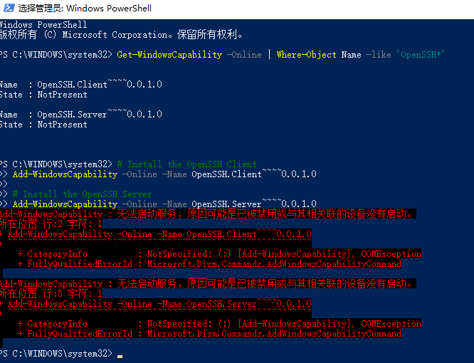

# fastai-notes
fastai part1 &amp; part2 notes, part1的中文笔记来自其他作者对hiromis笔记的翻译，part2的中文笔记为英文笔记翻译而成

## fastai part1 notes
- https://github.com/hiromis/notes 参考hiromis的笔记，有中文版，质量较高。
  - [chinese](/chinese)文件夹，来源于https://github.com/hiromis/notes 
- [lesson1.pdf](https://github.com/HaronCHou/fastai-notes/blob/main/Lesson1.pdf)
- [lesson2.pdf](https://github.com/HaronCHou/fastai-notes/blob/main/Lesson2.pdf)
- [lesson3.pdf](https://github.com/HaronCHou/fastai-notes/blob/main/Lesson3.pdf)
- [lesson4.pdf](https://github.com/HaronCHou/fastai-notes/blob/main/Lesson4.pdf)
- [lesson5.pdf](https://github.com/HaronCHou/fastai-notes/blob/main/Lesson5.pdf)
- [lesson6.pdf](https://github.com/HaronCHou/fastai-notes/blob/main/Lesson6.pdf)
- [lesson7.pdf](https://github.com/HaronCHou/fastai-notes/blob/main/Lesson7.pdf)
- [lesson8.pdf](https://github.com/HaronCHou/fastai-notes/blob/main/lesson8.pdf)
- [lesson9.pdf](https://github.com/HaronCHou/fastai-notes/blob/main/lesson9.pdf)
- [lesson10.pdf](https://github.com/HaronCHou/fastai-notes/blob/main/lesson10.pdf)
- [lesson11.pdf](https://github.com/HaronCHou/fastai-notes/blob/main/lesson11.pdf)
- [lesson12.pdf](https://github.com/HaronCHou/fastai-notes/blob/main/lesson12%20%E7%BD%91%E7%BB%9C%E7%AC%94%E8%AE%B0.pdf)
  - [lesson12.pdf详细](https://github.com/HaronCHou/fastai-notes/blob/main/Lesson%2012%20Notes%20Advanced%20training%20techniques%3B%20ULMFiT%20from%20scratch.pdf)

## fastai part2 notes
- lesson8 markdown 笔记源文件： [lesson8 中文版笔记 md版本 ](./lesson8/lesson8.md)    [lesson8.pdf](https://github.com/HaronCHou/fastai-notes/blob/main/lesson8.pdf)    [fastai 2019 lesson8 notes 笔记_hello world-CSDN博客](https://blog.csdn.net/haronchou/article/details/120541922)
- lesson9 markdown ：[lesson9 中文版笔记 md版本 ](./lesson9/lesson9.md)     [lesson9.pdf](https://github.com/HaronCHou/fastai-notes/blob/main/lesson9.pdf)
- lessson10 markdown: [lesson10 中文版笔记 md版本 ](./lesson10/lesson10.md)  [lesson10.pdf](https://github.com/HaronCHou/fastai-notes/blob/main/lesson10.pdf)
- lessson11 markdown: [lesson11 中文版笔记 md版本 ](https://github.com/HaronCHou/fastai-notes/blob/main/lesson11/lesson11.md)   [lesson11.pdf](https://github.com/HaronCHou/fastai-notes/blob/main/lesson11.pdf)
- lesson12 markdown: [lesson12 中文版笔记 md版本](https://github.com/HaronCHou/fastai-notes/blob/main/lesson12/Lesson%2012%20Notes%20Advanced%20training%20techniques%3B%20ULMFiT%20from%20scratch.md)  [lesson12.pdf详细](https://github.com/HaronCHou/fastai-notes/blob/main/Lesson%2012%20Notes%20Advanced%20training%20techniques%3B%20ULMFiT%20from%20scratch.pdf)

## windows vscode ssh

- https://zhuanlan.zhihu.com/p/86637316

- https://docs.microsoft.com/zh-cn/windows-server/administration/openssh/openssh_install_firstuse

  - **步骤1.检查windows本地是否安装有ssh。** 

    windows powershell 管理员模式打开：输入

    `Get-WindowsCapability -Online | Where-Object Name -like 'OpenSSH*'`

- 如果两者均尚未安装，则此操作应返回以下输出：

    ```shell
    Name  : OpenSSH.Client~~~~0.0.1.0
    State : NotPresent
    
    Name  : OpenSSH.Server~~~~0.0.1.0
    State : NotPresent
    ```
    
- 然后，根据需要安装服务器或客户端组件：

    ```shell
    # Install the OpenSSH Client
    Add-WindowsCapability -Online -Name OpenSSH.Client~~~~0.0.1.0
    
    # Install the OpenSSH Server
    Add-WindowsCapability -Online -Name OpenSSH.Server~~~~0.0.1.0
    ```
    
- 这两者应该都会返回以下输出：

    ```shell
    Path          :
    Online        : True
    RestartNeeded : False
    ```
    
    
    
    

- win+R gpedit.msc 打开本地组策略编辑器


- https://www.cnblogs.com/wolbo/p/11881641.html

