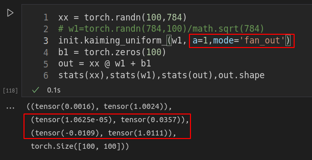

### 关于初始化——卷积也是矩阵乘法，差别不大的

- 除以784，是除以乘法。确保y1=sum(xi*wi)之后的结果，y1的方差保持。这里累加了，所以要除以xi的数量。也就是784。

- 由于W权重矩阵，要除以fin_in，做乘法之后，`xx @ w1`才是保存均值的。不是除以fin_out
- 而w1本身，肯定就不是均值为1的了。肯定是要小一些的。

- 用kaiming_init如下面所示：fan_out才是784，a=1，才能把uniform干掉

- w用均匀分布初始化，rand在[0,1]之间，要先变到[-1,1]，然后再补充sqrt(3)，实现[0,1]。均值为0，方差为1的w。要用784来归一化，才能实现 w^Tx的均值保持不变！
  - 注释的代码，与红色框的代码，是一样的效果。所以就是这样的结果！

