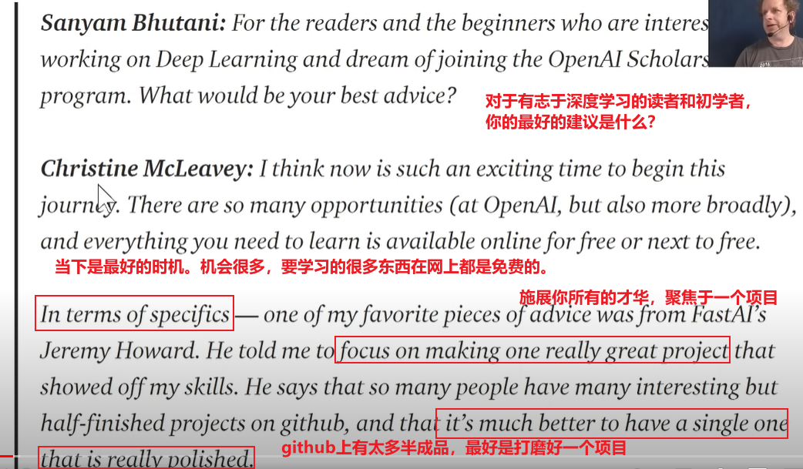
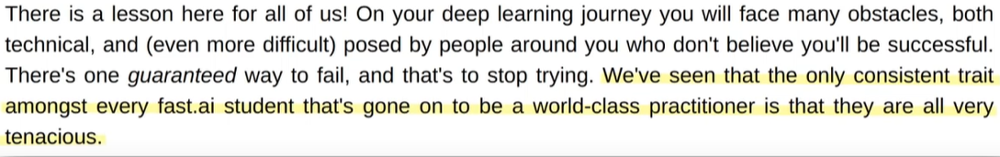
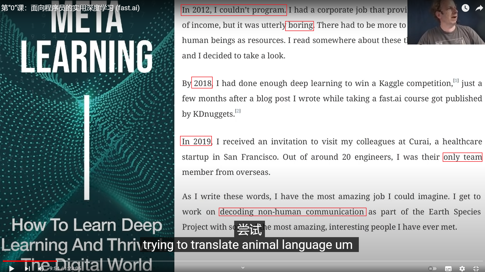
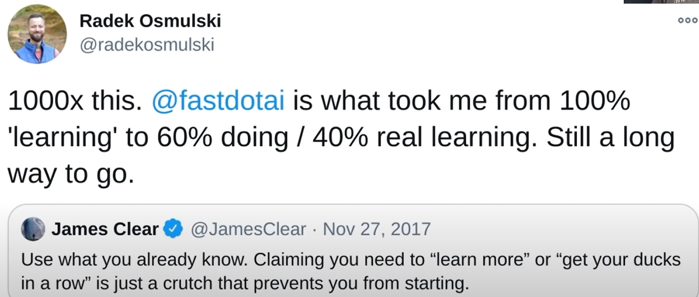
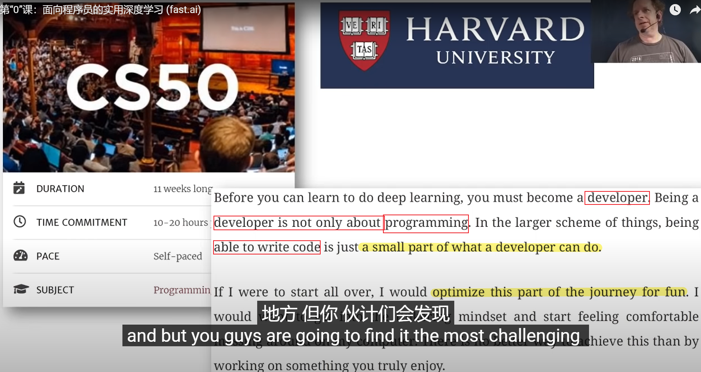
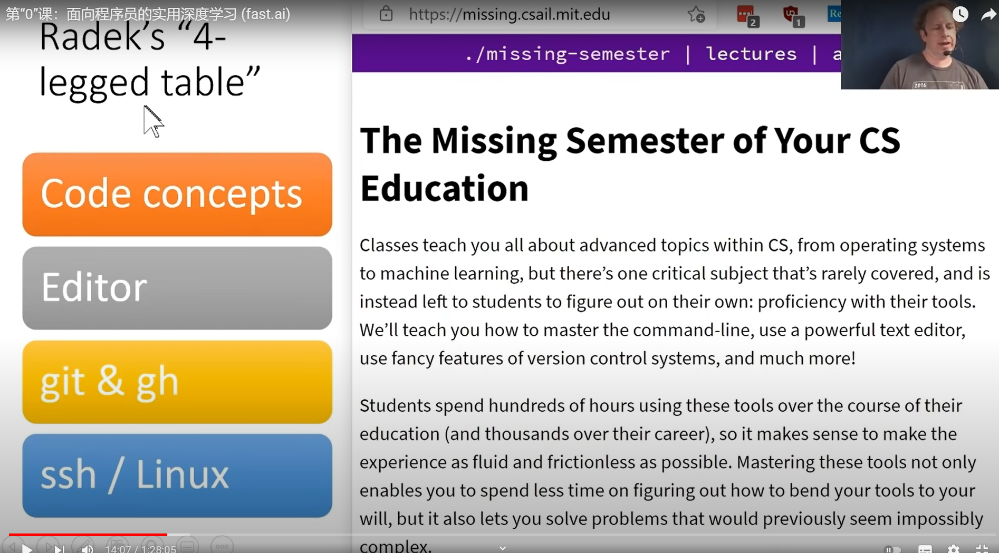
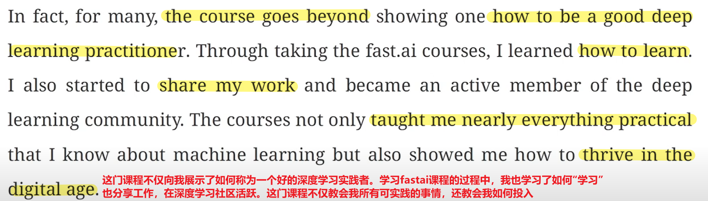
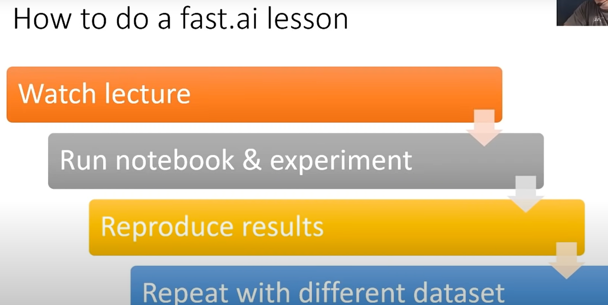

# lesson0 2020

## 一、如何学习和利用本门课程？

- **如何充分利用本课程？** **如何确保完成本课程？** **如何确保这段学习时间富有成效？**
- 不要到课程结束的时候才意识到，我应该如何完成这个课程。
- 所以Jeremy要告诉大家，==人们发现的最有效的课程方法==。
  - 现在很多人和==成千上万的人都经历了 fas面向程序员的实用深度学习课程==，嗯，他们中的许多人继续创建成功的初创公司，==撰写具有高影响因子的研究论文==，以在他们的公司中创建新产品，您知道这是一个==非常成熟的课程==，<u>但是也有很多人从未完成课程</u>，所以如果你正在看这个，那是因为你已经决定要学习深度学习，所以我要谈谈它会为你带来什么成为使这成为一次很棒的体验的人之一 。
  - 所以这本书实际上是作为木星笔记本写的，我们现在是否写了一些东西把它变成一本书，顺便说一下，这本书实际上也是在 Kindle 上和纸质版上看起来都很棒。这个课程是书的另一半加上一些其他新东西，嗯，==但基本上每节课都涵盖书的一章左右==，所以如果你正在学习这门课程，你至少会在笔记本中阅读这本书
- 所以你要完成课程。或者至少完成书的一半。
  - 因为我认为加入的每个人都认为好的，我要去做我要做深度学习，但如果你在我看我们的 youtube 时分析很多人没有完成。
  - 但如果你的意图是成为一个真正有效的深度学习从业者，你需要完成该死的课程
  - christine mcclavey 是我们出色的校友之一 她现在在 openai 世界顶级研究组织之一 她建立了一个奇妙的系统，用于通过深度学习创作新音乐 她曾经是一名钢琴家，我记得这一点光盘我告诉她，嗯，专注于让一个项目变得伟大并打磨它并完成它，她做到了，并且该项目最终创造了英国广播公司管弦乐队演奏正确的音乐，除其他外，帮助她在公开赛中获得了这份极其独特的工作ai 所以这是我们的一个学生 sanyon 和 christine 的 um 播客的片段，其中 christine 说这是她的一个关键见解，所以我将给你一些关键见解，其中一些来自我或者其中一些来自我通过学生，但它们都像我听过很多次的东西，所以这是一个例子

- 这对我们所有人来说都是一个教训!在深入学习的过程中，你会遇到很多障碍，既有技术上的，也有(更困难的)来自于你周围那些不相信你会成功的人。
- ==有一种方法肯定会失败，那就是停止尝试==。
- 我们已经看到了每一个fast.ai的学生，那些将要成为==世界级的实践者==的唯一的一致的共同点是：==他们都很顽强==！！！！

- 成功和失败的人的区别：是顽强！
- 坚韧是你现在可以选择的东西。
- 你不能选择的东西是：现在新冠在全球大流行。你没办法。这类型的事情你无法选择。
- 因此顽强的一部分是正确地理解自己
- 有些事情发生了，我现在不能做我希望做的事情，但后来又回到了正确的状态，所以坚韧的一部分不是忽略颠簸，而是继续追求……然后又遇到颠簸，也许这就是你知道的，我经常会遇到颠簸。

## Meta learning

我将要与你分享这本书中的一些见解。

如果你之前没看过，没关系它昨天出版了，它是由一个叫雷迪克的人写的，他是这门课程的顶尖校友之一，嗯，这是一本非常值得一读的书，因为他的旅程非同寻常，你知道这是一个没有学位却不会编码的人。就在几年前，他找到了一份无聊的工作，他开始学习深度学习，嗯，多次失败，但是，嗯，拉德克非常顽强，每次失败时，他都会再试一次，最终他想通了找到一种方法来做到这一点，他这样做的方式非常强烈地基于 fast ai 的课程和学习理念，呃他现在是 kaggle 比赛的获胜者。呃他是唯一一个呃非旧金山的人qai 的人，这是世界顶级医疗人工智能初创公司之一，现在呃他在一个新的非营利组织工作，这实际上是在尝试翻译动物语言，呃就是这样，他是一个很好的例子，就像我一直认为的那样。

- 100%的学习，要转化为60%的doing实操 + 40%的真正的学习。

- 有一个榜样的想法，在人工智能社区中有一个很多榜样，所以这里有人既是榜样，又像尝试失败尝试失败尝试失败然后你知道找到一些成功
- 所以嗯我将向你展示他书中的一些东西。嗯和很多他的书是他，他把我说的东西转化为他从中学到的东西，其中一些是他的想法，嗯，所以我们一次又一次地从不成功的深度学习学生那里听到的一件事就是他们一直在**准备preparing做深度学习，他们一直在准备preparing做项目     所以他们学习线性代数 他们学习微积分 他们学习 c 加上他们学习所有这些不同的事情     他们做一个慕课，然后是另一个慕课，然后他们读一本书，然后再读另一本书，在什么时候他们实际上会开始做一些事情，所以快速人工智能的理念是你**第一周**开始做一些事情，所以第一周你需要实际训练一个模型，
- 这并不是说你不会学习理论,你会.根据需要在把事情做好的情况下，所以如果你做对了，特别是如果你正确完成了课程的全部两个部分，你将基本上从头开始实现所有     fastai 的库，你将了解批处理规范化，您将对各种矩阵乘法方法，进行基准测试 ，您将知道如何编写裸机 GPU 优化代码， 您将了解如何进行反向传播，以及从头开始的微积分， 您将完成所有这些工作，但一切都会过去就像你在解决特定问题或理解下一块拼图的情况下一样，嗯，所以是的，只是读书和看视频不会让你到达那里，但会让你到达那里的事情是**编写代码 做实验和训练模型** 你们中的一些人可能不太擅长编码 嗯好吧 那是一个非常好的地方 但你们会发现它最具挑战性     因为擅长编码是让你快速通过的东西，而不是思考哦，

- 4个脚的桌子，帮助你更有效的进行深度学习实验。
- 可惜我不擅长编码，但这实际上是一个机会，因为现在你有一个非常有趣的项目来学习编码，所以很多人都有通过学习这门课程成为优秀的编码员，因为当你学习这门课程时，你会学到很多计算机科学概念，比如面向对象的编程和函数式编程以及列表和列表推导式的映射以及 GPU 加速等等所以问题是，如果你不是，如果你遇到一个你不太熟悉的计算机科学概念或编程思想或一段语法，**那是一个值得暂停片刻的地方**，并确保你知道您确实了解该代码的工作原理，因为代码编码是一种关键的基础技能，这是一门很好的基础计算机科学入门课程 这是哈佛 **cs50** 课程，哈佛的每个人都在做用于计算机科学的 es 开始，所有这些都可以在网上免费获得，所以我会很好地推荐，所以 radic 会从那里开始，所以这些引述都是从 redex book 顺便说一下，然后是另一篇，

所以 radek 谈到了这个四足表格将帮助您更有效地进行深度学习实验，这些想法就像了解代码的基本思想 了解您的工具 编辑器 jupiter 笔记本 了解 git 之类的东西，例如如何保存你的工作和其他人的工作等等，了解 ssh 和 linux，比如如何访问服务器和操作它并用它做事，所以有一门很棒的课程，叫做**你的计算机科学教育的缺失学期**，它实际上是创建的我相信麻省理工学院的学生说哦，麻省理工学院的每个人都假设我们已经知道这些东西，但我们中的很多人都不对，所以如果您从未使用过 git 或者您没有使用过 git，则没有什么可羞耻的曾经使用过你知道的 ssh 或者任何它们只是工具，在旅程中的某个时刻，大多数人只是必须弄清楚，所以这实际上是一个很好的时机，这是一个很好的课程，呃用来使用帮助你到达那里，当然，主要的事情是练习这些工具，这是围绕编码和你的开发环境的那种基础，

- 这是我们在课程中经常讨论的下一个重要建议，以及雷迪克在他的书中谈到的是，**分享你的工作，交流你的工作，并写下你的工作**，这是很多人感到非常不舒服的事情，**就像发推文或博客一样**，嗯，就像我到底是谁开始一样写关于深度学习的文章，我刚刚开始很好，这是没有人比你更适合写的东西，就像你六个月前想知道的那样，所以你现在比六个月前知道的更多，而且你”会知道更多一周或一周甚至更多，所以如果你有酒店业的背景，你知道你可能会为整个酒店业的同事写一些非常有趣的关于围绕深度学习的想法的东西例如呃，或者如果你在高中教书，你知道你可能有一些想法，你可以写下高中生可能觉得有趣或老师可能觉得有趣的东西，所以你知道每个人都有话要说，关键是要写把它记下来，因为这将有助于更好地嵌入你的理解，它会开始建立你的投资组合，所以我们稍后会讨论更多，但很多人发现这个分享他们的信息工作一直是他们学习和建立个人品牌的关键部分，最终让他们找到了一份工作，

- 第一次，看视频。运行笔记本。多做一些尝试。看看有什么不同
  - 然后就要重新开始一个空白的python.py文件，能不能从一个全新的笔记本开始，能不能再做到同样的事情。比照前面的notebook，重新实现同样的操作。
  - 自己实现！
  - 这样重复着走，每一次都把自己往前面，往深度推进一点点。
- 所以上快速 AI 课程意味着什么，所以快速 AI     课程是基本的只是本书的一章或课程中的一个视频，或两者兼而有之所以，假设您正在做视频，那么学习这些课程中的一个意味着什么，那么显然可以观看视频，所以有几个小时是对的那么这意味着运行笔记本，我们稍后会看到它你应该尝试一下，所以如果你想知道为什么这样做，之前我们会尝试删除它，尝试以不同的顺序进行，如果你想知道如果我这样做会发生什么，但是这对另一个图像尝试对的，你开始试验的越多，你给你的大脑喂食越多，就像你自己的深度学习发生在你的大脑，输入输出模式中，你尝试一些发生的事情，你尝试一些发生的事情，然后下一步是尝试从现在划伤好吧，你显然必须查一下东西，但这个想法是你能不能用一个全新的笔记本你能不能回去重新创建一些模型，重新训练它们或重做一些数据处理管道，所以试着自己输入你知道你可以根据自己的喜好切换回答案，但你真的想开始，实际上你知道填写你自己的代码写你自己的代码，然后你真正的重点您真正想要的是使用您现在收集或下载的不同数据集重复课程的某些部分，**整个过程通常需要人们多次完成课程，**
- 因此通常第一次通过人们可能只会观看每堂课并尝试运行它，你知道只要走到最后，对正在发生的事情有一个大致的了解，**所以人们通常会像三遍一样经历整个事情**，**然后回来尝试走得更远再往右走**，所以不要如果你不能立即完成所有这些，请不要担心，当然，在第一课中，这将是具有挑战性的，只要尽可能正确，并且随着你继续尝试推动自己做越来越多的事情，**你甚至可以回到更早的笔记本，看看你是否能理解越来越多的内容**，让我们看看它是什么样子，所以这里的课程可以，这里是你可以观看的课程，