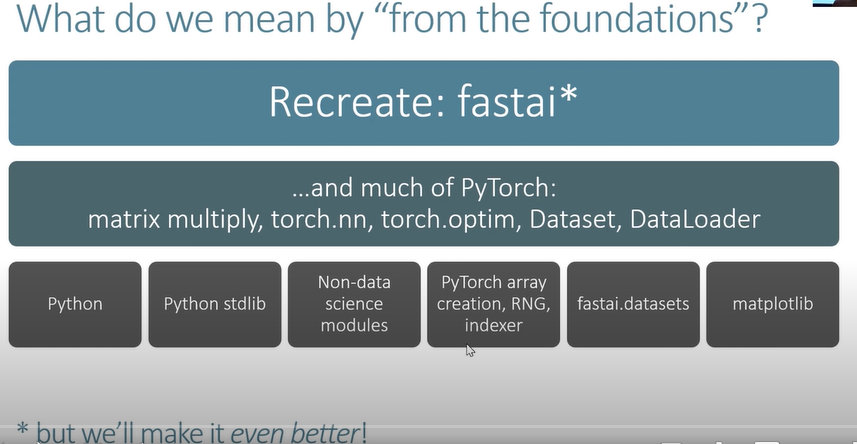
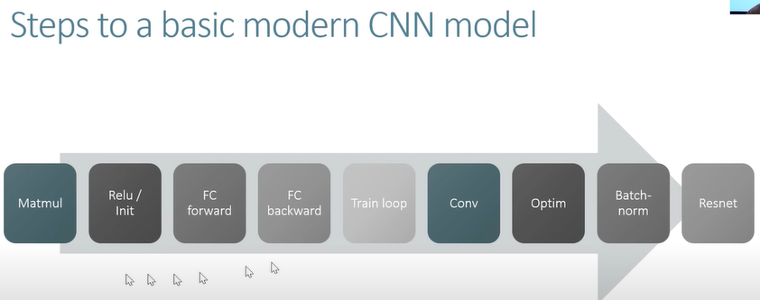
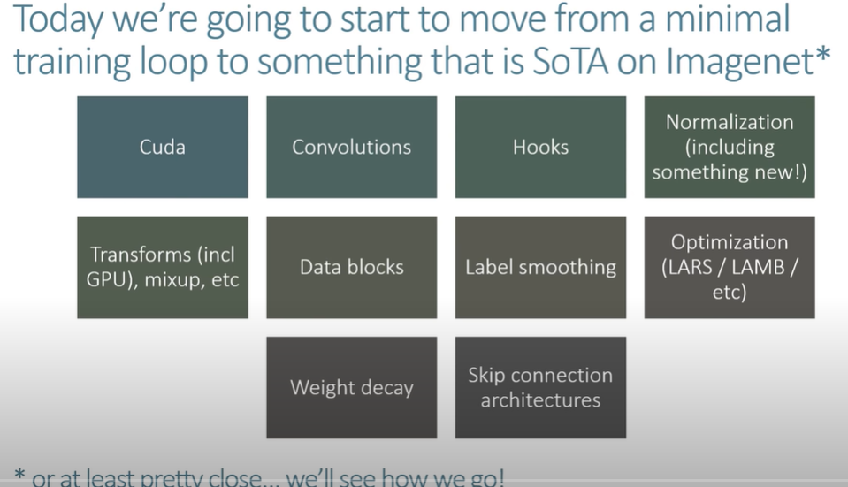
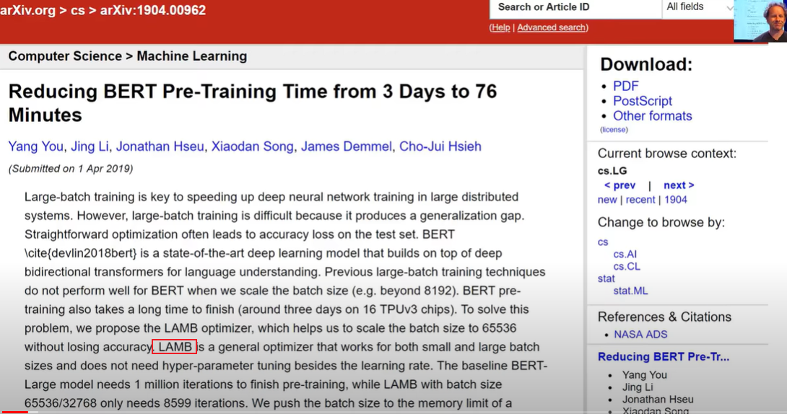
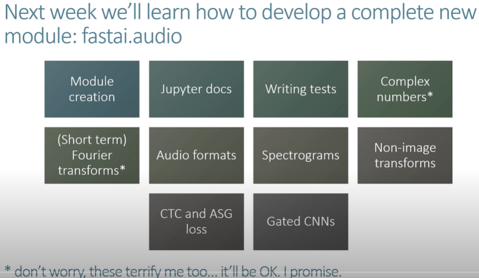
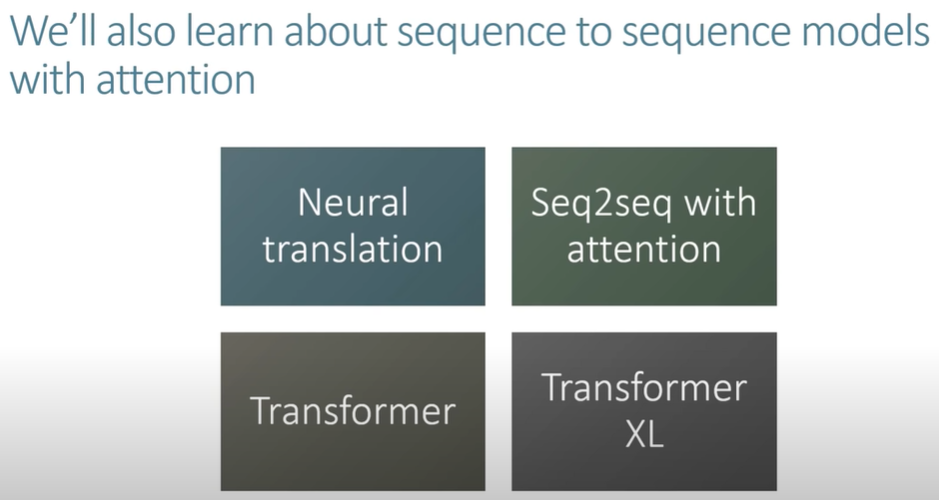
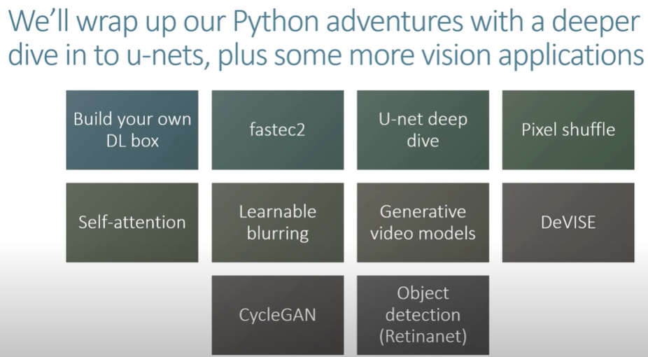

# lesson 10 Wrapping up our CNN

- 2019年视频地址：[https://course19.fast.ai/videos/?lesson=10](https://course19.fast.ai/videos/?lesson=10)
- YouTube lesson10 英文字幕（自动生成），中文字幕（自动翻译，不太好）：https://www.youtube.com/playlist?list=PLWP4UZT-7V3Gv9y_dLHzM0A-Ju3EqDP9r
- 哔哩哔哩 视频地址：[【中文字幕】Fast.ai part 2 (2019) - 深度学习原理 Deep Learning from the Foundations](https://www.bilibili.com/video/BV1yx411d7aL?p=2)
- fastai forum论坛 第10课 Links and Updates：[https://forums.fast.ai/t/2019-part-2-lessons-links-and-updates/41429](https://forums.fast.ai/t/2019-part-2-lessons-links-and-updates/41429)
  - 笔记参考 from [@Lankinen](https://forums.fast.ai/u/lankinen)：[Fast.ai Lesson 10 notes — Part 2 v3](https://medium.com/@lankinen/fast-ai-lesson-10-notes-part-2-v3-aa733216b70d)
  - 笔记参考 from [@jimypbr](https://forums.fast.ai/u/jimypbr)： https://jimypbr.github.io/2020/03/fast-ai-lesson-10-notes-looking-inside-the-model
- 笔记本地址：https://nbviewer.jupyter.org/github/fastai/course-v3/tree/master/nbs/dl2/
  - 用Jupyter viewer 效果真的好，github中反而打不开

------

## 前言

- 本周收到很多来信，他们非常难过，他们没有完全跟上一切正常的事情，别担心，因为我在第 1 课中提到过，我试图在这里给你足够的时间，让你在下一部分到明年之前保持忙碌，这样你就可以深入了解你感兴趣的部分，然后回去查看内容。
- 没有觉得，你必须在第一次听课就得在一周内理解所有内容，如果你没有在家庭作业中投入时间，或者你没有在最后一部分投入时间，特别是因为我们在第 1 部分中涵盖的很多东西我有点假设你在这一点上很舒服，不是因为你很愚蠢，而是因为它让你有机会回去重新研究它，练习和实验，直到你深入很舒服，
- 所以是的，如果你发现它以一定的速度飞快地前进，那是因为它以一定的速度伴随着你，而且它涵盖了更多软件工程类的东西，对于那些正在练习软件工程师的软人来说，你会认为这一切都非常简单，对于那些不是的人，你会想哇，
- 这里有很多部分是，我认为数据科学家需要成为优秀的软件工程师，所以我试图向你展示一些这些东西，但你知道这是人们可以花数年时间学习的东西，所以希望这是你成为更好的软件工程师之前没有做过软件工程的漫长过程的开始，希望有一些有用的技巧可以帮助你找到你。
- 我们试图从这些基础上更快地重建大部分pytorch，并开始使事情变得更好，今天你实际上会看到一些很好的东西，事实上你已经看到了一些会更好。我认为fastai的下一个版本都会有这个新的callback系统，我认为它比旧的更好，今天我们将向您展示一些以前未发表的新研究，这些研究将进入快速人工智能，也许还有其他库，所以我们将尝试坚持，我们将坚持只使用这些基础。

> 首先，我想强调 Jeremy 在课堂上说过的一件事。对于大多数人来说，这个阶段可能真的很快，他说这不是他希望我们在 7 周内学习的东西，而是他希望我们在明年再次教第二部分之前学习的东西。我试着在这里写最重要的东西，但我不想做的是复制完整的笔记本。阅读、run和play这些东西是一件很重要的事情，任何东西都无法替代。

## 从基础开始的含义



- 重新构建fastai，只用一些很少的基础操作。

##### 现代CNN的步骤



- 我们目前处在Conv步骤中
- 以下这些是我们这次要介绍的内容



- 我们正在开发现代 CNN 模型，已经完成了train loop，我们已经有了一个很好的灵活训练循环，所以从这里开始，当我说我们将完成一个现代 CNN 模型时，它不仅仅是一些基本的模型。我们实际上会努力得到我想要的东西在接下来的一两周内，在 imagenet 上大约是最先进的，这就是我们的目标。
- 在我们此时的测试中，我们对向您展示一些可能以前在图像上从未见过的东西感到非常满意的结果，这就是我们将要尝试和作为一个团队前往的地方，所以这些是我们将要讲的一些内容，以实现您之前在部分代码中可能未见过的事情之一。
- 
- 在Optimazation这部分，可能都是你之前没见过的。**原因是这将是一些未发表的研究 我们将向您展示哪些是我们一直在开发的新优化算法 该框架仍然是新的**，但实际上是特定的方法 是由谷歌两天前发布的，所以我们已经在那里挖到了，所以这是核心论文，真的很棒，他们引入了一种名为LAMB的新优化算法，它将向您展示如何非常轻松地实现它，如果你想知道我们是怎样的，之所以这么快做到这一点，是因为我们自己已经在几个星期内一直在做同样的事情，



- 下周我们还将开始开发一个全新的fastai module。fastai.audio. 语音算法。
  - 如如何创建module，jupyter docs，我们将学习诸如复数和傅立叶变换之类，如果你现在像我一样，**因为我我的一生都设法避免了复数和傅里叶变换**，但不要担心它会没事的，**它实际上一点也不糟糕**，或者至少我们需要了解的一点一点都不糟糕，而你即使你从来没有接触过这些，我也会完全明白。
  - 也会学习Audio formats音频格式，频谱图，做数据增强，和非图像的变换，以及一些特定类型的音频损失函数和架构，你知道很多任何事情都会如此。
  - 这些都只是一些不同的数据类型，在fastai上的工作都差不多。



- 也会学习 seq2seq带有注意力机制

  - 然后我们将把神经翻译看作是学习序列的一种方式使用注意力模型进行排序，然后我们将越来越深入地研究关注 Transformer 的注意力模型，它的后代 Transformer XL更加出色，然后我们将深入研究一些非常有趣的视觉主题来结束我们的 Python 冒险。

  

- 将构建一些更大的模型，如DL box。
- 使用我们开发的新库fasterc2在AWS上运行大型实验。也会深入查看在最后一门课做U-net的时候到底发生了什么。当我们做那个单元超分辨率图像生成时，那里有哪些部分，我们实际上已经获得了一些非常令人兴奋的新结果，向您展示了哪些是与一些非常酷的合作伙伴合作完成的，所以我期待向您展示，给您提示生成视频模型是我们将要研究的内容，然后我们将研究一些有趣的不同应用，

- 然后是 Swift，当然如此，还有Swift 课程汇集在一起非常令人兴奋，我们将尽可能多地覆盖相同的领域，但显然它将在 Swift 中进行，并且只会在两节课中，所以它不会是一切，但是我们将尝试给您足够的体验，让您感觉自己了解为什么 Swift 很重要，以及如何开始在 Swift 中构建类似的东西，甚至可能在 Swift 中构建整个东西，我们将在接下来的 12几个月，我们会看到。

05a_foundations.ipynb

- 复习一些上周依赖的一些软件工程和数学基础知识，具体来说，我们会更详细地了解一下擅长回调和变体以及一些其他 Python 概念，例如在特殊方法下添加确定你已经看到了一个对fastai非常重要的东西，
- 总的来说，它们是一种非常有用的软件工程技术，对研究人员来说非常有用，因为它们允许你构建可以快速调整和添加内容，并再次拉出的东西非常适合研究，所以什么是回调

- 用回调函数做按钮交互和消息响应

```python
import ipywidgets as widgets
def f(o): print('hi')
w = widgets.Button(description='Click me')
w.on_click(f)
```

- python创建GUI小部件的矿建，在on_click中传递一个函数f
- 所以 f 是一个回调，它不是一个特定的类，它没有特定的签名，它不是一个特定的库，它是一个概念，
- 将函数f作为一个对象，所以看起来我们不是在调用该函数，我们在 F 之后没有任何括号我们将函数本身传递给这个方法，它说当发生某些事情时请call f. 这种情况是当我单击 OK 所以这是我们的起点和这些类型的函数 这些类型的回调 在某个特定框架中的 GUI 中使用 当某些事件发生时通常称为事件 所以如果您听说过事件它们是一种回调然后回调是一种我们称之为函数指针的东西 我的意思是它可以比你看到的更通用，但它基本上是一种传递一些东西的方式，
- 我们刚刚看到了回调是如何工作的，但是我们如何创建自己的回调呢？让我们举个例子。

```python
from time import sleep
def slow_calculation():
    res = 0
    for i in range(5):
        res += i*i
        sleep(1)
    return res
slow_calculation()
30
def slow_calculation(cb=None):
    res = 0
    for i in range(5):
        res += i*i
        sleep(1)
        if cb: cb(i)
    return res
def show_progress(epoch):
    print(f"Awesome! We've finished epoch {epoch}!")
slow_calculation(show_progress)
Awesome! We've finished epoch 0!
Awesome! We've finished epoch 1!
Awesome! We've finished epoch 2!
Awesome! We've finished epoch 3!
Awesome! We've finished epoch 4!
30
```

- 正如我们所看到的，第一个版本将在 5 秒内返回结果。然后我们要添加一个功能来告诉进度。`if cb: cb(i)`只是检查是否有回调，然后它会调用它。我们创建了一个`show_progress`函数，它将以纪元数作为输入，然后打印一个文本。现在我们可以`show_progress`用作回调并查看计算进度。

  对于参加本课程的每个人来说，这可能是一个简单的例子。Jeremy 展示了这一点，因为我们将学习更复杂的用例。当您有一个简单的示例时，通过比较差异可以更容易地理解更复杂的事物。

- 所以这我们现在回调的起点会发生什么 你会注意到我们做的事情越来越快 我会从这样的地方开始 这对你们中的许多人来说是微不足道的，在接下来的某个时间你知道一个小时或两个你可能会到达一个你感觉完全迷失的地步，诀窍是如果你正在观看视频，那么回到它非常容易的地步，找出你突然注意到你完全迷失的方式找到中间你有点遗漏的部分，因为我们将继续从简单的东西中构建，就像我们对矩阵乘法所做的那样，所以我们将从这里逐渐构建并查看在更有趣的回调，
- 现在你觉得还挺简单的，但是越来越复杂，你可能搞蒙了。所以诀窍就是倒回去慢慢看视频，一遍遍的看清楚就可以了。

### Lambdas and partials

```python
slow_calculation(lambda o: print(f"Awesome! We've finished epoch {o}!"))
```

```python
Awesome! We've finished epoch 0!
Awesome! We've finished epoch 1!
Awesome! We've finished epoch 2!
Awesome! We've finished epoch 3!
Awesome! We've finished epoch 4!
30
```

- 使用lambda表达式，有点类似于宏。
- 我们可以使用 lambda 就地定义函数。您可以将其视为 def ，但您无需添加括号或函数名称。
- 一旦我们可以使用 lambda 表示法在我们实际使用它的时候定义函数，那么 lambda 表示法只是创建函数的另一种方式，所以我们说 lambda，而不是说 def，然后我们将参数放在冒号之前而不是放在括号中，因此这与前面的相同一个它只是为了方便您想在使用回调的同时定义回调可以使您的代码更简洁一些。
- 如果我们的`show_progress`函数包含两个参数但`cb(i)`只包含一个，我们需要一种方法来转换`show_progress`为一个参数函数。下面正在发生这种情况。

```python
def show_progress(exclamation, epoch):
    print(f"{exclamation}! We've finished epoch {epoch}!")
```

```python
slow_calculation(lambda o: show_progress("OK I guess", o))
OK I guess! We've finished epoch 0!
OK I guess! We've finished epoch 1!
OK I guess! We've finished epoch 2!
OK I guess! We've finished epoch 3!
OK I guess! We've finished epoch 4!
30
```

- 这里 `slow_calculation(show_progress)`的调用方式就是错的，show_progress有两个参数，而cb只有一个参数，所以要改变使用方式
- 通过这种方式，我们将感叹号设置为“OK I guess”。
- 也许我们想让添加不同的感叹号更容易，这样我们就可以为此创建一个函数。

```python
def make_show_progress(exclamation):
    _inner = lambda epoch: print(f"{exclamation}! We've finished epoch {epoch}!")
    return _inner
```

```python
slow_calculation(make_show_progress("Nice!"))
```

```python
Nice!! We've finished epoch 0!
Nice!! We've finished epoch 1!
Nice!! We've finished epoch 2!
Nice!! We've finished epoch 3!
Nice!! We've finished epoch 4!
30
```

- 这是一个错误，我们调用了一个只有一个参数的具有两个参数的函数，因此我们必须将其转换为只有一个参数的函数，因此 lambda o 是一个只有一个参数的函数参数和这个函数调用。用**一个特定的感叹号显示进度，所以我们已经将带有两个参数的东西转换成带有一个参数的东西**，
- 我们可能想让人们很容易地使用不同的感叹号创建不同的进度指示器，这样我们就可以创建一个名为 make show progress 的函数，返回那个 lambda
- 通常我们想这样做：

```python
def make_show_progress(exclamation):
    def _inner = lambda epoch: print(f"{exclamation}! We've finished epoch {epoch}!")
    return _inner

slow_calculation(make_show_progress("Nice!"))
Nice!! We've finished epoch 0!
Nice!! We've finished epoch 1!
Nice!! We've finished epoch 2!
Nice!! We've finished epoch 3!
Nice!! We've finished epoch 4!
30
```

- 因为你可能认为定义一个函数就像一个声明性的东西，一旦你定义它，现在它就像编译的东西的一部分，如果你看到你的 C++ 这就是它们在 Python 中的工作方式，而不是它们在你时的工作方式定义一个函数，
- def在编译的时候工作，而不是再运行时再定义一个函数。
- 实际上是每次我们调用 make show progress 时，它都会在内部创建一个带有不同感叹号的新函数下划线，因此它会像以前一样工作
- 这称为**闭包**。`_inner`每次`make_show_progress`调用时都会返回函数。

```python
f2 = make_show_progress("Terrific")
slow_calculation(f2)
Terrific! We've finished epoch 0!
Terrific! We've finished epoch 1!
Terrific! We've finished epoch 2!
Terrific! We've finished epoch 3!
Terrific! We've finished epoch 4!
30
slow_calculation(make_show_progress("Amazing"))
Amazing! We've finished epoch 0!
Amazing! We've finished epoch 1!
Amazing! We've finished epoch 2!
Amazing! We've finished epoch 3!
Amazing! We've finished epoch 4!
30
```

- 许多语言包括python都有这种特性，把两个参数的函数转为一个参数，如partial功能
- `"OK I guess"`将用作`show_progress`函数中的第一个参数，因此它成为一个参数函数。

```python
from functools import partial
slow_calculation(partial(show_progress, "OK I guess"))
OK I guess! We've finished epoch 0!
OK I guess! We've finished epoch 1!
OK I guess! We've finished epoch 2!
OK I guess! We've finished epoch 3!
OK I guess! We've finished epoch 4!
30
f2 = partial(show_progress, "OK I guess")
f2(shift+Tab)
```

### Callbacks as callable classes

- 上周我们的大部分代码都使用一个类作为回调。因此， 我们可以使用类，而不是使用闭包（= 返回函数的函数）。所以我们可以做完全相同的事情.
- 下面就是用closure来做的，上周是用类来做的Callback. call是类是一个对象时，就调用call函数。
- `__init__`将在创建对象时运行，`__call__`并使以与函数相同的方式使用对象变得合理。

```python
class ProgressShowingCallback():
    def __init__(self, exclamation="Awesome"): self.exclamation = exclamation
    def __call__(self, epoch): print(f"{self.exclamation}! We've finished epoch {epoch}!")
cb = ProgressShowingCallback("Just super")
slow_calculation(cb)
Just super! We've finished epoch 0!
Just super! We've finished epoch 1!
Just super! We've finished epoch 2!
Just super! We've finished epoch 3!
Just super! We've finished epoch 4!
30
```

### Multiple callback funcs; `*args` and `**kwargs`

`*args`位置参数 

`**kwargs`关键字参数

```python
def f(*args, **kwargs): print(f"args: {args}; kwargs: {kwargs}")
f(3, 'a', thing1="hello")
args: (3, 'a'); kwargs: {'thing1': 'hello'}
```

- 为什么使用这两个参数？
  - 想要包装一些其他的类或对象，可以把一对参数当做kwargs传递给其他函数对象
  - 但是Fastai v1中过度使用 kwargs，所以我们一直在逐渐删除这些用法，因为它主要是最有助于快速把所有的东西放在一起。
- 注意：我们对在 fastai 中过度使用 kwargs 感到内疚 - 这对开发人员来说非常方便，但对最终用户来说很烦人，除非注意确保文档也显示所有 kwargs。kwargs 还可以隐藏错误（因为它可能不会告诉您参数名称中的拼写错误）。在[R 中](https://www.r-project.org/)有一个非常相似的问题（R`...`用于同一件事），并且 matplotlib 也经常使用 kwargs。
- 我们添加 **kwargs 是因为将来我们可能会添加一些新参数并且我们不希望它破坏此代码。

```python
    res = 0
    for i in range(5):
        if cb: cb.before_calc(i)
        res += i*i
        sleep(1)
        if cb: cb.after_calc(i, val=res)
    return res
class PrintStepCallback():
    def __init__(self): pass
    # 这个函数就不用关心cb，也不用关系它里面的数值，反正参数就都在args和kwargs里面了
    # 也不用担心里面到底传递了一些什么
    def before_calc(self, *args, **kwargs): print(f"About to start")
    # def before_calc(self): print(f"About to start") 
    # 上述代码会报错，会告诉你，没有i参数。
    def after_calc (self, *args, **kwargs): print(f"Done step")
slow_calculation(PrintStepCallback())
About to start
Done step
About to start
Done step
About to start
Done step
About to start
Done step
About to start
Done step
30
```

```python
class PrintStatusCallback():
    def __init__(self): pass
    def before_calc(self, epoch, **kwargs): print(f"About to start: {epoch}")
    def after_calc (self, epoch, val, **kwargs): print(f"After {epoch}: {val}")
slow_calculation(PrintStatusCallback())
About to start: 0
After 0: 0
About to start: 1
After 1: 1
About to start: 2
After 2: 5
About to start: 3
After 3: 14
About to start: 4
After 4: 30
30
```

- 这是很棒的代码，它开始提醒我们上次使用的代码。接下来，我们要添加几个功能。

### Modifying behavior

- 现在在这两种情况下，我们首先检查是否有我们要调用的函数。那么在后一种情况下，我们还想添加停止代码的能力。

```python
def slow_calculation(cb=None):
    res = 0
    for i in range(5):
        if cb and hasattr(cb,'before_calc'): cb.before_calc(i)
        res += i*i
        sleep(1)
        # check检查是否有我们要调用的Callback函数，同时还想提前终止
        if cb and hasattr(cb,'after_calc'):
            if cb.after_calc(i, res):
                print("stopping early")
                break
    return res
# 超过10就不计算了
class PrintAfterCallback():
    def after_calc (self, epoch, val):
        print(f"After {epoch}: {val}")
        if val>10: return True
        
slow_calculation(PrintAfterCallback())
After 0: 0
After 1: 1
After 2: 5
After 3: 14
stopping early
14
```

- 然后我们甚至可以通过在函数中定义它来改变计算的发生方式。
- 最终灵活的回调系统

```python
class SlowCalculator():
    def __init__(self, cb=None): self.cb,self.res = cb,0
    
    def callback(self, cb_name, *args):
        if not self.cb: return
        cb = getattr(self.cb,cb_name, None)
        if cb: return cb(self, *args)

    def calc(self):
        for i in range(5):
            self.callback('before_calc', i)
            self.res += i*i
            sleep(1)
            if self.callback('after_calc', i):
                print("stopping early")
                break
class ModifyingCallback():
    def after_calc (self, calc, epoch):
        print(f"After {epoch}: {calc.res}")
        if calc.res>10: return True
        if calc.res<3: calc.res = calc.res*2
calculator = SlowCalculator(ModifyingCallback())
calculator.calc()
calculator.res
After 0: 0
After 1: 1
After 2: 6
After 3: 15
stopping early
15
```

##### **__dunder__**

任何看起来像的东西`__this__`在某种程度上都是*特别的*。Python 或某个库可以定义一些函数，它们将在某些记录的时间调用。例如，当您的类设置一个新对象时，python 将调用`__init__`. 这些被定义为 python[数据模型的一部分](https://docs.python.org/3/reference/datamodel.html#object.__init__)。

例如，如果 python 看到`+`，那么它将调用特殊方法`__add__`。如果您尝试在 Jupyter（或 Python 中的许多其他地方）中显示一个对象，它将调用`__repr__`.

- 前后带有双下划线的所有变量名都有些特殊。您可以从[Python 文档中](https://docs.python.org/3/reference/datamodel.html#object.__init__)阅读所有这些的含义。您可能已经在本课程中学到了一些知识。
- 类似于C++的操作符重载，operator

```python
class SloppyAdder():
    def __init__(self,o): self.o=o
    def __add__(self,b): return SloppyAdder(self.o + b.o + 0.01)
    def __repr__(self): return str(self.o)
a = SloppyAdder(1)
b = SloppyAdder(2)
a+b
3.01
```

- Jeremy 列出的你应该知道/学习的特殊方法
- `__getitem__`
- `__getattr__`
- `__setattr__`
- `__del__`
- `__init__`
- `__new__`
- `__enter__`
- `__exit__`
- `__len__`
- `__repr__`
- `__str__`

##### 浏览源代码——vim举例

- `**:tag NAME_START**`**+tab** — 遍历以`NAME_START`(Eg `NAME_START_THIS`, `NAME_START_ANOTHER`)开头的不同选项
  - vim中的查找函数名：`:tag create_cnn`， 然后按tab，浏览
  - **单击函数名称并按 ctrl + ]** — 转到定义
- **ctrl + t** - 回到你使用上面那个东西的地方
- `Ack lambda` — 显示 lambda 所在的所有地方。
-  我个人对 VIM 的看法是，它看起来很酷，但并不实用。当然，使用终端编辑器看起来更像是您对编码有所了解，但其中大部分内容比使用 VS Code 等 GUI 编辑器要复杂得多。有些东西是可以学习的，但有些东西不管你使用 VIM 有多好，都会坚持下去。

## Variance and stuff

```python
t = torch.tensor([1.,2.,4.,18])
m = t.mean(); m
tensor(6.2500)
(t-m).mean()
tensor(0.)

(t-m).pow(2).mean()
tensor(47.1875)
(t-m).abs().mean()
tensor(5.8750)
```

- 最后两个数字告诉我们数据点离均值有多远。`(t-m).pow(2).mean()`称为**方差**，`(t-m).pow(2).mean().sqrt()`称为**标准差**，`(t-m).abs().mean()`称为**平均绝对偏差**.

  注意！`(t-m).abs().mean()`=`(t-m).pow(2).sqrt().mean()`

  如您所见，标准偏差更敏感，这就是我们更经常使用绝对偏差的原因。数学家和统计学家使用标准差而不是平均绝对差的唯一原因是它使数学更容易。

  ```
  (t-m).pow(2).mean()` = `**(t\*t).mean() — (m\*m)**
  D(X) = E(X^2) - E(X)^2
  ```

- $E(X^2)-(E(X))^2$ 方差的表达式，

- 有一个异常值18，所以标准差`(t-m).pow(2).mean() = tensor(47.1875)`，太大了。对异常值太敏感。就用sqrt()来处理一下。

- 在机器学习中，`(t-m).abs().mean()` 平均绝对偏差，绝对值的平均数，还经常使用。

- 2范数和1范数的区别。

```python
(t-m).pow(2).mean().sqrt()
tensor(6.8693)
```

- 他们还是不同的。为什么？

  请注意，我们有一个异常值 ( `18`)。在我们把一切都平方的版本中，它比其他一切都大得多。

  `(t-m).pow(2).mean()`被称为**方差**。==它是衡量数据分布情况的一个指标，并且对异常值特别敏感。==

- 当我们取方差的 sqrt 时，我们得到**标准偏差**。由于它与原始数据的规模相同，因此通常更具可解释性。然而，由于`sqrt(1)==1`，在讨论用于初始化神经网络的*单位方差*时，我们使用哪个并不重要。

  `(t-m).abs().mean()`被称为**平均绝对偏差**。它没有得到应有的使用，因为数学家不喜欢使用它有多么尴尬。但这不应该阻止我们，因为我们有电脑和东西。
  
  - **所以主要绝对偏差确实没有得到充分利用，实际上是一个非常好的使用方法**
  - 它有很多地方我注意到用涉及绝对值的东西替换涉及平方的东西绝对值的东西通常效果更好，这是一个很好的提示请记住，有一种长期存在的假设，我们必须在任何地方使用平方，但实际上它通常对您不起作用，

```python

```

s

```python

```

s

```python

```

s

```python

```

s

```python

```

s

```python

```

s

```python

```

s

```python

```

s

```python

```

s

```python

```

s

```python

```

s

```python

```

s

```python

```

s

```python

```

s

```python

```

s

```python

```

s

```python

```

s

```python

```

s

```python

```

s

```python

```

s

```python

```

s

```python

```

s

```python

```

s

```python

```

s

```python

```

s

```python

```

s

```python

```

s

```python

```

s

```python

```

s

```python

```

s

```python

```

s

```python

```

s

```python

```

s

```python

```

s

```python

```

s

```python

```

s

```python

```

s

```python

```

s

```python

```

s

```python

```

s

```python

```

s

```python

```

s

```python

```

s

```python

```

s

```python

```

