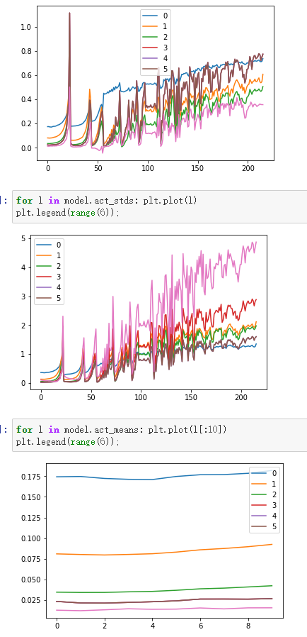

# Lesson 10 Looking inside the model

- 2019年视频地址：[https://course19.fast.ai/videos/?lesson=10](https://course19.fast.ai/videos/?lesson=10)
- YouTube lesson10 英文字幕（自动生成），中文字幕（自动翻译，不太好）：https://www.youtube.com/playlist?list=PLWP4UZT-7V3Gv9y_dLHzM0A-Ju3EqDP9r
- 哔哩哔哩 视频地址：[【中文字幕】Fast.ai part 2 (2019) - 深度学习原理 Deep Learning from the Foundations](https://www.bilibili.com/video/BV1yx411d7aL?p=2)
- fastai forum论坛 第10课 Links and Updates：[https://forums.fast.ai/t/2019-part-2-lessons-links-and-updates/41429](https://forums.fast.ai/t/2019-part-2-lessons-links-and-updates/41429)
  - 笔记参考 from [@Lankinen](https://forums.fast.ai/u/lankinen)：[Fast.ai Lesson 10 notes — Part 2 v3](https://medium.com/@lankinen/fast-ai-lesson-10-notes-part-2-v3-aa733216b70d)
  - 笔记参考 from [@jimypbr](https://forums.fast.ai/u/jimypbr)： https://jimypbr.github.io/2020/03/fast-ai-lesson-10-notes-looking-inside-the-model
- 笔记本地址：https://nbviewer.jupyter.org/github/fastai/course-v3/tree/master/nbs/dl2/
  - 用Jupyter viewer 效果真的好，github中反而打不开

## 链接和参考

- 第10[课视频](https://course.fast.ai/videos/?lesson=10)。
- 第 10 课笔记本：[05a_foundations.ipynb](https://github.com/fastai/course-v3/blob/master/nbs/dl2/05a_foundations.ipynb)、[05b_early_stopping.ipynb](https://github.com/fastai/course-v3/blob/master/nbs/dl2/05b_early_stopping.ipynb)、[06_cuda_cnn_hooks_init.ipynb](https://github.com/fastai/course-v3/blob/master/nbs/dl2/06_cuda_cnn_hooks_init.ipynb)、[07_batchnorm.ipynb](https://github.com/fastai/course-v3/blob/master/nbs/dl2/07_batchnorm.ipynb)。
- lankinen第 10 课笔记：[https](https://medium.com/@lankinen/fast-ai-lesson-10-notes-part-2-v3-aa733216b70d) ://[medium.com/@lankinen/fast-ai-lesson-10-notes-part-2-v3-aa733216b70d](http://medium.com/@lankinen/fast-ai-lesson-10-notes-part-2-v3-aa733216b70d)
- [解释本课中使用的彩色直方图](https://forums.fast.ai/t/the-colorful-dimension/42908)
- 关于[CNN 的 Bag-of-tricks 的](https://www.youtube.com/watch?v=QxfF_NrltxY)讲座。大量用于训练 CNN 解决图像问题的最先进技巧，这将是重新实现为回调的一个很好的练习。
- 要阅读的论文：
  - [Batch Normalization: Accelerating Deep Network Training by Reducing Internal Covariate Shift 批量归一化：通过减少内部协变量偏移来加速深度网络训练](https://arxiv.org/abs/1502.03167)
  - [层归一化 layer normalization](https://arxiv.org/abs/1607.06450)
  - [Instance Normalization: The missing ingredient for Fast Stylization实例标准化：快速风格化的缺失要素](https://arxiv.org/abs/1607.08022)
  - [Group Normalization组归一化](https://arxiv.org/abs/1803.08494)
  - [Revisiting Small Batch Training for Deep Neural Networks 重新审视深度神经网络的小批量训练](https://arxiv.org/abs/1804.07612)

------

## 前言

- 本周收到很多来信，他们非常难过，他们没有完全跟上一切正常的事情，别担心，因为我在第 1 课中提到过，我试图在这里给你足够的时间，让你在下一部分到明年之前保持忙碌，这样你就可以深入了解你感兴趣的部分，然后回去查看内容。
- 没有觉得，你必须在第一次听课就得在一周内理解所有内容，如果你没有在家庭作业中投入时间，或者你没有在最后一部分投入时间，特别是因为我们在第 1 部分中涵盖的很多东西我有点假设你在这一点上很舒服，不是因为你很愚蠢，而是因为它让你有机会回去重新研究它，练习和实验，直到你深入很舒服，
- 所以是的，如果你发现它以一定的速度飞快地前进，那是因为它以一定的速度伴 随着你，而且它涵盖了更多软件工程类的东西，对于那些正在练习软件工程师的软人来说，你会认为这一切都非常简单，对于那些不是的人，你会想哇，
- 这里有很多部分是，我认为数**据科学家需要成为优秀的软件工程师**，所以我试图向你展示一些这些东西，但你知道这是人们可以花数年时间学习的东西，所以希望这是你成为更好的软件工程师之前没有做过软件工程的漫长过程的开始，希望有一些有用的技巧可以帮助你找到你。
- 我们试图从这些基础上更快地重建大部分pytorch，并开始使事情变得更好，今天你实际上会看到一些很好的东西，事实上你已经看到了一些会更好。我认为fastai的下一个版本都会有这个新的callback系统，我认为它比旧的更好，今天我们将向您展示一些以前未发表的新研究，这些研究将进入快速人工智能，也许还有其他库，所以我们将尝试坚持，我们将坚持只使用这些基础。

> 首先，我想强调 Jeremy 在课堂上说过的一件事。对于大多数人来说，这个阶段可能真的很快，他说这不是他希望我们在 7 周内学习的东西，而是他希望我们在明年再次教第二部分之前学习的东西。我试着在这里写最重要的东西，但我不想做的是复制完整的笔记本。阅读、run和play这些东西是一件很重要的事情，任何东西都无法替代。

## 从基础开始的含义


- 重新构建fastai，只用一些很少的基础操作。

##### 现代CNN的步骤


- 我们目前处在Conv步骤中
- 以下这些是我们这次要介绍的内容


- 我们正在开发现代 CNN 模型，已经完成了train loop，我们已经有了一个很好的灵活训练循环，所以从这里开始，当我说我们将完成一个现代 CNN 模型时，它不仅仅是一些基本的模型。我们实际上会努力得到我想要的东西在接下来的一两周内，在 imagenet 上大约是最先进的，这就是我们的目标。
- 在我们此时的测试中，我们对向您展示一些可能以前在图像上从未见过的东西感到非常满意的结果，这就是我们将要尝试和作为一个团队前往的地方，所以这些是我们将要讲的一些内容，以实现您之前在部分代码中可能未见过的事情之一。
- 
- 在Optimazation这部分，可能都是你之前没见过的。**原因是这将是一些未发表的研究 我们将向您展示哪些是我们一直在开发的新优化算法 该框架仍然是新的**，但实际上是特定的方法 是由谷歌两天前发布的，所以我们已经在那里挖到了，所以这是核心论文，真的很棒，他们引入了一种名为LAMB的新优化算法，它将向您展示如何非常轻松地实现它，如果你想知道我们是怎样的，之所以这么快做到这一点，是因为我们自己已经在几个星期内一直在做同样的事情，


- 下周我们还将开始开发一个全新的fastai module。fastai.audio. 语音算法。
  - 如如何创建module，jupyter docs，我们将学习诸如复数和傅立叶变换之类，如果你现在像我一样，**因为我我的一生都设法避免了复数和傅里叶变换**，但不要担心它会没事的，**它实际上一点也不糟糕**，或者至少我们需要了解的一点一点都不糟糕，而你即使你从来没有接触过这些，我也会完全明白。
  - 也会学习Audio formats音频格式，频谱图，做数据增强，和非图像的变换，以及一些特定类型的音频损失函数和架构，你知道很多任何事情都会如此。
  - 这些都只是一些不同的数据类型，在fastai上的工作都差不多。


- 也会学习 seq2seq带有注意力机制

  - 然后我们将把神经翻译看作是学习序列的一种方式使用注意力模型进行排序，然后我们将越来越深入地研究关注 Transformer 的注意力模型，它的后代 Transformer XL更加出色，然后我们将深入研究一些非常有趣的视觉主题来结束我们的 Python 冒险。

  

- 将构建一些更大的模型，如DL box。
- 使用我们开发的新库fasterc2在AWS上运行大型实验。也会深入查看在最后一门课做U-net的时候到底发生了什么。当我们做那个单元超分辨率图像生成时，那里有哪些部分，我们实际上已经获得了一些非常令人兴奋的新结果，向您展示了哪些是与一些非常酷的合作伙伴合作完成的，所以我期待向您展示，给您提示生成视频模型是我们将要研究的内容，然后我们将研究一些有趣的不同应用，

- 然后是 Swift，当然如此，还有Swift 课程汇集在一起非常令人兴奋，我们将尽可能多地覆盖相同的领域，但显然它将在 Swift 中进行，并且只会在两节课中，所以它不会是一切，但是我们将尝试给您足够的体验，让您感觉自己了解为什么 Swift 很重要，以及如何开始在 Swift 中构建类似的东西，甚至可能在 Swift 中构建整个东西，我们将在接下来的 12几个月，我们会看到。

05a_foundations.ipynb

- 复习一些上周依赖的一些软件工程和数学基础知识，具体来说，我们会更详细地了解一下擅长回调和变体以及一些其他 Python 概念，例如在特殊方法下添加确定你已经看到了一个对fastai非常重要的东西，
- 总的来说，它们是一种非常有用的软件工程技术，对研究人员来说非常有用，因为它们允许你构建可以快速调整和添加内容，并再次拉出的东西非常适合研究，所以什么是回调

- 用回调函数做按钮交互和消息响应

```python
import ipywidgets as widgets
def f(o): print('hi')
w = widgets.Button(description='Click me')
w.on_click(f)
```

- python创建GUI小部件的矿建，在on_click中传递一个函数f
- 所以 f 是一个回调，它不是一个特定的类，它没有特定的签名，它不是一个特定的库，它是一个概念，
- 将函数f作为一个对象，所以看起来我们不是在调用该函数，我们在 F 之后没有任何括号我们将函数本身传递给这个方法，它说当发生某些事情时请call f. 这种情况是当我单击 OK 所以这是我们的起点和这些类型的函数 这些类型的回调 在某个特定框架中的 GUI 中使用 当某些事件发生时通常称为事件 所以如果您听说过事件它们是一种回调然后回调是一种我们称之为函数指针的东西 我的意思是它可以比你看到的更通用，但它基本上是一种传递一些东西的方式，
- 我们刚刚看到了回调是如何工作的，但是我们如何创建自己的回调呢？让我们举个例子。

```python
from time import sleep
def slow_calculation():
    res = 0
    for i in range(5):
        res += i*i
        sleep(1)
    return res
slow_calculation()
30
def slow_calculation(cb=None):
    res = 0
    for i in range(5):
        res += i*i
        sleep(1)
        if cb: cb(i)
    return res
def show_progress(epoch):
    print(f"Awesome! We've finished epoch {epoch}!")
slow_calculation(show_progress)
Awesome! We've finished epoch 0!
Awesome! We've finished epoch 1!
Awesome! We've finished epoch 2!
Awesome! We've finished epoch 3!
Awesome! We've finished epoch 4!
30
```

- 正如我们所看到的，第一个版本将在 5 秒内返回结果。然后我们要添加一个功能来告诉进度。`if cb: cb(i)`只是检查是否有回调，然后它会调用它。我们创建了一个`show_progress`函数，它将以纪元数作为输入，然后打印一个文本。现在我们可以`show_progress`用作回调并查看计算进度。

  对于参加本课程的每个人来说，这可能是一个简单的例子。Jeremy 展示了这一点，因为我们将学习更复杂的用例。当您有一个简单的示例时，通过比较差异可以更容易地理解更复杂的事物。

- 所以这我们现在回调的起点会发生什么 你会注意到我们做的事情越来越快 我会从这样的地方开始 这对你们中的许多人来说是微不足道的，在接下来的某个时间你知道一个小时或两个你可能会到达一个你感觉完全迷失的地步，诀窍是如果你正在观看视频，那么回到它非常容易的地步，找出你突然注意到你完全迷失的方式找到中间你有点遗漏的部分，因为我们将继续从简单的东西中构建，就像我们对矩阵乘法所做的那样，所以我们将从这里逐渐构建并查看在更有趣的回调，
- 现在你觉得还挺简单的，但是越来越复杂，你可能搞蒙了。所以诀窍就是倒回去慢慢看视频，一遍遍的看清楚就可以了。

### Lambdas and partials

```python
slow_calculation(lambda o: print(f"Awesome! We've finished epoch {o}!"))
```

```python
Awesome! We've finished epoch 0!
Awesome! We've finished epoch 1!
Awesome! We've finished epoch 2!
Awesome! We've finished epoch 3!
Awesome! We've finished epoch 4!
30
```

- 使用lambda表达式，有点类似于宏。
- 我们可以使用 lambda 就地定义函数。您可以将其视为 def ，但您无需添加括号或函数名称。
- 一旦我们可以使用 lambda 表示法在我们实际使用它的时候定义函数，那么 lambda 表示法只是创建函数的另一种方式，所以我们说 lambda，而不是说 def，然后我们将参数放在冒号之前而不是放在括号中，因此这与前面的相同一个它只是为了方便您想在使用回调的同时定义回调可以使您的代码更简洁一些。
- 如果我们的`show_progress`函数包含两个参数但`cb(i)`只包含一个，我们需要一种方法来转换`show_progress`为一个参数函数。下面正在发生这种情况。

```python
def show_progress(exclamation, epoch):
    print(f"{exclamation}! We've finished epoch {epoch}!")
```

```python
slow_calculation(lambda o: show_progress("OK I guess", o))
OK I guess! We've finished epoch 0!
OK I guess! We've finished epoch 1!
OK I guess! We've finished epoch 2!
OK I guess! We've finished epoch 3!
OK I guess! We've finished epoch 4!
30
```

- 这里 `slow_calculation(show_progress)`的调用方式就是错的，show_progress有两个参数，而cb只有一个参数，所以要改变使用方式
- 通过这种方式，我们将感叹号设置为“OK I guess”。
- 也许我们想让添加不同的感叹号更容易，这样我们就可以为此创建一个函数。

```python
def make_show_progress(exclamation):
    _inner = lambda epoch: print(f"{exclamation}! We've finished epoch {epoch}!")
    return _inner
```

```python
slow_calculation(make_show_progress("Nice!"))
```

```python
Nice!! We've finished epoch 0!
Nice!! We've finished epoch 1!
Nice!! We've finished epoch 2!
Nice!! We've finished epoch 3!
Nice!! We've finished epoch 4!
30
```

- 这是一个错误，我们调用了一个只有一个参数的具有两个参数的函数，因此我们必须将其转换为只有一个参数的函数，因此 lambda o 是一个只有一个参数的函数参数和这个函数调用。用**一个特定的感叹号显示进度，所以我们已经将带有两个参数的东西转换成带有一个参数的东西**，
- 我们可能想让人们很容易地使用不同的感叹号创建不同的进度指示器，这样我们就可以创建一个名为 make show progress 的函数，返回那个 lambda
- 通常我们想这样做：

```python
def make_show_progress(exclamation):
    def _inner = lambda epoch: print(f"{exclamation}! We've finished epoch {epoch}!")
    return _inner

slow_calculation(make_show_progress("Nice!"))
Nice!! We've finished epoch 0!
Nice!! We've finished epoch 1!
Nice!! We've finished epoch 2!
Nice!! We've finished epoch 3!
Nice!! We've finished epoch 4!
30
```

- 因为你可能认为定义一个函数就像一个声明性的东西，一旦你定义它，现在它就像编译的东西的一部分，如果你看到你的 C++ 这就是它们在 Python 中的工作方式，而不是它们在你时的工作方式定义一个函数，
- def在编译的时候工作，而不是再运行时再定义一个函数。
- 实际上是每次我们调用 make show progress 时，它都会在内部创建一个带有不同感叹号的新函数下划线，因此它会像以前一样工作
- 这称为**闭包**。`_inner`每次`make_show_progress`调用时都会返回函数。

```python
f2 = make_show_progress("Terrific")
slow_calculation(f2)
Terrific! We've finished epoch 0!
Terrific! We've finished epoch 1!
Terrific! We've finished epoch 2!
Terrific! We've finished epoch 3!
Terrific! We've finished epoch 4!
30
slow_calculation(make_show_progress("Amazing"))
Amazing! We've finished epoch 0!
Amazing! We've finished epoch 1!
Amazing! We've finished epoch 2!
Amazing! We've finished epoch 3!
Amazing! We've finished epoch 4!
30
```

- 许多语言包括python都有这种特性，把两个参数的函数转为一个参数，如partial功能
- `"OK I guess"`将用作`show_progress`函数中的第一个参数，因此它成为一个参数函数。

```python
from functools import partial
slow_calculation(partial(show_progress, "OK I guess"))
OK I guess! We've finished epoch 0!
OK I guess! We've finished epoch 1!
OK I guess! We've finished epoch 2!
OK I guess! We've finished epoch 3!
OK I guess! We've finished epoch 4!
30
f2 = partial(show_progress, "OK I guess")
f2(shift+Tab)
```

### Callbacks as callable classes

- 上周我们的大部分代码都使用一个类作为回调。因此， 我们可以使用类，而不是使用闭包（= 返回函数的函数）。所以我们可以做完全相同的事情.
- 下面就是用closure来做的，上周是用类来做的Callback. call是类是一个对象时，就调用call函数。
- `__init__`将在创建对象时运行，`__call__`并使以与函数相同的方式使用对象变得合理。

```python
class ProgressShowingCallback():
    def __init__(self, exclamation="Awesome"): self.exclamation = exclamation
    def __call__(self, epoch): print(f"{self.exclamation}! We've finished epoch {epoch}!")
cb = ProgressShowingCallback("Just super")
slow_calculation(cb)
Just super! We've finished epoch 0!
Just super! We've finished epoch 1!
Just super! We've finished epoch 2!
Just super! We've finished epoch 3!
Just super! We've finished epoch 4!
30
```

### Multiple callback funcs; `*args` and `**kwargs`

`*args`位置参数 

`**kwargs`关键字参数

```python
def f(*args, **kwargs): print(f"args: {args}; kwargs: {kwargs}")
f(3, 'a', thing1="hello")
args: (3, 'a'); kwargs: {'thing1': 'hello'}
```

- 为什么使用这两个参数？
  - 想要包装一些其他的类或对象，可以把一对参数当做kwargs传递给其他函数对象
  - 但是Fastai v1中过度使用 kwargs，所以我们一直在逐渐删除这些用法，因为它主要是最有助于快速把所有的东西放在一起。
- 注意：我们对在 fastai 中过度使用 kwargs 感到内疚 - 这对开发人员来说非常方便，但对最终用户来说很烦人，除非注意确保文档也显示所有 kwargs。kwargs 还可以隐藏错误（因为它可能不会告诉您参数名称中的拼写错误）。在[R 中](https://www.r-project.org/)有一个非常相似的问题（R`...`用于同一件事），并且 matplotlib 也经常使用 kwargs。
- 我们添加 **kwargs 是因为将来我们可能会添加一些新参数并且我们不希望它破坏此代码。

```python
    res = 0
    for i in range(5):
        if cb: cb.before_calc(i)
        res += i*i
        sleep(1)
        if cb: cb.after_calc(i, val=res)
    return res
class PrintStepCallback():
    def __init__(self): pass
    # 这个函数就不用关心cb，也不用关系它里面的数值，反正参数就都在args和kwargs里面了
    # 也不用担心里面到底传递了一些什么
    def before_calc(self, *args, **kwargs): print(f"About to start")
    # def before_calc(self): print(f"About to start") 
    # 上述代码会报错，会告诉你，没有i参数。
    def after_calc (self, *args, **kwargs): print(f"Done step")
slow_calculation(PrintStepCallback())
About to start
Done step
About to start
Done step
About to start
Done step
About to start
Done step
About to start
Done step
30
```

```python
class PrintStatusCallback():
    def __init__(self): pass
    def before_calc(self, epoch, **kwargs): print(f"About to start: {epoch}")
    def after_calc (self, epoch, val, **kwargs): print(f"After {epoch}: {val}")
slow_calculation(PrintStatusCallback())
About to start: 0
After 0: 0
About to start: 1
After 1: 1
About to start: 2
After 2: 5
About to start: 3
After 3: 14
About to start: 4
After 4: 30
30
```

- 这是很棒的代码，它开始提醒我们上次使用的代码。接下来，我们要添加几个功能。

### Modifying behavior

- 现在在这两种情况下，我们首先检查是否有我们要调用的函数。那么在后一种情况下，我们还想添加停止代码的能力。

```python
def slow_calculation(cb=None):
    res = 0
    for i in range(5):
        if cb and hasattr(cb,'before_calc'): cb.before_calc(i)
        res += i*i
        sleep(1)
        # check检查是否有我们要调用的Callback函数，同时还想提前终止
        if cb and hasattr(cb,'after_calc'):
            if cb.after_calc(i, res):
                print("stopping early")
                break
    return res
# 超过10就不计算了
class PrintAfterCallback():
    def after_calc (self, epoch, val):
        print(f"After {epoch}: {val}")
        if val>10: return True
        
slow_calculation(PrintAfterCallback())
After 0: 0
After 1: 1
After 2: 5
After 3: 14
stopping early
14
```

- 然后我们甚至可以通过在函数中定义它来改变计算的发生方式。
- 最终灵活的回调系统

```python
class SlowCalculator():
    def __init__(self, cb=None): self.cb,self.res = cb,0
    
    def callback(self, cb_name, *args):
        if not self.cb: return
        cb = getattr(self.cb,cb_name, None)
        if cb: return cb(self, *args)

    def calc(self):
        for i in range(5):
            self.callback('before_calc', i)
            self.res += i*i
            sleep(1)
            if self.callback('after_calc', i):
                print("stopping early")
                break
class ModifyingCallback():
    def after_calc (self, calc, epoch):
        print(f"After {epoch}: {calc.res}")
        if calc.res>10: return True
        if calc.res<3: calc.res = calc.res*2
calculator = SlowCalculator(ModifyingCallback())
calculator.calc()
calculator.res
After 0: 0
After 1: 1
After 2: 6
After 3: 15
stopping early
15
```

##### **__dunder__**

任何看起来像的东西`__this__`在某种程度上都是*特别的*。Python 或某个库可以定义一些函数，它们将在某些记录的时间调用。例如，当您的类设置一个新对象时，python 将调用`__init__`. 这些被定义为 python[数据模型的一部分](https://docs.python.org/3/reference/datamodel.html#object.__init__)。

例如，如果 python 看到`+`，那么它将调用特殊方法`__add__`。如果您尝试在 Jupyter（或 Python 中的许多其他地方）中显示一个对象，它将调用`__repr__`.

- 前后带有双下划线的所有变量名都有些特殊。您可以从[Python 文档中](https://docs.python.org/3/reference/datamodel.html#object.__init__)阅读所有这些的含义。您可能已经在本课程中学到了一些知识。
- 类似于C++的操作符重载，operator

```python
class SloppyAdder():
    def __init__(self,o): self.o=o
    def __add__(self,b): return SloppyAdder(self.o + b.o + 0.01)
    def __repr__(self): return str(self.o)
a = SloppyAdder(1)
b = SloppyAdder(2)
a+b
3.01
```

- Jeremy 列出的你应该知道/学习的特殊方法
- `__getitem__`
- `__getattr__`
- `__setattr__`
- `__del__`
- `__init__`
- `__new__`
- `__enter__`
- `__exit__`
- `__len__`
- `__repr__`
- `__str__`

##### 浏览源代码——vim举例

- `**:tag NAME_START**`**+tab** — 遍历以`NAME_START`(Eg `NAME_START_THIS`, `NAME_START_ANOTHER`)开头的不同选项
  - vim中的查找函数名：`:tag create_cnn`， 然后按tab，浏览
  - **单击函数名称并按 ctrl + ]** — 转到定义
- **ctrl + t** - 回到你使用上面那个东西的地方
- `Ack lambda` — 显示 lambda 所在的所有地方。
-  我个人对 VIM 的看法是，它看起来很酷，但并不实用。当然，使用终端编辑器看起来更像是您对编码有所了解，但其中大部分内容比使用 VS Code 等 GUI 编辑器要复杂得多。有些东西是可以学习的，但有些东西不管你使用 VIM 有多好，都会坚持下去。

## Variance and stuff

```python
t = torch.tensor([1.,2.,4.,18])
m = t.mean(); m
tensor(6.2500)
(t-m).mean()# 减去均值，为0
tensor(0.)

(t-m).pow(2).mean() # 减去均值后的 平方的 均值。 就是方差，方差很大。
tensor(47.1875)
(t-m).pow(2).mean().sqrt()
tensor(6.8693)
(t-m).abs().mean() # 绝对值的均值，偏差。
tensor(5.8750)
```

- 最后两个数字告诉我们数据点离均值有多远。`(t-m).pow(2).mean()`称为**方差**，`(t-m).pow(2).mean().sqrt()`称为**标准差**，`(t-m).abs().mean()`称为**平均绝对偏差**.

  注意！`(t-m).abs().mean()`=`(t-m).pow(2).sqrt().mean()`

  如您所见，标准偏差更敏感，这就是我们更经常使用绝对偏差的原因。数学家和统计学家使用标准差而不是平均绝对差的唯一原因是它使数学更容易。

  ```
  (t-m).pow(2).mean()` = `**(t\*t).mean() — (m\*m)**
  D(X) = E(X^2) - E(X)^2
  ```

- $E(X^2)-(E(X))^2$ 方差的表达式，

- 有一个异常值18，所以标准差`(t-m).pow(2).mean() = tensor(47.1875)`，太大了。对异常值太敏感。就用sqrt()来处理一下。

- 在机器学习中，`(t-m).abs().mean()` 平均绝对偏差，绝对值的平均数，还经常使用。

- 2范数和1范数的区别。

```python
(t-m).pow(2).mean().sqrt()
tensor(6.8693)
```

- 他们还是不同的。为什么？

  请注意，我们有一个异常值 ( `18`)。在我们把一切都平方的版本中，它比其他一切都大得多。

  `(t-m).pow(2).mean()`被称为**方差**。==它是衡量数据分布情况的一个指标，并且对异常值特别敏感。==

- 当我们取方差的 sqrt 时，我们得到**标准偏差**。由于它与原始数据的规模相同，因此通常更具可解释性。然而，由于`sqrt(1)==1`，在讨论用于初始化神经网络的*单位方差*时，我们使用哪个并不重要。

  `(t-m).abs().mean()`被称为**平均绝对偏差**。它没有得到应有的使用，因为数学家不喜欢使用它有多么尴尬。但这不应该阻止我们，因为我们有电脑和东西。
  
  - **所以主要绝对偏差确实没有得到充分利用，实际上是一个非常好的使用方法**
  - 它有很多地方我注意到用涉及绝对值的东西替换涉及平方的东西绝对值的东西通常效果更好，这是一个很好的提示请记住，有一种长期存在的假设，我们必须在任何地方使用平方，但实际上它通常对您不起作用，

```python
(t-m).pow(2).mean(), (t*t).mean() - (m*m) # 计算机计算时，通常是有后者的公式
(tensor(47.1875), tensor(47.1875))
```

- 但是，这里重要的是后者通常更容易使用。==特别是，您只需要跟踪两件事：数据的总和和数据的平方和==。而在第一种形式中，您实际上必须两次遍历所有数据（一次计算平均值，一次计算差异）。

##### 协方差与person相关系数

- 衡量数据像不像——X==Y时， ![[公式]](https://www.zhihu.com/equation?tex=cov%28X%2CX%29%3DE%5B%28X-E%28X%29%29%5E2%5D),也就是方差。
- 为什么要提出相关系数呢，因为有些情况协方差无法很好的反应，比如：如上图所示的X和Y，Y图线的幅值比X大两个数量级，其协方差的值可能是8。
  - 在X和Y具有较大的量级差异，量纲差异时，数值容易受绝对数值的影响，无法衡量二者的相对相似性。
  - 也就是用X、Y的协方差除以X和Y的标准差，标准差的含义在[Mr.括号：时域分析——有量纲特征值含义一网打尽](https://zhuanlan.zhihu.com/p/57153601)中说过，==标准差代表的是信号的离散程度且量纲与原始信号一致==。
  - 也就是说，在协方差除以标准差之后，由于信号幅值带来的影响被消除了。可以这样说：求两段信号的相关系数时，对其中的信号做幅值上的放大和缩小，是不会影响最终结果的。
  - 而且相关系数的结果范围是在[-1,1]之中的，相关系数为1代表两段信号相似性最大，相关系数为-1代表两段信号相似性完全相反。这就使得我们有一个明确的衡量标准，这也是协方差达不到的效果。

$cov(X,Y)=E[(X−E[X])(Y−E[Y])]$

```python
t
tensor([ 1.,  2.,  4., 18.])

# `u` is twice `t`, plus a bit of randomness
u = t*2
u *= torch.randn_like(t)/10+0.95

plt.scatter(t, u);
```


```python
prod = (t-t.mean())*(u-u.mean()); prod
tensor([ 59.8856,  39.8543,  11.6089, 304.8394])
prod.mean()
tensor(104.0471)
v = torch.randn_like(t)
plt.scatter(t, v);
```

prod 是 x 轴上的每个点距 x 轴平均值的距离乘以 y 轴上的每个点距 y 轴平均值的距离

这个数字比上面小得多的原因是当数据点设置成直线时，x 轴与 y 轴同时增加。将有两个大的正数或负数相乘，结果当然是一个大数。


- 这个数字说明点排列的好坏。它被称为**协方差**。这些数字可以在任何范围内，因此我们计算的相关性始终介于 -1 和 1 之间。

```python
((t-t.mean())*(v-v.mean())).mean()
tensor(3.3606)
```

```python
cov = (t*v).mean() - t.mean()*v.mean(); cov
tensor(3.3606)
```

从现在开始，你不能在没有在 Python 中输入并实际计算一些值的情况下查看方程（或者特别是在 LaTeX 中输入它）。理想情况下，您还应该绘制一些值。

最后，这里是 Pearson 相关系数：$ρ_{X,Y}=\frac{cov (X,Y)}{σ_Xσ_Y}$

```python
cov / (t.std() * v.std())
tensor(0.2978)

((t-t.mean())*(u-u.mean())).mean() / (t.std() * u.std())
tensor(0.7410)
```

它只是同一事物的缩放版本。问题：*为什么它按标准偏差缩放，而不是按方差或平均值或其他什么？*

- 关于该主题的精彩（3 分钟）视频：[https](https://youtu.be/85Ilb-89sjk) : [//youtu.be/85Ilb-89sjk](https://youtu.be/85Ilb-89sjk)

##### Softmax

- **所以我只是想澄清一些在知名会议上发表的许多研究人员都弄错的事情**，**即您应该何时使用，不应该使用 softmax** 

我们已经学习过很多次这个东西是如何工作的，但这一次 Jeremy 展示了很多人错过的东西。


- 图1和图2的输出不同，但它们的softmax结果是相同的，原因是exp()的比例是相同。
  - 看起来，图1中有一个fish，图2中也有一个fish
  - 但是图2似乎并不是这样，在第一张图片中，一条鱼导致输出约为 2，但在第二张图片中，fish get 的输出为 0.63。
  - **虽然鱼的输出只有0.63，但是softmax的结果是，它还挺重要的，概率挺高的**，但实际是这里可能没有雨，没有猫、也没有狗或者飞机，建筑。
  - 意味着图片中可能都没有这些。如图1中，可能有cat，有bulidings，但是由于fish的值要高一些，比重大一些，softmax又必须要给出一个结果，就变成了输出fish的值变的高了很多。
  - 所以最后然后因为我们 softmax 必须添加到一个它必须选择一些东西所以它是鱼通过，更重要的是因为我们这样做是因为我们这样做是为了获得一点点的力量高一点，它推得更高，因为它是指数级的，所以 softmax 喜欢选择一件事并让它变大，他们必须加起来一
  - 所以softmax是一个糟糕的idea。除非你知道在您进行图像识别时，您的每一幅图像，或者如果您正在制作音频或表格，无论您的每件物品都只有一个，而且绝对至少是您关心的事物的一个示例因为如果它没有任何你正在建造的猫狗普通鱼，**它仍然会很有可能告诉你它有这些东西之一**，即使它不仅仅是一个猫狗玩官方建造它'我会选择其中一个并告诉你它很确定它有那个，所以如果没有东西或者可能有多个这些东西，
- 图1和图2的概率绝对应该是不一样的，所以这里存在一些问题。
  - 由于output中fish的值略高于其它的类别，经过exp()放大之后，其概率推高的更多了。
- 所以这里的问题是：图二也许cat dog等这些东西都没有，我们不得不选择一些东西，softmax必须有输出，那就是一条鱼。
- 或者问题实际上是这个图像有一只猫，一条鱼和一座建筑物，但是softmax只能有一个输出，其中一个fish比其他的值要高的多，所以就是它了。
- 但其实我并不知道发生了哪些情况，所以softmax是一个糟糕的函数。**图像中没有其中任何一个类别，但softmax仍然返回给你一个结果，这是不恰当的**
- ==如果图中没有类别中的任何一个，它仍然选择一个，或者如果图像中有多个类别，它又只选择一个==。

https://zhuanlan.zhihu.com/p/105722023 一文详解Softmax函数

- hardmax最大的特点就是只选出其中一个最大的值，即非黑即白。但是往往在实际中这种方式是不合情理的，比如对于文本分类来说，一篇文章或多或少包含着各种主题信息，我们更期望得到文章对于每个可能的文本类别的概率值（置信度），可以简单理解成属于对应类别的可信度。所以此时用到了soft的概念，Softmax的含义就在于不再唯一的确定某一个最大值，而是为每个输出分类的结果都赋予一个概率值，表示属于每个类别的可能性。
  - 引入指数函数对于Softmax函数是把双刃剑，即得到了优点也暴露出了缺点：
  - 指数函数曲线呈现递增趋势，最重要的是斜率逐渐增大，也就是说在x轴上一个很小的变化，可以导致y轴上很大的变化。这种函数曲线能够将输出的数值拉开距离。
  - 如，`x=[2,3,5]` , `softmax=tf.Tensor([0.04201007 0.11419519 0.8437947 ], shape=(3,), dtype=float32)`
    - 5的概率结果为，0.84。**==微小的差别导致了概率值巨大的变化！都是引入了指数导致的==！**
    - 使用指数形式的Softmax函数能够将差距大的数值距离拉的更大。
    - 在深度学习中通常使用反向传播求解梯度进而使用梯度下降进行参数更新的过程，而指数函数在求导的时候比较方便。比如 ![[公式]](https://www.zhihu.com/equation?tex=%28e%5E%7Bx%7D%29%5E%7B%27%7D+%3De%5E%7Bx%7D) 。
- 这里需要注意一下，当使用Softmax函数作为输出节点的激活函数的时候，一般使用交叉熵作为损失函数。由于Softmax函数的数值计算过程中，很容易因为输出节点的输出值比较大而发生数值溢出的现象，在计算交叉熵的时候也可能会出现数值溢出的问题。为了数值计算的稳定性，TensorFlow提供了一个统一的接口，将Softmax与交叉熵损失函数同时实现，同时也处理了数值不稳定的异常，使用TensorFlow深度学习框架的时候，一般推荐使用这个统一的接口，避免分开使用Softmax函数与交叉熵损失函数。
- **softmax的求导过程**

##### So how ？ 选择二元损失的方式 


- 多标签的情况下，$\frac{exp(x)}{1+exp(x)}$，
- 这根softmax是一样的。可以看到binomial的输出结果，虽然sum !=1了，但是各个类别的概率有大有小
- 图像识别中，**可能大部分时间你都不想要 softmax 那么为什么我们总是使用 softmax** 因为我们都是在imagenet中长大的，imagenet是专门策划的所以输出结果只有 image net 中的一个类，并且它总是有这些类中的一个，
- 如果您希望能够在那里处理，如果没有这些类，因为您可以创建另一个类别称为背景或或不存在或为空或缺失，所以让我们假设你创建了这个缺失的类别==missing categories==，所以六类，cat dog fish building, plane, missing , 
- 很多研究人员都尝试过，**但这实际上是一个糟糕的想法，它不起作用，它不起作用的原因是因为能够成功预测****missing,** **倒数第二层激活必须具有其中的特征**，这就是非猫狗飞机鱼或建筑物的样子，那么您如何描述非猫狗飞机鱼或建筑物的样子，什么样的特征会将这些激活元的值激活，activation high，光泽是皮毛是阳光还是边缘
- 不，什么都没有，没有一组特征，当它们都很高时，显然不是猫狗plane建筑，所以这不是一种object, missing or nothing 不是一种object，**所以神经网络可以尝试通过创建所有其他单一类型的negative model 负样本模型**来绕过它，并创建一种不是任何其他事物中的一种，但这对它来说非常困难，而在其他地方创建简单的二项式可以做到或是不是其中任意一类都有这个对它来说真的很容易，因为它只是没有猫 yes or no 它有狗 yes or no等等、
- 这么多很多备受推崇的学术论文犯了这个错误，所以当心它，如果你遇到一篇使用 softmax 的学术论文，并且你认为它的softmax确实work，但是也许答案是这个作者没有尝试没有 softmax的情况，如果replicating it without softmax 你可能会发现你得到了更好的结果
- 一个例子，其中 softmax 显然是一个好主意，或者 softmax 之类的东西显然是一个好主意 的情况，是语言模型，language model。要预测下一个词是什么，而且它的下一个词绝对至少是一个词 ，它绝对不会超过一个词。这种情况下你想要 使用softmax 。总的来说，softmax不总是一个愚蠢的想法，但它通常是一个愚蠢的想法

### lrFinder

所以接下来我想做的事情是我想要构建一个**学习率查找器**

我们需要一种方法来在某个时候停止fit。当我们查看上次编写的代码时，我们注意到为了阻止它，我们需要在许多不同的回调中返回 true，这使得代码变得复杂。Jeremy 提出了这种使用异常Exceptions作为停止代码的方法的想法。

- 们需要使用这种TestCallback想法，这种在某处停止，问题是（您可能已经注意到这一点）我想在某处stop callback停止回调，在我们创建此Runner类的新重构中不起作用，它不起作用的原因是因为我们返回     true ，true意味着cancel。但即使在我们这样做之后它仍然会继续执行next batch，即使我们设置了 self.stop     即使在我们这样做之后它也会继续到下一个epoch，所以就像实际停止它一样，你必须从检查每一个回调以确保它真的停止了，或者你必须添加一些东西来检查很多地方的。 self.stop是一个真正的痛苦，它也没有我们想要的那么灵活，
- 所以我想向你展示什么今天是我认为非常有趣的事情，它使用异常Exceptions的想法作为一种控制流control flow，你可能会想到异常Exceptions它只是一种处理错误Error的方式，实际上异常Exceptions是一种非常通用的写作方式整洁neat的代码，**对用户非常有帮助**，让我向您展示我的意思，所以让我们先获取我们之前的     mnist 数据集并创建您的数据束databunch，

```python
x_train,y_train,x_valid,y_valid = get_data()
train_ds,valid_ds = Dataset(x_train, y_train),Dataset(x_valid, y_valid)
nh,bs = 50,512
c = y_train.max().item()+1
loss_func = F.cross_entropy
```

```python
data = DataBunch(*get_dls(train_ds, valid_ds, bs), c)
```

- 第一个不太相关，但我认为是**一个有用的重构**，之前的runner中，`__call__`中按顺序完成每个callback，实际上将它放在callback内部而不是Runner类中更有意义

```python
def __call__(self, cb_name):
    for cb in sorted(self.cbs, key=lambda x: x._order): 
    	# 检查是否存在这个回调
    	f = getattr(cb, cb_name, None)
        # 有回调f，并且调用了f()，就返回true
        if f and f(): return true
     return false
```

- 这意味着现在您是想要创建自己的回调的用户，可以从callback创建继承，并替换 `__call__`，添加一些新的功能，具有不错的灵活性。

```python
#export
class Callback():
    _order=0
    def set_runner(self, run): self.run=run
    def __getattr__(self, k): return getattr(self.run, k)
    
    @property
    def name(self):
        name = re.sub(r'Callback$', '', self.__class__.__name__)
        return camel2snake(name or 'callback')
    # call放在callback类的内部
    def __call__(self, cb_name):
        f = getattr(self, cb_name, None)
        if f and f(): return True
        return False
# 训练 验证 回调函数
class TrainEvalCallback(Callback):
    def begin_fit(self):
        self.run.n_epochs=0.
        self.run.n_iter=0
    
    def after_batch(self):
        if not self.in_train: return
        self.run.n_epochs += 1./self.iters
        self.run.n_iter   += 1
        
    def begin_epoch(self):
        self.run.n_epochs=self.epoch
        self.model.train()
        self.run.in_train=True

    def begin_validate(self):
        self.model.eval()
        self.run.in_train=False

class CancelTrainException(Exception): pass
class CancelEpochException(Exception): pass
class CancelBatchException(Exception): pass
```

- 所以 Python 中的异常只是一个继承自异常的类，大多数的时候你不必给它任何其他行为。所以创建一个就像它的父类一样的类，但它只是有一个新名称，没有更多的行为，你只是说 pass。 所以 pass 意味着这一切都一样属性和所有东西都作为父级**，但它有一个不同的名字**
- 所以为什么我们做得那么好，你可能会从名字中了解到cancel train     exception, cancel epoch exception, cancel batch exception，这个想法是我们要让人们的回调callback cancel     anything取消任何东西。因此如果他们取消一个batch，它将继续进行下一批，但如果他们取消一个epoch，则不会完成这一epoch，它将在下一个epoch继续进行，这将取消该取消train 将停止训练或一起训练，所以如何取消train exception work

```python
# export
class Runner():
    def __init__(self, cbs=None, cb_funcs=None):
        self.in_train = False
        cbs = listify(cbs)
        for cbf in listify(cb_funcs):
            cb = cbf()
            setattr(self, cb.name, cb)
            cbs.append(cb)
        self.stop,self.cbs = False,[TrainEvalCallback()]+cbs

    @property
    def opt(self):       return self.learn.opt
    @property
    def model(self):     return self.learn.model
    @property
    def loss_func(self): return self.learn.loss_func
    @property
    def data(self):      return self.learn.data

    def one_batch(self, xb, yb):
        try:
            self.xb,self.yb = xb,yb
            self('begin_batch')
            self.pred = self.model(self.xb)
            self('after_pred')
            self.loss = self.loss_func(self.pred, self.yb)
            self('after_loss')
            if not self.in_train: return
            self.loss.backward()
            self('after_backward')
            self.opt.step()
            self('after_step')
            self.opt.zero_grad()
        except CancelBatchException: self('after_cancel_batch')
        finally: self('after_batch')

    def all_batches(self, dl):
        self.iters = len(dl)
        try:
            for xb,yb in dl: self.one_batch(xb, yb)
        except CancelEpochException: self('after_cancel_epoch')

    def fit(self, epochs, learn):
        self.epochs,self.learn,self.loss = epochs,learn,tensor(0.)

        try:
            for cb in self.cbs: cb.set_runner(self)
            self('begin_fit')
            for epoch in range(epochs):
                self.epoch = epoch
                if not self('begin_epoch'): self.all_batches(self.data.train_dl)

                with torch.no_grad(): 
                    if not self('begin_validate'):
                        self.all_batches(self.data.valid_dl)
                self('after_epoch')
        # 取消train 异常    
        except CancelTrainException: self('after_cancel_train')
        finally:
            self('after_fit')
            self.learn = None

    def __call__(self, cb_name):
        res = False
        for cb in sorted(self.cbs, key=lambda x: x._order): res = cb(cb_name) or res
        return res
```

- 在上面的fit中，有 try: finally。调用了after_fit， 删除了learn。
- 在finally之前添加了一行 cancel train exception的代码，如果发生这种情况，那么它可以选择在cancel train exception回调后调用一些代码，但最重要的是没有发生错误，

```python
learn = create_learner(get_model, loss_func, data)

class TestCallback(Callback):
    _order=1
    def after_step(self):
        print(self.n_iter)
        if self.n_iter>=10: raise CancelTrainException()
            
run = Runner(cb_funcs=TestCallback)
run.fit(3, learn)
# 在fit调用了 all_batches-》one_batch->after_step，就终止了。然后调用了Cancel Train exception
-----------
0
1
2
3
4
5
6
7
8
9
10
```

- 没有stack track， 没有error，只有exception作为control flow，而不是error处理技术，
- 所以这就像一种超级巧妙的方式，我们允许任何回调callback编写者停止这三个级别中的任何一个发生的事情，所以它是所以在这种情况下，我们使用取消训练异常cancel train exception来停止训练，
- 

```python

```

### LR Finder

- 所以我们现在可以使用它并创建一个学习率查找器，所以学习率查找器的基本方法是在begin_batch中有一些东西，就像我们的参数调度器param schedule一样使用指数和指数曲线来设置学习率，因此这与程序调度程序相同，
- 然后在每一步之后，它会检查我们是否完成了超过最大迭代次数，或者损失更糟糕，引发CancelTrainException
- 当前fastai的v1版本中，还没有基于Exception的简洁的control flow方法，后面肯定会有的，因为它更方便和灵活

```python
class LR_Find(Callback):
    _order=1
    def __init__(self, max_iter=100, min_lr=1e-6, max_lr=10):
        self.max_iter,self.min_lr,self.max_lr = max_iter,min_lr,max_lr
        self.best_loss = 1e9
        
    def begin_batch(self): 
        if not self.in_train: return
        pos = self.n_iter/self.max_iter
        # 设置学习率
        lr = self.min_lr * (self.max_lr/self.min_lr) ** pos
        for pg in self.opt.param_groups: pg['lr'] = lr
            
    def after_step(self):
        # 迭代超过最大迭代次数，或者损失大于最好损失的10倍了，停止训练
        if self.n_iter>=self.max_iter or self.loss>self.best_loss*10:
            raise CancelTrainException()
        if self.loss < self.best_loss: self.best_loss = self.loss
```

- 2个epoch之后，plot_lr在

```python
learn = create_learner(get_model, loss_func, data)
run = Runner(cb_funcs=[LR_Find, Recorder])
run.fit(2, learn)
run.recorder.plot(skip_last=5)
```

- loss的曲线图如下，loss变得更差了。所以我想我们需要lr=10的地方，最低点，loss最小。


- 你可以看到它在停止之前只做了不到 100 个 epochs ，因为损失变得更糟。

`06_cuda_cnn_hooks_init.ipynb`

- mnist data——normalize——创建databunch——创建CNNmodel

```python
x_train,y_train,x_valid,y_valid = get_data()
#export
# 这是一个较好的重构，总是用训练集去归一化验证集
def normalize_to(train, valid):
    m,s = train.mean(),train.std()
    return normalize(train, m, s), normalize(valid, m, s)

x_train,x_valid = normalize_to(x_train,x_valid)
train_ds,valid_ds = Dataset(x_train, y_train),Dataset(x_valid, y_valid)
```

```python
x_train.mean(),x_train.std()
(tensor(3.0614e-05), tensor(1.))
```

```python
nh,bs = 50,512
c = y_train.max().item()+1
loss_func = F.cross_entropy

data = DataBunch(*get_dls(train_ds, valid_ds, bs), c)
```

```python
#export
class Lambda(nn.Module):
    def __init__(self, func):
        super().__init__()
        self.func = func

    def forward(self, x): return self.func(x)

def flatten(x):      return x.view(x.shape[0], -1)
```

- 输入图像是bs×784，所以要改为28×28， -1表示batch大小保持不变
- 所以我们需要以某种方式将这个函数包含在我们的和nn.Sequential. pytorch不支持默认情况下, 我们可以写一个带有前向传播的类，但nn.Sequential对于很多方式都不是很方便。它有一个很好的表示你可以用它做各种定制，所以我们创建一个层，一个叫做 lambda 
- lambda类继承了nn.Module，传递的参数是一个func函数。前向传播就是调用这个函数

```python
def mnist_resize(x): return x.view(-1, 1, 28, 28)
```

```python
def get_cnn_model(data):
    return nn.Sequential(
        Lambda(mnist_resize),
        nn.Conv2d( 1, 8, 5, padding=2,stride=2), nn.ReLU(), #14
        nn.Conv2d( 8,16, 3, padding=1,stride=2), nn.ReLU(), # 7
        nn.Conv2d(16,32, 3, padding=1,stride=2), nn.ReLU(), # 4
        nn.Conv2d(32,32, 3, padding=1,stride=2), nn.ReLU(), # 2
        nn.AdaptiveAvgPool2d(1),
        Lambda(flatten),
        nn.Linear(32,data.c)
    )
model = get_cnn_model(data)
```

```python
cbfs = [Recorder, partial(AvgStatsCallback,accuracy)]
opt = optim.SGD(model.parameters(), lr=0.4)
learn = Learner(model, opt, loss_func, data)
run = Runner(cb_funcs=cbfs)
%time run.fit(1, learn)
train: [1.7832209375, tensor(0.3780)]
valid: [0.68908681640625, tensor(0.7742)]
CPU times: user 7.84 s, sys: 5.79 s, total: 13.6 s
Wall time: 5.87 s
```

- 7s 运行了一个epoch，所以在这一点上现在变得有点慢所以让我们让它更快。

### Cuda

- 这需要很长时间才能运行，所以是时候使用 GPU 了。一个简单的回调可以确保模型、输入和目标都在同一设备上。
- 所以我们需要做两件事情
  - 把模型参数parameters放在GPU上，
    - 模型参数包含两种，一种是weight，要更新和存储的东西。还有激活值，还有计算的东西，都是要放在GPU上的东西
    - 还有模型的输入和loss函数放在一起，也就是dataloader的输出也要放在GPU上，把数据放在GPU上。
- 

```python
# Somewhat more flexible way
device = torch.device('cuda',0)
class CudaCallback(Callback):
    def __init__(self,device): self.device=device
        # model 放在GPU上，把tensor放在GPU上
    def begin_fit(self): self.model.to(self.device)
    # 开始一个batch，把数据放在GPU上
    def begin_batch(self): 
        self.run.xb,self.run.yb = self.xb.to(self.device),self.yb.to(self.device)
        
# Somewhat less flexible, but quite convenient 只需要做一次
# 如果您只有一个 GPU，您甚至不需要这样做然后默认情况下所有内容现在都将发送到该设备
torch.cuda.set_device(device)

#export
class CudaCallback(Callback):
    # 由于调用了上一行代码，这里就不是self.model.to(device)，而是直接是model.cuda
    # 因为我们在这门课上只用一个 GPU 做几乎所有的事情
    def begin_fit(self): self.model.cuda()
    def begin_batch(self): self.run.xb,self.run.yb = self.xb.cuda(),self.yb.cuda()
        
cbfs.append(CudaCallback)
model = get_cnn_model(data)
opt = optim.SGD(model.parameters(), lr=0.4)
learn = Learner(model, opt, loss_func, data)
run = Runner(cb_funcs=cbfs)
%time run.fit(3, learn)
```

-  5 秒内完成三个 epoch，而在 6 秒内完成一个 epoch，所以这要好得多，而且对于更deep深的模型，它会快几十倍

```python
train: [1.8033628125, tensor(0.3678, device='cuda:0')]
valid: [0.502658544921875, tensor(0.8599, device='cuda:0')]
train: [0.3883639453125, tensor(0.8856, device='cuda:0')]
valid: [0.205377734375, tensor(0.9413, device='cuda:0')]
train: [0.17645265625, tensor(0.9477, device='cuda:0')]
valid: [0.15847452392578126, tensor(0.9543, device='cuda:0')]
CPU times: user 4.36 s, sys: 1.07 s, total: 5.43 s
Wall time: 5.41 s
```

### Refactor model 重构模型

- 现在我们想让创建不同类型的架构变得容易
  - 先把卷积层和ReLU合并在一起。

```python
def conv2d(ni, nf, ks=3, stride=2):
    return nn.Sequential(
        nn.Conv2d(ni, nf, ks, padding=ks//2, stride=stride), nn.ReLU())
```

```python
#export
class BatchTransformXCallback(Callback):
    _order=2
    def __init__(self, tfm): self.tfm = tfm
    def begin_batch(self): self.run.xb = self.tfm(self.xb)

def view_tfm(*size):
    def _inner(x): return x.view(*((-1,)+size))
    return _inner
# resize的部分，callback
mnist_view = view_tfm(1,28,28)
# 给callback增加了一个
cbfs.append(partial(BatchTransformXCallback, mnist_view))
```

- 由于有resize的部分，九江resize的部分单独作为一个Callback拎出来做。
- 对于不熟悉clusure和partial函数的人，可以用上面一段很棒的代码来研究，确保自己能够习惯这种使用方法。
- 所以现在我们可以创建一个通用的 get CNN 模型函数，它返回一个包含一些任意层的序列模型，其中包含一些任意的filters

```python
# 这就是我们想要的卷积层的滤波器个数 channel个数
nfs = [8,16,32,32]
def get_cnn_layers(data, nfs):
    # 这些就是用nfs来构建的CNN层
    nfs = [1] + nfs
    return [
        conv2d(nfs[i], nfs[i+1], 5 if i==0 else 3)
        for i in range(len(nfs)-1)
    ] + [nn.AdaptiveAvgPool2d(1), Lambda(flatten), nn.Linear(nfs[-1], data.c)]
# 
def get_cnn_model(data, nfs): return nn.Sequential(*get_cnn_layers(data, nfs))
```

- 为什么第一层的filter size =  5, 而其他层的filter是3呢？
  - 把每一个3×3的格子，转化为8个channel里面的数，我们真正做的也就是把这9个数字重新排序了，但这并没有真正进行任何有用的计算，因此没有意义。你的第一层基本上只是把数字改成不同的顺序，
- 单通道，3*3 经过 3×3的卷积层，把9个数字，变为8通道，就是把数字随机打乱一下，没有任何意义
- 同样的，三通道中，把27个数字变成32通道，也没有什么意义。
- 实际中，第一层都要用多一点的通道的。
- 这就是您想要的类型当你在设计或审查一个架构时要考虑的。


```python
#export
def get_runner(model, data, lr=0.6, cbs=None, opt_func=None, loss_func = F.cross_entropy):
    if opt_func is None: opt_func = optim.SGD
    opt = opt_func(model.parameters(), lr=lr)
    learn = Learner(model, opt, loss_func, data)
    return learn, Runner(cb_funcs=listify(cbs))

model = get_cnn_model(data, nfs)
learn,run = get_runner(model, data, lr=0.4, cbs=cbfs)
model
```

- model的结果

```python
Sequential(
  (0): Sequential(
    (0): Conv2d(1, 8, kernel_size=(5, 5), stride=(2, 2), padding=(2, 2))
    (1): ReLU()
  )
  (1): Sequential(
    (0): Conv2d(8, 16, kernel_size=(3, 3), stride=(2, 2), padding=(1, 1))
    (1): ReLU()
  )
  (2): Sequential(
    (0): Conv2d(16, 32, kernel_size=(3, 3), stride=(2, 2), padding=(1, 1))
    (1): ReLU()
  )
  (3): Sequential(
    (0): Conv2d(32, 32, kernel_size=(3, 3), stride=(2, 2), padding=(1, 1))
    (1): ReLU()
  )
  (4): AdaptiveAvgPool2d(output_size=1)
  (5): Lambda()
  (6): Linear(in_features=32, out_features=10, bias=True)
)
```

- 所以让我们试着找出里面发生了什么，怎么让valid的acc更高一些呢？
- 我们是否让它训练更稳定 ？我们如何让训练更快更好？ 我们真的想看看里面发生了什么

```python
run.fit(3, learn)
train: [1.90592640625, tensor(0.3403, device='cuda:0')]
valid: [0.743217529296875, tensor(0.7483, device='cuda:0')]
train: [0.4440590625, tensor(0.8594, device='cuda:0')]
valid: [0.203494482421875, tensor(0.9409, device='cuda:0')]
train: [0.1977476953125, tensor(0.9397, device='cuda:0')]
valid: [0.13920831298828126, tensor(0.9606, device='cuda:0')]
```

- 我们已经知道不同的初始化方式会改变不同层的方差 ，我们如何找出它是否在某个地方饱和 ？如果它是太小了如果太大了发生了什么？所以如果我们用我们自己的序列模型类替换 nn.Sequential 会怎么样？

### Hooks

- 钩子的想法是当我们训练模型时，我们想看看模型内部发生了什么

假设我们想要做一些遥测，并且想要模型中每个激活的均值和标准差。首先，我们可以像这样手动完成：

- 现在就可以track每一层到底发生了什么
- 因此我们现在可以像往常一样创建它来拟合它以与往常一样的方式，现在我们的模型中有两个额外的东西

```python
class SequentialModel(nn.Module):
    def __init__(self, *layers):
        super().__init__()
        self.layers = nn.ModuleList(layers)
        self.act_means = [[] for _ in layers]
        self.act_stds  = [[] for _ in layers]
        
    def __call__(self, x):
        for i,l in enumerate(self.layers):
            x = l(x)
            # 增加两行代码，计算该层parameters激活值的均值和标准差
            self.act_means[i].append(x.data.mean())
            self.act_stds [i].append(x.data.std ())
        return x
    
    def __iter__(self): return iter(self.layers)
    
model =  SequentialModel(*get_cnn_layers(data, nfs))

learn,run = get_runner(model, data, lr=0.9, cbs=cbfs)

run.fit(2, learn)
---------
train: [2.11050140625, tensor(0.2425, device='cuda:0')]
valid: [1.2921490234375, tensor(0.5014, device='cuda:0')]
train: [0.6482396875, tensor(0.7932, device='cuda:0')]
valid: [0.18447919921875, tensor(0.9439, device='cuda:0')]
```

- 让我们把这些激活值的mean和std plot画出来
- 我们可以绘制这些列表并更好地了解这些值发生了什么。

```python
for l in model.act_means: plt.plot(l)
plt.legend(range(6));
```

- 横轴为batch，每经过一个batch后，激活值的均值的变化情况。
- 你可以看到它看起来非常糟糕 ==训练早期发生的每一层的均值都呈指数级增长，直到它们突然崩溃==。然后它再次发生，它突然崩溃。它再次发生，它突然崩溃。直到最终的200个batch的时候，终于开始训练了。
- 从图中可以看出，这些值呈指数增长，并在开始时突然崩溃很多次。然后值在某个范围内保持更好，这意味着模型开始训练。如果这些值只是上下波动，模型就不会学到任何东西。
- 你可能会认为最后不是训练起来了吗，这也不是不可以。但是我担心的是，它从第一个悬崖上掉下来，
- 我们的模型中有很多参数Parameters，我们都确定他们回到的合理的位置了么？还是只是其中一些参数回到了一个合理的地方，也许他们中的绝大多数人此时的梯度为零，我不知道。似乎很可能在训练初期这个糟糕的training profile 让我们的模型处于一种非常悲伤的状态，这是我的猜测，我们稍后会检查它，



- 现在会说让我们尽量避免这种情况发生，让我们也看看标准偏差，你会看到完全相同的东西，这看起来真的是这样，所以让我们看看前 10 个平均值，它们看起来都不错，它们都非常接近于零，
- 我们注意到从第一层开始，标准偏差进一步下降。回想一下，我们希望这接近于一个。
- 上图第一层的std标准差<1，然后逐层减小。因为第一层小于 1，接下来的层与 1 的距离呈指数级增长，直到最后一层非常接近于 0 
- 标准差逐层呈指数级别递减。
- 所以现在我们可以看到这里发生的事情是，我们的最后一层基本上没有激活。他们基本上没有梯度，所以逐渐移动到他们实际上至少有一些梯度的空间，但是当他们到达那里时梯度是如此之快以至于他们有点从悬崖上掉下来不得不开始。再次，这是我们要尝试修复的问题，我们认为我们已经知道如何使用一些初始化方法。

##### question:你说过如果我们从 27 个数字变为 32 个数字，我们会丢失信息你能不能多说一下这意味着什么?

- 是的 我想我们不会丢失信息，说我们是我们正在浪费信息 我想我们是这样的 如果你从 27 个数字开始 你做一些矩阵乘法，你现在正在为你开始的相同信息占用更多空间。神经网络层的全部意义是提取一些有趣的特征，这样你希望拥有较少的总激活发生，因为在这个区域我已经把这组像素拉成一些东西，说明这是多么美妙或者这有多少对角线，无论如何增加实际数量对特定位置的实际激活数量，完全是在浪费时间，我们没有做任何有用的事情。我们在哪里浪费了大量计算，我们可以在论坛上讨论更多如果还不清楚，

### pytorch hooks

- 所以这是为您的模型创建遥测的想法非常重要，这种方法在您实际编写一个只能进行一种遥测的全新类的情况下进行，这显然是愚蠢的，因此我们显然需要一个更好的方法.
- 更好的方法是什么？当然是回调，除了我们不能使用我们的回调，因为我们没有一个回调，当你计算这个层回调到我们的代码时，我们没有办法做对了，所以我们实际上需要使用 pytorch内部的一个功能，当计算一个层时，它可以回调到我们的代码中，无论是前向传递还是后向传递，出于我无法想象的原因，pytorch不叫callbacks他们被称为hooks钩子，但它是同样的事情，
- Hooks 是可以添加到任何 nn.Module 的 PyTorch 对象。在前向传递（forward hook）或向后传递（backward hook）期间执行注册到的层时，将调用钩子。
- Hooks 不需要我们重写模型。

```python
model = get_cnn_model(data, nfs)
learn,run = get_runner(model, data, lr=0.5, cbs=cbfs)
# 全局变量存储
act_means = [[] for _ in model]
act_stds  = [[] for _ in model]
```

一个Hooks被附加到一个层上，并且需要有一个接受三个参数的函数：模块、输入、输出。在这里，我们将输出的均值和标准差存储在列表的正确位置。

- 在计算这个模块向后传递时调用这个函数，以便用钩子替换之前的东西，我们可以简单地创建几个全局变量来存储我们可以使用的每一层的均值和标准差
- 如果您在 google 上搜索 register forward hook 的文档，您会发现它会告诉您回调将通过执行回调的模块的三件事来调用，模块的输入和该模块的输出

```python
# 创建回调函数调用mean和std
def append_stats(i, mod, inp, outp):
    act_means[i].append(outp.data.mean())
    act_stds [i].append(outp.data.std())
    
# 对任意一个module，注册一个前向传播过程中的hook
for i,m in enumerate(model): m.register_forward_hook(partial(append_stats, i))
run.fit(1, learn)
train: [2.2561553125, tensor(0.1835, device='cuda:0')]
valid: [2.00057578125, tensor(0.3186, device='cuda:0')]
for o in act_means: plt.plot(o)
plt.legend(range(5));
```


### Hook class

- fastai有一个hook class，我们可以在 Hook 类中重构它。删除钩子时删除钩子非常重要，否则会保留引用并且删除模型时不会正确释放内存。
- 让我们可以避免全局变量这种凌乱的状态。而是把state状态信息放在Hook中。

```python
#export
def children(m): return list(m.children())

class Hook():
    def __init__(self, m, f): self.hook = m.register_forward_hook(partial(f, self))
    def remove(self): self.hook.remove()
    def __del__(self): self.remove()

def append_stats(hook, mod, inp, outp):
    if not hasattr(hook,'stats'): hook.stats = ([],[])
    # 把状态信息放在hook中
    means,stds = hook.stats
    means.append(outp.data.mean())
    stds .append(outp.data.std())
```

- 注意：在 fastai 中，我们使用`bool`参数来选择是使其成为向前还是向后挂钩。在上面的版本中，我们只支持前向钩子。

```python
model = get_cnn_model(data, nfs)
learn,run = get_runner(model, data, lr=0.5, cbs=cbfs)

hooks = [Hook(l, append_stats) for l in children(model[:4])]

run.fit(1, learn)
------------
train: [1.62387, tensor(0.4400, device='cuda:0')]
valid: [0.89751240234375, tensor(0.7350, device='cuda:0')]
    
for h in hooks:
    plt.plot(h.stats[0])
    h.remove()
plt.legend(range(4));
```


### A hook class

- 因为我们经常这样做，让我们把它放到一个类中连接钩子，所以这里是我们的钩子类，它只是为某些模块列表中的每个模块调用钩子，现在需要注意的是，当你完成使用钩子模块时，你应该调用 hooked.remove 因为否则如果你继续注册更多的钩子同一个模块，它们都会变cold，最终你会耗尽内存，所以当我们的 Hook类创建一个 __del __时，我做的一件事是当 Python 清除清理一些内存时自动调用它，所以当它完成了你的钩子，它会自动调用 remove ，这反过来会删除钩子，所以我在钩子中有类似的东西，所以当钩子完成时，它会调用 self.remove ，它依次遍历我注册的每个钩子并删除它们

让我们设计我们自己的类，它可以包含一个对象列表。它的行为有点像一个 numpy 数组，因为我们可以通过以下方式对其进行索引：

- 单一索引
- 一片（如 1:5）
- 索引列表
- 索引掩码 ( `[True,False,False,True,...]`)

该`__iter__`方法是为了能够做类似的事情`for x in ...`。

```python
#export
class ListContainer():
    def __init__(self, items): self.items = listify(items)
    def __getitem__(self, idx):
        if isinstance(idx, (int,slice)): return self.items[idx]
        if isinstance(idx[0],bool):
            assert len(idx)==len(self) # bool mask
            return [o for m,o in zip(idx,self.items) if m]
        return [self.items[i] for i in idx]
    def __len__(self): return len(self.items)
    def __iter__(self): return iter(self.items)
    def __setitem__(self, i, o): self.items[i] = o
    def __delitem__(self, i): del(self.items[i])
    def __repr__(self):
        res = f'{self.__class__.__name__} ({len(self)} items)\n{self.items[:10]}'
        if len(self)>10: res = res[:-1]+ '...]'
        return res
    
ListContainer(range(10))
ListContainer (10 items)
[0, 1, 2, 3, 4, 5, 6, 7, 8, 9]

ListContainer(range(100))
ListContainer (100 items)
[0, 1, 2, 3, 4, 5, 6, 7, 8, 9...]

t = ListContainer(range(10))
t[[1,2]], t[[False]*8 + [True,False]]
([1, 2], [8])
```

- 你会看到不知何故我遍历self中的h，但我没有在这里注册任何类型的迭代器，诀**窍是我在上面创建了一个叫做列表容器****ListContainer****的东西**，它非常方便。它基本上定义了你所有的事情
- 与Numpy的作用类似，但我们不允许使用Numpy，这个实际比Numpy还要好一点，因为 numpy 做了一些奇怪的转换和奇怪的边缘情况。

```python
#export
from torch.nn import init

class Hooks(ListContainer):
    def __init__(self, ms, f): super().__init__([Hook(m, f) for m in ms])
    def __enter__(self, *args): return self
    def __exit__ (self, *args): self.remove()
    def __del__(self): self.remove()

    def __delitem__(self, i):
        self[i].remove()
        super().__delitem__(i)
    # 可以遍历self的h，然后remove，归功于上面的ListContainer    
    def remove(self):
        for h in self: h.remove()
            
model = get_cnn_model(data, nfs).cuda()
learn,run = get_runner(model, data, lr=0.9, cbs=cbfs)
hooks = Hooks(model, append_stats)

hooks
Hooks (7 items)
--------------
[<__main__.Hook object at 0x7efc8196a198>, <__main__.Hook object at 0x7efc8196a978>, <__main__.Hook object at 0x7efc8196a0b8>, <__main__.Hook object at 0x7efc8196a3c8>, <__main__.Hook object at 0x7efc8196a160>, <__main__.Hook object at 0x7efc8196f828>, <__main__.Hook object at 0x7efc8196f400>]
```

```python
hooks.remove()
x,y = next(iter(data.train_dl))
x = mnist_resize(x).cuda()

x.mean(),x.std()
--------------------
(tensor(0.0094, device='cuda:0'), tensor(1.0095, device='cuda:0'))

p = model[0](x)
p.mean(),p.std()
----------------
(tensor(0.1921, device='cuda:0', grad_fn=<MeanBackward1>),
 tensor(0.3832, device='cuda:0', grad_fn=<StdBackward0>))

for l in model:
    if isinstance(l, nn.Sequential):
        # 用kaiming初始化 第一层 的权重
        init.kaiming_normal_(l[0].weight)
        l[0].bias.data.zero_()
        
p = model[0](x)
p.mean(),p.std()
-------------
(tensor(0.4704, device='cuda:0', grad_fn=<MeanBackward1>),
 tensor(0.9262, device='cuda:0', grad_fn=<StdBackward0>))
```

为我们的类提供了一个`__enter__`and`__exit__`方法后`Hooks`，我们可以将它用作上下文管理器。这确保一旦我们离开了`with`块，所有的钩子都被移除了，不会污染我们的记忆。

- 使用了with block。with块。
- with块在结束之后，会调用 `__exit__`方法，删除hooks

```python
with Hooks(model, append_stats) as hooks:
    run.fit(2, learn)
    fig,(ax0,ax1) = plt.subplots(1,2, figsize=(10,4))
    for h in hooks:
        ms,ss = h.stats
        # 绘制前10个batch的均值和std
        ax0.plot(ms[:10])
        ax1.plot(ss[:10])
    plt.legend(range(6));
    
    fig,(ax0,ax1) = plt.subplots(1,2, figsize=(10,4))
    for h in hooks:
        ms,ss = h.stats
        # 绘制整个batch的曲线
        ax0.plot(ms)
        ax1.plot(ss)
    plt.legend(range(6));
    
train: [1.31235171875, tensor(0.5528, device='cuda:0')]
valid: [0.2173892578125, tensor(0.9362, device='cuda:0')]
train: [0.192031640625, tensor(0.9398, device='cuda:0')]
valid: [0.1460028076171875, tensor(0.9572, device='cuda:0')]
```

- 从下图看到，我们再也没有那种可怕的指数 崩溃，再崩溃了。看起来好多了。
- 所有的标准偏差看起来都更接近于1，所以这看起来非常有希望


- 问题是这是否真的做了一些不好的事情，它之后训练得很好，所以有些事情糟糕的更多是，关于有多少激活是很小的？你知道它实际上让所有东西都很好地激活，所以我们可以做的是，我们可以调整我们的附加统计数据。所以它不仅有平均值和标准偏差，而且它还有一个直方图，所以我们可以创建一个激活的直方图，将它们放入 0 到 10 之间的 40 个区间中，
- 我们要确保的一件事是激活并不是很小。这可以使用直方图看到。

### other statistics

- 

```python
def append_stats(hook, mod, inp, outp):
    if not hasattr(hook,'stats'): hook.stats = ([],[],[])
    means,stds,hists = hook.stats
    means.append(outp.data.mean().cpu())
    stds .append(outp.data.std().cpu())
    # 再加一个激活值的直方图
    hists.append(outp.data.cpu().histc(40,0,10)) #histc isn't implemented on the GPU
    
model = get_cnn_model(data, nfs).cuda()
learn,run = get_runner(model, data, lr=0.9, cbs=cbfs)

for l in model:
    if isinstance(l, nn.Sequential):
        init.kaiming_normal_(l[0].weight)
        l[0].bias.data.zero_()
        
with Hooks(model, append_stats) as hooks: run.fit(1, learn)
    ------------------
train: [1.272715859375, tensor(0.5783, device='cuda:0')]
valid: [0.310600634765625, tensor(0.9042, device='cuda:0')]
    
# Thanks to @ste for initial version of histgram plotting code
def get_hist(h): return torch.stack(h.stats[2]).t().float().log1p()
```

- 即使用kaiming初始化，但是学习率设置的很高，如0.9，我们还是得到了尖峰、崩溃、尖峰、崩溃的结果。

```python
fig,axes = plt.subplots(2,2, figsize=(15,6))
for ax,h in zip(axes.flatten(), hooks[:4]):
    ax.imshow(get_hist(h), origin='lower')
    ax.axis('off')
plt.tight_layout()
```


- 我应该向我们的 Stefano 说声谢谢，感谢我们旧金山研究小组的原始代码，将这些代码很好地绘制出来，这样你就可以看到这种增长崩溃增长崩溃增长崩溃的事情。我最大的担忧是底部的这条黄线，
- 底部的黄线部分才是关键的地方，我真正关心的黄色部分有多少。就是激活值的零到底占了多少？

```python
def get_min(h):
    h1 = torch.stack(h.stats[2]).t().float()
    # 获取直方图前两个bin的和，就可以知道到底有多大比例的激活元是接近于0 的
    return h1[:2].sum(0)/h1.sum(0)

fig,axes = plt.subplots(2,2, figsize=(15,6))
for ax,h in zip(axes.flatten(), hooks[:4]):
    ax.plot(get_min(h))
    ax.set_ylim(0,1)
plt.tight_layout()
```

- 可以看出：您可以在最后 一层中看到是的，正如我们怀疑超过 90% 的激活实际上为零，所以如果你像这样训练你的模型，它最终可能看起来很好，而你却没有意识到 90% 的激活已经完全浪费了，所以你浪费 90% 的激活永远不会得到很好的结果。


### Generalized ReLU

- 所以让我们尝试修复它，让我们尝试并能够训练它一个很好的高学习率，并且不会发生这种情况。所以诀窍是我们要尝试有几件事，但主要的是我们将使用我们更好的ReLU，所以我们创建了一个通用的ReLU类，现在我们可以传递一些东西，

```python
#export
def get_cnn_layers(data, nfs, layer, **kwargs):
    nfs = [1] + nfs
    return [layer(nfs[i], nfs[i+1], 5 if i==0 else 3, **kwargs)
            for i in range(len(nfs)-1)] + [
        nn.AdaptiveAvgPool2d(1), Lambda(flatten), nn.Linear(nfs[-1], data.c)]

def conv_layer(ni, nf, ks=3, stride=2, **kwargs):
    return nn.Sequential(
        nn.Conv2d(ni, nf, ks, padding=ks//2, stride=stride), GeneralRelu(**kwargs))

class GeneralRelu(nn.Module):
    # 可以选择传递一些参数，如leak relu，如在relu上减去一些值，等；值太大了也许也是一个问题，可以限制
    def __init__(self, leak=None, sub=None, maxv=None):
        super().__init__()
        self.leak,self.sub,self.maxv = leak,sub,maxv

    def forward(self, x): 
        x = F.leaky_relu(x,self.leak) if self.leak is not None else F.relu(x)
        if self.sub is not None: x.sub_(self.sub)
        if self.maxv is not None: x.clamp_max_(self.maxv)
        return x
# 没有设置均匀初始化
def init_cnn(m, uniform=False):
    f = init.kaiming_uniform_ if uniform else init.kaiming_normal_
    for l in m:
        if isinstance(l, nn.Sequential):
            f(l[0].weight, a=0.1)
            l[0].bias.data.zero_()

def get_cnn_model(data, nfs, layer, **kwargs):
    return nn.Sequential(*get_cnn_layers(data, nfs, layer, **kwargs))
```

```python
def append_stats(hook, mod, inp, outp):
    if not hasattr(hook,'stats'): hook.stats = ([],[],[])
    means,stds,hists = hook.stats
    means.append(outp.data.mean().cpu())
    stds .append(outp.data.std().cpu())
    # 因为有了Leak，所以有了负数，直方图的统计就要改变一下
    hists.append(outp.data.cpu().histc(40,-7,7))
```

```python
model =  get_cnn_model(data, nfs, conv_layer, leak=0.1, sub=0.4, maxv=6.)
init_cnn(model)
learn,run = get_runner(model, data, lr=0.9, cbs=cbfs)
```

```python
with Hooks(model, append_stats) as hooks:
    run.fit(1, learn)
    fig,(ax0,ax1) = plt.subplots(1,2, figsize=(10,4))
    for h in hooks:
        ms,ss,hi = h.stats
        ax0.plot(ms[:10])
        ax1.plot(ss[:10])
        h.remove()
    plt.legend(range(5));
    
    fig,(ax0,ax1) = plt.subplots(1,2, figsize=(10,4))
    for h in hooks:
        ms,ss,hi = h.stats
        ax0.plot(ms)
        ax1.plot(ss)
    plt.legend(range(5));
```

```python
train: [0.54654125, tensor(0.8278, device='cuda:0')]
valid: [0.15122969970703126, tensor(0.9572, device='cuda:0')]
```


```python
fig,axes = plt.subplots(2,2, figsize=(15,6))
for ax,h in zip(axes.flatten(), hooks[:4]):
    ax.imshow(get_hist(h), origin='lower')
    ax.axis('off')
plt.tight_layout()
```

- 与之前的expand,die, expande, die。迅速上升，然后崩溃，再上升，再崩溃。不同。
- 使用了激活元的丰富性，没有发生死亡。但真正的问题是其中有多少黄线部分，黄线是0的激活元，0的激活元的比例到底是多少。
- 在最后一层可以看到，0的激活元的数量并没有多少。不到20%。
- 所以我们现在通过小心我们的初始化和ReLU来使用几乎所有的激活，然后我们仍然在一个很好的训练高学习率，所以这看起来很棒，


```python
def get_min(h):
    h1 = torch.stack(h.stats[2]).t().float()
    return h1[19:22].sum(0)/h1.sum(0)
```

```python
fig,axes = plt.subplots(2,2, figsize=(15,6))
for ax,h in zip(axes.flatten(), hooks[:4]):
    ax.plot(get_min(h))
    ax.set_ylim(0,1)
plt.tight_layout()
```


- 在最后一层可以看到，0的激活元的数量并没有多少。不到20%。

##### Question：你能再次解释一下如何阅读直方图吗


让我们做一个1cycle traing，来看一下结果。

```python
#export
def get_learn_run(nfs, data, lr, layer, cbs=None, opt_func=None, uniform=False, **kwargs):
    model = get_cnn_model(data, nfs, layer, **kwargs)
    init_cnn(model, uniform=uniform)
    return get_runner(model, data, lr=lr, cbs=cbs, opt_func=opt_func)
```

```python
# 50%的lr为cos，从0.2到1，剩下的50%从1降低到0.1
sched = combine_scheds([0.5, 0.5], [sched_cos(0.2, 1.), sched_cos(1., 0.1)]) 
```

```python
learn,run = get_learn_run(nfs, data, 1., conv_layer, cbs=cbfs+[partial(ParamScheduler,'lr', sched)])
```

```python
run.fit(8, learn)
```

```python
train: [1.177220859375, tensor(0.6270, device='cuda:0')]
valid: [0.331805712890625, tensor(0.8985, device='cuda:0')]
train: [0.3674151171875, tensor(0.8885, device='cuda:0')]
valid: [0.394902099609375, tensor(0.8691, device='cuda:0')]
train: [0.29181142578125, tensor(0.9135, device='cuda:0')]
valid: [0.12695498046875, tensor(0.9642, device='cuda:0')]
train: [0.11358849609375, tensor(0.9647, device='cuda:0')]
valid: [0.1171941650390625, tensor(0.9657, device='cuda:0')]
train: [0.0813043896484375, tensor(0.9754, device='cuda:0')]
valid: [0.102300390625, tensor(0.9715, device='cuda:0')]
train: [0.057199677734375, tensor(0.9825, device='cuda:0')]
valid: [0.07670272216796875, tensor(0.9786, device='cuda:0')]
train: [0.04207271484375, tensor(0.9870, device='cuda:0')]
valid: [0.06070926513671875, tensor(0.9811, device='cuda:0')]
train: [0.03412069091796875, tensor(0.9899, device='cuda:0')]
valid: [0.06048909301757813, tensor(0.9826, device='cuda:0')]
```

- 8个epoch后，达到了98%。
- kaiming_normal的效果会更好些，这里使用Uniform，有人认为uniform更好，uniform的随机数不会接近于0.
- 但我认为uniform初始化可能会有更好的丰富性，我没有仔细研究过这个问题。

```python
# 使用的kaiming_uniform
learn,run = get_learn_run(nfs, data, 1., conv_layer, uniform=True,
                          cbs=cbfs+[partial(ParamScheduler,'lr', sched)])
```

```python
run.fit(8, learn)
```

```python
train: [1.13958578125, tensor(0.6487, device='cuda:0')]
valid: [0.3293475341796875, tensor(0.8952, device='cuda:0')]
train: [0.3618896484375, tensor(0.8904, device='cuda:0')]
valid: [0.19215552978515624, tensor(0.9407, device='cuda:0')]
train: [0.20206876953125, tensor(0.9378, device='cuda:0')]
valid: [0.12095736083984375, tensor(0.9660, device='cuda:0')]
train: [0.123935849609375, tensor(0.9618, device='cuda:0')]
valid: [0.14329190673828124, tensor(0.9567, device='cuda:0')]
train: [0.10821904296875, tensor(0.9675, device='cuda:0')]
valid: [0.07789203491210937, tensor(0.9778, device='cuda:0')]
train: [0.0598996728515625, tensor(0.9809, device='cuda:0')]
valid: [0.07529915771484375, tensor(0.9769, device='cuda:0')]
train: [0.0429351416015625, tensor(0.9866, device='cuda:0')]
valid: [0.06512515869140625, tensor(0.9809, device='cuda:0')]
train: [0.0341603076171875, tensor(0.9898, device='cuda:0')]
valid: [0.06295247802734374, tensor(0.9822, device='cuda:0')]
```

- 目前我们用简单的卷积层就设计出了精确度非常高的模型，我们做了哪些操作？你怎么知道模型会不会变好？然后你能从中获得什么见解，让它变得更好
- 好吧，所以最后试着打败我吧 尝试打败 98% 你会发现你可以很容易地通过一些play来打败它，但做一些实验没问题，所以这就是我们可以用初始化做的事情，
- 这就是我们使用初始化所得到的东西，下一步深入我们需要使用归一化。其中模型中最常见的归一化方法是批量归一化，所以让我们看看更好的归一化

## `07_batchnorm.ipynb`

我们现在已经学习了如何初始化值以获得更好的结果。我们已经达到了极限，为了更进一步，我们需要使用规范化。BatchNorm 可能是最常见的归一化方法。


- batchnormalization 从2015年就有了。
- 这是论文和首先描述一下为什么他们认为批量标准化是一个好主意，大约在第三页他们提供了算法，所以如果你不阅读大量数学，它可能看起来有点可怕。但是然后当你再看一会儿时，你会突然注意到这实际上只是总和除以计数，这是主要的差异与主要广场舞的差异的主要部分，哦，那只是我们看到的是方差，这只是减去主要除以标准偏差哦，这只是标准化，所以当你第二次看它时，你意识到我们已经完成了所有这些，我们只是用代码而不是数学来完成它，然后他们做的唯一一件事就是在他们以通常的方式对其进行标准化之后，然后将其乘以伽玛，然后添加 beta 


```python
x_train,y_train,x_valid,y_valid = get_data()

x_train,x_valid = normalize_to(x_train,x_valid)
train_ds,valid_ds = Dataset(x_train, y_train),Dataset(x_valid, y_valid)

nh,bs = 50,512
c = y_train.max().item()+1
loss_func = F.cross_entropy

data = DataBunch(*get_dls(train_ds, valid_ds, bs), c)
mnist_view = view_tfm(1,28,28)
cbfs = [Recorder,
        partial(AvgStatsCallback,accuracy),
        CudaCallback,
        partial(BatchTransformXCallback, mnist_view)]
nfs = [8,16,32,64,64]
learn,run = get_learn_run(nfs, data, 0.4, conv_layer, cbs=cbfs)

%time run.fit(2, learn)
train: [1.024234921875, tensor(0.6730, device='cuda:0')]
valid: [0.2444910400390625, tensor(0.9262, device='cuda:0')]
train: [0.162599970703125, tensor(0.9502, device='cuda:0')]
valid: [0.10074585571289063, tensor(0.9698, device='cuda:0')]
CPU times: user 3.78 s, sys: 1.61 s, total: 5.39 s
Wall time: 6.37 s
```

### Batch normalization

-  γ和β跟我们之前创建的线性层是一样的，后者就是一个bias。初始化为0.
-  代替 γ和 β, 使用描述性名称 -`mults`和`adds`. 进入 BatchNorm 的每个过滤器都有一个`mult`和一个`add`。它们分别被初始化为 1 和 0。
-  ==**在训练时**，它使用批次的均值和方差对批次数据进行归一化。==平均计算为：`x.mean((0,2,3), ...)`。的尺寸`x`是`(nb, nf, h, w)`。所以`(0,2,3)`告诉它对批次、高度和宽度取平均值，留下`nf`数字。方差相同。
-  但是，**在推理时，**每个批次都需要使用相同的均值和方差进行归一化。如果我们不这样做，那么如果我们得到一个完全不同类型的图像，那么它就会删除所有有趣的东西。
-  在训练时，==我们保持均值和方差的*指数加权移动平均值*。==该`lerp_`方法更新移动平均线。这些平均值是在推理时使用的。
-  这些平均值使用以下特殊方式存储： `self.register_buffer`。这来自`nn.Module`. 它的工作原理与普通 PyTorch 张量相同，不同之处在于它在模型移动到 GPU 时将值移动到 GPU。此外，我们需要像存储其他参数一样存储这些值。这将在保存模型时保存数字。当我们在一个层中有不是模型参数的“辅助变量”时，我们需要这样做。
-  另一件要注意的事情：如果您使用 BatchNorm，那么之前的层不需要有偏差，因为 BatchNorm 已经有偏差。
-  在数学中，我们使用 gamma 和 beta，但在代码中我们使用单词`mults`和`adds`。这些首先被初始化为 1 和 0，但因为这些是参数，我们将学习它们。
   - 还有个小事情要考虑，为什么在推理的时候发生？如果推理的时候也标准化，会得到一个完全不同类型的图像，可能会删除掉所有又去的东西。
- 我们的不同之处在于，我们使用运行平均值而不是使用批次的均值和方差进行训练。我们按照以下方式计算运行平均值。首先，我们使用 buffers 设置方差和均值`self.register_buffer('vars', torch.ones(1,nf,1,1))`。这就像`self.vars = torch.ones(1,nf,1,1)`移==动整个模型时将值移动到 GPU 一样。==此外，我们需要像存储其他参数一样存储这些值。这将在保存模型时保存数字。
- 我们正在训练，我们保持指数加权移动平均值和方差。我稍后会详细讨论这意味着什么，但基本上我们已经得到它们是最后几批平均值的运行平均值和最后两批方差的运行平均值，然后当我们不训练换句话说 推理时间 我们不使用这个 mini-batch 的均值和方差 我们使用我们一直跟踪的运行平均均值和方差 
- 所以我们如何很好地计算运行平均值 我们不不只是创建一个叫做 self.var 的东西，我们现在去 self.register_buffer_vars，创造了一种叫做隐形 self.var 的东西，
- 做了几件好事：①模型移动到GPU，任何注册为缓冲区的内容也移动到GPU，如果我们没有这样做，然后它将尝试在这里进行计算，如果 VAR 和均值不在 GPU 上，==但其他所有内容都在 GPU 上，我们将收到错误，会失败，所以寄存缓冲区是一件好事==。
- ②第二件好事是，方差和这些移动平均值是模型的一部分，当我们进行推理时为了计算我们的预测，我们实际上需要知道这些数字是什么，所以如果我们保存模型，我们必须保存这些方差和均值，因此寄存器缓冲区也会使它们与模型中的其他所有内容一起保存，这就是寄存器缓冲区这样做


- γ和β 作为训练参数，要存在模型里。使用的是bn类的`self.mults, self.adds`。且分别初始化为1,0. 
  其实类似于对归一化后的batch x进行了Linear线性变换。
- 训练时，training。使用bn。但是valid中，不用bn。仅仅使用相同的`self.means和self.vars`
- 训练时，保存均值和方差的指数加权移动平均值，用`self.register_buffer`保存，可以将值移动到GPU。因为batch data在GPU上，所以计算结果也要在GPU上，否则有error。
  - 在推理时也要使用self.means和self.vars，所以这些值要保存在GPU的模型中，同模型一起保存下来。

```python
class BatchNorm(nn.Module):
    # mom = 0.9，与lerp的计算方式有关
    def __init__(self, nf, mom=0.1, eps=1e-5):
        super().__init__()
        # NB: pytorch bn mom is opposite of what you'd expect
        self.mom,self.eps = mom,eps
        # γ和β都是参数，需要学习的参数
        self.mults = nn.Parameter(torch.ones (nf,1,1))
        self.adds  = nn.Parameter(torch.zeros(nf,1,1))
        self.register_buffer('vars',  torch.ones(1,nf,1,1))
        self.register_buffer('means', torch.zeros(1,nf,1,1))

    def update_stats(self, x):
        m = x.mean((0,2,3), keepdim=True)
        v = x.var ((0,2,3), keepdim=True)
        # 在训练中，保持指数加权移动平均值和方差
        self.means.lerp_(m, self.mom)
        self.vars.lerp_ (v, self.mom)
        return m,v
        
    def forward(self, x):
        if self.training:
            # 训练的时候，m,v是移动平均值
            with torch.no_grad(): m,v = self.update_stats(x)
            # 推理的时候，使用batch的均值和方差，不一样的
        else: m,v = self.means,self.vars
        x = (x-m) / (v+self.eps).sqrt()
        # γ = mults, β=adds
        return x*self.mults + self.adds
```

- 移动平均的计算方式

**指数加权移动平均线 (EWMA)**

EWMA 是一个移动平均线，它对最近的值给予最大权重，对旧值给予指数衰减权重。它允许您保持对异常值稳健的运行平均值，并要求我们只跟踪一个数字。公式为：$μ_t=αx_t+(1−α)μ_{t−1}$ ,α称为*动量*，表示权重下降的程度。α越大，旧值衰减的越快。

在 PyTorch 中，EWMA 被称为“线性插值”并使用函数`means.lerp_(m, mom)`. 在 PyTorch`lerp`和 PyTorch 的 BatchNorm 中，动量使用与其他人相反的约定，因此您必须在传递之前从 1 中减去值。我们代码中的默认动量是`0.1`。

*（包含有关 EWMA 的更多信息的[6 分钟视频](https://www.youtube.com/watch?v=lAq96T8FkTw)）*


- 通常通过取 n 个点并计算这些点的平均值来计算运行（或移动）平均值（上图）。然后，如果我们得到一个新点，我们将删除旧批次的最后一个点并计算该批次的平均值。这次我们不想使用它，因为我们可能有数亿个参数，这意味着计算可能需要很多时间。
- 激活元有那么多，我们不想保存那么多激活元的历史。累积着做。


- 我们使用代替这种计算。我们采用大部分旧值并为其添加一点新值。这称为线性插值（在 Python 中`_lerp`）。这样我们走得更远，第一个值会产生影响。效果实际上呈指数级下降。这样我们只需要跟踪一个数字。
- 有点类似于线性插值。$a(1-\beta)+b(1-\beta)$
  - lerp与正常的momentum的使用方式挖暖相反，所以batchnorm中的0.1意味着0.9

```python
def conv_layer(ni, nf, ks=3, stride=2, bn=True, **kwargs):
    # No bias needed if using bn
    # 因为使用了bn，就不需要bias了
    layers = [nn.Conv2d(ni, nf, ks, padding=ks//2, stride=stride, bias=not bn),
              GeneralRelu(**kwargs)]
    if bn: layers.append(BatchNorm(nf))
    return nn.Sequential(*layers)
```

```python
#export
def init_cnn_(m, f):
    if isinstance(m, nn.Conv2d):
        f(m.weight, a=0.1)
        if getattr(m, 'bias', None) is not None: m.bias.data.zero_()
    for l in m.children(): init_cnn_(l, f)

def init_cnn(m, uniform=False):
    f = init.kaiming_uniform_ if uniform else init.kaiming_normal_
    init_cnn_(m, f)

def get_learn_run(nfs, data, lr, layer, cbs=None, opt_func=None, uniform=False, **kwargs):
    model = get_cnn_model(data, nfs, layer, **kwargs)
    init_cnn(model, uniform=uniform)
    return get_runner(model, data, lr=lr, cbs=cbs, opt_func=opt_func)
```

```python
learn,run = get_learn_run(nfs, data, 0.9, conv_layer, cbs=cbfs)
```

```python
with Hooks(learn.model, append_stats) as hooks:
    run.fit(1, learn)
    fig,(ax0,ax1) = plt.subplots(1,2, figsize=(10,4))
    for h in hooks[:-1]:
        ms,ss = h.stats
        ax0.plot(ms[:10])
        ax1.plot(ss[:10])
        h.remove()
    plt.legend(range(6));
    
    fig,(ax0,ax1) = plt.subplots(1,2, figsize=(10,4))
    for h in hooks[:-1]:
        ms,ss = h.stats
        ax0.plot(ms)
        ax1.plot(ss)
train: [0.26532763671875, tensor(0.9189, device='cuda:0')]
valid: [0.16395225830078125, tensor(0.9520, device='cuda:0')]
```

- 可以看到，有了bn之后，均值从0开始。方差从1开始。
- 使用 CNN、Kaiming init、BatchNorm、1 epoch 在 MNIST 上进行训练：


- 所以我们的训练完全摆脱了所有在我们之前经历的指数增长和突然崩溃的事情中，==在训练结束时发生了一些有趣的事情==，当我说训练结束时，我们已经完成了一个epoch(100)，我不太明白这是什么意思，但是你知道这看起来比我们以前见过的任何东西都要好     ==我的意思是那只是一个非常漂亮的曲线== 

```python
learn,run = get_learn_run(nfs, data, 1.0, conv_layer, cbs=cbfs)
# 使用lr=1，我们3个epoch后都能得到97%的准确率

%time run.fit(3, learn)
train: [0.27833810546875, tensor(0.9105, device='cuda:0')]
valid: [0.1912491943359375, tensor(0.9386, device='cuda:0')]
train: [0.08977265625, tensor(0.9713, device='cuda:0')]
valid: [0.09156090698242188, tensor(0.9716, device='cuda:0')]
train: [0.06145498046875, tensor(0.9810, device='cuda:0')]
valid: [0.09970919799804688, tensor(0.9707, device='cuda:0')]
CPU times: user 3.71 s, sys: 584 ms, total: 4.29 s
Wall time: 4.29 s
```

### Builtin batchnorm

```python
#export
def conv_layer(ni, nf, ks=3, stride=2, bn=True, **kwargs):
    layers = [nn.Conv2d(ni, nf, ks, padding=ks//2, stride=stride, bias=not bn),
              GeneralRelu(**kwargs)]
    # 这里是使用了pytorh的bn
    if bn: layers.append(nn.BatchNorm2d(nf, eps=1e-5, momentum=0.1))
    return nn.Sequential(*layers)
learn,run = get_learn_run(nfs, data, 1., conv_layer, cbs=cbfs)
%time run.fit(3, learn)
train: [0.27115255859375, tensor(0.9206, device='cuda:0')]
valid: [0.1547997314453125, tensor(0.9496, device='cuda:0')]
train: [0.07861462890625, tensor(0.9755, device='cuda:0')]
valid: [0.07472044067382813, tensor(0.9776, device='cuda:0')]
train: [0.0570835498046875, tensor(0.9818, device='cuda:0')]
valid: [0.0673232666015625, tensor(0.9813, device='cuda:0')]
CPU times: user 3.37 s, sys: 747 ms, total: 4.12 s
Wall time: 4.12 s
```

### With scheduler

- 让我们用我们的1cycle训练试一下。加入一个学习率退火annealing

```python 
sched = combine_scheds([0.3, 0.7], [sched_lin(0.6, 2.), sched_lin(2., 0.1)]) 
```

```python
learn,run = get_learn_run(nfs, data, 0.9, conv_layer, cbs=cbfs
                          +[partial(ParamScheduler,'lr', sched)])
run.fit(8, learn)
--------------------
train: [0.2881914453125, tensor(0.9116, device='cuda:0')]
valid: [0.5269224609375, tensor(0.8394, device='cuda:0')]
train: [0.153792421875, tensor(0.9551, device='cuda:0')]
valid: [0.462953662109375, tensor(0.8514, device='cuda:0')]
train: [0.087637158203125, tensor(0.9736, device='cuda:0')]
valid: [0.07029829711914062, tensor(0.9788, device='cuda:0')]
train: [0.049282421875, tensor(0.9853, device='cuda:0')]
valid: [0.08710025024414063, tensor(0.9740, device='cuda:0')]
train: [0.0356986328125, tensor(0.9888, device='cuda:0')]
valid: [0.07853966674804687, tensor(0.9773, device='cuda:0')]
train: [0.0268300439453125, tensor(0.9918, device='cuda:0')]
valid: [0.04807376098632812, tensor(0.9870, device='cuda:0')]
train: [0.0219412109375, tensor(0.9939, device='cuda:0')]
valid: [0.04363873901367187, tensor(0.9882, device='cuda:0')]
train: [0.018501048583984374, tensor(0.9951, device='cuda:0')]
valid: [0.04355916137695313, tensor(0.9877, device='cuda:0')]
```

- 加入了lr退火，得到了98%的acc
- 所以batch_normalization非常棒

## More norms

- 但是bn也有一点问题

- BatchNorm 在大多数情况下运行良好，但不能应用于在线学习任务。在线学习意味着我们在每个项目之后学习。例如，机器人跑步。我们想在它运行的同时训练它，所以我们在每一步之后训练它。问题是一个数据点的方差是无限的。如果所有这些都是相同的值，这个问题实际上可能发生不止一个点。因此，为了更好地概括，我们可以说 BatchNorm 不适用于小批量。另一个问题是 RNN。我们不能将 BatchNorm 与 RNN 和小批量一起使用。

- 如果bs=1, 其var就inf，所以不能在小batch上使用bn。比如大的分布式系统中，minibatch很小。

- 如果我们正在做怎么办就像一个分割任务，其中我们只能有 2 或 4 的批量大小，我们在第一部分中已经看到很多次。这将是一个问题，因为在我们所有的层中，当然我们所有的训练都在batch size = 2，在某些时候这两个值将成为相同或几乎相同，所以我们然后除以大约为 0 的方差，我们有无穷大，所以我们遇到了这个问题，无论何时当你有一个小批量时，你会得到**不稳定或不可能的训练**，它也会是对我们自己的目的来说真的很难。

  **BatchNorm 缺陷**
  
  BatchNorm 在大多数地方都很好用，但它不能应用于在线学习任务online，我们在每个项目之后学习。问题是一个数据点的方差是无限的。如果任意大小的单个批次包含所有相同的值，您也可能会遇到相同的问题。BatchNorm 不适用于小批量（如 2）。这阻止了人们探索受内存限制的更高容量模型。它也不能与 RNN 一起使用。
  
  *tl;dr*我们不能将 BatchNorm 与小批量或 RNN 一起使用。

##### layer normalization


- Geoffrey刚刚获得了图灵奖，就像CS里的诺贝尔奖一样。

- 像许多论文一样，当您阅读它时，它看起来相当可怕，尤其是当您开始查看所有这些内容时，但实际上，当我们拿起这篇论文并将其转换为代码时，只有下面这一部分。

- From [the paper](https://arxiv.org/abs/1607.08022):bn不能用在online task上面
  - 来自[论文](https://arxiv.org/abs/1607.06450)：“*批量归一化不能应用于在线学习任务或小批量必须很小的超大型分布式模型*”。
  
- General equation for a norm layer with learnable affine:
  - 

- 与 BatchNorm 的区别在于
  1. 我们不Keep a moving average
  2. 我们不是在批次维度上batch dimension求平均值average，而是在隐藏维度隐藏层/channel维度上求平均值，因此它与batch大小无关
  
- 我们不再需要运行平均值running average的原因是，因为我们'不要对批次中batch的所有项目item取平均值。
  每个图像都有自己的平均值 mean和标准偏差std，因此没有必须对batch中的事物进行平均average的概念

- LayerNorm 就像 BatchNorm 一样，我们不是对`(0,2,3)`进行平均，而是对`(1,2,3)`进行平均。而且它不使用运行平均值running average。它甚至不如 BatchNorm 好，但对于 RNN，我们想使用它，因为在RNN中我们不能使用 BatchNorm。

- 思考题：这个能区分出foggy days雾天和sunny days吗？ 雾天和晴天能区分开吗？ 加入在第一个卷积层之前使用LayerNorm的话？

  - foggy days是亮度没那么高，对比度比较低（方差较低）
  - LayerNorm会将foggy days和sunny days都归一化，它们都会同样的均值和方差

  - **但答案是：就算用了layer norm，还是无法区分foggy days和sunny days，它们机会是一样的了**
  - layer norm放在输入层没用，放在中间任何一层都没用。**这个设计就是要扔掉量纲**
  - 如果你的推理中，使用的是来自不同分布的东西，其中不同的分布很重要，它会扔掉它，so layer norm是一些非常真实的问题的部分解决方法。

```python
class LayerNorm(nn.Module):
    __constants__ = ['eps']
    def __init__(self, eps=1e-5):
        super().__init__()
        self.eps = eps
        self.mult = nn.Parameter(tensor(1.))
        self.add  = nn.Parameter(tensor(0.))

    def forward(self, x):
        # 去除了所有的移动平均
        m = x.mean((1,2,3), keepdim=True)
        v = x.var ((1,2,3), keepdim=True)
        x = (x-m) / ((v+self.eps).sqrt())
        return x*self.mult + self.add
def conv_ln(ni, nf, ks=3, stride=2, bn=True, **kwargs):
    layers = [nn.Conv2d(ni, nf, ks, padding=ks//2, stride=stride, bias=True),
              GeneralRelu(**kwargs)]
    if bn: layers.append(LayerNorm())
    return nn.Sequential(*layers)

# 学习率0.8训练
learn,run = get_learn_run(nfs, data, 0.8, conv_ln, cbs=cbfs)
%time run.fit(3, learn)
```

```
train: [nan, tensor(0.1321, device='cuda:0')]
valid: [nan, tensor(0.0991, device='cuda:0')]
train: [nan, tensor(0.0986, device='cuda:0')]
valid: [nan, tensor(0.0991, device='cuda:0')]
train: [nan, tensor(0.0986, device='cuda:0')]
valid: [nan, tensor(0.0991, device='cuda:0')]
CPU times: user 4.56 s, sys: 862 ms, total: 5.42 s
Wall time: 5.42 s
```

### Instance norm/ Contrast normalization

- LayerNorm 的问题在于它将所有通道合二为一。InstanceNorm 是 LayerNorm 的更好版本，其中通道未组合在一起。
- 问题是，当我们这样做时，**我们甚至以较低的学习率进行训练0.8 行不通 ，layer norm不太好。所以这是我们可以使用的解决方法**，但是因为我们没有运行平均值是在推理时，更重要的是因为我们没有对不同的通道进行不同的归一化，==我们只是把它们放在一起，假装它们是一样的==，它们不是很好，所以layer norm有帮助，但它远不及批量batch norm处理好。
- instance norm的论文很好阅读，

- **对比度** contrast和批量归一化batch normalization之间的主要区别在于，后者将归一化应用于整批 batch的图像而不是single image单个图像：
- 为了结合某一个图像的特定的归一化和batch归一化的效果，我们建议将后者替换为*实例归一化*（也称为*对比度归一化*）层：


- ==所以当你把它们变成代码时，你可以看到所有这些不同的论文，它们在代码中只是微小的变化== 
-  ==实例规范即使在0.1的学习率下也没有学习任何东西。== 为什么它可以对任何东西进行分类？为什么机会没有效果？
  - 因为我们现在正在取平均值，消除每个通道和每个图像的均值差异和激活差异。这意味着我们实际上已经扔掉了所有允许我们分类的东西，这是否意味着实例归一化是愚蠢的。
  - 不，当然不是。它不是为分类而设计的，它是为风格迁移style transformer而设计的，作者猜测这些对比度和总体数量over amount的差异并不重要，或者他**们应该避免创建**看起来像不同类型图片的东西，结果证明效果很好，但你必须小心，你不能只是说这是另一个归一化的东西，我试试吧。而是你必须真正知道它是做什么的，才能知道它在哪里work有用。

```python
class InstanceNorm(nn.Module):
    __constants__ = ['eps']
    def __init__(self, nf, eps=1e-0):
        super().__init__()
        self.eps = eps
        self.mults = nn.Parameter(torch.ones (nf,1,1))
        self.adds  = nn.Parameter(torch.zeros(nf,1,1))

    def forward(self, x):
        m = x.mean((2,3), keepdim=True) # 代码中只是微小的变化，mean(1,2,3)还是Mean(2,3)
        v = x.var ((2,3), keepdim=True)
        res = (x-m) / ((v+self.eps).sqrt())
        return res*self.mults + self.adds
def conv_in(ni, nf, ks=3, stride=2, bn=True, **kwargs):
    layers = [nn.Conv2d(ni, nf, ks, padding=ks//2, stride=stride, bias=True),
              GeneralRelu(**kwargs)]
    if bn: layers.append(InstanceNorm(nf))
    return nn.Sequential(*layers)
learn,run = get_learn_run(nfs, data, 0.1, conv_in, cbs=cbfs)
%time run.fit(3, learn)
train: [nan, tensor(0.0986, device='cuda:0')]
valid: [nan, tensor(0.0991, device='cuda:0')]
train: [nan, tensor(0.0986, device='cuda:0')]
valid: [nan, tensor(0.0991, device='cuda:0')]
train: [nan, tensor(0.0986, device='cuda:0')]
valid: [nan, tensor(0.0991, device='cuda:0')]
CPU times: user 4.46 s, sys: 718 ms, total: 5.18 s
Wall time: 5.18 s
```

*Question*: why can't this classify anything?

- 这不是用于图像分类，而是用于样式迁移。这只是如何不选择归一化的一个例子。您需要了解它在做什么，才能了解它是否可行。也许您可以只进行测试，但如果您不知道它在做什么，则可能会导致以后难以调试的其他类型的问题。

Lost in all those norms? The authors from the [group norm paper](https://arxiv.org/pdf/1803.08494.pdf) have you covered:

- 一张图来总结所有的norm归一化方法。


- 上图向我们展示了 BatchNorm ：沿着batch N归一化

- 然后 LayerNorm 在所有通道channel上取均值和方差。

- InstanceNorm 取一批和一个通道的均值和方差。

- GroupNorm 在一批中随机选取一组通道并计算它们的均值和方差。

- Group norm使用的更普遍。将任意的几个channel组合在一起。

  - pytorch doc中表明：group norm可以很容易转为instance norm和layer norm。取决于分组

- 因此有各种办法来解决我们不能使用小batch的问题，但是它们的效果都没有batch normalization效果好

  但是我想知道如何解决 small batch size的问题，所以让我们先看看在实践中的批量大小问题。bs=2的databunch。

### Group norm

- group norm paper提出：把channel合并为Groups，并在每一个group归一化features。

  - groupNorm是独立于batch size的，并且不使用batch的维度。GroupNorm 在很宽的batch sizes范围内保持稳定。GroupNorm 旨在解决小批量的 BatchNorm 问题。

  - 对于图像分类中的“正常”批量大小，它接近 BatchNorm 的性能，并在较小的批量大小上打败了 BatchNorm。GroupNorm 在大内存任务large memory task中效果很好，例如：对象检测、分割和高分辨率图像。

    它没有在讲座中实现，但 PyTorch 已经实现了：

*来自 PyTorch 文档：*

```
GroupNorm(num_groups, num_channels, eps=1e-5, affine=True)
```

输入通道被分成多个`num_groups`组，每个组包含 `num_channels / num_groups`通道。每个组的平均值和标准差分别计算。γγ 和 ββ是可学习的每通道仿射变换参数向量，`num_channels`如果 `affine`是`True`。

该层在训练和评估模式下使用从输入数据计算的统计数据。

参数：

- num_groups (int): 将通道分成的组数
- num_channels (int)：输入中预期的通道数
- eps：为数值稳定性添加到分母的值。默认值：1e-5
- 仿射：一个布尔值，当设置为 时`True`，该模块具有可学习的每通道仿射参数，初始化为 1（对于权重）和 0（对于偏差）。默认值：`True`。

形状：

- 输入： `(N, num_channels, *)`
- 输出：（`(N, num_channels, *)`与输入相同的形状）

例子：：

```python
GroupNorm(num_groups, num_channels, eps=1e-5, affine=True)
>>> input = torch.randn(20, 6, 10, 10)
>>> # Separate 6 channels into 3 groups
>>> m = nn.GroupNorm(3, 6)
>>> # Separate 6 channels into 6 groups (equivalent with InstanceNorm)
>>> m = nn.GroupNorm(6, 6)
>>> # Put all 6 channels into a single group (equivalent with LayerNorm)
>>> m = nn.GroupNorm(1, 6)
>>> # Activating the module
>>> output = m(input)
```

*（有关更多详细信息，请参阅此[博客文章](https://towardsdatascience.com/an-alternative-to-batch-normalization-2cee9051e8bc)。此[博客文章](https://mlexplained.com/2018/11/30/an-overview-of-normalization-methods-in-deep-learning/)涵盖了更多类型的初始化。）*

## Fix small batch sizes

上面的归一化尝试解决不能将小批量或 RNN 与 BatchNorm 一起使用的问题。但它们都没有 BatchNorm 好

*Jeremy 在这里提出了一个新的解决方案来解决批量大小问题，但不是 RNN 问题。该算法称为**Running BatchNorm**。*

- 有什么问题呢？

  - 当我们在小批量上计算 BatchNorm 层的统计数据（均值和标准差）时，我们可能会得到非常接近于 0 的标准偏差。因为样本并不多（一件事的方差为 0。因为它等于它的平均值）。

- Jeremy 说他没有 RNN 问题的解决方案，但他有 BatchNorm 的小批量问题的解决方案。

  数学家和程序员经常使用 epsilon 来描述一些小数。我们可能想要使用它的一件事是用于除法。如果分母（线下方的数字）是一个非常小的数字，则计算机可能无法在不添加 epsilon 的情况下计算它。

```python
# bs=2，太小会发生什么。
data = DataBunch(*get_dls(train_ds, valid_ds, 2), c)

def conv_layer(ni, nf, ks=3, stride=2, bn=True, **kwargs):
    layers = [nn.Conv2d(ni, nf, ks, padding=ks//2, stride=stride, bias=not bn),
              GeneralRelu(**kwargs)]
    if bn: layers.append(nn.BatchNorm2d(nf, eps=1e-5, momentum=0.1))
    return nn.Sequential(*layers)

learn,run = get_learn_run(nfs, data, 0.4, conv_layer, cbs=cbfs)
%time run.fit(1, learn)
-------------------------
train: [2.35619296875, tensor(0.1649, device='cuda:0')]
valid: [2867.7198, tensor(0.2604, device='cuda:0')]
CPU times: user 1min 32s, sys: 835 ms, total: 1min 33s
Wall time: 1min 33s
# 
```

- 请注意，它需要很长时间，但小批量bs=2 需要很长时间，因为它只是在 GPU 上启动大量内核，大量开销，但这样的事情甚至可能在 CPU 上运行得更快，
  - 然后你会注意到它的准确率只有 26%，这太糟糕了，为什么我这太糟糕了？
  - 因为我所说的这些小批量会导致一个巨大的问题，因为通常一层中有一个通道，其中方差非常小，因为这两个数字恰好非常接近，因此它会破坏激活超过十亿，一切都分崩离析
- 我们可以尝试做一件事来轻松解决这个问题，那就是使用 epsilon 。什么是 epsilon？
  - **计算机科学家和数学家喜欢使用这个数字 这个希腊字母非常频繁地表示一些非常小的数字**，在计算机科学中它通常是一个您添加的小数字是为了**避免浮点舍入问题**之类的问题 。所以在除法中会经常看见。避免除以0.
  - 但我们的观点是 epsilon 实际上是一个很棒的超参数，您应该使用它来更好地训练事物
  - 如果eps不是1e-5，而是0.1，会发生什么？
  - $x=(x-m)/(v + self.eps).sqrt()$ 如果eps=0.1，意味着x不会乘以超过10的数，系数不会超过10了。即使再最糟糕的情况下，这个除法也不会爆炸。
  - 但仍然不是很好，因为不同layers和不同channels之间存在巨大的差异。但至少这会导致它不会崩溃。所以选项第一是使用高得多的 epsilon 值。我们将继续回到这个想法，即 epsilon 出现在很多地方和深度学习中，我们应该将其用作我们控制和利用的超参数，
- 但是我们有一个更好的想法，我们已经建立了一个新算法，称为Running batch norm

如果我们在 BatchNorm 中使用更高的 epsilon 值（例如 0.1），它将确保值不会很大。Jeremy 的另一个解决方案是 RunningBatchNorm。

### Running Batch Norm

为了解决这个问题，我们引入了Running BatchNorm，对均值和标准差使用更平滑的running均值和方差。

- 我认为这是小批量批量规范问题 small batch norm problem的第一个真正解决方案,
- 就像我们在第一次人工智能所做的一切一样，它非常简单，我不知道为什么之前没有人做过，也许他们已经做了，我已经错过了，而且一个非常简单的事情。
- 是在Running BatchNorm的前向forward函数中，不要除以批处理标准差batch std，不要减去批处理平均值batch mean，而是使用训练时的移动平均统计数据，不是仅仅在推理时使用，而是训练时也使用。
- 为什么这有帮助，因为假设您使用的批次大小为 2 ，在某一个通道中或者某一个层中，两个值很接近，那么方差就接近于0，但这很好，因为您只采用其中的一个点，并指出我以前拥有的任何东西，就像运行平均值一样，

**算法思想**：

1. 在前向函数中，不要除以批次标准差或减去批次均值，而是*在训练时*使用移动平均统计数据，而不仅仅是在推理时使用。
2. 为什么这有帮助？假设您的批次大小为 2。然后有时您可能会得到一个批次，其中两个值非常相似，方差非常接近于 0。但这很好，因为您只取了当前值的 0.1 和 历史值的0.9。历史加权平均。

RunningBatchNorm 的想法是我们不使用批次的平均值或标准差，而是使用运行平均值版本。这是有效的，因为例如，批量大小为 2 时，这些数字有时会相同，但是当我们有这个运行平均值时，我们不关心数字是否相同。

- 从fit的结果上来看，是amazing的，加入了running batch norm后，效果好很多。

有一些小细节需要修复，我们稍后会详细了解这些。这只是对所有这些的快速介绍，立即记住所有内容并不重要。

```python
class RunningBatchNorm(nn.Module):
    def __init__(self, nf, mom=0.1, eps=1e-5):
        super().__init__()
        self.mom,self.eps = mom,eps
        self.mults = nn.Parameter(torch.ones (nf,1,1))
        self.adds = nn.Parameter(torch.zeros(nf,1,1))
        self.register_buffer('sums', torch.zeros(1,nf,1,1))
        self.register_buffer('sqrs', torch.zeros(1,nf,1,1))
        self.register_buffer('batch', tensor(0.))
        self.register_buffer('count', tensor(0.))
        self.register_buffer('step', tensor(0.))
        self.register_buffer('dbias', tensor(0.))

    def update_stats(self, x):
        bs,nc,*_ = x.shape
        self.sums.detach_()
        self.sqrs.detach_()
        dims = (0,2,3)
        s = x.sum(dims, keepdim=True)
        ss = (x*x).sum(dims, keepdim=True)
        c = self.count.new_tensor(x.numel()/nc)
        mom1 = 1 - (1-self.mom)/math.sqrt(bs-1)
        self.mom1 = self.dbias.new_tensor(mom1)
        self.sums.lerp_(s, self.mom1)
        self.sqrs.lerp_(ss, self.mom1)
        self.count.lerp_(c, self.mom1)
        self.dbias = self.dbias*(1-self.mom1) + self.mom1
        self.batch += bs
        self.step += 1

    def forward(self, x):
        if self.training: self.update_stats(x)
        sums = self.sums
        sqrs = self.sqrs
        c = self.count
        if self.step<100:
            sums = sums / self.dbias
            sqrs = sqrs / self.dbias
            c    = c    / self.dbias
        means = sums/c
        vars = (sqrs/c).sub_(means*means)
        if bool(self.batch < 20): vars.clamp_min_(0.01)
        x = (x-means).div_((vars.add_(self.eps)).sqrt())
        return x.mul_(self.mults).add_(self.adds)
```

```python
def conv_rbn(ni, nf, ks=3, stride=2, bn=True, **kwargs):
    layers = [nn.Conv2d(ni, nf, ks, padding=ks//2, stride=stride, bias=not bn),
              GeneralRelu(**kwargs)]
    if bn: layers.append(RunningBatchNorm(nf))
    return nn.Sequential(*layers)
```

```python
learn,run = get_learn_run(nfs, data, 0.4, conv_rbn, cbs=cbfs)
```

```python
%time run.fit(1, learn)
train: [0.157932021484375, tensor(0.9511, device='cuda:0')]
valid: [0.0986408935546875, tensor(0.9730, device='cuda:0')] # acc=97%，前面只有26%
CPU times: user 16.5 s, sys: 1.57 s, total: 18.1 s
Wall time: 18.1 s
```

- bs=2，lr=0.4，只有两个批次大小和相当高的学习率 ，我们必须正确处理很多细节才能使这项工作正常进行，但它们都是细节。我们第一次在本课程中展示这个，所以我必须向您展示所有细节，但不要不知所措，我们会继续回到他们身上。

##### *让我们来看看这段代码。*

- ① 在正常的 BatchNorm 中，我们取方差的运行平均值，但这没有意义——你不能只是平均一堆方差。特别是如果批量大小不是恒定的。我们想要计算方差的方式是这样的：
  - batch size都不是恒定的，不能总是平均一堆方差，因为这些方差甚至都是不同的batch的方差
  - 我们想要计算的方差是$E(X^2)-E(X)^2$，所以我们要跟踪存储$X^2$的和，和$X$的和。

- 相反，让我们跟踪存储它们的 EWMA的和`sums`和平方`sqrs`和。从上面的公式 - 为了得到均值和方差，我们需要将它们除以`count`（的运行平均值`H*W*BS`），我们也将其存储为 EWMA。这说明了不同批次大小的可能性。
- ② 第二个，minnibatch在训练中可以变化。所以将Count也存储下来，count也移动平均。然后可以用来求std的时候作为分母。这样就支持了mini-batch在训练中可以变化。
- ③ debiasing 去偏差。第一个数值的权重总是太大，解决这个问题的办法是：sums和sqrs全都初始化为0
  由于0.1将10降低了10倍，所以我们除以0.1，修复回去。对于第二个值，除以（1-0.9^2）来修复。所以代码中有一个dbias的lerp_指数加权平均。


- 我们需要做一些称为*去*偏（也称为偏差校正）的事情。我们要确保没有观察observations的权重太高。做 EWMA 的正常方式给第一点太多的权重。这些第一点都为零，因此运行平均值都偏低。添加校正因子`dbias`：$x_i=x_i/(1−α^i).$ 当 i 较大时（多个batch之后），此校正因子趋于 1 - 它只会推高初始值。*（见[这篇文章](http://www.ashukumar27.io/exponentially-weighted-average/)）。*
- 最后，为了避免出现第一个小批量方差接近于零的不幸情况，我们将前 20 个批次的方差限制为 0.01。

**结果**

批量大小为 2，学习率为 0.4，它仅用 1 个 epoch 就完全搞定了：

```python 
%time run.fit(1, learn)
train: [0.157932021484375, tensor(0.9511, device='cuda:0')]
valid: [0.0986408935546875, tensor(0.9730, device='cuda:0')] # acc=97%，前面只有26%
CPU times: user 16.5 s, sys: 1.57 s, total: 18.1 s
Wall time: 18.1 s
```

### What can we do in a single epoch?

思考题：我们在一个epoch里面能够做些什么？现在让我们看看在一个合适的批量大小下我们能得到什么结果。

```python
data = DataBunch(*get_dls(train_ds, valid_ds, 32), c)
# 使用的是带有running batch norm的layer, bs = 32
learn,run = get_learn_run(nfs, data, 0.9, conv_rbn, cbs=cbfs 
                          +[partial(ParamScheduler,'lr', sched_lin(1., 0.2))])
%time run.fit(1, learn)
train: [0.1573110546875, tensor(0.9521, device='cuda:0')]
valid: [0.09242745971679688, tensor(0.9818, device='cuda:0')]
CPU times: user 16.6 s, sys: 1.52 s, total: 18.1 s
Wall time: 18.2 s
```

- Jeremy只尝试了几件事起，我希望你能打败我。创造有趣的小东西，toll problem。但几乎所有研究中的问题基本上都是玩具问题
- 提出问题并尝试找到解决它们的好方法。本周的另一个toll problem是你使用你喜欢的任何类型的norm方法，任何你喜欢的架构，只要使用了我们介绍的概念，用不着7个，都可以得到最好的acc准确率。
- running batch norm的未来是什么？在还为时尚早，我们还没有发表这项研究，但我们还没有完成所有类型的消融研究。
  - 尽管我真的很兴奋每次我尝试它的时候，它都运行得非常好
  - 之前我们说的哪些还未发表的研究，很高兴现在变成了你真正广泛使用的算法，并在ACL上发表。所以这是非常棒的事情，无论哪种方式，你都必须看到这个过程。
  - 因为就像字面上的构建这些笔记本，就是我用来创建这个算法的过程，所以你们已经看到了我用来建立这个想法的确切过程，并对其进行了一些初步测试，希望这对你们来说很有趣，下周见
