# Lesson11 Data Block API, generic optimizer

- fastai 论坛 lesson11 地址： https://forums.fast.ai/t/lesson-11-discussion-and-wiki/43406 
- 哔哩哔哩视频地址：https://www.bilibili.com/video/BV1yx411d7aL?p=4
- YouTube视频地址：https://www.youtube.com/playlist?list=PLWP4UZT-7V3Gv9y_dLHzM0A-Ju3EqDP9r

##### Papers

- [mixup: Beyond Empirical Risk Minimization 4](https://arxiv.org/abs/1710.09412)
- [Rethinking the Inception Architecture for Computer Vision 3](https://arxiv.org/abs/1512.00567) (label smoothing is in part 7)
- [Bag of Tricks for Image Classification with Convolutional Neural Networks 3](https://arxiv.org/abs/1812.01187)

##### Notes and other resources

- [Annotated notebooks for Lessons 8 - 12 14](https://github.com/jcatanza/Fastai-Deep-Learning-From-the-Foundations-TWiML-Study-Group)

- [Lesson 11 notes 78](https://medium.com/@lankinen/fast-ai-lesson-11-notes-part-2-v3-6d28e17509f4) [@Lankinen](https://forums.fast.ai/u/lankinen)

- https://jimypbr.github.io/archive.html 所有的fastai课程的笔记的博客目录

- [Lesson 11 jupyter notebooks with video link annotations 59](https://github.com/sergeman/annotated-fastai-notebooks) [@sergeman](https://forums.fast.ai/u/sergeman)

- ###### [Blog post on the interaction between L2 Regularization and Batchnorm, including experiments 17](https://blog.janestreet.com/l2-regularization-and-batch-norm/)

- [Review slides from TWiML meetup, 4/13/2019 16](https://forums.fast.ai/uploads/default/original/3X/a/9/a99b951af3c99ca5bf4fc8b8a5a0d72f81fb6007.pdf) [@jcatanza](https://forums.fast.ai/u/jcatanza)

### 链接和参考

- [第 11 课视频](https://course.fast.ai/videos/?lesson=11)
- [拉尼肯的第 11 课笔记](https://medium.com/@lankinen/fast-ai-lesson-11-notes-part-2-v3-6d28e17509f4)
- 笔记本：
  - [07a_lsuv.ipynb](https://github.com/fastai/course-v3/blob/master/nbs/dl2/07a_lsuv.ipynb)
  - [08_data_block.ipynb](https://github.com/fastai/course-v3/blob/master/nbs/dl2/08_data_block.ipynb)
  - [09_optimizers.ipynb](https://github.com/fastai/course-v3/blob/master/nbs/dl2/09_optimizers.ipynb)
  - [09c_add_progress_bar.ipynb](https://github.com/fastai/course-v3/blob/master/nbs/dl2/09c_add_progress_bar.ipynb)
  - [10_augmentation.ipynb](https://github.com/fastai/course-v3/blob/master/nbs/dl2/10_augmentation.ipynb)
- 文件：
  - LSUV 论文：*[你所需要的只是一个好的 Init](https://arxiv.org/abs/1511.06422)*
  - [*L2 正则化与批量和权重标准化 [2017\]*](http://arxiv.org/abs/1706.05350)
  - [*权重衰减正则化的三种机制 [2019\]*](https://arxiv.org/abs/1810.12281)
  - [*规范很重要：深度网络中高效准确的归一化方案 [2018\]*](http://arxiv.org/abs/1803.01814)
  - [*Jane Street 技术博客 - L2 正则化和批量规范 [2019\]*](https://blog.janestreet.com/l2-regularization-and-batch-norm/)
  - Adam 论文 - [*Adam：一种随机优化方法 [2015\]*](http://arxiv.org/abs/1412.6980)
  - [*Nesterov 的加速梯度和动量作为正则化更新下降的近似值 [2017\]*](https://doi.org/10.1109/IJCNN.2017.7966082)
  - LAMB 论文 -[*深度学习的大批量优化：76 分钟内训练 BERT* [2019\]](https://arxiv.org/abs/1904.00962)
  - LARS 论文 - *[Large Batch Training of Convolutional Networks [2017\]](https://arxiv.org/abs/1708.03888)*（LARS 还使用权重统计，而不仅仅是梯度统计。）
  - *[Adafactor: Adaptive Learning Rates with Sublinear Memory Cost [2018\]](https://arxiv.org/abs/1804.04235)*（Adafactor 结合了多组轴的统计数据）
  - *[具有动态学习率界限的自适应梯度方法 [2019\]](https://arxiv.org/abs/1902.09843)*

----------

#### Jeremy Says to do:

**第 11 课**

1. ==在您的领域中擅长深度学习的很大一部分是知道如何创建小型可行的有用数据集==。在您的领域中，无论是音频还是梵文文本，尝试提出一两个玩具问题，您希望它们可以深入了解您的完整问题。[第 11 课：小型有用数据集](https://youtu.be/hPQKzsjTyyQ?t=849)
2. 如果你以前没有见过`compose`编程中的使用，谷歌它。这是一个非常有用的概念，它一直出现。[第 11 课：撰写](https://youtu.be/hPQKzsjTyyQ?t=1881)
3. 一个很好的贡献机会是使用遥测来查看不同层的激活并查看实验中发生的情况。理论的人一般不知道怎么训练模型，从业者根本就忘记了对基础的实际思考，但是如果你能把两者结合起来，尝试一些实验，看看当你调整权重衰减时会发生什么，你可以发现一些非常有趣的结果。[第 11 课：另一个机会 3](https://youtu.be/hPQKzsjTyyQ?t=5449)
4. 使 Adam 和 Adam-like 的东西运行良好的诀窍是使 epsilon 0.1（或介于 1e-3 和 1e-1 之间）。大多数人使用 1e-7，这永远不会是一个好主意。
   [第 11 课：epsilon 重要的另一个地方 3](https://youtu.be/hPQKzsjTyyQ?t=6212)
5. 在扩充数据时，请查看或聆听扩充后的数据。不要只是把它放在模型中，而是查看增强输出并尝试找到一些东西来研究，看看你是否丢失了信息。[第 11 课：注意数据增强](https://youtu.be/hPQKzsjTyyQ?t=6965)
6. 图像增强不仅仅是在其中抛出一些转换函数，还要考虑何时执行此操作，因为您有这个管道，从字节开始，字节变为浮点数。想想你要去哪里工作。在它们仍然是字节的时候做任何你能做的事情，但要小心不要做任何会导致舍入错误或饱和问题的事情。[第 11 课：优化数据增强](https://youtu.be/hPQKzsjTyyQ?t=7131)
7. 在对非图像进行数据增强时，问问自己数据中会发生什么样的变化，这些变化不会导致标签发生变化，但仍会将这些数据作为可以出现在数据集中的合理示例。 [第 11 课：其他领域的数据增强 1](https://youtu.be/hPQKzsjTyyQ?t=7363)

-------------


今天我们将学习数据加载和优化器。


- 现在我们到这里了，下面四个部分我们已经学过了。已经完成了前面四个了。将继续以下内容来创建state of art的imagenet模型。我们目前处理图像相关的内容，也同样适用于其他任务，同样适用于表格协同过滤和文本以及几乎所有其他内容。


- 上节课batch norm的notebook的最后有一个simplified runningBatchNorm，有一些可以简化的内容，Tom Viehmann也是参与pytorch社区的，感谢建议。seumas chinchilla也是pytorch的原始创始人之一，一直在为这门课程整理一些东西方面非常有帮助。
- 在进入课程主题datablock之前，这里是另一种初始化技术。LSUV

## 逐层顺序单位方差 (LSUV) Layerwise Sequential Unit Variance

- 另外一种能确保你的模型训练的很好。现在我们要看看论文[All You Need is a Good Init](https://arxiv.org/pdf/1511.06422.pdf)，它介绍了Layerwise Sequential Unit Variance*逐层**顺序单位方差*( *LSUV* )。
  - 正如我们所见，**通过模型获得 单位方差【1】非常困难**，**因为即使是小的改变也会破坏方差，不能保持方差为1。**
  - 比如==你改变你的激活函数或者如果你添加 dropout 或改变 dropout 的数量==，这些都会影响你的层输出的方差，如果它们与模型略有不同，当我们通过模型看到时，您会变得更糟，**因此解决此问题的正常方法**是仔细考虑您的架构并准确地分析找出如何初始化所有内容以使其正常工作。
  - LSUV 背后的高级理念是让计算机做出所有这些决定。
- 我们用通常的技术初始化我们的神经网络，然后我们通过模型传递一批batch并检查线性和卷积层的输出。然后我们可以根据我们在激活时观察到的实际方差重新调整权重，并从初始偏差中减去我们观察到的均值。这样我们就会有保持正常化的激活。我们重复这个过程，直到我们对观察到的均值/方差感到满意。
- 首先，我们通过创建一个正常的执法机关启动[R ER。然后我们从这个学习器中取出一小批。我们获取所有层，然后创建一个钩子，可以查看层的均值和标准差。因为我们没有任何初始化，所以均值和标准差不是我们所希望的。通常在这一点上，我们会测试一堆初始化方法，看看哪种方法效果最好。不过，这一次，我们使用我们之前采用的 mini-batch 并迭代地尝试解决问题。


```python
x_train,y_train,x_valid,y_valid = get_data()

x_train,x_valid = normalize_to(x_train,x_valid)
train_ds,valid_ds = Dataset(x_train, y_train),Dataset(x_valid, y_valid)

nh,bs = 50,512
c = y_train.max().item()+1
loss_func = F.cross_entropy

data = DataBunch(*get_dls(train_ds, valid_ds, bs), c)
mnist_view = view_tfm(1,28,28)
cbfs = [Recorder,
        partial(AvgStatsCallback,accuracy),
        CudaCallback,
        partial(BatchTransformXCallback, mnist_view)]
nfs = [8,16,32,64,64]
class ConvLayer(nn.Module):
    def __init__(self, ni, nf, ks=3, stride=2, sub=0., **kwargs):
        super().__init__()
        self.conv = nn.Conv2d(ni, nf, ks, padding=ks//2, stride=stride, bias=True)
        self.relu = GeneralRelu(sub=sub, **kwargs)
    
    def forward(self, x): return self.relu(self.conv(x))
    
    @property
    def bias(self): return -self.relu.sub
    @bias.setter
    def bias(self,v): self.relu.sub = -v
    @property
    def weight(self): return self.conv.weight
learn,run = get_learn_run(nfs, data, 0.6, ConvLayer, cbs=cbfs)

run.fit(2, learn)
train: [1.73625, tensor(0.3975, device='cuda:0')]
valid: [1.68747265625, tensor(0.5652, device='cuda:0')]
train: [0.356792578125, tensor(0.8880, device='cuda:0')]
valid: [0.13243565673828125, tensor(0.9588, device='cuda:0')]
    
learn,run = get_learn_run(nfs, data, 0.6, ConvLayer, cbs=cbfs)

#export
def get_batch(dl, run):
    run.xb,run.yb = next(iter(dl))
    for cb in run.cbs: cb.set_runner(run)
    run('begin_batch')
    return run.xb,run.yb
xb,yb = get_batch(data.train_dl, run)

#export
def find_modules(m, cond):
    if cond(m): return [m]
    # 找到所有未CnovLayer的魔铠，pytorch经常使用递归，模块可以contains模块
    # 模块就像一个tree。
    return sum([find_modules(o,cond) for o in m.children()], [])

def is_lin_layer(l):
    lin_layers = (nn.Conv1d, nn.Conv2d, nn.Conv3d, nn.Linear, nn.ReLU)
    return isinstance(l, lin_layers)

mods = find_modules(learn.model, lambda o: isinstance(o,ConvLayer))
mods
[ConvLayer(
   (conv): Conv2d(1, 8, kernel_size=(5, 5), stride=(2, 2), padding=(2, 2))
   (relu): GeneralRelu()
 ), ConvLayer(
   (conv): Conv2d(8, 16, kernel_size=(3, 3), stride=(2, 2), padding=(1, 1))
   (relu): GeneralRelu()
 ), ConvLayer(
   (conv): Conv2d(16, 32, kernel_size=(3, 3), stride=(2, 2), padding=(1, 1))
   (relu): GeneralRelu()
 ), ConvLayer(
   (conv): Conv2d(32, 64, kernel_size=(3, 3), stride=(2, 2), padding=(1, 1))
   (relu): GeneralRelu()
 ), ConvLayer(
   (conv): Conv2d(64, 64, kernel_size=(3, 3), stride=(2, 2), padding=(1, 1))
   (relu): GeneralRelu()
 )]
```

- 拿出一个batch的数据。
- 如果小批量的平均值超过 1e-3，我们从模型偏差中减去它。这一直持续到平均值是我们想要的东西。对方差也做同样的事情。

```python
def append_stat(hook, mod, inp, outp):
    d = outp.data
    hook.mean,hook.std = d.mean().item(),d.std().item()
mdl = learn.model.cuda()

# 创建钩子，抓住均值和标准差。不是0和1，因为ReLU，标准差>0
with Hooks(mods, append_stat) as hooks:
    mdl(xb)
    for hook in hooks: print(hook.mean,hook.std)
0.3813672363758087 0.6907835006713867
0.3570525348186493 0.651114284992218
0.28284627199172974 0.5356632471084595
0.2487572282552719 0.42617663741111755
0.15965904295444489 0.2474386990070343

#export
def lsuv_module(m, xb):
    h = Hook(m, append_stat)
	# 创建循环，看均值和标准差是否接近0和1，就在bias里面减去均值，即做一个归一化。
    while mdl(xb) is not None and abs(h.mean)  > 1e-3: m.bias -= h.mean
    while mdl(xb) is not None and abs(h.std-1) > 1e-3: m.weight.data /= h.std
# 如果小批量的平均值超过 1e-3，我们从模型偏差中减去它。这一直持续到平均值是我们想要的东西。对方差也做同样的事情。
    h.remove()
    return h.mean,h.std

for m in mods: print(lsuv_module(m, xb))
(0.17071205377578735, 1.0)
(0.08888687938451767, 1.0000001192092896)
(0.1499888300895691, 0.9999999403953552)
(0.15749432146549225, 1.0)
(0.3106708824634552, 1.0)
```

- 你可以不假思索的初始化任何神经网络，不用考虑是否有ReLU或者dropout。我们可以很轻松的对**复杂和特别深层的网络架构训练。**这是fastai初始化你的神经网络的方法，这不是数学，不需要思考，只需要一直while循环。

https://jimypbr.github.io/2020/08/fast-ai-v3-lesson-11-notes-data-block-api-the-generic-optimizer-data-augmentation

**无 LSUV，正常初始化：**训练期间权重的直方图和非零值比例：


**使用 LSUV：**训练期间权重随时间变化的直方图和非零比例：


## Datablock API 基础

`08_data_block.ipynb`


> 使用全尺寸 ImageNet 图片测试模型并不智能，因为它需要大量时间和计算能力。事实证明，使用 32x32 等较小的图像几乎与使用普通图像一样多。Jeremy 更进一步，创建了两个更小的 ImageNet 版本，其中仅包含十个千类。结果表明，在这些数据集上运行良好的东西在全尺寸数据集上也能得到很好的结果。

- ImageNet太大，只有一个GPU训练需要很多天。这真的很令人沮丧，以一种昂贵的方式来尝试练习或学习。Jeremy一直发现这个问题，不知道我应该为我的研究、实践或学习尝试哪些数据集。有人用cifar10，但是cifar10都是32 x 32 像素的图像，但我们的研究清楚地表明，**32 x 32 的小图像具有与较大的图像和特定的特征非常不同的特征**。
- 大约 96 x 96，事情就会表现得非常不同。在cifar10上训练好的东西在normal image正常图像上的效果往往不好。cifar10在imageNet上的效果不好。
  - 在正常尺寸的图像上训练，同时能在合理的时间内训练，能让我了解到哪些work，哪些不work
- 实际上 Demetriou 写了我们刚刚看到的那篇 LS UV 论文，他还写一篇很棒的论文，==卷积神经网络的系统评估==，他注意到如果你使用 128 x 128 的图像ImageNet，他发现，不管效果好坏，所有这些discoveries都同样适用于全尺寸图像网络。
  - 但这还是需要很长的时间，**128×128的130 万张图像仍然太大**。但我想更进一步，所以我尝试创建两个新数据集，我的两个新数据集是图ImageNet的子集，只有1/100的数据大小。创建了20 像素大小和 160 像素大小的多个版本。
  - 第一个数据集是专门简单设计的数据集，包含10个类别，彼此完全不同。就可以用这个mini数据集训练1个epoch，看看几分钟之后哪些work了。
  - 第二个数据集是设计的难一些，10个类别彼此非常相似。
- 第一个数据集为：Imagenette. 第二个为imagewolf。


- 我在这里看到了相同的结果，这也很有趣，看看两个数据集之间有些事情是如何相同的，有些事情是不同的，==我发现使用这两个数据集比我做过的任何其他事情都让我更深入地了解计算机视觉模型训练==，所以请查看它们。

- 我真的很想提到这一点：**您的领域中擅长使用深度学习的很大一部分是知道如何创建类似小而实用的有用数据集**，所以我花了大约三个小时，因为它根本不是难以创建的。用python脚本来创建。

  - **我是如何决定选择这些东西的。**用python脚本，然后从中挑选。
  - 所以在你的研究领域中，无论是video、text或者基金序列等，尝试提出一两个你想完整的深入了解的toll problem。这对我非常有帮助，如果你对计算机视觉感兴趣，我强烈建议你尝试一下，特别是尝试打败我。试图打败我会让你感觉到你正在考虑的事情是否在一个中等能力的从业者能够做少量时间的范围内。
  - 1/100的ImageNet的子数据集，**我能够从随机权重中创建一个 90% 准确的狗品种分类器，所以即使你没有迁移学习**，你也可以在没有太多数据的情况下很快地做很多事情，这真是太棒了，所以我们现在要使用这个数据集。

  Question: 在所有层上一开始就运行LSUV，而不是在训练过程中，如果batch size太小，是否会过拟合。

  - 您可以在训练开始时运行一次以初始化您的权重，以便额外的一组步骤为您提供合理的梯度。
  - ==前面我看到如果前面的几个batch我们没有很好的初始化，我们最终有90%的激活元都为0，即激活元处于非活动状态。这就是我们想要LSUV的原因。==
  - 如果batch很小，那就运行5个batch，然后取平均值。一个小批量没有什么特别之处，这只是一种快速的计算方式。

- ImageNet 足够大，一次可能不适合我们的 RAM，这就是为什么我们需要一种方法来批量读取它。

- 大多数使用datablock API的人都觉得对它足够熟悉，可以对他们知道可以做的事情做一些小的调整，但我与之交谈的大多数人不知道如何喜欢真正改变正在发生的事情，所以在本笔记本结束时，您将看到公司如何数据块 api 非常简单，您可以根据这个 API 编写自己的 API 

  - 因此如果您想知道某人是否实际上是深度学习从业者，请显示在这张照片，如果他们不知道这是一个网球，他们在骗你

- 然后是：**skander** 比glob要快很多，是python的C API ，是抓取东西很快的方法。**具体而言，获取 13,000 个文件名需要 70 毫秒，而我在 Windows 资源管理器中查看 13,000 个文件似乎需要大约 4 分钟**大一百倍的完整图像网络上，它实际上只需几秒钟。

- **skander 应该比 glob 快得多**，我记得我曾经使用 **glob而且它有点慢**，**你可以抓取 imagenet 文件夹的速度是比以前快得多，所以它是相当大的差异**

- 这些东西是**你在实践中需要的基础专业知识和工具**

### Get images

```python
#export
from exp.nb_07a import *

datasets.URLs.IMAGENETTE_160
--------------
'https://s3.amazonaws.com/fast-ai-imageclas/imagenette-160'

path = datasets.untar_data(datasets.URLs.IMAGENETTE_160)
path
PosixPath('/home/ubuntu/.fastai/data/imagenette-160')

#export
import PIL,os,mimetypes
Path.ls = lambda x: list(x.iterdir())
path.ls()
[PosixPath('/home/ubuntu/.fastai/data/imagenette-160/val'),
 PosixPath('/home/ubuntu/.fastai/data/imagenette-160/train'),
 PosixPath('/home/ubuntu/.fastai/data/imagenette-160/models')]
(path/'val').ls()
[PosixPath('/home/ubuntu/.fastai/data/imagenette-160/val/n03888257'),
 PosixPath('/home/ubuntu/.fastai/data/imagenette-160/val/n03445777'),
 PosixPath('/home/ubuntu/.fastai/data/imagenette-160/val/n03425413'),
 PosixPath('/home/ubuntu/.fastai/data/imagenette-160/val/n01440764'),
 PosixPath('/home/ubuntu/.fastai/data/imagenette-160/val/n03028079'),
 PosixPath('/home/ubuntu/.fastai/data/imagenette-160/val/n02979186'),
 PosixPath('/home/ubuntu/.fastai/data/imagenette-160/val/n03394916'),
 PosixPath('/home/ubuntu/.fastai/data/imagenette-160/val/n02102040'),
 PosixPath('/home/ubuntu/.fastai/data/imagenette-160/val/n03417042'),
 PosixPath('/home/ubuntu/.fastai/data/imagenette-160/val/n03000684')]

path_tench = path/'val'/'n01440764'
img_fn = path_tench.ls()[0]
img_fn
PosixPath('/home/ubuntu/.fastai/data/imagenette-160/val/n01440764/ILSVRC2012_val_00017995.JPEG')
img = PIL.Image.open(img_fn)
img
plt.imshow(img)

#export
# 以防万一目录中有其他文件（模型、文本...），我们只想保留图像。让我们不要手工写出来，而是使用我们计算机上已有的内容（MIME 类型数据库）。
image_extensions = set(k for k,v in mimetypes.types_map.items() if v.startswith('image/'))
' '.join(image_extensions)
'.svg .tif .ras .png .ppm .tiff .gif .jpe .xbm .pnm .jpg .jpeg .xpm .bmp .xwd .ief .rgb .ico .pgm .pbm'
#export
def setify(o): return o if isinstance(o,set) else set(listify(o))
test_eq(setify('aa'), {'aa'})
test_eq(setify(['aa',1]), {'aa',1})
test_eq(setify(None), set())
test_eq(setify(1), {1})
```

现在让我们遍历目录并获取所有图像。第一个私有函数抓取给定目录中的所有图像 `_get_files`，第二个函数遍历（可能递归地）遍历`path`.

```python
#export
def _get_files(p, fs, extensions=None):
    p = Path(p)
    res = [p/f for f in fs if not f.startswith('.')
           and ((not extensions) or f'.{f.split(".")[-1].lower()}' in extensions)]
    return res

t = [o.name for o in os.scandir(path_tench)]
t = _get_files(path, t, extensions=image_extensions)
t[:3]
---------------------
[PosixPath('/home/ubuntu/.fastai/data/imagenette-160/ILSVRC2012_val_00017995.JPEG'),
 PosixPath('/home/ubuntu/.fastai/data/imagenette-160/ILSVRC2012_val_00009379.JPEG'),
 PosixPath('/home/ubuntu/.fastai/data/imagenette-160/ILSVRC2012_val_00003014.JPEG')]

#export
def get_files(path, extensions=None, recurse=False, include=None):
    path = Path(path)
    extensions = setify(extensions)
    extensions = {e.lower() for e in extensions}
    if recurse:
        res = []
        for i,(p,d,f) in enumerate(os.walk(path)): # returns (dirpath, dirnames, filenames)
            if include is not None and i==0: d[:] = [o for o in d if o in include]
            else:                            d[:] = [o for o in d if not o.startswith('.')]
            res += _get_files(p, f, extensions)
        return res
    else:
        f = [o.name for o in os.scandir(path) if o.is_file()]
        return _get_files(path, f, extensions)
get_files(path_tench, image_extensions)[:3]
----------------------
[PosixPath('/home/ubuntu/.fastai/data/imagenette-160/val/n01440764/ILSVRC2012_val_00017995.JPEG'),
 PosixPath('/home/ubuntu/.fastai/data/imagenette-160/val/n01440764/ILSVRC2012_val_00009379.JPEG'),
 PosixPath('/home/ubuntu/.fastai/data/imagenette-160/val/n01440764/ILSVRC2012_val_00003014.JPEG')]
```

我们开始时需要递归参数，`path`因为图片在目录下两级。

```python
get_files ( path ,  image_extensions ,  recurse = True )[: 3 ]
```

```python
[PosixPath('/home/ubuntu/.fastai/data/imagenette-160/val/n03888257/ILSVRC2012_val_00016387.JPEG')，
 PosixPath('/home/ubuntu/.fastai/data/imagenette-160/val/n070104SVRC2012_val_00016387.JPEG') .JPEG'), 
 PosixPath('/home/ubuntu/.fastai/data/imagenette-160/val/n03888257/ILSVRC2012_val_00009593.JPEG')]
```

```python
all_fns  =  get_files ( path ,  image_extensions ,  recurse = True ) 
len ( all_fns )
```

```
13394 # imagenettte只有1/100,imagenet有130万数据
```

Imagenet 比 imagenette 大 100 倍，所以我们需要它是快速的。

```python
% timeit -n 10 get_files(path, image_extensions, recurse=True)
# 每个循环 72.6 ms ± 134 µs（7 次运行的平均值 ± 标准偏差，每次 10 次循环）
# 获取1.3万数据，只需要72ms，还是比较快的。原因在于sacndir和walk都比较快的
```

**Question:**经常混淆，有些是 Jeremy 在笔记本中编写的代码还是将被集成到fastai库中的功能，或者这些函数和类是否旨在由用户交互式地即时编写和使用

- 不用的人会从这个课程中得到不同的东西。
- 但对Jeremy来说，**这是关于揭开正在发生的事情的神秘面纱**，这样你就可以把脑海中的东西变成真实的东西，然后去做将总是使用**现有库中的东西的某种组合**，这些东西可能是fastAI 或 pytorch或 tensorflow 或其他任何东西，部分将是现有库中没有的东西，
- Jeremy不希望大家处于这样一种情况：“这不是在fastAI 中，因此我不知道该怎么做，”。**离开了fastai，就不知道该怎么办了？不知道该怎么做了**

- 所以真正的目标是：**教给你在实践中需要的基础专业知识和工具** 我希望我向你展示的很多东西在我library的第一天就结束了。Jeremy向大家展示了过去六个月他的研究内容。

Question: scandir与glob相比怎么样？

- scandir与glob应该亏很多。做的lower level的事情。**glob而且它有点慢**，抓取 imagenet 文件夹的速度是比以前快得多，所以它是相当大的差异。

### Prepare for modeling

为什么 FastAI 有 DataBlock API？==该 API 尝试系统地定义为深度学习模型准备数据所需的所有步骤==，并创建混合搭配食谱以组合这些步骤。

为了准备建模，需要执行以下步骤：

- Get files    快速read image的函数

- Split validation set        ListContainer, ItemList, ImageList classes 用于构建数据集

  - random%, folder name, csv, ...

- Label:

  - folder name, file name/re, csv, ...

- Transform per image (optional)

- Transform to tensor

- DataLoader

- Transform per batch (optional)

- DataBunch

- Add test set (optional)

  

get_files() fast function for reading images

 ● ListContainer, ItemList, ImageList classes enable construction of data set 

● grandparent_splitter to build train and valid sets 

● SplitData() class

 ● Processor() and CategoryProcessor() classes 

● ProcessedItemList() 

● LabeledData() class 

● Transform ResizeFIxed(128) resizes the images to 128x128 

● databunchify() 

● On a Windows machine, put num_workers = 0, so you can’t exploit multi -core CPU

 ● “It really is 3x3 kernels everywhere” 

● 1-cycle scheduling with cosine annealing gets 72.6% accuracy on Imagenette

### 第一步：图像类别 ImageList

- 需要获取图像并存储在集合一样的数据结构中。我们已经在上一课中创建了`ListContainer`用于将事物存储在列表中的数据结构，我们可以在这里构建。**我们想要做的不是将加载的源数据**存储在我们的列表中，而是将**源数据的文件名**存储在列表中，并**在需要时将它们加载到内存**中。

- 我们创建了一个基类`ItemList`，它有一个`get`方法，它的子类覆盖，这个`get`方法应该加载并返回你放在那里的东西。一个*项目*是一些数据点，它可以是图像、文本序列等等。对于`ImageList`子类的情况，`get`将读取图像文件并返回一个`PIL`图像对象。

  总之，`ItemList`：

  - 是项目列表和它们来自的路径
  - *可选地*有一个转换列表，它们是函数。transform
  - `composed`每次您`get`和项目时都会应用转换列表。所以你每次都会得到一个转换过的物品。

### compose的概念

- **所以对于那些没有做过任何更多函数式编程的人来说，组合只是一个概念**。
- 遍历函数列表，并调用x=f(x)，深**度神经网络只是一个函数的组合**。**以某种方式对它们进行排序，它会检查其他内容是否具有下划线顺序键并对它们进行排序，您还可以传入一些关键字参数，**如果这样做，它只会保留正确传递这些关键字参数。
- compose是一个非常有用的概念。
-  **`compose` \*function：\***获取一个函数列表并将它们组合成一个管道，将第一个函数的输出链接到第二个函数的输入，依此类推。换句话说，深度神经网络只是函数（层）的组合。**注意**，如果您编写一个函数列表，那么它们的应用顺序是*从右到左*。`compose([f, g, h], x) = f(g(h(x)))`

```python
# export
def compose(x, funcs, *args, order_key='_order', **kwargs):
    key = lambda o: getattr(o, order_key, 0)
    for f in sorted(listify(funcs), key=key): x = f(x, **kwargs)
    return x

class ItemList(ListContainer):
    def __init__(self, items, path='.', tfms=None):
        super().__init__(items)
        self.path,self.tfms = Path(path),tfms

    def __repr__(self): return f'{super().__repr__()}\nPath: {self.path}'
    
    def new(self, items, cls=None):
        if cls is None: cls=self.__class__
        return cls(items, self.path, tfms=self.tfms)
    # 父类的ItemList只返回i filename
    def  get(self, i): return i
    # compose函数
    def _get(self, i): return compose(self.get(i), self.tfms)
    
    def __getitem__(self, idx):
        res = super().__getitem__(idx)
        if isinstance(res,list): return [self._get(o) for o in res]
        return self._get(res)
# 我们最后想要的是imageList
class ImageList(ItemList):
    @classmethod
    def from_files(cls, path, extensions=None, recurse=True, include=None, **kwargs):
        if extensions is None: extensions = image_extensions
        return cls(get_files(path, extensions, recurse=recurse, include=include), path, **kwargs)
    
    def get(self, fn): return PIL.Image.open(fn)
```

- 它定义了`from_files`从`path`. 它使用`image_extensions`并`path`使用我们的`get_files`函数搜索。它的`get`方法被覆盖并返回一个`PIL`图像对象。
- 变换呢？我们创建的第一个转换是`make_rgb`。加载图像时，如果图像是灰度的，那么`PIL`当我们希望它是 3 级时，会将其作为 2 级张量读取。因此，`make_rgb`转换调用`PIL`方法将其转换为 RGB：

- 让我们举一个变换函数的例子。通常，数据集中可能存在黑白图像，这会导致一些问题。问题是当 BW 是 1 通道图像时，RGB 将是 3 通道图像。下面有两种方法可以解决这个问题。通过创建类或函数。

- 变换不仅用于数据增强。为了允许完全的灵活性，`ImageList`返回原始 PIL 图像。第一件事是将其转换为“RGB”（或其他）。

  变换只需是采用 的元素`ItemList`并对其进行变换的函数。如果它们需要状态，可以将它们定义为一个类。此外，将它们作为一个类允许定义`_order`用于对转换进行排序的属性（默认为 0）。

```python
#export
class Transform(): _order=0

class MakeRGB(Transform):
    def __call__(self, item): return item.convert('RGB')

def make_rgb(item): return item.convert('RGB')
il = ImageList.from_files(path, tfms=make_rgb)
il
ImageList (13394 items)
[PosixPath('/home/ubuntu/.fastai/data/imagenette-160/val/n03888257/ILSVRC2012_val_00016387.JPEG'), PosixPath('/home/ubuntu/.fastai/data/imagenette-160/val/n03888257/ILSVRC2012_val_00034544.JPEG'), PosixPath('/home/ubuntu/.fastai/data/imagenette-160/val/n03888257/ILSVRC2012_val_00009593.JPEG'), PosixPath('/home/ubuntu/.fastai/data/imagenette-160/val/n03888257/ILSVRC2012_val_00029149.JPEG'), PosixPath('/home/ubuntu/.fastai/data/imagenette-160/val/n03888257/ILSVRC2012_val_00037770.JPEG'), PosixPath('/home/ubuntu/.fastai/data/imagenette-160/val/n03888257/ILSVRC2012_val_00009370.JPEG'), PosixPath('/home/ubuntu/.fastai/data/imagenette-160/val/n03888257/ILSVRC2012_val_00031268.JPEG'), PosixPath('/home/ubuntu/.fastai/data/imagenette-160/val/n03888257/ILSVRC2012_val_00047147.JPEG'), PosixPath('/home/ubuntu/.fastai/data/imagenette-160/val/n03888257/ILSVRC2012_val_00031035.JPEG'), PosixPath('/home/ubuntu/.fastai/data/imagenette-160/val/n03888257/ILSVRC2012_val_00020698.JPEG')...]
Path: /home/ubuntu/.fastai/data/imagenette-160
img = il[0]; img
# 这里使用了i1[0]索引，所以会去调用getitem函数
```

### 第2步：拆分验证集

下来，我们要将数据拆分为训练集和验证集。已经为我们创建了 Imagenette 训练和验证集，并位于不同的目录中。这些是`train`和`val`子目录。数据集中图像的路径是这样的：

```python
fn = il.items[0]; fn
```

```
PosixPath('/home/ubuntu/.fastai/data/imagenette-160/val/n03888257/ILSVRC2012_val_00016387.JPEG')
```

```
fn.parent.parent.name # 爷爷级别文件的名字
```

```
'val'
```
图像的父级是它的标签，其父级（祖父级）的父级表示它是在训练集中还是验证集中。因此，我们将创建一个拆分器函数，该函数在图像路径的祖父级上进行拆分：
```python
#export
def grandparent_splitter(fn, valid_name='valid', train_name='train'):
    gp = fn.parent.parent.name # 爷爷的文件夹的name是否是valid
    return True if gp==valid_name else False if gp==train_name else None

def split_by_func(items, f):
    mask = [f(o) for o in items]
    # `None` values will be filtered out
    f = [o for o,m in zip(items,mask) if m==False] # train训练集
    t = [o for o,m in zip(items,mask) if m==True ] # vallid
    return f,t
```

```python
splitter = partial(grandparent_splitter, valid_name='val')
```

```python
%time train,valid = split_by_func(il, splitter)
CPU times: user 38.4 ms, sys: 169 µs, total: 38.6 ms
Wall time: 38.2 ms
```

```python
len(train),len(valid)
```

```
(12894, 500)
```

- 让我们更进一步，将其封装到一个`SplitData`类中，该类可以将拆分器函数应用于任何类型的`ItemList`对象：imagelist派生自ListContainer，所以是可以索引的。
- 接下来，让我们创建一个使用它来拆分数据的类。

```python
#export
class SplitData():
    def __init__(self, train, valid): self.train,self.valid = train,valid
        
    def __getattr__(self,k): return getattr(self.train,k)
    #This is needed if we want to pickle SplitData and be able to load it back without recursion errors
    def __setstate__(self,data:Any): self.__dict__.update(data) 
    
    @classmethod
    def split_by_func(cls, il, f):
        # 在ItemList中定义了new，这是一个trick，pytorch中有
        # self.__class__看一下是什么类，是这个类的构造函数。new就是新创建了类的构造函数的对象
        lists = map(il.new, split_by_func(il.items, f))
        return cls(*lists)

    def __repr__(self): 
        return f'{self.__class__.__name__}\nTrain: {self.train}\nValid: {self.valid}\n'
    
sd = SplitData.split_by_func(il, splitter); sd
SplitData
Train: ImageList (12894 items)
[PosixPath('/home/ubuntu/.fastai/data/imagenette-160/train/n03888257/n03888257_9403.JPEG'), PosixPath('/home/ubuntu/.fastai/data/imagenette-160/train/n03888257/n03888257_6402.JPEG'), PosixPath('/home/ubuntu/.fastai/data/imagenette-160/train/n03888257/n03888257_4446.JPEG'), PosixPath('/home/ubuntu/.fastai/data/imagenette-160/train/n03888257/n03888257_22655.JPEG'), PosixPath('/home/ubuntu/.fastai/data/imagenette-160/train/n03888257/n03888257_29390.JPEG'), PosixPath('/home/ubuntu/.fastai/data/imagenette-160/train/n03888257/n03888257_17004.JPEG'), PosixPath('/home/ubuntu/.fastai/data/imagenette-160/train/n03888257/n03888257_8837.JPEG'), PosixPath('/home/ubuntu/.fastai/data/imagenette-160/train/n03888257/n03888257_19451.JPEG'), PosixPath('/home/ubuntu/.fastai/data/imagenette-160/train/n03888257/n03888257_12883.JPEG'), PosixPath('/home/ubuntu/.fastai/data/imagenette-160/train/n03888257/n03888257_13476.JPEG')...]
Path: /home/ubuntu/.fastai/data/imagenette-160
Valid: ImageList (500 items)
[PosixPath('/home/ubuntu/.fastai/data/imagenette-160/val/n03888257/ILSVRC2012_val_00016387.JPEG'), PosixPath('/home/ubuntu/.fastai/data/imagenette-160/val/n03888257/ILSVRC2012_val_00034544.JPEG'), PosixPath('/home/ubuntu/.fastai/data/imagenette-160/val/n03888257/ILSVRC2012_val_00009593.JPEG'), PosixPath('/home/ubuntu/.fastai/data/imagenette-160/val/n03888257/ILSVRC2012_val_00029149.JPEG'), PosixPath('/home/ubuntu/.fastai/data/imagenette-160/val/n03888257/ILSVRC2012_val_00037770.JPEG'), PosixPath('/home/ubuntu/.fastai/data/imagenette-160/val/n03888257/ILSVRC2012_val_00009370.JPEG'), PosixPath('/home/ubuntu/.fastai/data/imagenette-160/val/n03888257/ILSVRC2012_val_00031268.JPEG'), PosixPath('/home/ubuntu/.fastai/data/imagenette-160/val/n03888257/ILSVRC2012_val_00047147.JPEG'), PosixPath('/home/ubuntu/.fastai/data/imagenette-160/val/n03888257/ILSVRC2012_val_00031035.JPEG'), PosixPath('/home/ubuntu/.fastai/data/imagenette-160/val/n03888257/ILSVRC2012_val_00020698.JPEG')...]
Path: /home/ubuntu/.fastai/data/imagenette-160
```

这有一个`split_by_func`，用于将`ItemList.new`训练和测试项目强制恢复为其原始`ItemList`类型。所以最后我们会得到两个`ImageList`对象用于训练和验证图像集。

这看起来像这样：

### 第3步：Labeling

标记有点棘手，因为它必须*在*拆分splitting*后*完成*，*因为它将*训练*集信息应用于*验证*集。

为此，我们需要创建一个叫做*Processor 的*东西。例如，我们可以有一个处理器，其工作是**将标签字符串编码为数字**：做交叉熵loss的时候，希望是数字，而不是字符串。

- **我们需要训练集与验证集具有相同的映射**，**并且对于我们将来所做的任何推理也将具有相同的映射**

- “tench” => 0
- “french horn”=> 1

我们需要训练集与验证集具有相同的映射。所以我们需要创建一个vocab，将我们的类别编码为数字并告诉我们它们的顺序。我们从训练集创建这个vocab，并使用它来转换训练和验证集。

Processor是一种转换，在初始化时应用于所有的输入。在训练集上计算，然后再应用在valid上。

- 例如：可以对文本进行标记，将texts变为tokenize，然后再变为数字。在这种情况下，我们希望使用与训练集**完全相同的词汇表**对验证集进行数字化。
- 另一个例子是表格数据tabular data。要使用train训练集的中值来填充缺失值 fill missing values。将统计信息存储在Processor的内部状态中，并应用于验证集。
- 在本例中，将标签的字符串转换为数字。**convert label strings to numbers** 

这里我们按照图片所在的文件夹进行标注，所以简单`fn.parent.name`。我们首先用新创建的训练集标记训练集，`CategoryProcessor`以便它`vocab`在该集上计算其内部。然后我们使用相同的处理器标记验证集，这意味着它使用相同的`vocab`.

```python
#export
from collections import OrderedDict

# 将所有的标签都列出来
def uniqueify(x, sort=False):
    res = list(OrderedDict.fromkeys(x).keys())
    if sort: res.sort()
    return res

#export
class Processor(): 
    def process(self, items): return items

class CategoryProcessor(Processor):
    def __init__(self): self.vocab=None
    # 编码
    def __call__(self, items):
        #The vocab is defined on the first use. 第一次使用，应该在训练集中
        if self.vocab is None:
            self.vocab = uniqueify(items)
            # 把vocab转换为int的数字
            self.otoi  = {v:k for k,v in enumerate(self.vocab)}
        return [self.proc1(o) for o in items]
    def proc1(self, item):  return self.otoi[item]
    # 解码
    def deprocess(self, idxs):
        assert self.vocab is not None
        return [self.deproc1(idx) for idx in idxs]
    def deproc1(self, idx): return self.vocab[idx]
```

```python
#export
def parent_labeler(fn): return fn.parent.name

def _label_by_func(ds, f, cls=ItemList): 
    return cls([f(o) for o in ds.items], path=ds.path)

#This is a slightly different from what was seen during the lesson,
#   we'll discuss the changes in lesson 11
class LabeledData():
    def process(self, il, proc): return il.new(compose(il.items, proc))

    def __init__(self, x, y, proc_x=None, proc_y=None):
        self.x,self.y = self.process(x, proc_x),self.process(y, proc_y)
        self.proc_x,self.proc_y = proc_x,proc_y
        
    def __repr__(self): return f'{self.__class__.__name__}\nx: {self.x}\ny: {self.y}\n'
    def __getitem__(self,idx): return self.x[idx],self.y[idx]
    def __len__(self): return len(self.x)
    
    def x_obj(self, idx): return self.obj(self.x, idx, self.proc_x)
    def y_obj(self, idx): return self.obj(self.y, idx, self.proc_y)
    
    def obj(self, items, idx, procs):
        isint = isinstance(idx, int) or (isinstance(idx,torch.LongTensor) and not idx.ndim)
        item = items[idx]
        for proc in reversed(listify(procs)):
            item = proc.deproc1(item) if isint else proc.deprocess(item)
        return item

    @classmethod
    def label_by_func(cls, il, f, proc_x=None, proc_y=None):
        return cls(il, _label_by_func(il, f), proc_x=proc_x, proc_y=proc_y)

def label_by_func(sd, f, proc_x=None, proc_y=None):
    train = LabeledData.label_by_func(sd.train, f, proc_x=proc_x, proc_y=proc_y)
    valid = LabeledData.label_by_func(sd.valid, f, proc_x=proc_x, proc_y=proc_y)
    return SplitData(train,valid)
```

```python
ll = label_by_func(sd, parent_labeler, proc_y=CategoryProcessor())
```

```python
assert ll.train.proc_y is ll.valid.proc_y
```

```python
ll.train.y
```

```python
ItemList (12894 items)
[0, 0, 0, 0, 0, 0, 0, 0, 0, 0...]
Path: /home/ubuntu/.fastai/data/imagenette-160
```

```python
ll.train.y.items[0], ll.train.y_obj(0), ll.train.y_obj(slice(2))
```

```
(0, 'n03888257', ['n03888257', 'n03888257'])
```

```python
ll
```

```
SplitData
Train: LabeledData
x: ImageList (12894 items)
[PosixPath('/home/ubuntu/.fastai/data/imagenette-160/train/n03888257/n03888257_9403.JPEG'), PosixPath('/home/ubuntu/.fastai/data/imagenette-160/train/n03888257/n03888257_6402.JPEG'), PosixPath('/home/ubuntu/.fastai/data/imagenette-160/train/n03888257/n03888257_4446.JPEG'), PosixPath('/home/ubuntu/.fastai/data/imagenette-160/train/n03888257/n03888257_22655.JPEG'), PosixPath('/home/ubuntu/.fastai/data/imagenette-160/train/n03888257/n03888257_29390.JPEG'), PosixPath('/home/ubuntu/.fastai/data/imagenette-160/train/n03888257/n03888257_17004.JPEG'), PosixPath('/home/ubuntu/.fastai/data/imagenette-160/train/n03888257/n03888257_8837.JPEG'), PosixPath('/home/ubuntu/.fastai/data/imagenette-160/train/n03888257/n03888257_19451.JPEG'), PosixPath('/home/ubuntu/.fastai/data/imagenette-160/train/n03888257/n03888257_12883.JPEG'), PosixPath('/home/ubuntu/.fastai/data/imagenette-160/train/n03888257/n03888257_13476.JPEG')...]
Path: /home/ubuntu/.fastai/data/imagenette-160
y: ItemList (12894 items)
[0, 0, 0, 0, 0, 0, 0, 0, 0, 0...]
Path: /home/ubuntu/.fastai/data/imagenette-160

Valid: LabeledData
x: ImageList (500 items)
[PosixPath('/home/ubuntu/.fastai/data/imagenette-160/val/n03888257/ILSVRC2012_val_00016387.JPEG'), PosixPath('/home/ubuntu/.fastai/data/imagenette-160/val/n03888257/ILSVRC2012_val_00034544.JPEG'), PosixPath('/home/ubuntu/.fastai/data/imagenette-160/val/n03888257/ILSVRC2012_val_00009593.JPEG'), PosixPath('/home/ubuntu/.fastai/data/imagenette-160/val/n03888257/ILSVRC2012_val_00029149.JPEG'), PosixPath('/home/ubuntu/.fastai/data/imagenette-160/val/n03888257/ILSVRC2012_val_00037770.JPEG'), PosixPath('/home/ubuntu/.fastai/data/imagenette-160/val/n03888257/ILSVRC2012_val_00009370.JPEG'), PosixPath('/home/ubuntu/.fastai/data/imagenette-160/val/n03888257/ILSVRC2012_val_00031268.JPEG'), PosixPath('/home/ubuntu/.fastai/data/imagenette-160/val/n03888257/ILSVRC2012_val_00047147.JPEG'), PosixPath('/home/ubuntu/.fastai/data/imagenette-160/val/n03888257/ILSVRC2012_val_00031035.JPEG'), PosixPath('/home/ubuntu/.fastai/data/imagenette-160/val/n03888257/ILSVRC2012_val_00020698.JPEG')...]
Path: /home/ubuntu/.fastai/data/imagenette-160
y: ItemList (500 items)
[0, 0, 0, 0, 0, 0, 0, 0, 0, 0...]
Path: /home/ubuntu/.fastai/data/imagenette-160
```

- 在train时，没有vocab，创建一个包含所有独特可能性的列表。另一方面，当它进入验证集过程时，现在确实有一个词汇表，因此它将跳过该步骤并使用训练集词汇表，因此这非常重要，正确的人们会混淆。
- 在机器学习和深度学习中一直如此，就像经常**有人说我的模型不比随机更好**，最常见的原因是他们在训练集和验证集之间使用了某种不同的映射，所以如果你使用这样一个，那上述糟糕的事情永远不会发生，因为你确保你总是使用相同的映射，所以你知道代码的细节是特别重要，重要的想法是你知道你的标签过程需要包含某种处理器的想法。

Question：在online stream data,你如何处理在训练中看不到的新类别

- 它不是只是在线流数据，它一直发生。在验证集或测试集上或在生产中进行推理，在那里 你看到了一些你以前从未见过的标签，这在推理中不是问题，因为对于推理你没有定义标签，但你肯定会在你的验证集中遇到这个问题，所以我试图做的是，
  - 如果我有很多类别和其中一些不经常出现，我知道将来可能会出现新的类别，确保我的模型的方法可以处理。所有这些罕见的其他情况 类似的事情往往工作得很好，但您必须提前考虑解决许多类型的问题，您知道有一组固定的可能性，如果您知道这不是一个固定集 是的，我通常会尝试使用一些示例创建另一个类别，因此请确保您在标记数据类中使用其他类别中的某些内容进行训练 

Question: decorator在做什么？

- 但基本上这是实例方法和类方法之间的区别。
  - 用类来调用的，而不是用类的对象来调用的。就是这个区别。 

它们在数组中的顺序无关紧要，因为它们将通过下划线 order 属性对它们进行排序，因此我们可以将其传递给我们的图像列表，

### transform to tensor

```python
ll.train[0]
```

```
(<PIL.Image.Image image mode=RGB size=160x243 at 0x7FB0CF0488D0>, 0)
```

```python
ll.train[0][0]
#export
# 第一个变换调整到给定的大小，然后我们将图像转换为张量，然后将其转换为浮点数并除以 255。我们将在笔记本 10 中详细研究数据增强变换。
class ResizeFixed(Transform):
    _order=10
    def __init__(self,size):
        if isinstance(size,int): size=(size,size)
        self.size = size
        # 这里是bilinear双线性插值。
    def __call__(self, item): return item.resize(self.size, PIL.Image.BILINEAR)

def to_byte_tensor(item):
    # 从torchvison借用过来的，转为tensor
    res = torch.ByteTensor(torch.ByteStorage.from_buffer(item.tobytes()))
    w,h = item.size
    return res.view(h,w,-1).permute(2,0,1)
to_byte_tensor._order=20
# 添加state的两种方法，为类添加状态。可以用这种方式添加

def to_float_tensor(item): return item.float().div_(255.)
# 还要把tensor转为float，前面是byte tensor
to_float_tensor._order=30
```

```python
tfms = [make_rgb, ResizeFixed(128), to_byte_tensor, to_float_tensor]

il = ImageList.from_files(path, tfms=tfms)
# 因为那个decorator上面是classmethod，所以可以用类名.method来使用。类的decroator用法，可以上网搜索看一下用法
sd = SplitData.split_by_func(il, splitter)
ll = label_by_func(sd, parent_labeler, proc_y=CategoryProcessor())
```

- ```python
  ll.train[0][0].resize((128,128))
  ```

Here is a little convenience function to show an image from the corresponding tensor.

- show image

```python
#export
def show_image(im, figsize=(3,3)):
    plt.figure(figsize=figsize)
    plt.axis('off')
    plt.imshow(im.permute(1,2,0)) # pilow和tensor的维度不一样，所以要交换一下维度
```

```python
x,y = ll.train[0]
x.shape
```

```python
torch.Size([3, 128, 128])
```

```python
show_image(x)
```

### Model

### 第4步：DataBunch

```python
bs=64
train_dl,valid_dl = get_dls(ll.train,ll.valid,bs, num_workers=4)
x,y = next(iter(train_dl))
x.shape
torch.Size([64, 3, 128, 128])
show_image(x[0])
ll.train.proc_y.vocab[y[0]]
'n03888257'

# DataBunch接口里面，加入cin和cout
#export
class DataBunch():
    def __init__(self, train_dl, valid_dl, c_in=None, c_out=None):
        self.train_dl,self.valid_dl,self.c_in,self.c_out = train_dl,valid_dl,c_in,c_out

    @property
    def train_ds(self): return self.train_dl.dataset

    @property
    def valid_ds(self): return self.valid_dl.dataset
# 从SplitData到Databunch格式。
#export
def databunchify(sd, bs, c_in=None, c_out=None, **kwargs):
    dls = get_dls(sd.train, sd.valid, bs, **kwargs)
    return DataBunch(*dls, c_in=c_in, c_out=c_out)

SplitData.to_databunch = databunchify
```

```python
# This gives us the full summary on how to grab our data and put it in a DataBunch:
# 这就是所有的数据准备的步骤了，数据路径path，变换，获取图像列表。把列表分为valid和train，将splitData转换为databunch
path = datasets.untar_data(datasets.URLs.IMAGENETTE_160)
tfms = [make_rgb, ResizeFixed(128), to_byte_tensor, to_float_tensor]

il = ImageList.from_files(path, tfms=tfms)
sd = SplitData.split_by_func(il, partial(grandparent_splitter, valid_name='val'))
ll = label_by_func(sd, parent_labeler, proc_y=CategoryProcessor())
data = ll.to_databunch(bs, c_in=3, c_out=10, num_workers=4)
```

### 新的CNN模型

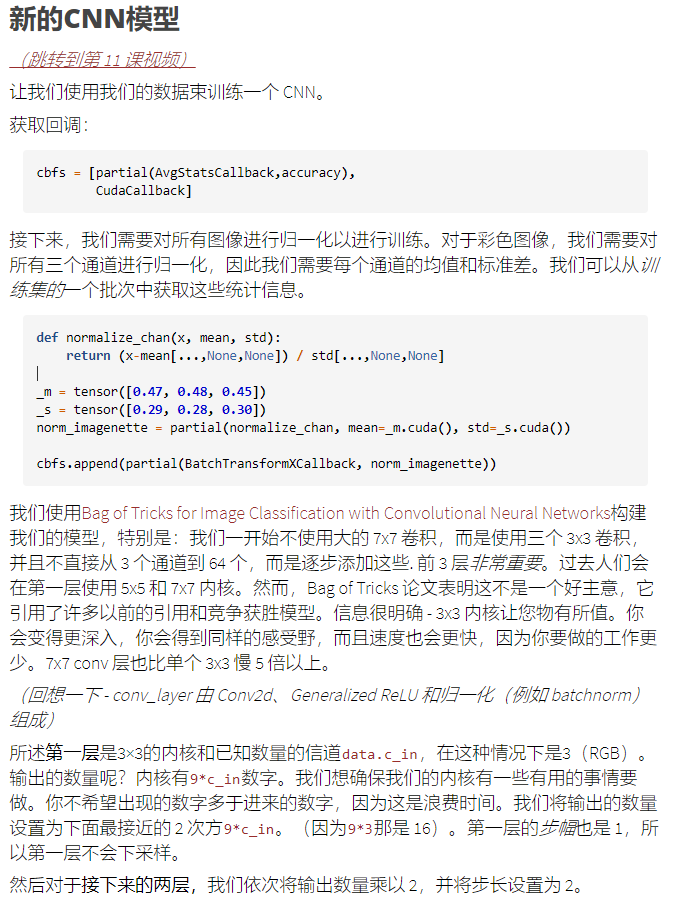

- 我们使用[Bag of Tricks for Image Classification with Convolutional Neural Networks](https://arxiv.org/abs/1812.01187)构建我们的模型，特别是：我们一开始不使用大的 7x7 卷积，而是使用三个 3x3 卷积，==并且不直接从 3 个通道到 64 个==，==而是逐步添加这些. 前 3 层*非常重要==*。过去人们会在第一层使用 5x5 和 7x7 内核。然而，Bag of Tricks 论文表明这不是一个好主意，它引用了许多以前的引用和竞争获胜模型。信息很明确 - 3x3 内核让您物有所值。你会变得更深入，你会得到同样的感受野，而且速度也会更快，因为你要做的工作更少。7x7 conv 层也比单个 3x3 慢 5 倍以上。

- 所述**第一层**是3×3的内核和已知数量的信道`data.c_in`，在这种情况下是3（RGB）。输出的数量呢？内核有`9*c_in`数字。我们想确保我们的内核有一些有用的事情要做。你不希望出现的数字多于进来的数字，因为这是浪费时间。我们将输出的数量设置为下面最接近的 2 次方`9*c_in`。（因为`9*3`那是 16）。第一层的*步幅*也是 1，所以第一层不会下采样。

  然后对于**接下来的两层，**我们依次将输出数量乘以 2，并将步长设置为 2。

  *（在任何地方看到不是 3x3 内核的东西 - 想一想它是否有意义。）*

  我们在模型主体中使用了 4 个 conv_layers，大小如下： `nfs = [64,64,128,256]`这就是我们的第一个内核的样子。因为我们使用 RGB 图像 c-in 是 3，但在一般情况下，我们`9*c-in`每一步都将数字相乘。我们不希望输出更多，因为这不仅仅是浪费我们的时间。过去，人们倾向于使用 5x5 和 7x7 内核，但现在我们知道使用 3x3 内核更好。

- 我们确保我们第一个卷积核在做一些有用的事情，上周讲过第一层的3×3的卷积核可能是在浪费时间。
  - 所以前面几层，其实用的大一些的卷积核，用2log2(x)来表示的。

- 看我们如何得到前三层的。3×3的kenerl效果会好，网络可以更深，最终也能得到一样的感受野。同时3×3的卷积核，训练起来更快，因为参数更少。这可以追溯到Siler和Fergus的论文。
- 如果哪里有3×3的卷积核，**想一想这是否有意义**
- 那些关键的前三层，这就是**初始特征表示发生的地方**
- 我们定义了前三层，然后才是用户定义的层

模型摘要是一件很重要的事情，因为很多时候容易发现错误。

- Jeremy每次写的时候，前面十几次总会写错，所以要debug，debug的办法就是打印出模型摘要。

```python
cbfs = [partial(AvgStatsCallback,accuracy), CudaCallback]
m,s = x.mean((0,2,3)).cuda(),x.std((0,2,3)).cuda()
m,s
(tensor([0.4768, 0.4785, 0.4628], device='cuda:0'),
 tensor([0.2538, 0.2485, 0.2760], device='cuda:0'))
#export
def normalize_chan(x, mean, std):
    return (x-mean[...,None,None]) / std[...,None,None]

_m = tensor([0.47, 0.48, 0.45])
_s = tensor([0.29, 0.28, 0.30])
norm_imagenette = partial(normalize_chan, mean=_m.cuda(), std=_s.cuda())
cbfs.append(partial(BatchTransformXCallback, norm_imagenette))
nfs = [64,64,128,256]

#export
import math
def prev_pow_2(x): return 2**math.floor(math.log2(x))

def get_cnn_layers(data, nfs, layer, **kwargs):
    def f(ni, nf, stride=2): return layer(ni, nf, 3, stride=stride, **kwargs)
    # databunch里面带有了data.c_in，所以有输入通道的个数
    l1 = data.c_in
    l2 = prev_pow_2(l1*3*3)
    # 定义了三层，然后才是上面的nfs定义的层【16,32,64】
    layers =  [f(l1  , l2  , stride=1), # 第一层不下采样。通道数不超过27
               f(l2  , l2*2, stride=2),
               f(l2*2, l2*4, stride=2)]
    nfs = [l2*4] + nfs
    layers += [f(nfs[i], nfs[i+1]) for i in range(len(nfs)-1)]
    layers += [nn.AdaptiveAvgPool2d(1), Lambda(flatten), 
               nn.Linear(nfs[-1], data.c_out)]
    return layers
def get_cnn_model(data, nfs, layer, **kwargs):
    return nn.Sequential(*get_cnn_layers(data, nfs, layer, **kwargs))

def get_learn_run(nfs, data, lr, layer, cbs=None, opt_func=None, **kwargs):
    model = get_cnn_model(data, nfs, layer, **kwargs)
    init_cnn(model)
    return get_runner(model, data, lr=lr, cbs=cbs, opt_func=opt_func)
sched = combine_scheds([0.3,0.7], cos_1cycle_anneal(0.1,0.3,0.05))
learn,run = get_learn_run(nfs, data, 0.2, conv_layer, cbs=cbfs+[partial(ParamScheduler, 'lr', sched)])
```

- 每次写这些模型的时候，前面的12次尝试我都会写错，调试的唯一方法就是准确的查看模型里面到底都是些啥，把模块的输入输出和卷积核大小等都输出来打印出来看看。
- 不用写多少代码就可以创建真正有用的工具，如直方图、模型摘要。
- 我真的希望你能喜欢在你的模型中挖掘它们是什么以及它们是什么

```python
#export
def model_summary(run, learn, data, find_all=False):
    xb,yb = get_batch(data.valid_dl, run)
    device = next(learn.model.parameters()).device#Model may not be on the GPU yet
    xb,yb = xb.to(device),yb.to(device)
    mods = find_modules(learn.model, is_lin_layer) if find_all else learn.model.children()
    f = lambda hook,mod,inp,out: print(f"{mod}\n{out.shape}\n")
    with Hooks(mods, f) as hooks: learn.model(xb)
```

```python
model_summary(run, learn, data)
Sequential(
  (0): Conv2d(3, 16, kernel_size=(3, 3), stride=(1, 1), padding=(1, 1), bias=False)
  (1): GeneralRelu()
  (2): BatchNorm2d(16, eps=1e-05, momentum=0.1, affine=True, track_running_stats=True)
)
torch.Size([128, 16, 128, 128])

Sequential(
  (0): Conv2d(16, 32, kernel_size=(3, 3), stride=(2, 2), padding=(1, 1), bias=False)
  (1): GeneralRelu()
  (2): BatchNorm2d(32, eps=1e-05, momentum=0.1, affine=True, track_running_stats=True)
)
torch.Size([128, 32, 64, 64])

Sequential(
  (0): Conv2d(32, 64, kernel_size=(3, 3), stride=(2, 2), padding=(1, 1), bias=False)
  (1): GeneralRelu()
  (2): BatchNorm2d(64, eps=1e-05, momentum=0.1, affine=True, track_running_stats=True)
)
torch.Size([128, 64, 32, 32])

Sequential(
  (0): Conv2d(64, 64, kernel_size=(3, 3), stride=(2, 2), padding=(1, 1), bias=False)
  (1): GeneralRelu()
  (2): BatchNorm2d(64, eps=1e-05, momentum=0.1, affine=True, track_running_stats=True)
)
torch.Size([128, 64, 16, 16])

Sequential(
  (0): Conv2d(64, 64, kernel_size=(3, 3), stride=(2, 2), padding=(1, 1), bias=False)
  (1): GeneralRelu()
  (2): BatchNorm2d(64, eps=1e-05, momentum=0.1, affine=True, track_running_stats=True)
)
torch.Size([128, 64, 8, 8])

Sequential(
  (0): Conv2d(64, 128, kernel_size=(3, 3), stride=(2, 2), padding=(1, 1), bias=False)
  (1): GeneralRelu()
  (2): BatchNorm2d(128, eps=1e-05, momentum=0.1, affine=True, track_running_stats=True)
)
torch.Size([128, 128, 4, 4])

Sequential(
  (0): Conv2d(128, 256, kernel_size=(3, 3), stride=(2, 2), padding=(1, 1), bias=False)
  (1): GeneralRelu()
  (2): BatchNorm2d(256, eps=1e-05, momentum=0.1, affine=True, track_running_stats=True)
)
torch.Size([128, 256, 2, 2])

AdaptiveAvgPool2d(output_size=1)
torch.Size([128, 256, 1, 1])

Lambda()
torch.Size([128, 256])

Linear(in_features=256, out_features=10, bias=True)
torch.Size([128, 10])
```

```
%time run.fit(5, learn)
train: [1.7975745138242594, tensor(0.3771, device='cuda:0')]
valid: [1.950084228515625, tensor(0.3640, device='cuda:0')]
train: [1.331341733558244, tensor(0.5549, device='cuda:0')]
valid: [1.182614013671875, tensor(0.6160, device='cuda:0')]
train: [1.0004353405653792, tensor(0.6729, device='cuda:0')]
valid: [0.9452028198242187, tensor(0.6740, device='cuda:0')]
train: [0.744675257750698, tensor(0.7583, device='cuda:0')]
valid: [0.8292762451171874, tensor(0.7360, device='cuda:0')]
train: [0.5341721137253761, tensor(0.8359, device='cuda:0')]
valid: [0.798895751953125, tensor(0.7360, device='cuda:0')]
CPU times: user 25.6 s, sys: 10.7 s, total: 36.4 s
Wall time: 1min 7s
```

The [leaderboard](https://github.com/fastai/imagenette/blob/master/README.md) as this notebook is written has ~85% accuracy for 5 epochs at 128px size, so we're definitely on the right track!

在imagetnette中，可以发现可以获得85%的acc。

- 数据是从imagenette的160×243resize bilinear到128×128,5个epochs后acc=73.6%，而官网为85%

### Optimizer tweaks

- 这是Jeremy最兴奋的地方。那里的每个库（我假设 Fastai 除外）都使用优化器作为不同的东西。这意味着添加新的需要大量无用的工作。Jeremy 将表明应该只有一个优化器，然后可以对其进行一些修改以使用不同的名称进行调用。
- 每个其他深度学习库都将每个优化器算法视为完全不同的对象。pytorch有一个adam优化器，还有sgd优化器，以及RMSProp优化器。还有decoupling weight decay优化器。他们怎么做呢？他们必须子啊优化器中向每一个优化器添加一个参数，每个优化器都有一个自己的参数。这样效率太低了，阻碍研究。一开始就感觉这些优化器是不同类型的优化器。
- Jeremy想要给大家一个优化器，然后定义不同的behavior，参数量少。
- 但这是一种人为的分类——然而，只有*一个优化器*和许多你可以添加的东西。

- 我们从通用优化器开始，然后结束的时候讲LAMB
- 我们将实施这篇论文：[Large Batch Optimization for Deep Learning: Training BERT in 76 minutes](https://arxiv.org/abs/1904.00962)。我们将从论文中实现这个方程组：
  - fastai不仅是第一个实现这个方程组的库，也是实现用的代码最少的一个库。

`09_optimizers.ipynb`

### Imagenette

- 还是使用imagenette这个数据集。

```python
#export
from exp.nb_08 import *
path = datasets.untar_data(datasets.URLs.IMAGENETTE_160)
tfms = [make_rgb, ResizeFixed(128), to_byte_tensor, to_float_tensor]
bs=128

il = ImageList.from_files(path, tfms=tfms)
sd = SplitData.split_by_func(il, partial(grandparent_splitter, valid_name='val'))
ll = label_by_func(sd, parent_labeler, proc_y=CategoryProcessor())
data = ll.to_databunch(bs, c_in=3, c_out=10, num_workers=4)

nfs = [32,64,128,256]
cbfs = [partial(AvgStatsCallback,accuracy), CudaCallback,
        partial(BatchTransformXCallback, norm_imagenette)]

learn,run = get_learn_run(nfs, data, 0.4, conv_layer, cbs=cbfs)
run.fit(1, learn)
train: [1.7649338173278268, tensor(0.3866, device='cuda:0')]
valid: [1.69968408203125, tensor(0.4180, device='cuda:0')]
```

- 在pytorch中，基本的optimizer，就是`torch.optim`就是一个词典，存储了所有超参数和训练时要用的参数组的引用parameter groups参数组（不同的组可以有不同的学习率/动量/权重衰减......这是是什么让我们做判别学习率discriminative learning rates）。
- 它包含一个`step`方法，用梯度更新我们的参数和一个`zero_grad`分离和归零所有参数梯度的方法。
- 我们从头开始构建等价物，只有我们的会更灵活。在我们的实现中，step 函数循环遍历所有参数组以使用我们在初始化优化器时必须提供的 stepper 函数来执行 step。
- 在05_anneal.ipynb的annealing退火函数中，我们使用了torch.opt.params_groups，我们作弊了。使用了一些不允许的库。所以我们现在自己来构建param_groups


- 我们将要从论文中实现的公式：fastai是第一个实现这个的库，而且代码也很少。
  - pytorch中的优化器，只是一个存储了一些超参数的字典。
  - params 应该是一个列表；然后我们将超参数保存为每个参数组的字典
  - model.parameters()或者其他生成器，调用list时能够返回所有tensor、权重和偏差的列表。
- 如迁移学习中，最后两层的学习率与其它层的学习率不一样，所以部门不仅是传入一个参数列表，而是传入一个list of list，有两个项目，第一项包含架构主体中的所有参数，最后一项只包含最后两层的参数。
  - 也就是params是一个list of list，也就是param groups
    - 然后决定如何将param_groups**分成不同的参数组，或者您可以让它们为您变成一个单独的参数组，这是我们需要的第一件事**
    - 在defaults中是一个字典，所有的超参数都储存为字典，每一个参数组都有一个字典
    - 每个参数组都有一组自己的参数，可以设置lr，动量等
  - **我是怎么说我们的compose是有点特别，它传递任何关键字参数到它组成的所有东西这里是一个很好的使用方法**
- 我们需要做学习率退火、1cycle退火等，就要创建param_groups。
  - 让我们建立自己的`Optimizer`类。它需要一种`zero_grad`将参数的梯度设置为零的`step`方法和一种执行某种步骤的方法。我们将做的与所有其他库不同的事情是将 的功能`step`抽象为`stepper`函数的组合。该`Optimizer`课程将只是有一个列表`steppers`迭代通过。
  - 模型的所有参数tensor是什么？我们可能想说：*“最后两层应该具有与其余层不同的学习率。”* 我们可以决定将不同的参数分组到 中`param_groups`，这基本上是一个list of list。个参数组可以有自己的一组超参数（例如学习率、权重衰减等），每个参数组都有自己的字典来存储这些超参数。`Optimizer`类的代码，可以获取stepper的默认超参数：
  - list of list：第一个包含网络架构层的所有超参数；第二个只包含训练最后两层的超参数。所以是一个参数组。

```python
class Optimizer(): # params是一个List of list
    def __init__(self, params, steppers, **defaults):
        # might be a generator
        self.param_groups = list(params)
        # ensure params is a list of lists
        if not isinstance(self.param_groups[0], list):
            # 如果不是list，就要包装在list中称为一个List
            self.param_groups = [self.param_groups]
        self.hypers = [{**defaults} for p in self.param_groups]
        self.steppers = listify(steppers)

    def grad_params(self):
        return [(p,hyper) for pg,hyper in zip(self.param_groups,self.hypers)
            for p in pg if p.grad is not None]

    def zero_grad(self):
        for p,hyper in self.grad_params():
            p.grad.detach_()
            p.grad.zero_()

    def step(self): # compose的部分：
        for p,hyper in self.grad_params(): compose(p, self.steppers, **hyper)
```

- 实现一个optimizer接口的关键在于stepper部分，steppers是具体的更新参数的实现部分，可以用sgd, adam等。

```python
#export
def sgd_step(p, lr, **kwargs):
    p.data.add_(-lr, p.grad.data)
    return p
opt_func = partial(Optimizer, steppers=[sgd_step])
```

- 然后改变一下ParaScheduler来使用我们的新的优化器
- 现在我们已经更改了优化器，我们需要调整使用 PyTorch 优化器属性的回调：特别是超参数在字典列表中`opt.hypers`（PyTorch 在参数组列表中包含所有内容）。

```python
#export
class Recorder(Callback):
    def begin_fit(self): self.lrs,self.losses = [],[]

    def after_batch(self):
        if not self.in_train: return
        self.lrs.append(self.opt.hypers[-1]['lr'])
        self.losses.append(self.loss.detach().cpu())        

    def plot_lr  (self): plt.plot(self.lrs)
    def plot_loss(self): plt.plot(self.losses)
        
    def plot(self, skip_last=0):
        losses = [o.item() for o in self.losses]
        n = len(losses)-skip_last
        plt.xscale('log')
        plt.plot(self.lrs[:n], losses[:n])

class ParamScheduler(Callback):
    _order=1
    def __init__(self, pname, sched_funcs):
        self.pname,self.sched_funcs = pname,listify(sched_funcs)

    def begin_batch(self): 
        if not self.in_train: return
        fs = self.sched_funcs
        if len(fs)==1: fs = fs*len(self.opt.param_groups)
        pos = self.n_epochs/self.epochs
        for f,h in zip(fs,self.opt.hypers): h[self.pname] = f(pos)
            
class LR_Find(Callback):
    _order=1
    def __init__(self, max_iter=100, min_lr=1e-6, max_lr=10):
        self.max_iter,self.min_lr,self.max_lr = max_iter,min_lr,max_lr
        self.best_loss = 1e9
        
    def begin_batch(self): 
        if not self.in_train: return
        pos = self.n_iter/self.max_iter
        lr = self.min_lr * (self.max_lr/self.min_lr) ** pos
        for pg in self.opt.hypers: pg['lr'] = lr
            
    def after_step(self):
        if self.n_iter>=self.max_iter or self.loss>self.best_loss*10:
            raise CancelTrainException()
        if self.loss < self.best_loss: self.best_loss = self.loss
```

```python
sched = combine_scheds([0.3, 0.7], [sched_cos(0.3, 0.6), sched_cos(0.6, 0.2)]) 

cbfs = [partial(AvgStatsCallback,accuracy),
        CudaCallback, Recorder,
        partial(ParamScheduler, 'lr', sched)]

learn,run = get_learn_run(nfs, data, 0.4, conv_layer, cbs=cbfs, opt_func=opt_func)

%time run.fit(1, learn)
----------------------
train: [1.7421688685144252, tensor(0.4011, device='cuda:0')]
valid: [1.589141357421875, tensor(0.4820, device='cuda:0')]
CPU times: user 4.72 s, sys: 2.29 s, total: 7.01 s
Wall time: 11.2 s
```

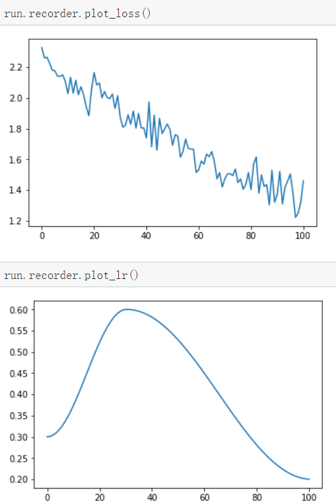

### Weight decay

重量衰减是鼓励参数为小数的原因。weight decay来源于 L2 正则化，如下所示……

- 为什么这样做呢？因为当我们计算梯度时，它会增加一个贡献，以鼓励权重尽可能小。
  - 限制weight权重的增长会阻碍模型的训练，但是也能让模型到一个泛化能力更好的状态。
  - weight decay实际上是一个参数，控制权重平方和。
- 经典的 L2 正则化包括将==所有权重平方的总和与乘以超参数 的损失相加`wd`。直觉是，大的权重值在平方时会“爆炸”，这将导致更大的损失。==因此，**优化器将避开这些参数空间区域**。从理论上讲，这就像在前向传递结束时将这个大和添加到总损失中：

```python
loss_with_wd = loss + (wd / 2) * (weights ** 2).sum()
# loss这样的时候，梯度下降就只需要在weight上加一点。
```

- 然而，这从来不是在实践中实现的方式。总和将需要在每个更新步骤中大量减少所有权重张量，这将是昂贵的并且可能在数值上不稳定（精度较低时更是如此）。
- 但实际计算中，计算这么大的总数并将其加到损失中是非常低效的(可能在数值上也不稳定)。如果你还记得一些高中的数学知识，p2对p的导数是2p。在loss上家这么大的和，等同于在梯度上加上下面的值：

```python
weight.grad += wd * weight
```

- 对于我们模型中的每个权重，这在vanilla-SGD的情况下相当于用以下方法更新参数:

- 这是weight decay的由来，每个权重都衰减一部分。这只适用于标准SGD，正如我们所看到的动量，RMSProp和Adam，更新中有一些关于梯度的额外公式。

- 对于 vanilla SGD，这等效于使用以下内容更新参数：

- 这种技术称为**权重衰减**，因为每个权重都会衰减一个因子`lr * wd`，如最后一个公式所示。

  这有点令人困惑**——L2 正则化和权重衰减不是一回事吗？**–*不完全是。只有在香草 SGD 的情况下，它们才相同。*

```python
# 梯度更新时，相当于前面还加上了Lr
weight = weight - lr*(weight.grad + wd*weight)
```

- 在这些情况下，来自L2正则化的公式:`weight.grad += wd * weight`与weight decay的公式是不一样的。`new_weight = weight - lr * weight.grad - lr * wd * weight`

- 大部分库使用第一个公式，但 [Decoupled Weight Regularization](https://arxiv.org/pdf/1711.05101.pdf) by Ilya Loshchilov and Frank Hutter指出：最好使用带有Adam优化器的第二个，这就是fastai将其作为默认值的原因。

- 代码中的 L2 正则化；需要注意的一件事是，在 PyTorch 中，使用 to 参数的 add_ 将首先将它们相乘，然后再添加到 p.grad。

- weight decay是从权重中减去`lr*wd*weight`，需要这个函数有一个_defaults属性，这样我们就可以确定在优化器Optimizer中有一个同名的超参数。

- 在 python 中，您可以将**属性**附加到 python 中的任何对象，包括函数。这里我们附上一个`_defaults`默认超参数值的字典。或者，如果您使用的是抽象基类，则您只需拥有一个 class 属性`_defaults`即可获得 同样的效果。

  同样，如果您想使用 L2 正则化，那么实现也很简单 - 添加`wd*weight`到梯度中：

```python
#export
def weight_decay(p, lr, wd, **kwargs):
    p.data.mul_(1 - lr*wd)
    return p
weight_decay._defaults = dict(wd=0.) # defaults属性

#export
def l2_reg(p, lr, wd, **kwargs):
    p.grad.data.add_(wd, p.data)
    return p
l2_reg._defaults = dict(wd=0.)
```

- 对于动量、RMSProp 和 Adam 等算法，更新在梯度周围有一些额外的公式。对于具有动量的 SGD，公式为：

```python
moving_avg = alpha * moving_avg + (1 - alpha) * w.grad
w = w - lr * moving_avg
```

如果我们进行 L2 正则化，这将变成：

```python
moving_avg = alpha * moving_avg + (1 - alpha) * (w.grad + wd*w)
w = w - lr * moving_avg
                        - lr * (1 - alpha) * w.grad - lr * (1 - alpha) * wd * w
```

而随着权重衰减weight decay，它将是：

```python
moving_avg = alpha * moving_avg + (1 - alpha) * w.grad
w = w - lr * moving_avg - lr * wd * w # 少一个1-α的衰减
```

- 我们可以看到，weight decay与正则化相关的部分在两种方法中并不相同，并且L2中`wd`受到了`(1-alpha)`因子的污染。当使用像 Adam 优化器这样更复杂的东西时，它会变得更加污染。大多数库使用第一个公式，但正如Ilya Loshchilov 和 Frank Hutter在[Decoupled Weight Regularization 中](https://arxiv.org/abs/1711.05101)指出的那样，最好将第二个与 Adam 优化器一起使用，这就是 fastai 库将其设为默认值的原因。Adam 和Decoupled Weight Regularization的这种实现通常称为**AdamW**。

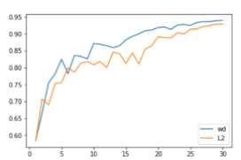

- *以上是[Jeremy和Sylvain](https://www.fast.ai/2018/07/02/adam-weight-decay/#results-of-adamw-experiments-does-it-work)对两者所做的对比weight decay 公式给出了稍微好一点的结果。*

  权重衰减也非常容易实现 - 您只需`lr*wd*weight`在优化器步骤之前从权重中减去。我们可以为 stepper 创建一些抽象基类，或者只在 python 中使用一个函数：

- 

- 允许stepper添加默认值，默认值就是超参数的默认值

- helper函数在dest中添加它在遍历os和应用f时找到的键/值，当它们不是同名的键时。

```python
#export
def maybe_update(os, dest, f):
    for o in os:
        for k,v in f(o).items():
            if k not in dest: dest[k] = v

def get_defaults(d): return getattr(d,'_defaults',{})
```

```python
#export
class Optimizer():
    def __init__(self, params, steppers, **defaults):
        self.steppers = listify(steppers)
        # stepper可以是任意的，然后获取defaults的参数
        maybe_update(self.steppers, defaults, get_defaults)
        # might be a generator
        self.param_groups = list(params)
        # ensure params is a list of lists
        if not isinstance(self.param_groups[0], list): self.param_groups = [self.param_groups]
        self.hypers = [{**defaults} for p in self.param_groups]

    def grad_params(self):
        return [(p,hyper) for pg,hyper in zip(self.param_groups,self.hypers)
            for p in pg if p.grad is not None]

    def zero_grad(self):
        for p,hyper in self.grad_params():
            p.grad.detach_()
            p.grad.zero_()

    def step(self):
        for p,hyper in self.grad_params(): compose(p, self.steppers, **hyper)
#export 
sgd_opt = partial(Optimizer, steppers=[weight_decay, sgd_step])
learn,run = get_learn_run(nfs, data, 0.4, conv_layer, cbs=cbfs, opt_func=sgd_opt)
# Before trying to train, let's check the behavior works as intended: when we don't provide a value for wd, we pull the corresponding default from weight_decay.

model = learn.model
opt = sgd_opt(model.parameters(), lr=0.1)
test_eq(opt.hypers[0]['wd'], 0.)
test_eq(opt.hypers[0]['lr'], 0.1)
# But if we provide a value, it overrides the default.

opt = sgd_opt(model.parameters(), lr=0.1, wd=1e-4)
test_eq(opt.hypers[0]['wd'], 1e-4)
test_eq(opt.hypers[0]['lr'], 0.1)
# Now let's fit.

cbfs = [partial(AvgStatsCallback,accuracy), CudaCallback]
learn,run = get_learn_run(nfs, data, 0.3, conv_layer, cbs=cbfs, opt_func=partial(sgd_opt, wd=0.01))
run.fit(1, learn)
train: [1.8518677231173415, tensor(0.3537, device='cuda:0')]
valid: [1.947130615234375, tensor(0.3100, device='cuda:0')]
# This is already better than the baseline!
```

- 所以我们有了一个带有weight decay的SGD优化器，然后fit 1 epoch。

### Momentum动量

Momentum 需要一个具有某种*状态*stat的优化器，因为它需要记住它在上次更新中做了什么来进行当前更新。需要参数和超参数，需要知道每组激活元上一次更新了哪些梯度。

动量需要添加一些状态。我们需要保存**梯度的移动平均值**才能执行该步骤并将其存储在优化器状态中。我们需要为每个参数**跟踪**上次发生的情况。这实际上是相当多的状态——如果您的网络中有 1000 万次激活，那么您现在必须存储 1000 万个浮点数。

为了实现这一点，我们需要创建一个新的子类，`Optimizer`该子类维护一个`state`属性，该属性可以存储正在运行`Stat`的事物，这些事物每`step`. A`Stat`是一个对象，它有两个方法和一个属性：

- `init_state`, 返回初始状态（梯度的移动平均值为 0 的张量）
- `update`，用新的梯度值更新状态。获取状态字典并返回更新的状态字典。
- 我们还读取`_defaults`这些对象的值，以允许它们为超参数提供默认值。

的`StatefulOptimizer`：

接下来让我们添加动量。我们需要再次修改优化器类以存储先前的参数值。

- 由于计算动量，需要激活元之前的状态，所以需要存储激活元的浮点数。StateOptimizer是拥有state的优化器。

```python
#export
class StatefulOptimizer(Optimizer):
    def __init__(self, params, steppers, stats=None, **defaults): 
        self.stats = listify(stats)
        maybe_update(self.stats, defaults, get_defaults)
        super().__init__(params, steppers, **defaults)
        self.state = {}
        
    def step(self):
        for p,hyper in self.grad_params():
            if p not in self.state:
                #Create a state for p and call all the statistics to initialize it.
                self.state[p] = {}
                maybe_update(self.stats, self.state[p], lambda o: o.init_state(p))
            state = self.state[p]
            for stat in self.stats: state = stat.update(p, state, **hyper)
            compose(p, self.steppers, **state, **hyper)
            self.state[p] = state
#export
class Stat():
    _defaults = {}
    def init_state(self, p): raise NotImplementedError
    def update(self, p, state, **kwargs): raise NotImplementedError    
# Here is an example of Stat:

class AverageGrad(Stat):
    _defaults = dict(mom=0.9)

    def init_state(self, p): return {'grad_avg': torch.zeros_like(p.grad.data)}
    def update(self, p, state, mom, **kwargs):
        state['grad_avg'].mul_(mom).add_(p.grad.data)
        return state
# Then we add the momentum step (instead of using the gradients to perform the step, we use the average).

#export
def momentum_step(p, lr, grad_avg, **kwargs):
    p.data.add_(-lr, grad_avg)
    return p
sgd_mom_opt = partial(StatefulOptimizer, steppers=[momentum_step,weight_decay],
                  stats=AverageGrad(), wd=0.01)
learn,run = get_learn_run(nfs, data, 0.3, conv_layer, cbs=cbfs, opt_func=sgd_mom_opt)
run.fit(1, learn)
------------------------
train: [1.7929072509500543, tensor(0.3878, device='cuda:0')]
valid: [1.6677803955078125, tensor(0.3960, device='cuda:0')]
```

### python的kwargs参数

python实现这一功能的特性之一是==python处理参数和关键字参数列表的灵活方式。==所有不同的stepper函数取一个权张量加上一些单独的位置参数集。调用一个包含所有位置参数的stepper函数列表会非常复杂。不过如果你坚持* * kwargs来做stepper的参数列表，调用stepper的时候，就可以从kwargs中取stepper函数所需要的参数，并且忽视其他不需要的参数。

这个简单的例子说明了我的意思：

```python
def foo(bar, lol, baz, **kwargs):
    print(bar, lol, baz)

def boo(biz, **kwargs):
    print(biz)

params = {"lol": 2, "baz": 3, "biz": 5}
foo(1, **params)
boo(**params)

## This outputs:
## 1 2 3
## 5
```

Params具有所有函数的所有kwargs。函数foo和boo只从参数中获取它们需要的东西。这里唯一需要注意的是，没有任何stepper函数的参数名相同，不同的stepper函数的参数的名字都是不一样的。但在语义上是不同的。==如果一个键被覆盖，您可能会检查要抛出的参数和异常，以防止这个沉默的错误silence bug==。

### Weight Decay + Batch Norm：一个令人惊讶的结果

- https://zhuanlan.zhihu.com/p/56142484 L2 wd配合bn的效果就是对lr的动态调节。

- 那么既然BN对参数放缩不敏感，而L2正则的作用就是整体地缩小参数大小，不就可以得出结论：L2和BN一起用的时候，L2一点用都没用？

- l2正则化，参数w每次都会按照固定比例decay

- 想要用wd=1e6来限制weight在一个比较小的范围内。相当于w要除以1e6才能保持跟之前的激活元一样。但是bn可以让所有的参数都乘以1e6，把w变回去。由于bn与量纲无关，所以又没有差别了。

  - 所以l2正则化基本就没用了。所以l2正则化遇到bn后，就失去作用了。最主要的是bn与量纲无关

  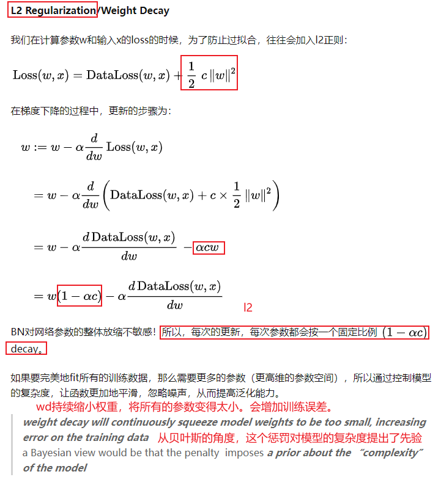

  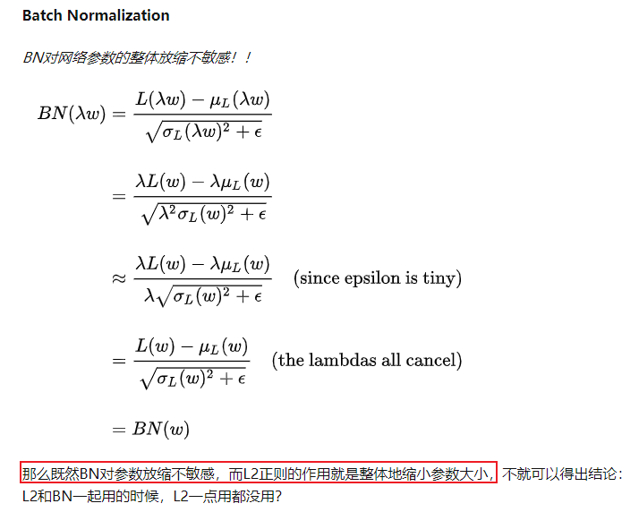

  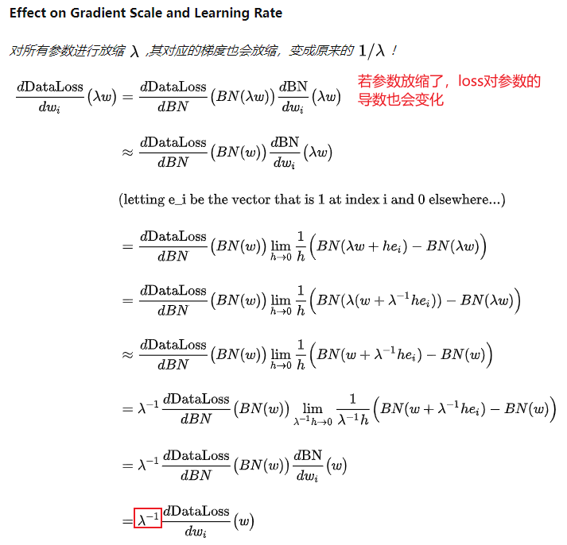

  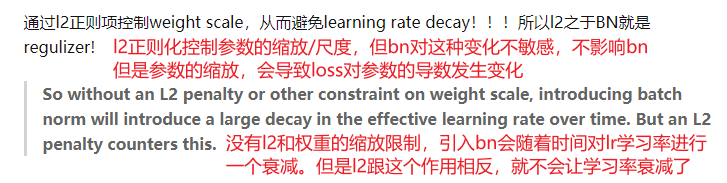


> paper:批量归一化是改进深度神经网络训练的常用技巧，他们还使用 l2 正则化或者叫做权重衰减 来防止过度拟合。==但是我们表明，l2正则化与归一化一起的时候，没有正则化作用==。what????

- 我在欧洲和 Silvia 聊天时意识到这一点，我已经告诉过你我给他布置的东西，这是在我发现这篇论文之前，我们有一些正确的激活层和一些层，

#### 如何理解这个结论呢？

权重->得到激活元->batch normalization批量归一化——bn：是对所有的激活元做线性变化，乘法+加法。

然后l2正则化的意思是：(1-α)×lr×wd×w。然后权重就减去这个数值。w -= (1-α)×lr×wd×w。

- 如果weight decay = 1e6 一百万。那么损失函数就destroyed了，不可能学到任何东西。
  w -= (1-α)×lr×wd×w。那么w权重的数值就会很小。
  - 但是后面的bn就会把前面w损失的部分，用1e6补偿回来。bn

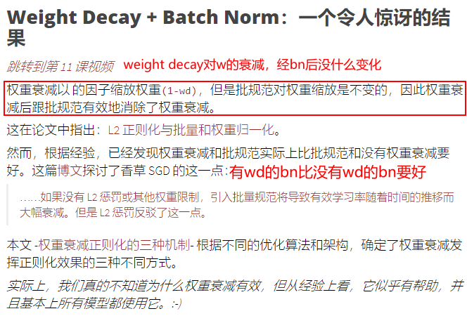

- 没有l2的时候，bn将随着时间的推移导致有效学习率的大幅下降。但是l2乘法conuters this。
  - This paper - [Three Mechanisms of Weight Decay Regularization](https://arxiv.org/abs/1810.12281) 根据不同的优化算法和结构，确定了三种不同的weight decay可以产生正则化效果。

- Jeremy 在这一点上提到的一件重要事情是，当我们进行批量标准化bn时，==L2 正则化并没有以每个人都期望的方式工作==。围绕这个领域正在进行一些研究，人们试图弄清楚当我们添加 L2 正则化时会发生什么。这个问题还没有一个答案。

- bn可以补偿掉l2 weight decay的部分，所以l2似乎没有什么作用了。

  - 作者 Twan van laarhoven 在中间提到了这一点，2017 年基本上没有人注意到
  
- 我在过去几个月的今天的课程笔记中提到了另外几篇论文，人们终于开始真正思考这个问题

  - 我们都做错了，甚至不知道l2正则化子啊做什么，但是如果你改变l2正则化，确实发生了变化。但它确实做了一些事情因为如果你改变它某些东西发生了所以这个人是错的？
  - 所以由 Rogergross 领导的团队最近发表的一篇论文找到了三种可能发生正则化的方式，**但这不是你认为这是其中一篇论文的方式课堂笔记，但即使在他几个月前的论文中，摘要说基本上或介绍说基本上没有人真正了解 L2 正则化的作用，所以我们不知道我们在做什么 每个模型都一直都有这样的事情，而且完全不起作用 至少它不会以我们认为的方式起作用**
  - 所以这应该让你感觉更好 我是否可以为深度学习做出贡献 显然你可以 因为我们都不知道我们在做什么
  - 所以深度学习还有很多值得深入探索的地方，还有很多未解的答案，open questions

  - 就像使用所有这些遥测技术，我向你展示了不同层的激活，看看实验中会发生什么，因为研究这些东西的人就像bn，weight decay等实际发生的情况一样，他们中的大多数人都没有知道如何正确训练模型，他们就像理论人员，然后是从业者，他们完全忘记了实际思考基础，但如果你能将两者结合起来说哦，让我们实际尝试一下一些实验让我们看看当我们改变权重衰减时会发生什么 现在我假设我们不知道我们在做什么 我相信你可以找到一些非常有趣的结果 

  ### Momentum Experiments

  **所以动量也很有趣**，而我们真的不知道对诸如动量之类的东西的工作原理有很多了解，但这里有一些不错的图片供您使用，希望它能让你对动量有一些认识。

  接下来，我们将看一些用不同方法计算动量的图。

  - 动量很有趣，但我妈真的不明白它的工作原理。让我们创建一些由 200 个正态分布点组成的假数据系列，并用不同的`beta`值绘制该系列的移动平均值：`[0.5, 0.7, 0.9, 0.99]`

    常规动量：

```python
x = torch.linspace(-4, 4, 200)
y = torch.randn(200) + 0.3
betas = [0.5, 0.7, 0.9, 0.99]
def plot_mom(f):
    _,axs = plt.subplots(2,2, figsize=(12,8))
    for beta,ax in zip(betas, axs.flatten()):
        ax.plot(y, linestyle='None', marker='.')
        avg,res = None,[]
        for i,yi in enumerate(y):
            avg,p = f(avg, beta, yi, i)
            res.append(p)
        ax.plot(res, color='red')
        ax.set_title(f'beta={beta}')
        
def mom1(avg, beta, yi, i): 
    if avg is None: avg=yi
    res = beta*avg + yi
    return res,res
plot_mom(mom1)
```

- 不同的β对avg进行加权，然后看历史累计在红色线上的影响。

- 

  - 动量β较小时，曲线都非常颠簸。一旦β比较高，到0.99了，你就会完全得到错误的答案了。因为过去的加权太重了，而大多数的值又>0，导致曲线一直都很高。
  - **0.9 加上一个新的东西，这些东西都在零以上，所以你最终得到的数字太高了，这就是为什么如果你的动量太高而基本上你离你需要在权重空间里的地方还有很远**

> *由于动量很小（小`beta`），它非常颠簸/高度变化。当你达到更大的动量值时，它会发射，而它看到的新值无法减慢它的速度。因此**，当涉及到高动量值时，您必须非常小心。***

  - 所以要小心高动量，而且此时的公式为$avg = \beta*avg+y_i$，给历史值太高的权重了。
  - 所以右侧的新公式为：$avg = \beta*avg+(1-\beta)y_i$，这就是指数加权平均。
  - 这有助于*抑制*传入的数据点，从而阻止它在较低动量值时变得如此颠簸。. 再次绘制相同的图：
  - *这工作得更好。所以我们完成了吗？- 不完全的。*

```python
#export
def lin_comb(v1, v2, beta): return beta*v1 + (1-beta)*v2
def mom2(avg, beta, yi, i):
    if avg is None: avg=yi
    avg = lin_comb(avg, yi, beta)
    return avg, avg
plot_mom(mom2)
```

上面是随机数，如果不是随机数，而是下面的一个具体的函数。

如果我们试图匹配的东西不仅是随机的，而且是多项式之类的函数，该怎么办？我们还在开始时添加了一个异常值。让我们看看 EWMA 在这里是如何做的：

```python
y = 1 - (x/3) ** 2 + torch.randn(200) * 0.1
y[0]=0.5 # 第一个数值是异常值
plot_mom(mom2)
```
- 如果指数加权平均的动量很小，一开始有一个异常值，由于beta较小，所以权重还是较小的。
  - 但如果后面有很多这样的异常值，在0.99时，曲线会大量偏向于第一个数值。所以走歪了。
  - 而且红线总是在绿色点的右侧，所以还是有点问题。


- 异常值一开始如果就遇到了较高的动量值，就会造成很大的麻烦。曲线会极大的偏向第一个数值。
  - 我们需要做一些Debiasing来校正，偏差校正。确保任何的单个数值都不能占过高的权重。正常的指数移动加权平均，总是给第一个值太多的权重。我们需要添加一个校正因子：$ x_i=x_i/(1−β^{i+1})$ ，当i较大时，这个校正因子会趋于1.它只会让初始值上升。
  - *这很好。即使我们的起点不好，它也能很好地消除偏差。*

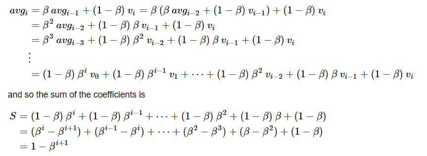

- Debiasing是为了纠正我们在第一个batch中的错误信息。bias的值应该是移动加权平均中的系数之和，随着时间的变化，我们的均值如上计算avg。
- 系数之和为S。通过除以S，我们的移动加权平均就是一个真正意义上的平均值了。在这种意义上，所有的系数之和就为1了。

- 我们就需要偏置了，除以(1-beta)。

```python
def mom3(avg, beta, yi, i):
    if avg is None: avg=0
    avg = lin_comb(avg, yi, beta)
    return avg, avg/(1-beta**(i+1))
plot_mom(mom3)
```

- 从下图可以看出，即使第一个点很差，debias也还是比较快的。0.9的beta曲线还是不错的。


- 如果初始值为0,那么0.9×0 + 0.1*a1，那么实际上a1就小了10倍。所以a1应该除以0.1（1-0.9）。

- 用Excel表来解释一下：β × last _ (1 - β) × val = new, correction = $1-β^{batch_i}$
- exp mov avg 指数加权平均的结果为：$\beta*new+(1-\beta)*val=new, new / (1 - \beta^i)$  
  - 后面两个是实际的加权平均。最右边一列是，average(val:6~9)


mom_bias.xlsx


# Adam and friends

- 让我们使用我们学到的知识来实现优化器**Adam**。[Adam 论文 (2014) 中](https://arxiv.org/abs/1412.6980)的算法定义是：
  - 分子是debias的动量，分母是debias的平方梯度的和的根。
  - damping是可选的参数。
- 经过偏置后，就拟合的比较好了。即使几点比较差，也不会被第一个点带走。
- **让我们使用所有这些来创建 Adam** 
- 参考Adam的公式理解如下的代码

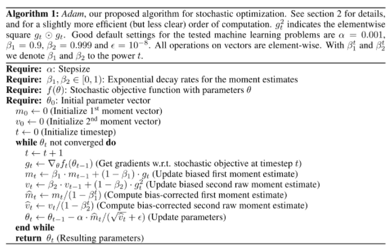


- 如果我们看一下 while 循环内部，并盯着数学，那么里面就没有我们还没有看到的东西。 G 是权重的梯度，m 是梯度的 EWMA，并且v 是梯度平方的 EMWA。 m 和vv 然后去偏差，正如我们在上面看到的。

*Adam 只是阻尼dampened debiased momentum去偏动量 除以 dampened debiased root sum of squared gradients 阻尼去偏的梯度平方根和。*

要实现 Adam，我们需要实现以下内容：

- 梯度的 EWMA - 一个`Stat`子类。
- 梯度平方的 EWMA - 一个`Stat`子类。
- 一个去偏函数。这将需要知道我们在哪一步。
- stepper counter—— 一个`Stat`子类

```python
#export
class AverageGrad(Stat):
    _defaults = dict(mom=0.9)
    
    def __init__(self, dampening:bool=False): self.dampening=dampening
    def init_state(self, p): return {'grad_avg': torch.zeros_like(p.grad.data)}
    def update(self, p, state, mom, **kwargs):
        state['mom_damp'] = 1-mom if self.dampening else 1.
        state['grad_avg'].mul_(mom).add_(state['mom_damp'], p.grad.data)
        return state
#export
class AverageSqrGrad(Stat):
    _defaults = dict(sqr_mom=0.99)
    
    def __init__(self, dampening:bool=True): self.dampening=dampening
    def init_state(self, p): return {'sqr_avg': torch.zeros_like(p.grad.data)}
    def update(self, p, state, sqr_mom, **kwargs):
        state['sqr_damp'] = 1-sqr_mom if self.dampening else 1.
        state['sqr_avg'].mul_(sqr_mom).addcmul_(state['sqr_damp'], p.grad.data, p.grad.data)
        return state
#export
class StepCount(Stat):
    def init_state(self, p): return {'step': 0}
    def update(self, p, state, **kwargs):
        state['step'] += 1
        return state
#export
def debias(mom, damp, step): return damp * (1 - mom**step) / (1-mom)

#export
def adam_step(p, lr, mom, mom_damp, step, sqr_mom, sqr_damp, grad_avg, sqr_avg, eps, **kwargs):
    debias1 = debias(mom,     mom_damp, step)
    debias2 = debias(sqr_mom, sqr_damp, step)
    p.data.addcdiv_(-lr / debias1, grad_avg, (sqr_avg/debias2).sqrt() + eps)
    return p
adam_step._defaults = dict(eps=1e-5)

#export
def adam_opt(xtra_step=None, **kwargs):
    return partial(StatefulOptimizer, steppers=[adam_step,weight_decay]+listify(xtra_step),
                   stats=[AverageGrad(dampening=True), AverageSqrGrad(), StepCount()], **kwargs)

learn,run = get_learn_run(nfs, data, 0.001, conv_layer, cbs=cbfs, opt_func=adam_opt())

run.fit(3, learn)
--------------
train: [1.7606317618659841, tensor(0.3931, device='cuda:0')]
valid: [1.4439287109375, tensor(0.5320, device='cuda:0')]
train: [1.246226745482395, tensor(0.5872, device='cuda:0')]
valid: [1.113287353515625, tensor(0.6260, device='cuda:0')]
train: [0.9583190188992943, tensor(0.6872, device='cuda:0')]
valid: [0.9859400634765625, tensor(0.6720, device='cuda:0')]
```

- 请注意，权重衰减和 Adam 步骤是完全解耦的。这是一个实现**AdamW**算法，上面提到的重量衰减小节。首先衰减权重，然后执行 Adam 步骤。
- `Adam 中的 epsilon`非常重要。如果我们设置`eps=1`呢？大多数情况下，梯度将小于 1，而平方梯度将远小于 1。因此`eps=1`将远大于`(sqr_avg/debias2).sqrt()`，因此`eps`将占主导地位，优化器将非常接近SGD with debiased-dampened momentum 带有debias的momentum的SGD优化器。

- 然而，如果`eps=1e-7`那时我们真的在使用这个`(sqr_avg/debias2).sqrt()`词。如果你的某些激活在一段时间内有一个很小的平方梯度，这一项的值可能是`1e-6`。除以这个相当于乘以一百万，这会杀死您的优化器Optimizer。让 Adam 和他的朋友们正常工作的诀窍是`eps=1e-3`和之间的值`eps=1e-1`。$\epsilon\in[1e-3,1e-1]$。

- 大多数人使用`1e-7`，相当于乘以 1000 万。这里`eps`基本上只是一个小的黑客数字，以避免可能被零除。相反，我们可以将其`eps`视为一种平滑因子，使优化器有时表现得更像动量 SGD  momentum SGD，有时表现得更像普通Adam normal Adam。
- $\epsilon=1$，Adam变为标准SGD，带有dibias的momentum。$\epsilon=1e-7$，那根号下的左侧的部分才有用。

### LAMB Algorithm

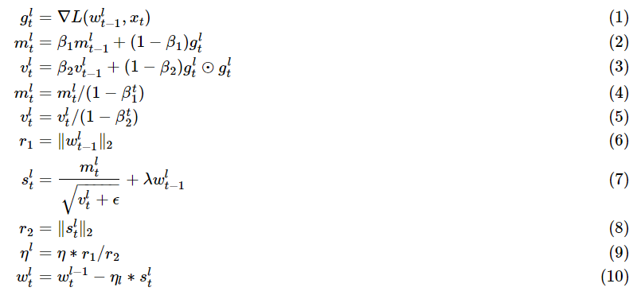

LAMB是最近新出的一篇论文，绝对值得一读。This is LAMB from a [very recent paper (2019)](https://arxiv.org/abs/1904.00962):

这是我们之前在 Adam 中看到的内容以及一些额外内容：

- m和v是debiased dampened momentum和去偏梯度平方根。像在Adam中一样
- $|w^l_{t−1}|^2$是第t层权重的l2范数
- 每一层的学习率$\eta^l$是逐渐的每层单独适应的。
  - 学习率，用每一层的权重的范数来加权平均。
- 需要和Adam一样多的State
- 该比率`r1/r2`被原作者称为*“信任比率”*。在大多数实现中，这个信任比率的上限值被削减以使 LAMB 更加稳定。此上限通常设置为 10 或 100。

```python
def lamb_step(p, lr, mom, mom_damp, step, sqr_mom, sqr_damp, grad_avg, sqr_avg, eps, wd, **kwargs):
    debias1 = debias(mom,     mom_damp, step)
    debias2 = debias(sqr_mom, sqr_damp, step)
    r1 = p.data.pow(2).mean().sqrt()
    step = (grad_avg/debias1) / ((sqr_avg/debias2).sqrt()+eps) + wd*p.data
    r2 = step.pow(2).mean().sqrt()
    p.data.add_(-lr * min(r1/r2,10), step)
    return p

lamb_step._defaults = dict(eps=1e-6, wd=0.)

lamb = partial(StatefulOptimizer, steppers=lamb_step, stats=[AverageGrad(dampening=True), AverageSqrGrad(), StepCount()])

learn,run = get_learn_run(nfs, data, 0.003, conv_layer, cbs=cbfs, opt_func=lamb)

run.fit(3, learn)
------------------
train: [1.8728660132619823, tensor(0.3419, device='cuda:0')]
valid: [1.484662841796875, tensor(0.4860, device='cuda:0')]
train: [1.3553239394291918, tensor(0.5506, device='cuda:0')]
valid: [1.537447021484375, tensor(0.4840, device='cuda:0')]
train: [1.0624497101364976, tensor(0.6537, device='cuda:0')]
valid: [1.11101806640625, tensor(0.6460, device='cuda:0')]
```
Other recent variants of optimizers:

- [Large Batch Training of Convolutional Networks](https://arxiv.org/abs/1708.03888) (LARS also uses weight statistics, not just gradient statistics. Can you add that to this class?)
- [Adafactor: Adaptive Learning Rates with Sublinear Memory Cost](https://arxiv.org/abs/1804.04235) (Adafactor combines stats over multiple sets of axes)
- [Adaptive Gradient Methods with Dynamic Bound of Learning Rate](https://arxiv.org/abs/1902.09843)

## Let's kill off Runner

`09b_learner.ipynb`

Jeremy 再次想重构我们在几节课前制作的代码。惹恼 Jeremy 的问题是 Learner 只是包含了一些东西，但没有做任何事情。然后是 Runner 里面有 Learner，然后它做了一些事情。Jeremy 决定在 Learner 中添加 Runner

- learner只存储了三个东西，哪有一个类的作用就是存三个值呢？我们为什么不在Runner里面存着呢？

```python
#export
from exp.nb_09 import *
AvgStats
exp.nb_04.AvgStats

path = datasets.untar_data(datasets.URLs.IMAGENETTE_160)
tfms = [make_rgb, ResizeFixed(128), to_byte_tensor, to_float_tensor]
bs=64

il = ImageList.from_files(path, tfms=tfms)
sd = SplitData.split_by_func(il, partial(grandparent_splitter, valid_name='val'))
ll = label_by_func(sd, parent_labeler, proc_y=CategoryProcessor())
data = ll.to_databunch(bs, c_in=3, c_out=10, num_workers=4)
cbfs = [partial(AvgStatsCallback,accuracy),
        CudaCallback,
        partial(BatchTransformXCallback, norm_imagenette)]
nfs = [32]*4

#export
def param_getter(m): return m.parameters()

class Learner():
    def __init__(self, model, data, loss_func, opt_func=sgd_opt, lr=1e-2, splitter=param_getter,
                 cbs=None, cb_funcs=None):
		# 把learn的东西合起来，放在原来的Runner里面去，变成了Learner
        self.model,self.data,self.loss_func,self.opt_func,self.lr,self.splitter = model,data,loss_func,opt_func,lr,splitter
        self.in_train,self.logger,self.opt = False,print,None
        
        # NB: Things marked "NEW" are covered in lesson 12
        # NEW: avoid need for set_runner
        self.cbs = []
        self.add_cb(TrainEvalCallback())
        self.add_cbs(cbs)
        self.add_cbs(cbf() for cbf in listify(cb_funcs))

    def add_cbs(self, cbs):
        for cb in listify(cbs): self.add_cb(cb)
            
    def add_cb(self, cb):
        cb.set_runner(self)
        setattr(self, cb.name, cb)
        self.cbs.append(cb)

    def remove_cbs(self, cbs):
        for cb in listify(cbs): self.cbs.remove(cb)
            
    def one_batch(self, i, xb, yb):
        try:
            self.iter = i
            self.xb,self.yb = xb,yb;                        self('begin_batch')
            self.pred = self.model(self.xb);                self('after_pred')
            self.loss = self.loss_func(self.pred, self.yb); self('after_loss')
            if not self.in_train: return
            self.loss.backward();                           self('after_backward')
            self.opt.step();                                self('after_step')
            self.opt.zero_grad()
        except CancelBatchException:                        self('after_cancel_batch')
        finally:                                            self('after_batch')

    def all_batches(self):
        self.iters = len(self.dl)
        try:
            for i,(xb,yb) in enumerate(self.dl): self.one_batch(i, xb, yb)
        except CancelEpochException: self('after_cancel_epoch')

    def do_begin_fit(self, epochs):
        self.epochs,self.loss = epochs,tensor(0.)
        self('begin_fit')

    def do_begin_epoch(self, epoch):
        self.epoch,self.dl = epoch,self.data.train_dl
        return self('begin_epoch')

    def fit(self, epochs, cbs=None, reset_opt=False):
        # NEW: pass callbacks to fit() and have them removed when done
        self.add_cbs(cbs)
        # NEW: create optimizer on fit(), optionally replacing existing
        if reset_opt or not self.opt: self.opt = self.opt_func(self.splitter(self.model), lr=self.lr)
            
        try:
            self.do_begin_fit(epochs)
            for epoch in range(epochs):
                if not self.do_begin_epoch(epoch): self.all_batches()

                with torch.no_grad(): 
                    self.dl = self.data.valid_dl
                    if not self('begin_validate'): self.all_batches()
                self('after_epoch')
            
        except CancelTrainException: self('after_cancel_train')
        finally:
            self('after_fit')
            self.remove_cbs(cbs)

    ALL_CBS = {'begin_batch', 'after_pred', 'after_loss', 'after_backward', 'after_step',
        'after_cancel_batch', 'after_batch', 'after_cancel_epoch', 'begin_fit',
        'begin_epoch', 'begin_validate', 'after_epoch',
        'after_cancel_train', 'after_fit'}
    
    def __call__(self, cb_name):
        res = False
        assert cb_name in self.ALL_CBS
        for cb in sorted(self.cbs, key=lambda x: x._order): res = cb(cb_name) and res
        return res
    
cbfs = [partial(AvgStatsCallback,accuracy),
        CudaCallback,
        partial(BatchTransformXCallback, norm_imagenette)]
#export
def get_learner(nfs, data, lr, layer, loss_func=F.cross_entropy,
                cb_funcs=None, opt_func=sgd_opt, **kwargs):
    model = get_cnn_model(data, nfs, layer, **kwargs)
    init_cnn(model)
    return Learner(model, data, loss_func, lr=lr, cb_funcs=cb_funcs, opt_func=opt_func)
learn = get_learner(nfs, data, 0.4, conv_layer, cb_funcs=cbfs)
%time learn.fit(1)
train: [1.8311652646095082, tensor(0.3570, device='cuda:0')]
valid: [1.5547332763671875, tensor(0.4880, device='cuda:0')]
CPU times: user 4.05 s, sys: 1.93 s, total: 5.98 s
Wall time: 18 s
```
### Progress bars 进度条

`09c_add_progress_bar.ipynb`

- 我们想要进度条。Jeremy写了这个fastprogress快速进度条的package。这是我们callback sytem核心的进度条。

```python
#export
from exp.nb_09b import *
import time
from fastprogress.fastprogress import master_bar, progress_bar
from fastprogress.fastprogress import format_time

path = datasets.untar_data(datasets.URLs.IMAGENETTE_160)
tfms = [make_rgb, ResizeFixed(128), to_byte_tensor, to_float_tensor]
bs = 64

il = ImageList.from_files(path, tfms=tfms)
sd = SplitData.split_by_func(il, partial(grandparent_splitter, valid_name='val'))
ll = label_by_func(sd, parent_labeler, proc_y=CategoryProcessor())
data = ll.to_databunch(bs, c_in=3, c_out=10, num_workers=4)
nfs = [32]*4

# export 
class AvgStatsCallback(Callback):
    def __init__(self, metrics):
        self.train_stats,self.valid_stats = AvgStats(metrics,True),AvgStats(metrics,False)
    
    def begin_fit(self):
        met_names = ['loss'] + [m.__name__ for m in self.train_stats.metrics]
        names = ['epoch'] + [f'train_{n}' for n in met_names] + [
            f'valid_{n}' for n in met_names] + ['time']
        self.logger(names)
    
    def begin_epoch(self):
        self.train_stats.reset()
        self.valid_stats.reset()
        self.start_time = time.time()
        
    def after_loss(self):
        stats = self.train_stats if self.in_train else self.valid_stats
        with torch.no_grad(): stats.accumulate(self.run)
    
    def after_epoch(self):
        stats = [str(self.epoch)] 
        for o in [self.train_stats, self.valid_stats]:
            stats += [f'{v:.6f}' for v in o.avg_stats] 
        stats += [format_time(time.time() - self.start_time)]
        self.logger(stats)
        # 将我们的stats存储在一个array里面
        

```

Sylvain Gugger 创建了一个`fastprogress`我们将要使用的库。我不会在这里复制笔记本，因为没有任何有趣的东西。我们只是创建一个回调`ProgressCallback`，然后我们使用它并获得不错的进度条。

- 然后我们添加进度条…当然是回调!
- Master_bar处理epoch的计数，而它的子progress_bar循环处理所有批。我们只需要在开始或每个epoch/验证阶段创建一个，并在每个批处理结束时更新它。
- 通过将学习者的记录器更改为主栏的写入功能，所有内容都将自动写入那里。
- 注意:这需要fastprogress v0.1.21或更高版本。

```python
# export 
class ProgressCallback(Callback):
    _order=-1
    def begin_fit(self):
        self.mbar = master_bar(range(self.epochs))
        self.mbar.on_iter_begin()
        self.run.logger = partial(self.mbar.write, table=True)
        
    def after_fit(self): self.mbar.on_iter_end()
    def after_batch(self): self.pb.update(self.iter)
    def begin_epoch   (self): self.set_pb()
    def begin_validate(self): self.set_pb()
        
    def set_pb(self):
        self.pb = progress_bar(self.dl, parent=self.mbar)
        self.mbar.update(self.epoch)
cbfs = [partial(AvgStatsCallback,accuracy),
        CudaCallback,
        ProgressCallback,
        partial(BatchTransformXCallback, norm_imagenette)]
learn = get_learner(nfs, data, 0.4, conv_layer, cb_funcs=cbfs)
learn.fit(2)
```
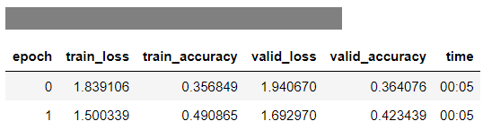

## Data Augmentation

`10_augmentation.ipynb`

- 到目前为止，我们已经创建了我们的数据块 API 和优化器，并且我们让它们在一个`Learner`类中很好地一起运行（取代了之前课程中看到的Runner类）。
- 有了这个，我们可以用 CNN ( [09b_learner.ipynb](https://github.com/fastai/course-v3/blob/master/nbs/dl2/09b_learner.ipynb) )训练一个相当好的 Imagenette 模型。但是 Imagenette 的数据有点少，所以为了制作更好的模型，我们应该使用**数据增强**。
- 在进行数据增强时，*重要的是查看或倾听或理解你的数据增强，以确保新数据具有足够好的质量，并能代表原始数据。不要只是把它扔进一个模型，然后抱着最好的希望。*让我们看一个示例，在该示例中，调整图像大小可能会产生问题。

#### 调整大小

- 让我们加载一些 imagenette：

```python
#export
from exp.nb_09c import *
#export
make_rgb._order=0
path = datasets.untar_data(datasets.URLs.IMAGENETTE)
tfms = [make_rgb, ResizeFixed(128), to_byte_tensor, to_float_tensor]

def get_il(tfms): return ImageList.from_files(path, tfms=tfms)

il = get_il(tfms)
--------
show_image(il[0])

img = PIL.Image.open(il.items[0])
img
```

我们这里的转换是：

1. 将图像转换为 RGB
2. 调整为 128x128
3. 从 Pillow 对象（字节）转换为字节张量 byte_tensor
4. 转换为float tensro张量

下面是来自*tench*类的带有`ResizeFixed(128)`变换的图像：

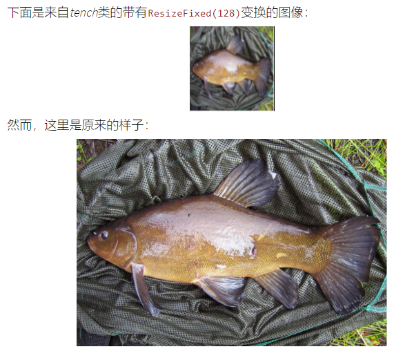

- 请注意在调整大小期间鱼的鳞片纹理和网的纹理是如何完全丢失的。**这种调整大小的方法可能会丢弃有用的纹理，而这些纹理对于识别某些类别至关重要**。*小心重采样方法resampling method，您可能会很快丢失一些纹理！*

  *（也许可以尝试将随机调整大小中使用的重采样方法作为一种数据增强方法？）*

  - 有很多重采样方法。对调整大小Resizing持批评谨慎的态度。查看增强数据，确保不会丢失纹理等关键信息。`Pillow`有许多不同的调整大小方法。他们推荐 `ANTIALIAS`作为一个很好的默认。让我们看看 Pillow 提供的不同重采样方法：

  - `NEAREST`是唯一一种保留纹理的方法。然而，有很多混叠伪影 aliasing artifacts。最后一个, `BICUBLIC/NEAREST`, 将大小调整为`256x256`with`BICUBIC`然后另一个调整大小为`128x128`with`NEAREST`以实现很好的折衷。

    **主题：**[最近的](https://twitter.com/poolio/status/1280689329908543488)这条[推文](https://twitter.com/poolio/status/1280689329908543488)显示了 tensorflow 和 pytorch 中图像调整大小方法之间的差异。*“在框架之间移植和比较模型时要检查的东西”*

```python
img.resize((128,128), resample=PIL.Image.ANTIALIAS)
# 完全看不见格子衬衫的格子了，这可能会完全break我的模型
img.resize((128,128), resample=PIL.Image.BILINEAR)
# 使用双线性，而不是抗锯齿，我还是看不见格子
img.resize((128,128), resample=PIL.Image.NEAREST)
# 使用最近邻插值，有一点格子了。
img.resize((256,256), resample=PIL.Image.BICUBIC).resize((128,128), resample=PIL.Image.NEAREST)
# 首先利用三次插值把图像调整到256×256，然后利用最近邻插值调整到128×128，效果要好很多。
# 可以把事情分两次做，然后组合在一起，可以获得很好的效果。
%timeit img.resize((224,224), resample=PIL.Image.BICUBIC)
12.9 ms ± 30.4 µs per loop (mean ± std. dev. of 7 runs, 100 loops each)
%timeit img.resize((224,224), resample=PIL.Image.BILINEAR)
7.81 ms ± 2.86 µs per loop (mean ± std. dev. of 7 runs, 100 loops each)
%timeit -n 10 img.resize((224,224), resample=PIL.Image.NEAREST)
90.7 µs ± 4.61 µs per loop (mean ± std. dev. of 7 runs, 10 loops each)
```

### Flipping, Rotating, Cropping

- 翻转是一种很好的视觉数据增强。这里要说明的一个非常重要的一点是，*对字节进行图像转换比在浮点数上进行图像变换要**快得多***，因为字节数比浮点数小 4 倍。如果您正在翻转图像，就结果而言，翻转字节与翻转浮点数相同。
- 当你的图像仍然是字节（一个`Pillow`对象）时，你绝对应该尽你所能。
- 但是，在对字节进行*破坏性**destructive*转换时应该小心，因为您可能会得到舍入错误和饱和错误rounding errors and saturation errors.。再次 -*检查步骤，不要想当然。*

```python
#export
import random
def pil_random_flip(x):
    return x.transpose(PIL.Image.FLIP_LEFT_RIGHT) if random.random()<0.5 else x
il1 = get_il(tfms)
il1.items = [il1.items[0]]*64
dl = DataLoader(il1, 8)
x = next(iter(dl))

#export
def show_image(im, ax=None, figsize=(3,3)):
    if ax is None: _,ax = plt.subplots(1, 1, figsize=figsize)
    ax.axis('off')
    ax.imshow(im.permute(1,2,0))

def show_batch(x, c=4, r=None, figsize=None):
    n = len(x)
    if r is None: r = int(math.ceil(n/c))
    if figsize is None: figsize=(c*3,r*3)
    fig,axes = plt.subplots(r,c, figsize=figsize)
    for xi,ax in zip(x,axes.flat): show_image(xi, ax)
```

```python
il1.tfms.append(pil_random_flip)
x = next(iter(dl))
show_batch(x)
```

因此，当你在变换过程中做某些图像变换时，思考一下是非常重要的。

我们可以很容易地将其扩展到整个二面体组的转换(随机水平翻转，随机垂直翻转，以及四个90度旋转)，通过传递一个在0和6之间的int来转置:`transpose`：random horizontal flip, random vertical flip, and the four 90 degrees rotations

```python
class PilRandomFlip(Transform):
    _order=11
    def __init__(self, p=0.5): self.p=p
    def __call__(self, x):
        return x.transpose(PIL.Image.FLIP_LEFT_RIGHT) if random.random()<self.p else x
#export
class PilTransform(Transform): _order=11

class PilRandomFlip(PilTransform):
    def __init__(self, p=0.5): self.p=p
    def __call__(self, x):
        return x.transpose(PIL.Image.FLIP_LEFT_RIGHT) if random.random()<self.p else x
del(il1.tfms[-1])
il1.tfms.append(PilRandomFlip(0.8))
x = next(iter(dl))
show_batch(x)

PIL.Image.FLIP_LEFT_RIGHT,PIL.Image.ROTATE_270,PIL.Image.TRANSVERSE
(0, 4, 6)

img = PIL.Image.open(il.items[0])
img = img.resize((128,128), resample=PIL.Image.NEAREST)
_, axs = plt.subplots(2, 4, figsize=(12, 6))
for i,ax in enumerate(axs.flatten()):
    if i==0: ax.imshow(img)
    else:    ax.imshow(img.transpose(i-1))
    ax.axis('off')
    
#export
class PilRandomDihedral(PilTransform):
    def __init__(self, p=0.75): self.p=p*7/8 #Little hack to get the 1/8 identity dihedral transform taken into account.
    def __call__(self, x):
        if random.random()>self.p: return x
        return x.transpose(random.randint(0,6))
del(il1.tfms[-1])
il1.tfms.append(PilRandomDihedral())
show_batch(next(iter(dl)))
```

Question：其他领域如何做数据增强，如语音和文本、还有表格数据？

- 需要领域的专业知识，如AI在音乐生成方面的分析，如变调和改变音量等

### Random crop

我们也可以做随机裁剪。做数据增强的一个很好的方法是抓取图像的一小部分，然后放大它。
我们可以通过随机裁剪然后缩小选择的大小来做到这一点。

简单地说，我们可以在Pillow中通过两个步骤做到这一点——裁剪和调整大小:

- 但是如果我们裁剪、然后resize，格子衬衫就丢失了。
- 一般来说你必须**非常小心**，特别是当你的数据仍然是**字节**
- 但是，在对字节进行*破坏性**destructive*转换时应该小心，因为您可能会得到舍入错误和饱和错误rounding errors and saturation errors.。再次 -*检查步骤，不要想当然。*

```python
img = PIL.Image.open(il.items[0])
img.size

img.crop((60,60,320,320)).resize((128,128), resample=PIL.Image.BILINEAR)
cnr2 = (60,60,320,320)
resample = PIL.Image.BILINEAR
# PIL中的速度
%timeit -n 10 img.crop(cnr2).resize((128,128), resample=resample)
818 µs ± 26.5 µs per loop (mean ± std. dev. of 7 runs, 10 loops each)
```

然而，这会降低质量。您可以使用 Pillow's 一步完成所有操作`transform`：

 在pillow中有一个EXTENT，格子衬衫要清晰很多了。

- 我们的时间预算:目标是imagenet在8个gpu上每批5分钟。imagenet上有1.25万幅图像。
- 所以在一台GPU上每分钟就是1250000/8/5 == 31250，也就是520 /秒。
- 假设每个GPU有4个核心，那么我们想要每秒125张图像——所以尽量保持每张图像10ms。在这里我们有时间做更多的事情。
- 例如，我们可以在调用变换的同时进行裁剪和调整大小，这将给出一个更平滑的结果。

```python
img.transform((128,128), PIL.Image.EXTENT, cnr2, resample=resample)
%timeit -n 10 img.transform((128,128), PIL.Image.EXTENT, cnr2, resample=resample)
751 µs ± 3.05 µs per loop (mean ± std. dev. of 7 runs, 10 loops each)
```

- 有点慢，但对我们的目的来说足够快了，所以我们就用这个。
- 然后定义一个通用的crop transform变换和两个子类:一个crop at the center (用于验证)，一个随机作物randomly crop。
- 每次，子类只实现将四个角传递给PIL的方式。

```python
#export
from random import randint

def process_sz(sz):
    sz = listify(sz)
    return tuple(sz if len(sz)==2 else [sz[0],sz[0]])

def default_crop_size(w,h): return [w,w] if w < h else [h,h]

class GeneralCrop(PilTransform):
    def __init__(self, size, crop_size=None, resample=PIL.Image.BILINEAR): 
        self.resample,self.size = resample,process_sz(size)
        self.crop_size = None if crop_size is None else process_sz(crop_size)
        
    def default_crop_size(self, w,h): return default_crop_size(w,h)

    def __call__(self, x):
        csize = self.default_crop_size(*x.size) if self.crop_size is None else self.crop_size
        return x.transform(self.size, PIL.Image.EXTENT, self.get_corners(*x.size, *csize), resample=self.resample)
    
    def get_corners(self, w, h): return (0,0,w,h)

class CenterCrop(GeneralCrop):
    # 从每边移除 14% 并抓住中心
    def __init__(self, size, scale=1.14, resample=PIL.Image.BILINEAR):
        super().__init__(size, resample=resample)
        self.scale = scale
        
    def default_crop_size(self, w,h): return [w/self.scale,h/self.scale]
    
    def get_corners(self, w, h, wc, hc):
        return ((w-wc)//2, (h-hc)//2, (w-wc)//2+wc, (h-hc)//2+hc)
    
il1.tfms = [make_rgb, CenterCrop(128), to_byte_tensor, to_float_tensor]
show_batch(next(iter(dl)))
```

### RandomResizeCrop

- `RandomResizeCrop`是ImageNet 上使用的常用的数据增强（[此处](https://arxiv.org/pdf/1409.4842.pdf)介绍）包括选择 8% 到 100% 的图像区域和 3/4 到 4/3 之间的比例作为裁剪，然后将其调整为所需的大小。它结合了一些缩放和一点挤压，计算成本非常低。

> Jeremy Says：
>
> 到目前为止，在竞赛获胜者身上展示的**最有用的变换**是抓取图像的**一小部分并放大**。这被称为随机调整大小剪裁。**这在任何领域都是非常有用的。**例如，在NLP中，真正有用的事情是抓取大小不同的连续文本块。
> 对于音频，如果你在做语音识别，抓取不同大小的话语片段。如果你能找到一种方法来获取不同的数据切片，这将是一种非常有用的数据扩充方法。这是到目前为止在过去6年左右的imagenet  winner赢家中最重要的增强。

- 所以它确实让人们看到这里他看起来很瘦，看到这里他看起来很宽，**实际上没有任何意义**
- 把人的比例设置为4/3或者3/4，但实际上没有任何意义，从光学上讲，**在正常的日常生活中，没有办法让他们喜欢向外扩展或向内收缩**。
- 这是他们使用他们拥有的工具所能做的最好的事情，但可能他们真正想做的是做一些**身体上合理**的事情，所以身体上合理的事情就像你可能比某人高一点或低一点某人或某人的左边或某人的右边导致你的视角改变 **所以我们的猜测是我们真正想要的不是这个而是这个**

```python
# export
class RandomResizedCrop(GeneralCrop):
    def __init__(self, size, scale=(0.08,1.0), ratio=(3./4., 4./3.), resample=PIL.Image.BILINEAR):
        super().__init__(size, resample=resample)
        self.scale,self.ratio = scale,ratio
    
    def get_corners(self, w, h, wc, hc):
        area = w*h
        #Tries 10 times to get a proper crop inside the image.
        for attempt in range(10):
            area = random.uniform(*self.scale) * area
            ratio = math.exp(random.uniform(math.log(self.ratio[0]), math.log(self.ratio[1])))
            new_w = int(round(math.sqrt(area * ratio)))
            new_h = int(round(math.sqrt(area / ratio)))
            if new_w <= w and new_h <= h:
                left = random.randint(0, w - new_w)
                top  = random.randint(0, h - new_h)
                return (left, top, left + new_w, top + new_h)
        
        # Fallback to squish
        if   w/h < self.ratio[0]: size = (w, int(w/self.ratio[0]))
        elif w/h > self.ratio[1]: size = (int(h*self.ratio[1]), h)
        else:                     size = (w, h)
        return ((w-size[0])//2, (h-size[1])//2, (w+size[0])//2, (h+size[1])//2)
il1.tfms = [make_rgb, RandomResizedCrop(128), to_byte_tensor, to_float_tensor]
show_batch(next(iter(dl)))
```


- 这里的变换比较生硬，有些挤压。现实生活中不会有这种情况，所以需要的是透视变换

### Perspective warping 透视变换

- 视觉扭曲。

- RandomResizeCrop所做的是，它将宽高比压缩到3:4和4:3之间。这会使图像变形，使物体向外和向内膨胀。也许他们真正想做的是物理上合理的事情。如果你高于或低于某物，那么你的*观点就会改变。*更好的是**透视扭曲**。

- 为了进行透视扭曲，我们将图像的角映射到新点：例如，如果我们想倾斜图像以使顶部看起来更接近我们，那么顶部/左上角需要移到右边，顶部/右边移到左边。为了避免挤压，底部/左下角需要移到左边，底部/右下角移到右边。

  PIL 可以为我们做到这一点，但它需要我们需要计算的 8 个系数。数学在这里不是最重要的，因为我们已经为您完成了。我们需要求解这个[线性方程组](https://web.archive.org/web/20150222120106/xenia.media.mit.edu/~cwren/interpolator/)。方程求解器`torch.solve`在 PyTorch 中被调用。

  **所以这些透视变换更有意义**，**所以如果你对透视变换感兴趣，我们这里有一些关于你如何实际进行数学运算的细节，细节并不重要，但有趣的是转换实际上需要求解一个线性方程组**，

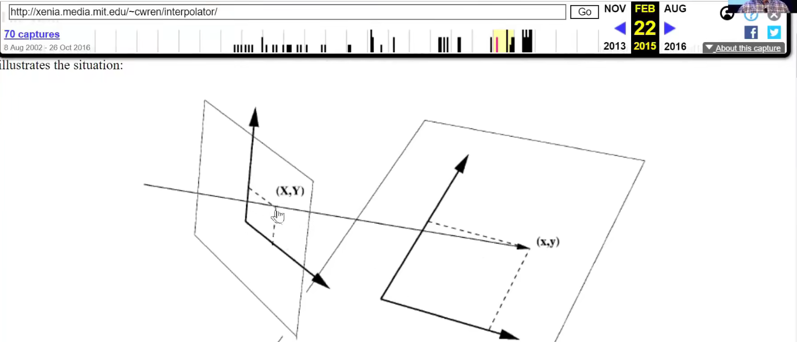

```python
# export
from torch import FloatTensor,LongTensor

def find_coeffs(orig_pts, targ_pts):
    matrix = []
    #The equations we'll need to solve.
    for p1, p2 in zip(targ_pts, orig_pts):
        matrix.append([p1[0], p1[1], 1, 0, 0, 0, -p2[0]*p1[0], -p2[0]*p1[1]])
        matrix.append([0, 0, 0, p1[0], p1[1], 1, -p2[1]*p1[0], -p2[1]*p1[1]])

    A = FloatTensor(matrix)
    B = FloatTensor(orig_pts).view(8, 1)
    #The 8 scalars we seek are solution of AX = B
    return list(torch.solve(B,A)[0][:,0])
# export
def warp(img, size, src_coords, resample=PIL.Image.BILINEAR):
    w,h = size
    targ_coords = ((0,0),(0,h),(w,h),(w,0))
    c = find_coeffs(src_coords,targ_coords)
    res = img.transform(size, PIL.Image.PERSPECTIVE, list(c), resample=resample)
    return res
targ = ((0,0),(0,128),(128,128),(128,0))
src  = ((90,60),(30,280),(310,280),(250,60))
c = find_coeffs(src, targ)
img.transform((128,128), PIL.Image.PERSPECTIVE, list(c), resample=resample)
```

```python
%timeit -n 10 warp(img, (128,128), src)
990 µs ± 9.37 µs per loop (mean ± std. dev. of 7 runs, 10 loops each)
%timeit -n 10 warp(img, (128,128), src, resample=PIL.Image.NEAREST)
338 µs ± 10.5 µs per loop (mean ± std. dev. of 7 runs, 10 loops each)
warp(img, (64,64), src, resample=PIL.Image.BICUBIC)
```

```python
warp(img, (64,64), src, resample=PIL.Image.NEAREST)
```

```python
# export
def uniform(a,b): return a + (b-a) * random.random()
```

```python
class PilTiltRandomCrop(PilTransform):
    def __init__(self, size, crop_size=None, magnitude=0., resample=PIL.Image.NEAREST): 
        self.resample,self.size,self.magnitude = resample,process_sz(size),magnitude
        self.crop_size = None if crop_size is None else process_sz(crop_size)
        
    def __call__(self, x):
        csize = default_crop_size(*x.size) if self.crop_size is None else self.crop_size
        up_t,lr_t = uniform(-self.magnitude, self.magnitude),uniform(-self.magnitude, self.magnitude)
        left,top = randint(0,x.size[0]-csize[0]),randint(0,x.size[1]-csize[1])
        src_corners = tensor([[-up_t, -lr_t], [up_t, 1+lr_t], [1-up_t, 1-lr_t], [1+up_t, lr_t]])
        src_corners = src_corners * tensor(csize).float() + tensor([left,top]).float()
        src_corners = tuple([(int(o[0].item()), int(o[1].item())) for o in src_corners])
        return warp(x, self.size, src_corners, resample=self.resample)
il1.tfms = [make_rgb, PilTiltRandomCrop(128, magnitude=0.1), to_byte_tensor, to_float_tensor]
x = next(iter(dl))
show_batch(x)
```

 

- Question：裁剪和调整大小当您失去感兴趣的对象时会发生什么？所以**鱼已经被裁剪掉。裁剪和调整大小让你的鱼消失了，感兴趣的对象消失了，会发生什么呢**
  - 因为上面的裁剪把鱼搞掉了，所以就没有鱼了。那么标签就错了，人为的加入了噪声。
  - 有趣的是，图像网络获胜策略是随机选择 8% 到 100% 的像素，**因此实际上他们经常选择 8% 的像素，这就是Imagenet winner的策略**。
  - 所以他们通常没有tench鱼，所以或经常**他们只有鳍或眼睛** 所以这告诉我们，如果我们想很好地使用这种**真正有效的增强策略**，我们必须非常好处理**嘈杂的标签**，
  - 我们将在下一课中学习，它也希望告诉您，如果您已经有了嘈杂的标签，请不要担心，我们所做的所有研究都告诉我们我们可以处理**标签**
  - 我们的观点是，**这种图像惊人的方法可能会给我们带来更好的结果传统的图像网络风格增强，所**以这是我们向任意**方向倾斜的最终变换**，结**果还不错**，

```python
# export
class PilTiltRandomCrop(PilTransform):
    def __init__(self, size, crop_size=None, magnitude=0., resample=PIL.Image.BILINEAR): 
        self.resample,self.size,self.magnitude = resample,process_sz(size),magnitude
        self.crop_size = None if crop_size is None else process_sz(crop_size)
        
    def __call__(self, x):
        csize = default_crop_size(*x.size) if self.crop_size is None else self.crop_size
        left,top = randint(0,x.size[0]-csize[0]),randint(0,x.size[1]-csize[1])
        top_magn = min(self.magnitude, left/csize[0], (x.size[0]-left)/csize[0]-1)
        lr_magn  = min(self.magnitude, top /csize[1], (x.size[1]-top) /csize[1]-1)
        up_t,lr_t = uniform(-top_magn, top_magn),uniform(-lr_magn, lr_magn)
        src_corners = tensor([[-up_t, -lr_t], [up_t, 1+lr_t], [1-up_t, 1-lr_t], [1+up_t, lr_t]])
        src_corners = src_corners * tensor(csize).float() + tensor([left,top]).float()
        src_corners = tuple([(int(o[0].item()), int(o[1].item())) for o in src_corners])
        return warp(x, self.size, src_corners, resample=self.resample)
il1.tfms = [make_rgb, PilTiltRandomCrop(128, 200, magnitude=0.2), to_byte_tensor, to_float_tensor]
x = next(iter(dl))
show_batch(x)
```

### Faster tensor creation

- 实际上，使用numpy将to_float_张量和to_byte_张量组合在一个转换中更快。
- 您可能会这么想图像变形的东西听起来**真的很难**而且**很慢**，**但要小心，只是将字节转换为浮点数真的很难而且很慢**
- 我们发现了另一个**速度快两倍的版本**

```python
[(o._order,o) for o in sorted(tfms, key=operator.attrgetter('_order'))]
[(0, <function exp.nb_08.make_rgb(item)>),
 (10, <exp.nb_08.ResizeFixed at 0x7f995b605ac8>),
 (11, <__main__.PilRandomDihedral at 0x7f99023e3dd8>),
 (20, <function exp.nb_08.to_byte_tensor(item)>),
 (30, <function exp.nb_08.to_float_tensor(item)>)]
#export
import numpy as np

def np_to_float(x): return torch.from_numpy(np.array(x, dtype=np.float32, copy=False)).permute(2,0,1).contiguous()/255.
np_to_float._order = 30

%timeit -n 10 to_float_tensor(to_byte_tensor(img))
-------
2.16 ms ± 18.1 µs per loop (mean ± std. dev. of 7 runs, 10 loops each)
# 您可能会这么想图像变形的东西听起来真的很难而且很慢，但要小心，只是将字节转换为浮点数真的很难而且很慢

# 我们发现了另一个速度快两倍的版本
%timeit -n 10 np_to_float(img)
-------
1.38 ms ± 10.1 µs per loop (mean ± std. dev. of 7 runs, 10 loops each)
```

## Batch data augmentation

- 实际上可以在 GPU 上对图像进行任意*仿射变换*（旋转、缩放、移位、变形等）。PyTorch 提供了实现这一目标的所有功能。所有的转换都需要*在*我们创建一个批次*之后*发生。**关键是一次做一整批。几乎所有 PyTorch 操作都可以批量完成。**
- 为此，我们创建了一个小批量的随机数来创建一个小批量的增强图像。
- 仿射变换基本上是线性变换加上平移。它们由矩阵表示，并且可以通过将所有矩阵相乘来组合多个仿射变换。*（[请参阅此博客文章。](https://eli.thegreenplace.net/2018/affine-transformations/)）*
- 让我们加载一个图像。它的形状是`torch.Size([1, 3, 128, 128])`。
- 一旦我们调整了图像的大小以便我们可以将它们一起批处理，我们就可以在批处理级别上应用更多的数据增强。对于仿射/坐标变换，我们是这样进行的：

### Step 1: generate the grid生成网格

```python
il1.tfms = [make_rgb, PilTiltRandomCrop(128, magnitude=0.2), to_byte_tensor, to_float_tensor]
dl = DataLoader(il1, 64)
x = next(iter(dl))
from torch import FloatTensor
def affine_grid_cpu(size):
    N, C, H, W = size
    grid = FloatTensor(N, H, W, 2)
    linear_points = torch.linspace(-1, 1, W) if W > 1 else tensor([-1])
    grid[:, :, :, 0] = torch.ger(torch.ones(H), linear_points).expand_as(grid[:, :, :, 0])
    linear_points = torch.linspace(-1, 1, H) if H > 1 else tensor([-1])
    grid[:, :, :, 1] = torch.ger(linear_points, torch.ones(W)).expand_as(grid[:, :, :, 1])
    return grid
grid = affine_grid_cpu(x.size())
grid.shape
torch.Size([64, 128, 128, 2])
grid[0,:5,:5]
```

```python
%timeit -n 10 grid = affine_grid_cpu(x.size())
5.78 ms ± 397 µs per loop (mean ± std. dev. of 7 runs, 10 loops each)
```

```python
m = tensor([[1., 0., 0.], [0., 1., 0.]])
theta = m.expand(x.size(0), 2, 3)
theta.shape
torch.Size([64, 2, 3])
%timeit -n 10 grid = F.affine_grid(theta, x.size())
10.1 ms ± 545 µs per loop (mean ± std. dev. of 7 runs, 10 loops each)
%timeit -n 10 grid = F.affine_grid(theta.cuda(), x.size())
The slowest run took 25.04 times longer than the fastest. This could mean that an intermediate result is being cached.
351 µs ± 665 µs per loop (mean ± std. dev. of 7 runs, 10 loops each)
```

- 矩阵只是一个接受坐标的函数 ( x , y)。并将它们映射到某个新位置 (x',y'). 如果我们想对图像中的每个像素应用相同的变换，我们首先需要将每个像素表示为 x,y 坐标。
- 生成一个网格地图，使用 torch's 的`affine_grid`其大小为我们的批次 ( `bs x height x width x 2`)，其中包含大小为高 x 宽的网格的坐标（-1 到 1）（这将是图像的最终大小，并且没有与批次中的当前大小相同）。

```python
def affine_grid(x, size):
    size = (size,size) if isinstance(size, int) else tuple(size)
    size = (x.size(0),x.size(1)) + size
    if x.device.type == 'cpu': return affine_grid_cpu(size) 
    m = tensor([[1., 0., 0.], [0., 1., 0.]], device=x.device)
    return F.affine_grid(m.expand(x.size(0), 2, 3), size)
grid = affine_grid(x, 128)
# This has shape: torch.Size([1, 128, 128, 2]), and looks like:
```

### Step 2: Affine multiplication

- 将仿射变换（即矩阵乘法）和坐标变换应用于该网格图。在 2D 中，仿射变换的形式为 y = Ax + b，其中 A 是一个 2x2 矩阵，b是一个具有 2 个坐标的向量。通常用 3x3 矩阵表示

- ```
  A[0,0]  A[0,1]  b[0]
  A[1,0]  A[1,1]  b[1]
     0       0     1
  ```

  因为那么两个仿射变换的组合可以用它们的 3x3 表示的矩阵乘积来计算。

  角度为 θ的逆时针旋转矩阵为`theta`：

  ```
  cos(theta)  sin(theta) 0
  -sin(theta) cos(theta) 0
  0           0          1
  ```

  然后我们`theta`为批次中的每个版本的图像绘制不同的图像以返回一批旋转矩阵（大小`bsx3x3`）。

  然后将所有 3 个通道乘以旋转矩阵并添加平移：

  ```
  tfm_grid = (torch.bmm(grid.view(1, -1, 2), m[:, :2, :2]) + m[:,2,:2][:,None]).view(-1, 128, 128, 2)
  ```

```python
from torch import stack,zeros_like,ones_like
```

```python
def rotation_matrix(thetas):
    thetas.mul_(math.pi/180)
    rows = [stack([thetas.cos(),             thetas.sin(),             torch.zeros_like(thetas)], dim=1),
            stack([-thetas.sin(),            thetas.cos(),             torch.zeros_like(thetas)], dim=1),
            stack([torch.zeros_like(thetas), torch.zeros_like(thetas), torch.ones_like(thetas)], dim=1)]
    return stack(rows, dim=1)
thetas = torch.empty(x.size(0)).uniform_(-30,30)
thetas[:5]
tensor([-20.3453,  25.1311, -15.2565,  -2.8207,  25.0947])
m = rotation_matrix(thetas)
m.shape, m[:,None].shape, grid.shape
(torch.Size([64, 3, 3]),
 torch.Size([64, 1, 3, 3]),
 torch.Size([64, 128, 128, 2]))
grid.view(64,-1,2).shape
torch.Size([64, 16384, 2])
```


```python
a = m[:,:2,:2]
b = m[:, 2:,:2]
tfm_grid = (grid.view(64,-1,2) @ a + b).view(64, 128, 128, 2)

%timeit -n 10 tfm_grid = grid @ m[:,None,:2,:2] + m[:,2,:2][:,None,None]
22.9 ms ± 337 µs per loop (mean ± std. dev. of 7 runs, 10 loops each)
%timeit -n 10 tfm_grid = torch.einsum('bijk,bkl->bijl', grid, m[:,:2,:2]) + m[:,2,:2][:,None,None]
11.5 ms ± 539 µs per loop (mean ± std. dev. of 7 runs, 10 loops each)
%timeit -n 10 tfm_grid = torch.matmul(grid, m[:,:2,:2].unsqueeze(1)) + m[:,2,:2][:,None,None]
22.9 ms ± 162 µs per loop (mean ± std. dev. of 7 runs, 10 loops each)
%timeit -n 10 tfm_grid = (torch.bmm(grid.view(64,-1,2), m[:,:2,:2]) + m[:,2,:2][:,None]).view(-1, 128, 128, 2)
11.1 ms ± 331 µs per loop (mean ± std. dev. of 7 runs, 10 loops each)
```

- 在GPU上计算如下

```python
grid = grid.cuda()
m = m.cuda()
%timeit -n 10 tfm_grid = grid @ m[:,None,:2,:2] + m[:,2,:2][:,None,None]
166 µs ± 117 µs per loop (mean ± std. dev. of 7 runs, 10 loops each)
%timeit -n 10 tfm_grid = torch.einsum('bijk,bkl->bijl', grid, m[:,:2,:2]) + m[:,2,:2][:,None,None]
138 µs ± 5.96 µs per loop (mean ± std. dev. of 7 runs, 10 loops each)
%timeit -n 10 tfm_grid = torch.matmul(grid, m[:,:2,:2].unsqueeze(1)) + m[:,2,:2][:,None,None]
123 µs ± 8.41 µs per loop (mean ± std. dev. of 7 runs, 10 loops each)
%timeit -n 10 tfm_grid = (torch.bmm(grid.view(64,-1,2), m[:,:2,:2]) + m[:,2,:2][:,None]).view(-1, 128, 128, 2)
74.9 µs ± 3.76 µs per loop (mean ± std. dev. of 7 runs, 10 loops each)
```

### Step 3: interpolate 插值

使用Pytorch的F.grid_sample函数，根据转换后的网格映射，从批处理中的初始图像中插入我们想要的最终像素值:

```python
tfm_grid = torch.bmm(grid.view(64,-1,2), m[:,:2,:2]).view(-1, 128, 128, 2)
```

这也是一个更快的版本，使用`F.affine_grid`：

```python
tfm_x = F.grid_sample(x, tfm_grid.cpu())
show_batch(tfm_x, r=2)

tfm_x = F.grid_sample(x, tfm_grid.cpu(), padding_mode='reflection')
show_batch(tfm_x, r=2)
```


我们在图像周围得到这些黑色边框。但PyTorch`grid_sample`也有一个`padding_mode`说法，让你在这个黑色的空间填充以不同的方式- `"zeros"`，`"border"`或`"reflection"`。这些可以进一步丰富和改进我们的增强数据。


### Timing

- 放在一起看一下速度

```python
def rotate_batch(x, size, degrees):
    grid = affine_grid(x, size)
    thetas = x.new(x.size(0)).uniform_(-degrees,degrees)
    m = rotation_matrix(thetas)
    tfm_grid = grid @ m[:,:2,:2].unsqueeze(1) + m[:,2,:2][:,None,None]
    return F.grid_sample(x, tfm_grid)
show_batch(rotate_batch(x, 128, 30), r=2)
```

 

```python
%timeit -n 10 tfm_x = rotate_batch(x, 128, 30)
45.6 ms ± 491 µs per loop (mean ± std. dev. of 7 runs, 10 loops each)
%timeit -n 10 tfm_x = rotate_batch(x.cuda(), 128, 30)
2.65 ms ± 138 µs per loop (mean ± std. dev. of 7 runs, 10 loops each)
```

- 速度还是不错的

### Jit version

```python
from torch import Tensor
from torch.jit import script

@script
def rotate_batch(x:Tensor, size:int, degrees:float) -> Tensor:
    sz = (x.size(0),x.size(1)) + (size,size)
    idm = torch.zeros(2,3, device=x.device)
    idm[0,0] = 1.
    idm[1,1] = 1.
    grid = F.affine_grid(idm.expand(x.size(0), 2, 3), sz)
    thetas = torch.zeros(x.size(0), device=x.device).uniform_(-degrees,degrees)
    m = rotation_matrix(thetas)
    tfm_grid = torch.matmul(grid, m[:,:2,:2].unsqueeze(1)) + m[:,2,:2].unsqueeze(1).unsqueeze(2)
    return F.grid_sample(x, tfm_grid)
m = tensor([[1., 0., 0.], [0., 1., 0.]], device=x.device)
%timeit -n 10 tfm_x = rotate_batch(x.cuda(), 128, 30)
2.6 ms ± 12 µs per loop (mean ± std. dev. of 7 runs, 10 loops each)
```

 

###  affine multiplication with `affine_grid`

```python
def rotate_batch(x, size, degrees):
    size = (size,size) if isinstance(size, int) else tuple(size)
    size = (x.size(0),x.size(1)) + size
    thetas = x.new(x.size(0)).uniform_(-degrees,degrees)
    m = rotation_matrix(thetas)
    grid = F.affine_grid(m[:,:2], size)
    return F.grid_sample(x.cuda(), grid)
%timeit -n 10 tfm_x = rotate_batch(x.cuda(), 128, 30)
1.92 ms ± 50.3 µs per loop (mean ± std. dev. of 7 runs, 10 loops each)
```

- 这个是很快的了。**这就是我们达到如此惊人的快速速度的地方**
- Jeremy觉得这里有大机会，**目前没有任何人可以在 GPU 库上编写自己的增强运行**
- **但目前它们都在 CPU 上一次运行一个图像**
- 你可以开始尝试这些你知道**随机 GPU 批量**
- 下周我们将向你展示这种神奇的**数据增强**，称为**混合****mix up**，它将在 **GPU 上工作**。它是 将在您能想到的各种领域开展工作，并且可能会使其中大部分领域相关，因为它太好了，您可能不需要任何其他领域


