# Lesson11 Data Block API, generic optimizer

- fastai 论坛 lesson11 地址： https://forums.fast.ai/t/lesson-11-discussion-and-wiki/43406 
- 哔哩哔哩视频地址：https://www.bilibili.com/video/BV1yx411d7aL?p=4
- YouTube视频地址：https://www.youtube.com/playlist?list=PLWP4UZT-7V3Gv9y_dLHzM0A-Ju3EqDP9r

##### Papers

- [mixup: Beyond Empirical Risk Minimization 4](https://arxiv.org/abs/1710.09412)
- [Rethinking the Inception Architecture for Computer Vision 3](https://arxiv.org/abs/1512.00567) (label smoothing is in part 7)
- [Bag of Tricks for Image Classification with Convolutional Neural Networks 3](https://arxiv.org/abs/1812.01187)

##### Notes and other resources

- [Annotated notebooks for Lessons 8 - 12 14](https://github.com/jcatanza/Fastai-Deep-Learning-From-the-Foundations-TWiML-Study-Group)
- [Lesson 11 notes 78](https://medium.com/@lankinen/fast-ai-lesson-11-notes-part-2-v3-6d28e17509f4) [@Lankinen](https://forums.fast.ai/u/lankinen)
- https://jimypbr.github.io/archive.html 所有的fastai课程的笔记的博客目录
- [Lesson 11 jupyter notebooks with video link annotations 59](https://github.com/sergeman/annotated-fastai-notebooks) [@sergeman](https://forums.fast.ai/u/sergeman)
- ###### [Blog post on the interaction between L2 Regularization and Batchnorm, including experiments 17](https://blog.janestreet.com/l2-regularization-and-batch-norm/)
- [Review slides from TWiML meetup, 4/13/2019 16](https://forums.fast.ai/uploads/default/original/3X/a/9/a99b951af3c99ca5bf4fc8b8a5a0d72f81fb6007.pdf) [@jcatanza](https://forums.fast.ai/u/jcatanza)

----------

#### Jeremy Says to do:

**第 11 课**

1. ==在您的领域中擅长深度学习的很大一部分是知道如何创建小型可行的有用数据集==。在您的领域中，无论是音频还是梵文文本，尝试提出一两个玩具问题，您希望它们可以深入了解您的完整问题。[第 11 课：小型有用数据集](https://youtu.be/hPQKzsjTyyQ?t=849)
2. 如果你以前没有见过`compose`编程中的使用，谷歌它。这是一个非常有用的概念，它一直出现。[第 11 课：撰写](https://youtu.be/hPQKzsjTyyQ?t=1881)
3. 一个很好的贡献机会是使用遥测来查看不同层的激活并查看实验中发生的情况。理论的人一般不知道怎么训练模型，从业者根本就忘记了对基础的实际思考，但是如果你能把两者结合起来，尝试一些实验，看看当你调整权重衰减时会发生什么，你可以发现一些非常有趣的结果。[第 11 课：另一个机会 3](https://youtu.be/hPQKzsjTyyQ?t=5449)
4. 使 Adam 和 Adam-like 的东西运行良好的诀窍是使 epsilon 0.1（或介于 1e-3 和 1e-1 之间）。大多数人使用 1e-7，这永远不会是一个好主意。
   [第 11 课：epsilon 重要的另一个地方 3](https://youtu.be/hPQKzsjTyyQ?t=6212)
5. 在扩充数据时，请查看或聆听扩充后的数据。不要只是把它放在模型中，而是查看增强输出并尝试找到一些东西来研究，看看你是否丢失了信息。[第 11 课：注意数据增强](https://youtu.be/hPQKzsjTyyQ?t=6965)
6. 图像增强不仅仅是在其中抛出一些转换函数，还要考虑何时执行此操作，因为您有这个管道，从字节开始，字节变为浮点数。想想你要去哪里工作。在它们仍然是字节的时候做任何你能做的事情，但要小心不要做任何会导致舍入错误或饱和问题的事情。[第 11 课：优化数据增强](https://youtu.be/hPQKzsjTyyQ?t=7131)
7. 在对非图像进行数据增强时，问问自己数据中会发生什么样的变化，这些变化不会导致标签发生变化，但仍会将这些数据作为可以出现在数据集中的合理示例。 [第 11 课：其他领域的数据增强 1](https://youtu.be/hPQKzsjTyyQ?t=7363)

-------------


今天我们将学习数据加载和优化器。

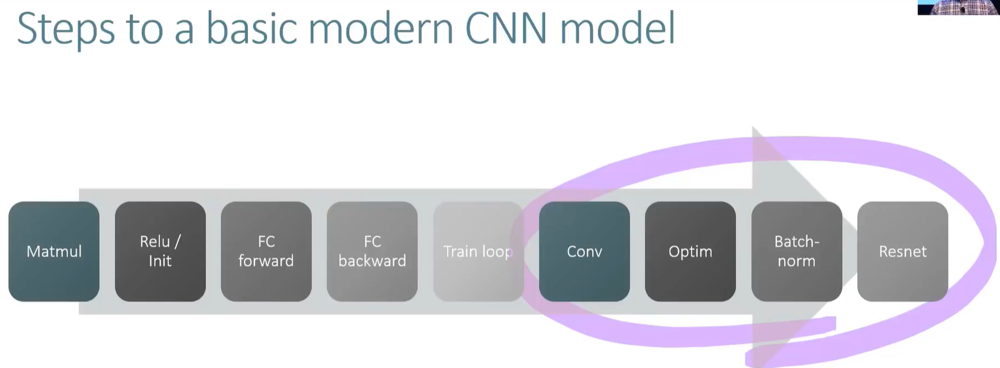

- 现在我们到这里了，下面四个部分我们已经学过了。已经完成了前面四个了。将继续以下内容来创建state of art的imagenet模型。我们目前处理图像相关的内容，也同样适用于其他任务，同样适用于表格协同过滤和文本以及几乎所有其他内容。

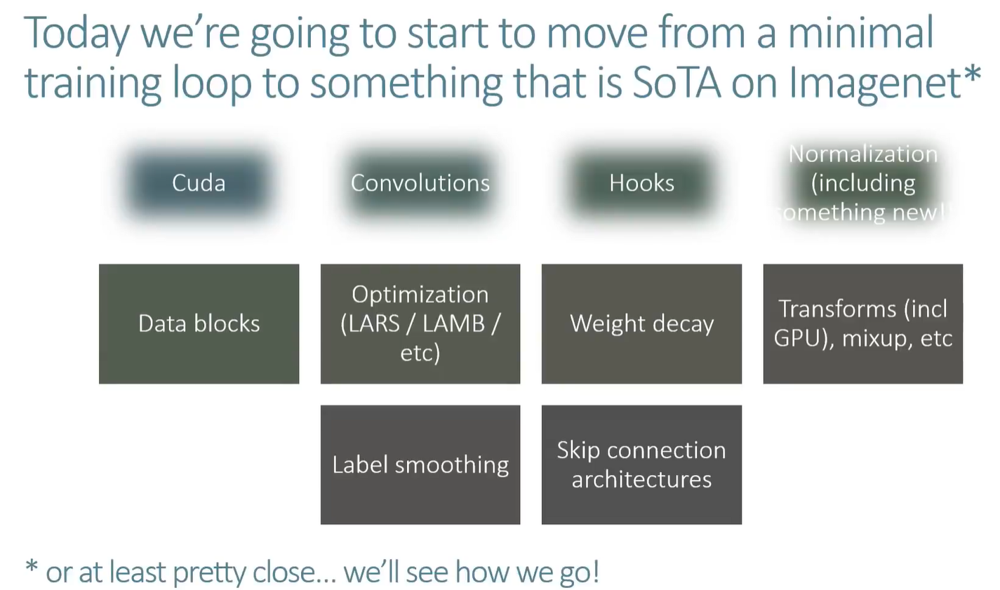

- 上节课batch norm的notebook的最后有一个simplified runningBatchNorm，有一些可以简化的内容，Tom Viehmann也是参与pytorch社区的，感谢建议。seumas chinchilla也是pytorch的原始创始人之一，一直在为这门课程整理一些东西方面非常有帮助。
- 在进入课程主题datablock之前，这里是另一种初始化技术。

## 逐层顺序单位方差 (LSUV) Layerwise Sequential Unit Variance

- 另外一种能确保你的模型训练的很好。
- 现在我们要看看论文[All You Need is a Good Init](https://arxiv.org/pdf/1511.06422.pdf)，它介绍了Layerwise Sequential Unit Variance*逐层**顺序单位方差*( *LSUV* )。
  - 正如我们所见，通过模型获得 单位方差【1】非常困难，因为即使是小的改变也会破坏方差，不能保持方差为1。
  - 比如你改变你的激活函数或者如果你添加 dropout 或改变 dropout 的数量，这些都会影响你的层输出的方差，如果它们与模型略有不同，当我们通过模型看到时，您会变得更糟，**因此解决此问题的正常方法**是仔细考虑您的架构并准确地分析找出如何初始化所有内容以使其正常工作。
  - LSUV 背后的高级理念是让计算机做出所有这些决定。
- 我们用通常的技术初始化我们的神经网络，然后我们通过模型传递一批batch并检查线性和卷积层的输出。然后我们可以根据我们在激活时观察到的实际方差重新调整权重，并从初始偏差中减去我们观察到的均值。这样我们就会有保持正常化的激活。我们重复这个过程，直到我们对观察到的均值/方差感到满意。
- 首先，我们通过创建一个正常的执法机关启动[R ER。然后我们从这个学习器中取出一小批。我们获取所有层，然后创建一个钩子，可以查看层的均值和标准差。因为我们没有任何初始化，所以均值和标准差不是我们所希望的。通常在这一点上，我们会测试一堆初始化方法，看看哪种方法效果最好。不过，这一次，我们使用我们之前采用的 mini-batch 并迭代地尝试解决问题。

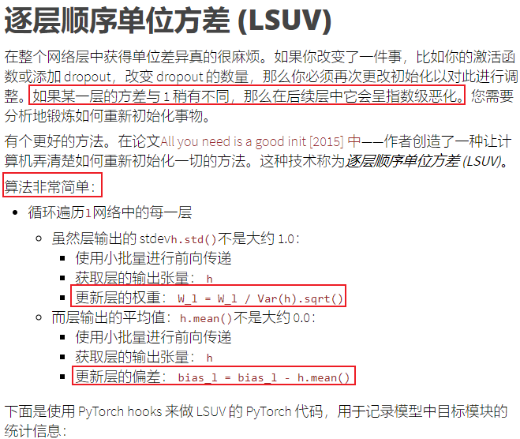

```python
x_train,y_train,x_valid,y_valid = get_data()

x_train,x_valid = normalize_to(x_train,x_valid)
train_ds,valid_ds = Dataset(x_train, y_train),Dataset(x_valid, y_valid)

nh,bs = 50,512
c = y_train.max().item()+1
loss_func = F.cross_entropy

data = DataBunch(*get_dls(train_ds, valid_ds, bs), c)
mnist_view = view_tfm(1,28,28)
cbfs = [Recorder,
        partial(AvgStatsCallback,accuracy),
        CudaCallback,
        partial(BatchTransformXCallback, mnist_view)]
nfs = [8,16,32,64,64]
class ConvLayer(nn.Module):
    def __init__(self, ni, nf, ks=3, stride=2, sub=0., **kwargs):
        super().__init__()
        self.conv = nn.Conv2d(ni, nf, ks, padding=ks//2, stride=stride, bias=True)
        self.relu = GeneralRelu(sub=sub, **kwargs)
    
    def forward(self, x): return self.relu(self.conv(x))
    
    @property
    def bias(self): return -self.relu.sub
    @bias.setter
    def bias(self,v): self.relu.sub = -v
    @property
    def weight(self): return self.conv.weight
learn,run = get_learn_run(nfs, data, 0.6, ConvLayer, cbs=cbfs)

run.fit(2, learn)
train: [1.73625, tensor(0.3975, device='cuda:0')]
valid: [1.68747265625, tensor(0.5652, device='cuda:0')]
train: [0.356792578125, tensor(0.8880, device='cuda:0')]
valid: [0.13243565673828125, tensor(0.9588, device='cuda:0')]
    
learn,run = get_learn_run(nfs, data, 0.6, ConvLayer, cbs=cbfs)

#export
def get_batch(dl, run):
    run.xb,run.yb = next(iter(dl))
    for cb in run.cbs: cb.set_runner(run)
    run('begin_batch')
    return run.xb,run.yb
xb,yb = get_batch(data.train_dl, run)

#export
def find_modules(m, cond):
    if cond(m): return [m]
    # 找到所有未CnovLayer的魔铠，pytorch经常使用递归，模块可以contains模块
    # 模块就像一个tree。
    return sum([find_modules(o,cond) for o in m.children()], [])

def is_lin_layer(l):
    lin_layers = (nn.Conv1d, nn.Conv2d, nn.Conv3d, nn.Linear, nn.ReLU)
    return isinstance(l, lin_layers)

mods = find_modules(learn.model, lambda o: isinstance(o,ConvLayer))
mods
[ConvLayer(
   (conv): Conv2d(1, 8, kernel_size=(5, 5), stride=(2, 2), padding=(2, 2))
   (relu): GeneralRelu()
 ), ConvLayer(
   (conv): Conv2d(8, 16, kernel_size=(3, 3), stride=(2, 2), padding=(1, 1))
   (relu): GeneralRelu()
 ), ConvLayer(
   (conv): Conv2d(16, 32, kernel_size=(3, 3), stride=(2, 2), padding=(1, 1))
   (relu): GeneralRelu()
 ), ConvLayer(
   (conv): Conv2d(32, 64, kernel_size=(3, 3), stride=(2, 2), padding=(1, 1))
   (relu): GeneralRelu()
 ), ConvLayer(
   (conv): Conv2d(64, 64, kernel_size=(3, 3), stride=(2, 2), padding=(1, 1))
   (relu): GeneralRelu()
 )]
```

- 拿出一个batch的数据。
- 如果小批量的平均值超过 1e-3，我们从模型偏差中减去它。这一直持续到平均值是我们想要的东西。对方差也做同样的事情。

```python
def append_stat(hook, mod, inp, outp):
    d = outp.data
    hook.mean,hook.std = d.mean().item(),d.std().item()
mdl = learn.model.cuda()

# 创建钩子，抓住均值和标准差。不是0和1，因为ReLU，标准差>0
with Hooks(mods, append_stat) as hooks:
    mdl(xb)
    for hook in hooks: print(hook.mean,hook.std)
0.3813672363758087 0.6907835006713867
0.3570525348186493 0.651114284992218
0.28284627199172974 0.5356632471084595
0.2487572282552719 0.42617663741111755
0.15965904295444489 0.2474386990070343

#export
def lsuv_module(m, xb):
    h = Hook(m, append_stat)
	# 创建循环，看均值和标准差是否接近0和1，就在bias里面减去均值，即做一个归一化。
    while mdl(xb) is not None and abs(h.mean)  > 1e-3: m.bias -= h.mean
    while mdl(xb) is not None and abs(h.std-1) > 1e-3: m.weight.data /= h.std
# 如果小批量的平均值超过 1e-3，我们从模型偏差中减去它。这一直持续到平均值是我们想要的东西。对方差也做同样的事情。
    h.remove()
    return h.mean,h.std

for m in mods: print(lsuv_module(m, xb))
(0.17071205377578735, 1.0)
(0.08888687938451767, 1.0000001192092896)
(0.1499888300895691, 0.9999999403953552)
(0.15749432146549225, 1.0)
(0.3106708824634552, 1.0)
```

- 你可以不假思索的初始化任何神经网络，不用考虑是否有ReLU或者dropout。我们可以很轻松的对复杂和特别深层的网络架构训练。这是fastai初始化你的神经网络的方法，这不是数学，不需要思考，只需要一直while循环。

https://jimypbr.github.io/2020/08/fast-ai-v3-lesson-11-notes-data-block-api-the-generic-optimizer-data-augmentation

**无 LSUV，正常初始化：**训练期间权重的直方图和非零值比例：

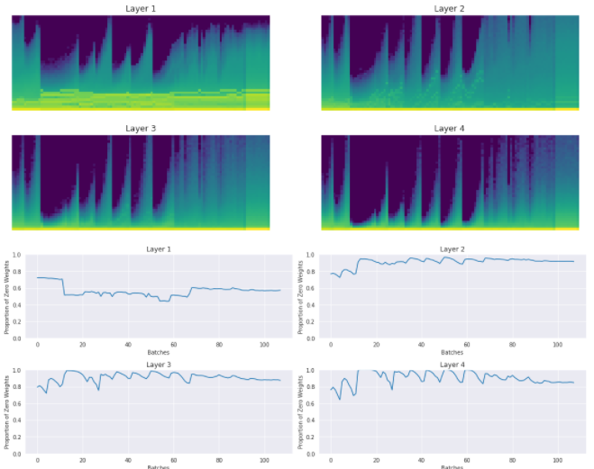

**使用 LSUV：**训练期间权重随时间变化的直方图和非零比例：

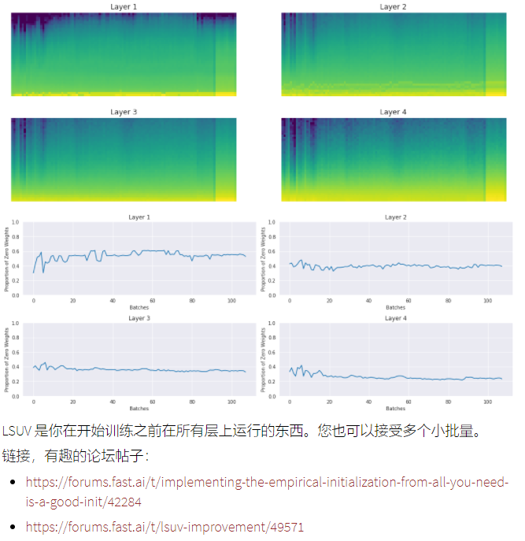

## Datablock API 基础

`08_data_block.ipynb`

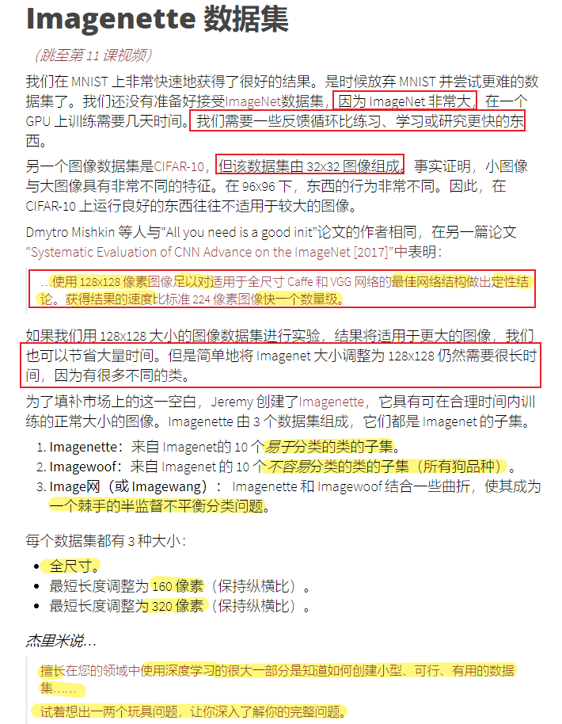

> 使用全尺寸 ImageNet 图片测试模型并不智能，因为它需要大量时间和计算能力。事实证明，使用 32x32 等较小的图像几乎与使用普通图像一样多。Jeremy 更进一步，创建了两个更小的 ImageNet 版本，其中仅包含十个千类。结果表明，在这些数据集上运行良好的东西在全尺寸数据集上也能得到很好的结果。

- ImageNet太大，只有一个GPU训练需要很多天。这真的很令人沮丧，以一种昂贵的方式来尝试练习或学习。Jeremy一直发现这个问题，不知道我应该为我的研究、实践或学习尝试哪些数据集。有人用cifar10，但是cifar10都是32 x 32 像素的图像，但我们的研究清楚地表明，**32 x 32 的小图像具有与较大的图像和特定的特征非常不同的特征**。
- 大约 96 x 96，事情就会表现得非常不同。在cifar10上训练好的东西在normal image正常图像上的效果往往不好。cifar10在imageNet上的效果不好。
  - 在正常尺寸的图像上训练，同时能在合理的时间内训练，能让我了解到哪些work，哪些不work
- 实际上 Demetriou 写了我们刚刚看到的那篇 LS UV 论文，他还写一篇很棒的论文，卷积神经网络的系统评估，他注意到如果你使用 128 x 128 的图像ImageNet，他发现，不管效果好坏，所有这些discoveries都同样适用于全尺寸图像网络。
- 但这还是需要很长的时间，128×128的130 万张图像仍然太大。但我想更进一步，所以我尝试创建两个新数据集，我的两个新数据集是图ImageNet的子集，只有1/100的数据大小。创建了20 像素大小和 160 像素大小的多个版本。
  - 第一个数据集是专门简单设计的数据集，包含10个类别，彼此完全不同。就可以用这个mini数据集训练1个epoch，看看几分钟之后哪些work了。
  - 第二个数据集是设计的难一些，10个类别彼此非常相似。
- 第一个数据集为：Imagenette. 第二个为imagewolf。

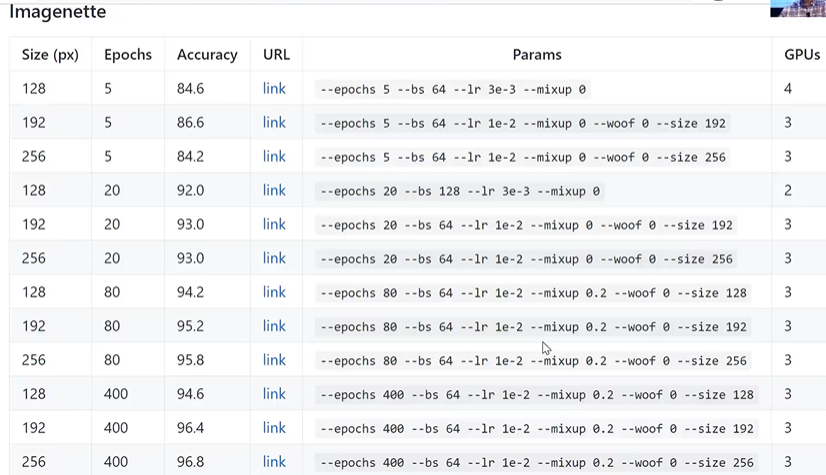

- 我在这里看到了相同的结果，这也很有趣，看看两个数据集之间有些事情是如何相同的，有些事情是不同的，==我发现使用这两个数据集比我做过的任何其他事情都让我更深入地了解计算机视觉模型训练==，所以请查看它们。

- 我真的很想提到这一点：**您的领域中擅长使用深度学习的很大一部分是知道如何创建类似小而实用的有用数据集**，所以我花了大约三个小时，因为它根本不是难以创建的。用python脚本来创建。

  - **我是如何决定选择这些东西的。**用python脚本，然后从中挑选。
  - 所以在你的研究领域中，无论是video、text或者基金序列等，尝试剔除一两个你想完整的深入了解的toll problem。这对我非常有帮助，如果你对计算机视觉感兴趣，我强烈建议你尝试一下，特别是尝试打败我。试图打败我会让你感觉到你正在考虑的事情是否在一个中等能力的从业者能够做少量时间的范围内。
  - 1/100的ImageNet的子数据集，我能够从随机权重中创建一个 90% 准确的狗品种分类器，所以即使你没有迁移学习，你也可以在没有太多数据的情况下很快地做很多事情，这真是太棒了，所以我们现在要使用这个数据集。

  Question: 在所有层上一开始就运行LSUV，而不是在训练过程中，如果batch size太小，是否会过拟合。

  - 您可以在训练开始时运行一次以初始化您的权重，以便额外的一组步骤为您提供合理的梯度。
  - 前面我看到如果前面的几个batch我们没有很好的初始化，我们最终有90%的激活元都为0，即激活元处于非活动状态。这就是我们想要LSUV的原因。
  - 如果batch很小，那就运行5个batch，然后取平均值。一个小批量没有什么特别之处，这只是一种快速的计算方式。

- ImageNet 足够大，一次可能不适合我们的 RAM，这就是为什么我们需要一种方法来批量读取它。

- 大多数使用datablock API的人都觉得对它足够熟悉，可以对他们知道可以做的事情做一些小的调整，但我与之交谈的大多数人不知道如何喜欢真正改变正在发生的事情，所以在本笔记本结束时，您将看到公司如何数据块 api 非常简单，您可以根据这个 API 编写自己的 API 

  - 因此如果您想知道某人是否实际上是深度学习从业者，请显示在这张照片，如果他们不知道这是一个网球，他们在骗你

- 然后是：**skander** 比glob要快很多，是python的C API ，是抓取东西很快的方法。**具体而言，获取 13,000 个文件名需要 70 毫秒，而我在 Windows 资源管理器中查看 13,000 个文件似乎需要大约 4 分钟**大一百倍的完整图像网络上，它实际上只需几秒钟。

- **skander 应该比 glob 快得多**，我记得我曾经使用 **glob而且它有点慢**，**你可以抓取 imagenet 文件夹的速度是比以前快得多，所以它是相当大的差异**

- 这些东西是**你在实践中需要的基础专业知识和工具**

### Prepare for modeling

- Get files    快速read image的函数
- Split validation set        ListContainer, ItemList, ImageList classes 用于构建数据集
  - random%, folder name, csv, ...
- Label:
  - folder name, file name/re, csv, ...
- Transform per image (optional)
- Transform to tensor
- DataLoader
- Transform per batch (optional)
- DataBunch
- Add test set (optional)

  

get_files() fast function for reading images

 ● ListContainer, ItemList, ImageList classes enable construction of data set 

● grandparent_splitter to build train and valid sets 

● SplitData() class

 ● Processor() and CategoryProcessor() classes 

● ProcessedItemList() 

● LabeledData() class 

● Transform ResizeFIxed(128) resizes the images to 128x128 

● databunchify() 

● On a Windows machine, put num_workers = 0, so you can’t exploit multi -core CPU

 ● “It really is 3x3 kernels everywhere” 

● 1-cycle scheduling with cosine annealing gets 72.6% accuracy on Imagenette


- **所以对于那些没有做过任何更多函数式编程的人来说，组合只是一个概念**。
- 遍历函数列表，并调用x=f(x)，深**度神经网络只是一个函数的组合**。**以某种方式对它们进行排序，它会检查其他内容是否具有下划线顺序键并对它们进行排序，您还可以传入一些关键字参数，**如果这样做，它只会保留正确传递这些关键字参数。
- compose是一个非常有用的概念。

```python
export
def compose(x, funcs, *args, order_key='_order', **kwargs):
    key = lambda o: getattr(o, order_key, 0)
    for f in sorted(listify(funcs), key=key): x = f(x, **kwargs)
    return x

class ItemList(ListContainer):
    def __init__(self, items, path='.', tfms=None):
        super().__init__(items)
        self.path,self.tfms = Path(path),tfms

    def __repr__(self): return f'{super().__repr__()}\nPath: {self.path}'
    
    def new(self, items, cls=None):
        if cls is None: cls=self.__class__
        return cls(items, self.path, tfms=self.tfms)
    
    def  get(self, i): return i
    def _get(self, i): return compose(self.get(i), self.tfms)
    
    def __getitem__(self, idx):
        res = super().__getitem__(idx)
        if isinstance(res,list): return [self._get(o) for o in res]
        return self._get(res)

class ImageList(ItemList):
    @classmethod
    def from_files(cls, path, extensions=None, recurse=True, include=None, **kwargs):
        if extensions is None: extensions = image_extensions
        return cls(get_files(path, extensions, recurse=recurse, include=include), path, **kwargs)
    
    def get(self, fn): return PIL.Image.open(fn)
```

让我们举一个变换函数的例子。通常，数据集中可能存在黑白图像，这会导致一些问题。问题是当 BW 是 1 通道图像时，RGB 将是 3 通道图像。下面有两种方法可以解决这个问题。通过创建类或函数。

```python
#export
class Transform(): _order=0

class MakeRGB(Transform):
    def __call__(self, item): return item.convert('RGB')

def make_rgb(item): return item.convert('RGB')
```

- imagelist派生自ListContainer，所以是可以索引的。

接下来，让我们创建一个使用它来拆分数据的类。

```python
#export
class SplitData():
    def __init__(self, train, valid): self.train,self.valid = train,valid
        
    def __getattr__(self,k): return getattr(self.train,k)
    #This is needed if we want to pickle SplitData and be able to load it back without recursion errors
    def __setstate__(self,data:Any): self.__dict__.update(data) 
    
    @classmethod
    def split_by_func(cls, il, f):
        lists = map(il.new, split_by_func(il.items, f))
        return cls(*lists)

    def __repr__(self): return f'{self.__class__.__name__}\nTrain: {self.train}\nValid: {self.valid}\n'
```

### Labeling

- 首先，我们需要 将字符串类映射为数字. 这是通过创建训练集中所有类的字典来实现的，其中每个类都有自己的编号。然后我们使用相同的字典来标记验证集。
- **标记标签**有点更棘手，它之所以棘手是因为我们需要流程，流程是首先应用于训练集.它们会获得一些状态，然后它们会应用于验证。
  - 做交叉熵loss的时候，希望是数字，而不是字符串。
  - 所以**我们需要训练集与验证集具有相同的映射**，**并且对于我们将来所做的任何推理也将具有相同的映射**，因为否则不同的数据集将在他们看到数字零时谈论完全不同的事情，
- 在train时，没有vocab，创建一个包含所有独特可能性的列表。另一方面，当它进入验证集过程时，现在确实有一个词汇表，因此它将跳过该步骤并使用训练集词汇表，因此这非常重要，正确的人们会混淆。
- 在机器学习和深度学习中一直如此，就像经常**有人说我的模型不比随机更好**，最常见的原因是他们在训练集和验证集之间使用了某种不同的映射，所以如果你使用这样一个，那上述糟糕的事情永远不会发生，因为你确保你总是使用相同的映射，所以你知道代码的细节是特别重要，重要的想法是你知道你的标签过程需要包含某种处理器的想法。

Question：在online stream data,你如何处理在训练中看不到的新类别

- 它不是只是在线流数据，它一直发生。在验证集或测试集上或在生产中进行推理，在那里 你看到了一些你以前从未见过的标签，这在推理中不是问题，因为对于推理你没有定义标签，但你肯定会在你的验证集中遇到这个问题，所以我试图做的是，
  - 如果我有很多类别和其中一些不经常出现，我知道将来可能会出现新的类别，确保我的模型的方法可以处理。所有这些罕见的其他情况 类似的事情往往工作得很好，但您必须提前考虑解决许多类型的问题，您知道有一组固定的可能性，如果您知道这不是一个固定集 是的，我通常会尝试使用一些示例创建另一个类别，因此请确保您在标记数据类中使用其他类别中的某些内容进行训练 

Question: decorator在做什么？

- 但基本上这是实例方法和类方法之间的区别。
  - 用类来调用的，而不是用类的对象来调用的。就是这个区别。 

它们在数组中的顺序无关紧要，因为它们将通过下划线 order 属性对它们进行排序，因此我们可以将其传递给我们的图像列表，

```python
tfms = [make_rgb, ResizeFixed(128), to_byte_tensor, to_float_tensor]

il = ImageList.from_files(path, tfms=tfms)
sd = SplitData.split_by_func(il, splitter)
ll = label_by_func(sd, parent_labeler, proc_y=CategoryProcessor())
```

这就是我们的第一个内核的样子。因为我们使用 RGB 图像 c-in 是 3，但在一般情况下，我们`9*c-in`每一步都将数字相乘。我们不希望输出更多，因为这不仅仅是浪费我们的时间。

过去，人们倾向于使用 5x5 和 7x7 内核，但现在我们知道使用 3x3 内核更好。

- 我们确保我们第一个卷积核在做一些有用的事情，上周讲过第一层的3×3的卷积核可能是在浪费时间。
  - 所以前面几层，其实用的大一些的卷积核，用2log2(x)来表示的。

- 看我们如何得到前三层的。3×3的kenerl效果会好，网络可以更深，最终也能得到一样的感受野。同时3×3的卷积核，训练起来更快，因为参数更少。这可以追溯到Siler和Fergus的论文。
- 如果哪里有3×3的卷积核，**想一想这是否有意义**
- 那些关键的前三层，这就是**初始特征表示发生的地方**
- 我们定义了前三层，然后才是用户定义的层

模型摘要是一件很重要的事情，因为很多时候容易发现错误。

```python
nfs = [64,64,128,256]
#export
import math
def prev_pow_2(x): return 2**math.floor(math.log2(x))

def get_cnn_layers(data, nfs, layer, **kwargs):
    def f(ni, nf, stride=2): return layer(ni, nf, 3, stride=stride, **kwargs)
    l1 = data.c_in
    l2 = prev_pow_2(l1*3*3)
    # 定义了三层，然后才是上面的nfs定义的层
    layers =  [f(l1  , l2  , stride=1),
               f(l2  , l2*2, stride=2),
               f(l2*2, l2*4, stride=2)]
    nfs = [l2*4] + nfs
    layers += [f(nfs[i], nfs[i+1]) for i in range(len(nfs)-1)]
    layers += [nn.AdaptiveAvgPool2d(1), Lambda(flatten), 
               nn.Linear(nfs[-1], data.c_out)]
    return layers
```

- 每次写这些模型的时候，前面的12次尝试我都会写错，调试的唯一方法就是准确的查看模型里面到底都是些啥，把模块的输入输出和卷积核大小等都输出来打印出来看看。
- 不用写多少代码就可以创建真正有用的工具，如直方图、模型摘要。
- 我真的希望你能喜欢在你的模型中挖掘它们是什么以及它们是什么

### Optimizer

那里的每个库（我假设 Fastai 除外）都使用优化器作为不同的东西。这意味着添加新的需要大量无用的工作。Jeremy 将表明应该只有一个优化器，然后可以对其进行一些修改以使用不同的名称进行调用。

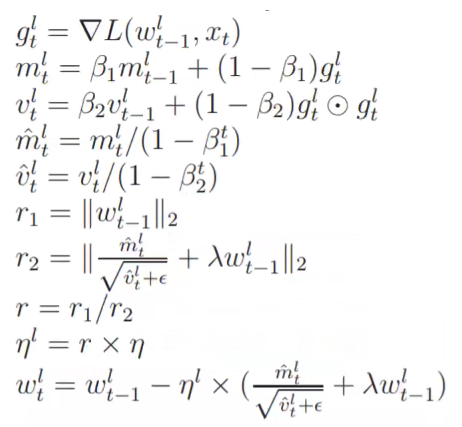

- 我们将要从论文中实现的公式：fastai是第一个实现这个的库，而且代码也很少。
  - pytorch中的优化器，只是一个存储了一些超参数的字典。
  - params 应该是一个列表；然后我们将超参数保存为每个参数组的字典
  - model.parameters()或者其他生成器，调用list时能够返回所有tensor、权重和偏差的列表。
- 如迁移学习中，最后两层的学习率与其它层的学习率不一样，所以部门不仅是传入一个参数列表，而是传入一个list of list，有两个项目，第一项包含架构主体中的所有参数，最后一项只包含最后两层的参数。
  - 也就是params是一个list of list，也就是param groups
    - 然后决定如何将param_groups**分成不同的参数组，或者您可以让它们为您变成一个单独的参数组，这是我们需要的第一件事**
    - 在defaults中是一个字典，所有的超参数都储存为字典，每一个参数组都有一个字典
    - 每个参数组都有一组自己的参数，可以设置lr，动量等
  - **我是怎么说我们的compose是有点特别，它传递任何关键字参数到它组成的所有东西这里是一个很好的使用方法**

```python
class Optimizer(): # params是一个List of list
    def __init__(self, params, steppers, **defaults):
        # might be a generator
        self.param_groups = list(params)
        # ensure params is a list of lists
        if not isinstance(self.param_groups[0], list):
            # 如果不是list，就要包装在list中称为一个List
            self.param_groups = [self.param_groups]
        self.hypers = [{**defaults} for p in self.param_groups]
        self.steppers = listify(steppers)

    def grad_params(self):
        return [(p,hyper) for pg,hyper in zip(self.param_groups,self.hypers)
            for p in pg if p.grad is not None]

    def zero_grad(self):
        for p,hyper in self.grad_params():
            p.grad.detach_()
            p.grad.zero_()

    def step(self):
        for p,hyper in self.grad_params(): compose(p, self.steppers, **hyper)
```

重量衰减是鼓励参数为小数的原因。我们使用称为 L2 正则化的东西，如下所示……

```python
loss_with_wd = loss + (wd / 2) * (weights ** 2).sum()
```

……或者你也可以使用另一种形式，实际上称为权重衰减

```python
weight.grad += wd * weight
```

代码中的 L2 正则化；需要注意的一件事是，在 PyTorch 中，使用 to 参数的 add_ 将首先将它们相乘，然后再添加到 p.grad。

接下来让我们添加动量。我们需要再次修改优化器类以存储先前的参数值。

```python

```

- 由于计算动量，需要激活元之前的状态，所以需要存储激活元的浮点数。StateOptimizer是拥有state的优化器。

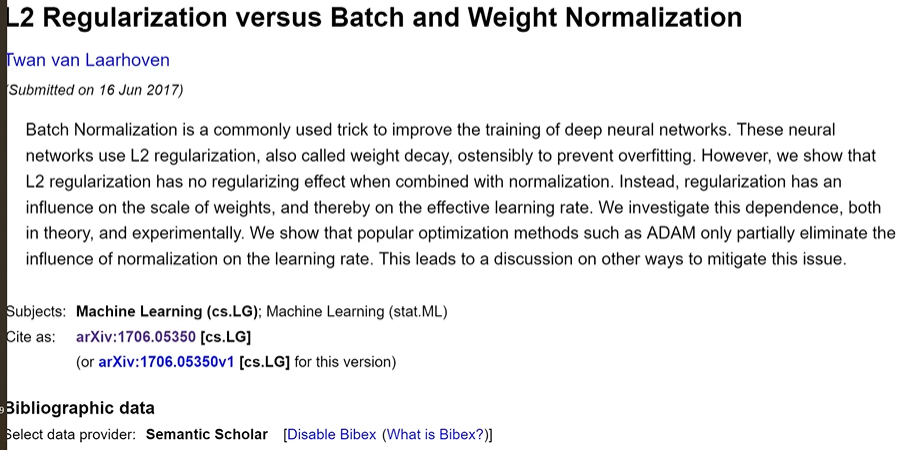

- paper:批量归一化是改进深度神经网络训练的常用技巧，他们还使用 l2 正则化或者叫做权重衰减 来防止过度拟合。

  - ==但是我们表明，l2正则化与归一化一起的时候，没有正则化作用==。what????
  - 我在欧洲和 Silvia 聊天时意识到这一点，我已经告诉过你我给他布置的东西，这是在我发现这篇论文之前，我们有一些正确的激活层和一些层，
  - 如果weight decay = 1e6 一百万。

- Jeremy 在这一点上提到的一件重要事情是，当我们进行批量标准化bn时，==L2 正则化并没有以每个人都期望的方式工作==。围绕这个领域正在进行一些研究，人们试图弄清楚当我们添加 L2 正则化时会发生什么。这个问题还没有一个答案。

- bn可以补偿掉l2 weight decay的部分，所以l2似乎没有什么作用了。

  - 作者 Twan van laarhoven 在中间提到了这一点，2017 年基本上没有人注意到
  
- 我在过去几个月的今天的课程笔记中提到了另外几篇论文，人们终于开始真正思考这个问题

  - 我们都做错了，甚至不知道l2正则化子啊做什么，但是如果你改变l2正则化，确实发生了变化。但它确实做了一些事情因为如果你改变它某些东西发生了所以这个人是错的？
  - 所以由 Rogergross 领导的团队最近发表的一篇论文找到了三种可能发生正则化的方式，**但这不是你认为这是其中一篇论文的方式课堂笔记，但即使在他几个月前的论文中，摘要说基本上或介绍说基本上没有人真正了解 LT 正则化的作用，所以我们不知道我们在做什么 每个模型都一直都有这样的事情，而且完全不起作用 至少它不会以我们认为的方式起作用**
  - 所以这应该让你感觉更好 我是否可以为深度学习做出贡献 显然你可以 因为我们都不知道我们在做什么
  - 所以深度学习还有很多值得深入探索的地方，还有很多未解的答案，open questions

  - 就像使用所有这些遥测技术，我向你展示了不同层的激活，看看实验中会发生什么，因为研究这些东西的人就像bn，weight decay等实际发生的情况一样，他们中的大多数人都没有知道如何正确训练模型，他们就像理论人员，然后是从业者，他们完全忘记了实际思考基础，但如果你能将两者结合起来说哦，让我们实际尝试一下一些实验让我们看看当我们改变权重衰减时会发生什么 现在我假设我们不知道我们在做什么 我相信你可以找到一些非常有趣的结果 

  

  **所以动量也很有趣**，而我们真的不知道对诸如动量之类的东西的工作原理有很多了解，但这里有一些不错的图片供您使用，希望它能让你对动量有一些认识。

  接下来，我们将看一些用不同方法计算动量的图。

  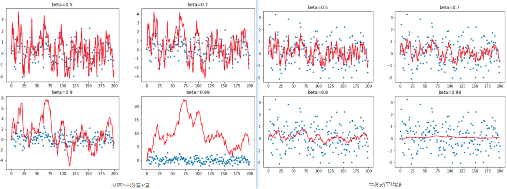

  - 动量β较小时，曲线都非常颠簸。一旦β比较高，到0.99了，你就会完全得到错误的答案了。因为过去的加权太重了，而大多数的值又>0，导致曲线一直都很高。
  -  **0.9 加上一个新的东西，这些东西都在零以上，所以你最终得到的数字太高了，这就是为什么如果你的动量太高而基本上你离你需要在权重空间里的地方还有很远**
  - 所以要小心高动量，而且此时的公式为$avg = \beta*avg+y_i$，给历史值太高的权重了。
  - 所以右侧的新公式为：$avg = \beta*avg+(1-\beta)y_i$，这就是指数加权平均。

- 上面是随机数，如果不是随机数，而是下面的一个具体的函数。

- 如果指数加权平均的动量很小，一开始有一个异常值，由于beta较小，所以权重还是较小的。

  - 但如果后面有很多这样的异常值，在0.99时，曲线会大量偏向于第一个数值。所以走歪了。
  - 而且红线总是在绿色点的右侧，所以还是有点问题。

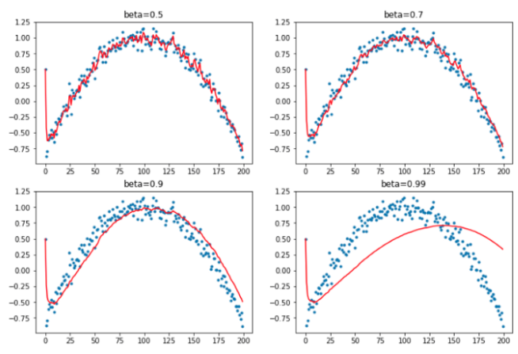

- 我们就需要偏置了，除以(1-beta)。

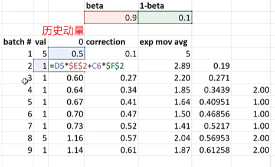

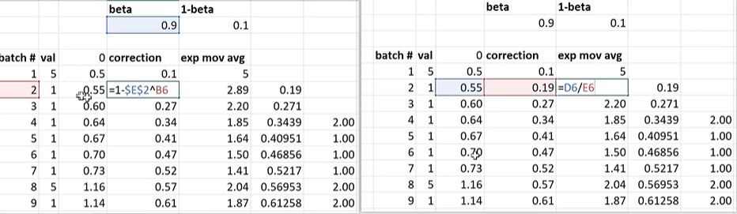

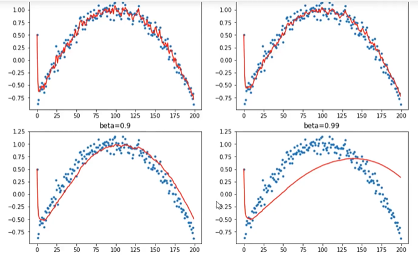

- 经过偏置后，就拟合的比较好了。即使几点比较差，也不会被第一个点带走。
- **让我们使用所有这些来创建 Adam** 
- 参考Adam的公式理解如下的代码

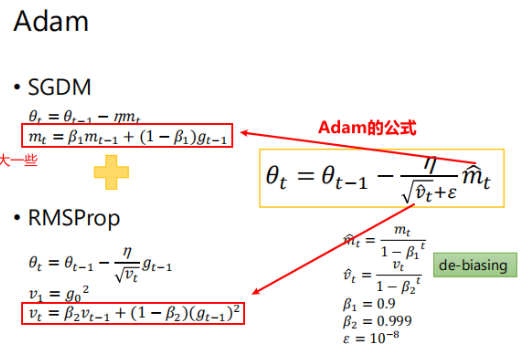

```python
#export
class AverageGrad(Stat):
    _defaults = dict(mom=0.9)
    
    def __init__(self, dampening:bool=False): self.dampening=dampening
    def init_state(self, p): return {'grad_avg': torch.zeros_like(p.grad.data)}
    def update(self, p, state, mom, **kwargs):
        state['mom_damp'] = 1-mom if self.dampening else 1.
        state['grad_avg'].mul_(mom).add_(state['mom_damp'], p.grad.data)
        return state
#export
class AverageSqrGrad(Stat):
    _defaults = dict(sqr_mom=0.99)
    
    def __init__(self, dampening:bool=True): self.dampening=dampening
    def init_state(self, p): return {'sqr_avg': torch.zeros_like(p.grad.data)}
    def update(self, p, state, sqr_mom, **kwargs):
        state['sqr_damp'] = 1-sqr_mom if self.dampening else 1.
        state['sqr_avg'].mul_(sqr_mom).addcmul_(state['sqr_damp'], p.grad.data, p.grad.data)
        return state
#export
class StepCount(Stat):
    def init_state(self, p): return {'step': 0}
    def update(self, p, state, **kwargs):
        state['step'] += 1
        return state
#export
def debias(mom, damp, step): return damp * (1 - mom**step) / (1-mom)
#export
def adam_step(p, lr, mom, mom_damp, step, sqr_mom, sqr_damp, grad_avg, sqr_avg, eps, **kwargs):
    debias1 = debias(mom,     mom_damp, step)
    debias2 = debias(sqr_mom, sqr_damp, step)
    p.data.addcdiv_(-lr / debias1, grad_avg, (sqr_avg/debias2).sqrt() + eps)
    return p
adam_step._defaults = dict(eps=1e-5)
#export
def adam_opt(xtra_step=None, **kwargs):
    return partial(StatefulOptimizer, steppers=[adam_step,weight_decay]+listify(xtra_step),
                   stats=[AverageGrad(dampening=True), AverageSqrGrad(), StepCount()], **kwargs)
learn,run = get_learn_run(nfs, data, 0.001, conv_layer, cbs=cbfs, opt_func=adam_opt())
run.fit(3, learn)
train: [1.7606317618659841, tensor(0.3931, device='cuda:0')]
valid: [1.4439287109375, tensor(0.5320, device='cuda:0')]
train: [1.246226745482395, tensor(0.5872, device='cuda:0')]
valid: [1.113287353515625, tensor(0.6260, device='cuda:0')]
train: [0.9583190188992943, tensor(0.6872, device='cuda:0')]
valid: [0.9859400634765625, tensor(0.6720, device='cuda:0')]
```

LAMB是最近新出的一篇论文，绝对值得一读。https://arxiv.org/pdf/1904.00962.pdf

```python

```

## Runner

```
09b_learner.ipynb
```

Jeremy 再次想重构我们在几节课前制作的代码。惹恼 Jeremy 的问题是 Learner 只是包含了一些东西，但没有做任何事情。然后是 Runner 里面有 Learner，然后它做了一些事情。Jeremy 决定在 Learner 中添加 Runner。

## 进度条

```
09c_add_progress_bar.ipynb
```

Sylvain Gugger 创建了一个`fastprogress`我们将要使用的库。我不会在这里复制笔记本，因为没有任何有趣的东西。我们只是创建一个回调`ProgressCallback`，然后我们使用它并获得不错的进度条。

## 数据增强

```
10_augmentation.ipynb
```

有很多不同的调整大小技术。PIL 建议`PIL.Image.ANTIALIAS`在缩小图像尺寸时使用。Jeremy 强调测试这些并查看结果很重要。有时，不同的技术可能会以某种重要特征消失的方式更改数据。

- 比如格子衬衫的事情。不同的resize的方法可能会让结果不一样！

Jeremy 提到的另一件重要的事情是数据增强可能很慢。他解释了翻转字节将如何为我们提供与翻转浮点数相同的结果，但速度要快得多。

RandomResizeCrop 几乎是每个 Kaggle（图像竞赛）获胜者都使用过的。同样的东西可以用在其他领域，比如文本。在训练时采用随机批量大小将有很大帮助。Jeremy 说透视扭曲是更好的版本。

问题：如果对象在增强后消失会怎样？它肯定会在数据集中添加一些噪音，但没关系。我们已经学会了解决噪音引起的问题的技巧。

```python

```

s

```python

```

 


