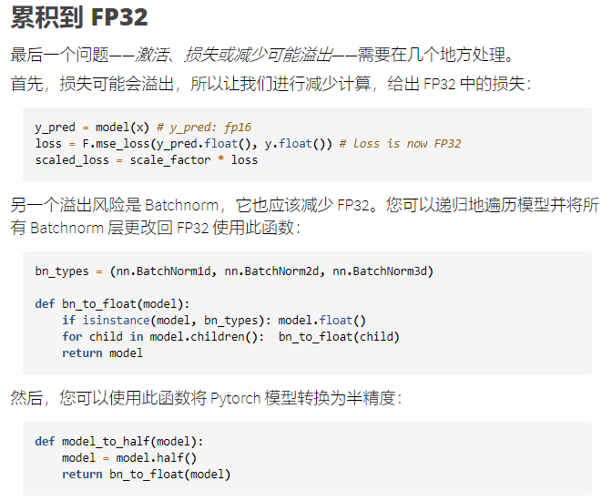
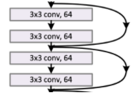

# [Lesson 12 Notes: Advanced training techniques; ULMFiT from scratch](https://jimypbr.github.io/2020/10/fast-ai-v3-lesson-12-notes-advanced-training-techniques-ulmfit-from-scratch)

## 概述

本课实现了一些今天非常重要的训练技术，全部使用回调：

- **MixUp**：一种数据增强技术，可显着改善结果，尤其是当您的数据较少或可以训练更长时间时。
- **标签平滑**：它与 MixUp 配合得特别好，当你有嘈杂的标签时，可以显着改善结果
- **混合精度训练**：在许多情况下训练模型的速度提高 3 倍左右。
- **它还实现了*XResNet***：这是经典 resnet 架构的调整版本，提供了实质性的改进。而且，更重要的是，它的开发提供了对什么使架构运行良好的深刻见解。
- **最后**，本课展示了如何从头开始实现 ULMFiT，包括构建 LSTM RNN，并查看处理自然语言数据以将其传递到神经网络所需的各个步骤。

## 链接和参考

- [第12课视频讲座](https://www.youtube.com/watch?v=vnOpEwmtFJ8&feature=youtu.be)
- [标签平滑 [paperswithcode/methods\]](https://paperswithcode.com/method/label-smoothing)
- [混合精度训练 [NVIDIA 博客\]](https://developer.nvidia.com/blog/video-mixed-precision-techniques-tensor-cores-deep-learning/)
- [浮动工作原理的](https://www.youtube.com/watch?v=PZRI1IfStY0)一个很好的解释[[YouTube\]](https://www.youtube.com/watch?v=PZRI1IfStY0)。
- 该视频通过[在位级别添加两个浮点数 [YouTube\]](https://www.youtube.com/watch?v=Pox8LzIHhR4)
- [Backpropagation Through Time 博客文章 [机器学习精通\]](https://machinelearningmastery.com/gentle-introduction-backpropagation-time/)
- [由 Stefano Giomo 撰写](https://forums.fast.ai/t/lesson-12-2019-discussion-and-wiki/44009/257)的[FastAI 论坛帖子](https://forums.fast.ai/t/lesson-12-2019-discussion-and-wiki/44009/257)揭开了[RNN](https://forums.fast.ai/t/lesson-12-2019-discussion-and-wiki/44009/257)中序列长度、BPTT 和批次大小之间的差异的神秘面纱。
- RNN 复习：[可视化](http://joshvarty.github.io/VisualizingRNNs/)RNN [[Josh Varty\]](http://joshvarty.github.io/VisualizingRNNs/)
- [了解 LSTM 网络 [Chris Olah\]](https://colah.github.io/posts/2015-08-Understanding-LSTMs/)
- [了解 ULMFiT 的构建块 [Kerem Turgutlu; 中等的\]](https://medium.com/mlreview/understanding-building-blocks-of-ulmfit-818d3775325b)
- paper：
  - 快速图像增强：[Mixup 论文 [2017\]](https://arxiv.org/abs/1710.09412)、[CutOut 论文 [2017\]](https://arxiv.org/abs/1708.04552)、[CutMix [2019\]](https://arxiv.org/abs/1905.04899)
  - [标签平滑何时有帮助？[2019\]](https://arxiv.org/abs/1906.02629)
  - [原始 ResNet 论文 [2015\]](https://arxiv.org/abs/1512.03385)
  - [Bag of Tricks 纸 [2019\]](https://arxiv.org/abs/1812.01187?utm_source=feedburner&utm_medium=feed&utm_campaign=Feed%3A+arxiv%2FQSXk+%28ExcitingAds%21+cs+updates+on+arXiv.org%29)
  - AWD-LSTM -[正则化和优化 LSTM 语言模型，Merity 等人。[2017\]](https://arxiv.org/abs/1708.02182)

------


- 要完成transforms，mixup，label smoothing，Resnet架构等。

在09b_learner.ipynb中的Runner做了一些修改，改掉了learner，因为它只存了四个值。然后有add_cbs, add_cb函数来添加回调函数。

- 理解代码的唯一方式，就是run。
- 之前在init的时候构建opt，现在是在fit的时候构建Opt。可以在fit的时候改变学习率、逐步解冻等事情，可以在fit的时候改变。虽然只有一行代码，在从概念上，它非常重要。所以这是对 9b 的一些小改动

```python
#export
from exp.nb_10 import *
path = datasets.untar_data(datasets.URLs.IMAGENETTE_160)
# rgb图像 resize，转为tensor和float
tfms = [make_rgb, ResizeFixed(128), to_byte_tensor, to_float_tensor]
bs = 64

il = ImageList.from_files(path, tfms=tfms)

sd = SplitData.split_by_func(il, partial(grandparent_splitter, valid_name='val'))
ll = label_by_func(sd, parent_labeler, proc_y=CategoryProcessor())
data = ll.to_databunch(bs, c_in=3, c_out=10, num_workers=4)
```

## 更好的图像训练：混合/标签平滑

- 上一课结束时对用GPU做数据增强很兴奋。GPU加速的数据增强，仅使用简单的pytorch操作，这是巨大的胜利。但很可能我们不再需要这种数据增强，因为在我们对这种称为混合的数据增强的实验中，我们发现我们可以删除大多数其他数据增强并获得惊人的好结果

### 混合

*（笔记本：[10b_mixup_label_smoothing.ipynb](https://github.com/fastai/course-v3/blob/master/nbs/dl2/10b_mixup_label_smoothing.ipynb)）*

- 我们很可能不再需要对图像进行大量数据增强。FastAI 对称为**Mixup**的数据增强进行了实验，他们发现他们可以删除大多数其他数据增强并获得惊人的好结果。这真的很简单，您还可以使用 MixUp 进行很*长时间的*训练并获得非常好的结果。

- MixUp 来自论文：[mixup: Beyond Empirical Risk Minimization [2017\]](https://arxiv.org/abs/1710.09412)。这是一篇非常容易阅读的论文。
- MixUp 在论文中被证明是一种非常有效的训练技术：[Bag of Tricks for Image Classification with Convolutional Neural Networks [2019\]](https://arxiv.org/abs/1812.01187?utm_source=feedburner&utm_medium=feed&utm_campaign=Feed%3A+arxiv%2FQSXk+%28ExcitingAds%21+cs+updates+on+arXiv.org%29)。*（本课将大量引用这篇论文，因此也值得一读。）*

以下是该论文中尝试的不同训练技巧的结果表：


- *（注意 MixUp 他们跑了更多的epoch）*
- 当他们打开mixup时，他们也开始训练 200 个 epoch，而不是 90 个，而不是 120 个，因此当你解释他们的纸质表格时要小心一点，当它从abel smoothing 94.1 到与蒸馏混合时 94.58。 他们也几乎翻了一番他们所做的epoch数，但你可以感觉到你可以大大减少错误。
- **什么是mixup？**我们将拍摄两个不同的图像，然后*将它们组合起来*。如何？通过简单地将两者进行凸组合。所以你做了一张图片的 30% 和另一张图片的 70%：
  - 但我们用多少比例的图像mixup，我们将随机使用权重。但是不是均匀分布，而是β分布！
  - why beta 分布？
    - 大部分时间随机数接近0或者1，偶尔会解决0.5. 大部分还是单个图像，只是偶尔预测一些0.5的mixup。
- 顾名思义，[mixup 文章](https://arxiv.org/abs/1710.09412)的作者，正如名称所暗示的那样，mixup文章的作者提出在训练集的混合图片上训练模型。例如，假设我们在CIFAR10上，然后不给模型提供原始图像，我们取两个(可能是同一类，也可能不是)，并对它们进行线性组合:从张量的角度


- `new_image = t * image1 + (1-t) * image2`
- 这里t是一个介于0和1之间的浮点数。那么我们分配给图像的目标就是原始目标的相同组合:**您还必须对标签进行 MixUp。**因此，您的标签将变成如下所示：`y = [0.3 (gas pump), 0.7 (dog)]`

- `new_target = t * target1 + (1-t) * target2`

假设你的目标是一个热点编码(这不是pytorch通常的情况)。就是这么简单。

```python
img1 = PIL.Image.open(ll.train.x.items[0])
img1
img2 = PIL.Image.open(ll.train.x.items[4000])
img2
mixed_up = ll.train.x[0] * 0.3 + ll.train.x[4000] * 0.7
plt.imshow(mixed_up.permute(1,2,0));
```

### Implementation

- 这个实现依赖于一个叫做beta分布的东西，这个分布反过来又使用了一个叫伽马函数的东西，杰里米仍然觉得有点可怕。为了克服他的恐惧，杰里米提醒自己，只是一个阶乘函数，(有点)也可以很好地平滑地插值到非整数。它究竟是如何做到这一点并不重要……
- pytorch没有γ函数，但有一个loggamma函数。

```python
# PyTorch has a log-gamma but not a gamma, so we'll create one
Γ = lambda x: x.lgamma().exp()
```

- 当我们生成这些混合训练示例时，我们需要选择我们将使用的每个图像的多少。我们定义一个混合比例λ，因此我们的混合图像将是λxi+(1 - λ) xj 。我们每次随机选取λ，但是我们不想简单地从均匀分布中生成它。在MixUp的文章中，**他们探索了混合参数如何影响性能**，并得出如下图(越高越差):


- 为了得到好的值，我们需要从一个更有可能选择接近0或1的数字的分布中取样。这样的分布就是gamma分布。这是一种奇怪的分布，它不是很直观从它的公式，但它的形状看起来是这样的两个不同的参数值α:


- α太大，我们大概率会得到相等的mixup。α太低，则大概率是0和1.因为数据增强我们需要能够调整一个杠杆，说明我正在做多少正则化，我在做多少方向，所以你可以上下移动你的 alpha。
- 注意：如果你看到你不知道的数学符号，你可以像这样在谷歌上搜索它们：[Γ函数](https://www.google.com/search?q=Γ+function)。
- 如果你不习惯打字的unicode符号，在Mac类型ctrl- cmd-space弹出一个搜索框表情符号。在 Linux 上，您可以使用[compose 键](https://help.ubuntu.com/community/ComposeKey)。在 Windows 上，您也可以使用组合键，但您首先需要安装[WinCompose](https://github.com/samhocevar/wincompose)。默认情况下，compose键是右手Alt键。
- 您可以在 WinCompose 中搜索符号名称。希腊字母通常是compose- `\*`- letter（例如，*字母*是希腊字母aα alpha）。

```python
facts = [math.factorial(i) for i in range(7)]
plt.plot(range(7), facts, 'ro')
plt.plot(torch.linspace(0,6), Γ(torch.linspace(0,6)+1))
plt.legend(['factorial','Γ']);
torch.linspace(0,0.9,10)
```


在原始文章中，作者提出了三件事：

1. 创建两个单独的数据加载器，并在每次迭代时从每个加载器中抽取一批以混合它们
2. 在具有参数 α 的 beta 分布之后绘制值（他们的文章中建议为 0.4）
3. 将具有相同值 t 的两个批次混合在一起。
4. 使用 one-hot 编码目标

为什么β分布具有相同的参数α？它看起来像这样：

```python
_,axs = plt.subplots(1,2, figsize=(12,4))
x = torch.linspace(0,1, 100)
for α,ax in zip([0.1,0.8], axs):
    α = tensor(α)
#     y = (x.pow(α-1) * (1-x).pow(α-1)) / (gamma_func(α ** 2) / gamma_func(α))
    y = (x**(α-1) * (1-x)**(α-1)) / (Γ(α)**2 / Γ(2*α))
    ax.plot(x,y)
    ax.set_title(f"α={α:.1}")
```


- Beta 分布倾向于在边缘生成数字。如果将其与上面的预测误差图进行比较，您会发现它们互为倒数。*（另外：[这篇](https://stats.stackexchange.com/questions/47771/what-is-the-intuition-behind-beta-distribution)关于 Beta 发行版背后直觉的[SO 帖子](https://stats.stackexchange.com/questions/47771/what-is-the-intuition-behind-beta-distribution)非常有趣）。*

- 我们来看看 MixUp 的实现……

  **原始 MixUp 算法：**在原始文章中，作者提出了三件事：

  1. 创建两个单独的数据加载器，并在每次迭代时从每个加载器中抽取一批以混合它们
  2. 根据带有参数α的beta分布绘制λ值 (他们的文章中建议使用 0.4）
  3. 将两个具有相同λ值的批次混合。
  4. 使用 one-hot 编码目标

  虽然上面的方法非常有效，但并不是最快的方法。减慢这一过程的主要原因是每次迭代都需要两个不同的批次(这意味着加载两倍数量的图像，并对它们应用其他数据增强功能)。为了避免这种速度变慢，我们可以更聪明一点，将批处理与自己的打乱版本混合(这样混合后的图像仍然是不同的)。这是 MixUp 论文中提出的一个技巧。


- FastAI MixUp Algorithm: FastAI采用了一些技巧来改进它:

1. 创建一个数据加载器，绘制一个批处理，X，带有标签y，我们可以通过变换这个批处理来创建混合图像。
2. 对于批处理中的每个项目，选择一个生成λ值的向量(α=0.4的Beta分布)。为了避免潜在的重复混淆，修复λ值:`t = max(t, 1-t)`
3. 创建一批X '和标签y '的随机排列。
4. 返回原批次和随机排列的线性组合:λX+(1−λ)X '。同样地，λy+(1−λ)y '。

- 一个技巧是为批处理中的每个图像选择不同的λ，因为fastai发现这样做可以使网络**更快地收敛**。
- 第二个技巧是使用单个批并将其用于MixUp，而不是加载两个批。但是，此策略可能会创建重复项。假设这个批处理有两张图片，我们先将Image0和Image1混合，λ1=0.1，然后将Image1和Image0混合，λ=0.9:

```
image0 * 0.1 + shuffle0 * (1-0.1) = image0 * 0.1 + image1 * 0.9
image1 * 0.9 + shuffle1 * (1-0.9) = image1 * 0.9 + image0 * 0.1
```

- 对于低`α`，我们以高概率选择接近 0. 和 1. 的值，中间的值都具有相同的概率。越大`α`，0. 和 1. 得到的概率越低。
- 然后 pytorch 非常小心地避免在可能的情况下使用 one-hot 编码目标，因此撤消此操作似乎有点麻烦。对我们来说，幸运的是，如果损失是典型的交叉熵我们有

```python
loss(output, new_target) = t * loss(output, target1) + (1-t) * loss(output, target2)
```

- 所以我们不会对任何东西进行one-hot编码，只计算这两个损失，然后进行线性组合。

- 对整批使用相同的参数 t 似乎也有点低效。在我们的实验中，我们注意到如果我们为批次中的每张图像绘制不同的 t，模型可以训练得更快（两个选项在准确性方面得到相同的结果，只是一个到达那里的速度更慢）。

- 我们必须应用的最后一个技巧是，这种策略可能会有一些重复：我们假设或者shuffle假设混合image0和image1，然后image1和image0，我们绘制t=0.1，第二个t=0.9。

```
image0 * 0.1 + shuffle0 * (1-0.1) = image0 * 0.1 + image1 * 0.9
image1 * 0.9 + shuffle1 * (1-0.9) = image1 * 0.9 + image0 * 0.1
```

将是相同的。当然，我们不得不有点不走运，但在实践中，我们看到使用这个而不去除那些近似重复的数据会降低准确性。为了避免它们，技巧是替换我们绘制的参数向量

```
t = max(t, 1-t)
```

两个参数相等的 beta 分布在任何情况下都是对称的，这样我们可以确保最大的系数总是在第一张图像(未打乱的批处理)附近。

在Mixup中，我们有处理损失的函数，它具有属性约化(如nn.CrossEntropy())。为了处理各种类型的损失函数的reduction=None，而不修改范围外的实际损失函数，我们需要在不减少的情况下执行这些操作，我们创建一个上下文管理器:

```python
#export
class NoneReduce():
    def __init__(self, loss_func): 
        self.loss_func,self.old_red = loss_func,None
        
    def __enter__(self):
        if hasattr(self.loss_func, 'reduction'):
            self.old_red = getattr(self.loss_func, 'reduction')
            setattr(self.loss_func, 'reduction', 'none')
            return self.loss_func
        else: return partial(self.loss_func, reduction='none')
        
    def __exit__(self, type, value, traceback):
        if self.old_red is not None: setattr(self.loss_func, 'reduction', self.old_red)  
```

这是`Callback`MixUp的代码。该`begin_batch`方法实现了上述算法：

```python
#export
from torch.distributions.beta import Beta

def unsqueeze(input, dims):
    for dim in listify(dims): input = torch.unsqueeze(input, dim)
    return input

def reduce_loss(loss, reduction='mean'):
    return loss.mean() if reduction=='mean' else loss.sum() if reduction=='sum' else loss  
```

- mixup需要我们改变我们的loss函数。mixup的loss_func
- **一组只是常规组，第二组是我们将随机抓取所有其他图像置换一个并随机选择一个共享**
- reduction的使用，有很多细节。
  - 在计算两种loss的时候，要关闭reduction
  - 在batch计算完了之后，有mean和sum

```python
  
#export
class MixUp(Callback):
    _order = 90 #Runs after normalization and cuda
    def __init__(self, α:float=0.4): self.distrib = Beta(tensor([α]), tensor([α]))
    
    def begin_fit(self): 
        self.old_loss_func,self.run.loss_func = self.run.loss_func,self.loss_func
    
    def begin_batch(self):
        # 只有训练时做mixup，valid不做mixup
        # 就在自己的batch里面做一个mixup，自己跟自己相加，λ加数据，λ加标签
        if not self.in_train: return #Only mixup things during training
        λ = self.distrib.sample((self.yb.size(0),)).squeeze().to(self.xb.device)
        λ = torch.stack([λ, 1-λ], 1)
        self.λ = unsqueeze(λ.max(1)[0], (1,2,3))
        shuffle = torch.randperm(self.yb.size(0)).to(self.xb.device)
        xb1,self.yb1 = self.xb[shuffle],self.yb[shuffle]
        self.run.xb = lin_comb(self.xb, xb1, self.λ)
        
    def after_fit(self): self.run.loss_func = self.old_loss_func
    
    def loss_func(self, pred, yb):
        if not self.in_train: return self.old_loss_func(pred, yb)
        with NoneReduce(self.old_loss_func) as loss_func:
             # 训练时，计算两种不同的图像损失，一个normal；对损失也要这样做
            loss1 = loss_func(pred, yb)
            loss2 = loss_func(pred, self.yb1)
        loss = lin_comb(loss1, loss2, self.λ)
        # 返回batch的loss的均值或者和，或者本身。
        return reduce_loss(loss, getattr(self.old_loss_func, 'reduction', 'mean'))
    
nfs = [32,64,128,256,512]

def get_learner(nfs, data, lr, layer, loss_func=F.cross_entropy,
                cb_funcs=None, opt_func=optim.SGD, **kwargs):
    model = get_cnn_model(data, nfs, layer, **kwargs)
    init_cnn(model)
    return Learner(model, data, loss_func, lr=lr, cb_funcs=cb_funcs, opt_func=opt_func)

cbfs = [partial(AvgStatsCallback,accuracy),
        CudaCallback, 
        ProgressCallback,
        partial(BatchTransformXCallback, norm_imagenette),
        MixUp]

learn = get_learner(nfs, data, 0.4, conv_layer, cb_funcs=cbfs)
learn.fit(1)
```

问题:softmax如何与所有这些互动? 我们应该直接 from mixup to inference?吗?

- 因为softmax是One-hot coding，标签是确定的0和1，这不是很好。也不能跟我们的label smoothing和mixup兼容。我们有标签噪声，肯定不能100%对标签肯定，所以不希望one-hot coding，希望是概率性的标签。这样就可以使用mixup了。这就是下面要将的label smoothing。

- softmax希望一个类别高，其他类别低这种。所以要用好Mixup，只要数据的标签含有标签噪声，就不会100%正确。所以不要one-hot编码，而是90%正确的标签。这个称为标签平滑。

- **我们如何修改损失函数？** *看`loss_func`上面的方法。*就像我们对交叉熵损失进行编码时一样，我们不需要将目标扩展为完整的分类分布，而是可以为 MixUp 编写一个专门的交叉熵版本：

```
loss(output, new_target) = t * _loss(output, target1) + (1-t) * _loss(output, target2)
```

- PyTorch 损失函数`nn.CrossEntropy`有一个`reduction`属性来指定如何从单个损失计算整批的损失，例如取平均值。
- 我们希望在计算出单个损失的线性组合*后*对批次进行这种reduction。
- 所以对于线性组合需要关闭reduction，然后再开启。
- 这些计算在GPU上进行，所以速度很快。超级强大的增强系统这不会给我们的代码增加任何开销，需要注意的一件事是我们实际上正在替换损失函数，损失函数还有reduction的东西。
- ==mixup它真的很有趣，因为你可以将它用于输入层以外的层，你可以在第一层使用它，也许与嵌入一起使用，所以你可以这样做例如，在 NLP 中混合增强==，就像人们还没有真正深入研究过的东西，但这似乎是一个机会，可以在许多我们目前没有真正看到它的地方添加增强，这意味着我们可以训练更好的模型和更少的数据
  - mixup的概念很有趣，不止可以在第一层使用，也可以在后面的层使用。人们研究的比较少，这里可能是一个机会。

## Label smoothing

- ==这是处理数据中的噪声标签的一种非常简单但非常有效的方法==。例如，在医疗问题中，诊断标签并不完美。结果是，如果你使用标签平滑，噪音标签通常不是那么大的问题。有趣的是，人们故意排列他们的标签，所以他们有50%的错误，他们仍然得到良好的结果，标签平滑。这也可以让你在花费大量时间清理数据之前，更快地接受训练，检查某些东西是否有效。
  - **所以不要听信其他人说，你数据没清理完，你就不能开始model，或者应该停止model。看看结果是否正确，如果结果正确，那么也许您可以跳过所有清理工作或同时进行这些工作**
  - 
- 另一种经常用于分类的正则化技术是标签平滑，它故意为标签引入噪声。它的设计是通过改变目标标签，使模型的决策不那么确定:
- 我们不再硬性预测正确类别为一，其他类别为零，而是将目标改为正确类别为1-ϵ，其他类别为ϵ/(k-1)，其中ϵ是个小正数，k代表类别的数量。
- 我们可以将损失更新为:


- where ce(x) is the cross-entropy of x (i.e.−log⁡(px)), and i is the correct class. Typical value: ϵ=0.1
- 有噪声的标签并没有你想的那么严重。

```python
#export
class LabelSmoothingCrossEntropy(nn.Module):
    def __init__(self, ε:float=0.1, reduction='mean'):
        super().__init__()
        self.ε,self.reduction = ε,reduction
    
    def forward(self, output, target):
        c = output.size()[-1]
        log_preds = F.log_softmax(output, dim=-1)
        loss = reduce_loss(-log_preds.sum(dim=-1), self.reduction)
        nll = F.nll_loss(log_preds, target, reduction=self.reduction)
        return lin_comb(loss/c, nll, self.ε)
    
cbfs = [partial(AvgStatsCallback,accuracy),
        CudaCallback,
        ProgressCallback,
        partial(BatchTransformXCallback, norm_imagenette)]
learn = get_learner(nfs, data, 0.4, conv_layer, cb_funcs=cbfs, loss_func=LabelSmoothingCrossEntropy())
learn.fit(1)

assert learn.loss_func.reduction == 'mean'
```


- 我们可以把它作为损失函数放进去，代替通常的交叉熵。
- Additional reading:
  - [Label Smoothing [paperswithcode/methods\]](https://paperswithcode.com/method/label-smoothing)
  - [When Does Label Smoothing Help? [2019\]](https://arxiv.org/abs/1906.02629)

## Training in Mixed Precision

`10c_fp16.ipynb`

- **所以这是一种超级强大的技术，它已经存在了几年这两种技术，但不是几乎尽可能广泛地使用**，然后如果您使用的是 volta tensor core 2080 任何种类的几乎任何当前一代的 nvidia 显卡，您都可以在理论上使用半精度浮点进行训练，理论山快10倍。
- 如果您使用的是现代加速器，则可以使用半精度浮点数进行训练。这些只是 16 位浮点数 (FP16)，而不是通常的单精度 32 位浮点数 (FP32)。从理论上讲，这应该可以将速度提高 10 倍，但*在实践*中，您可以在深度学习中获得 2-3 倍的加速。
- 使用 FP16 将内存使用量减少一半，因此您可以将模型的大小加倍，并将批量大小加倍。现代加速器中的专用硬件单元，例如张量核心，也可以更快地在 FP16 上执行操作。在 Volta 一代 NVIDIA 卡上，这些张量核心理论上提供了 8 倍的加速（遗憾的是，只是理论上）。
- 因此，半精度训练更适合您的内存使用，如果您有 Volta GPU，速度会更快（如果没有，仍然会快一点，因为计算最简单）。我们如何使用它？在 PyTorch 中，您只需要加载`.half()`所有张量即可。问题是，你通常不会在最后看到相同的精度，因为半精度并不是很精确，很有趣。
- 但时nvidia指出，又不能在所有地方都使用半精度，因为总是半精度训练不准确，是颠簸的，因为半精度经常四舍五入。所以只在一些地方使用半精度。如前向传播和反向传播中使用半精度，也就是Hard work都在fp16上进行，其他地方使用fp32.
  - 在w=w-lr*w.grad，由于grad的精度与w差几个数量级，所以step更新的这部分必须在FP32上进行。

继续这里关于 fastai_v1 开发的文档是关于混合精度训练的简短文章。对它的一个非常好的和清晰的介绍是[来自 NVIDIA 的这个视频](http://on-demand.gputechconf.com/gtc/2018/video/S81012/)。

### Aside: Some Floating Point Revision

- 浮点数可能看起来很神秘或有点像黑暗艺术，但它们确实非常优雅且易于理解。首先必须了解它们基本上类似于科学记数法，除了以 2 为基数而不是以 10 为基数：
- $x=0.1101101×2^4,x=(−1)^s×M×2^E$
- 在IEEE浮点数中，标准浮点数用上式表示，其中:
  - 符号s决定是负数(s=0)还是正数(s=1)
  - M是介于[1, 2-epsilon]的二进制小数，或者是[0, 1-epsilon]的小数
  - 指数E用2的a次幂(可能是负的)加权值。
- 这三个部分中的每一部分都占用一定数量的位。这里是32位浮点数的表示:*([Source](https://en.wikipedia.org/wiki/File:Float_example.svg))*


- 以下是进一步介绍材料的一些链接：
  - *关于浮动如何工作的一个很好的解释：[YouTube](https://www.youtube.com/watch?v=PZRI1IfStY0)。*
  - *该视频通过在位级别添加两个浮点数来工作：[YouTube](https://www.youtube.com/watch?v=Pox8LzIHhR4)*


https://www.cnblogs.com/h5l0/p/lib_hl_fixed-point.html

https://blog.csdn.net/dreamer2020/article/details/24158303


- 所以**FP32**是6~7位有效小数位，而**FP16**只有3-4位有效小数位！

**fp32**为了运算精度，给小数部分分配了23位（可以说是非常重视精度），这样小数的分度值是1/2^23 ，到小数点后6位的精度，而整数只有12位，除去符号位，可表示211=2048，范围就是-2048~2047。

**fp16**的位长有效，给小数分配10位，也只有1/210=1/1024也就是0.001的精度，而整数只剩可怜的5位，范围是-32~31。

- ### 什么是半精度？

- 在神经网络中，所有的计算通常都是在单一精度下完成的，这意味着所有数组中代表输入、激活、权重的所有浮点数……都是 32 位浮点数（本文其余部分为 FP32）。一个减少内存使用（并避免那些烦人的 cuda 错误）的想法是尝试以半精度做同样的事情，这意味着使用 16 位浮点数（或本文其余部分中的 FP16）。根据定义，它们占用 RAM 中一半的空间，理论上可以让您将模型的大小加倍，并将批量大小加倍。

- 另一个非常好的特性是 NVIDIA 开发了其最新的 GPU（Volta 系列）以充分利用半精度张量。基本上，如果你给它们半精度张量，它们就会堆叠起来，这样每个核就可以同时做更多的操作，并在理论上提供8倍的加速(遗憾的是，只是在理论上)。

  因此，半精度训练更适合您的内存使用，如果您有 Volta GPU，速度会更快（如果没有，仍然会快一点，因为计算最简单）。我们该怎么做呢？在 pytorch 中非常容易，我们只需将 .half() 放在任何地方：在我们模型的输入和所有参数上。问题是您通常最终不会看到相同的准确度（因此有时会发生这种情况），因为半精度是......好吧......没有那么精确;）。


这解决了问题 1。对于第二个问题，我们使用称为梯度缩放的东西：为了避免梯度被 FP16 精度归零，我们将损失乘以一个比例因子（例如 scale=512）。这样我们就可以将下图中的梯度向右推，并使它们不为零。


当然我们不希望那些 512-scaled 的梯度在权重更新中，所以在将它们转换成 FP32 之后，我们可以将它们除以这个比例因子（一旦它们没有变成 0 的风险）。这将循环更改为：

1. 用 FP16 模型计算输出，然后是损失。
2. 将损失乘以比例，然后以半精度反向传播梯度。
3. 以 FP32 精度复制梯度，然后按比例划分。
4. 对主模型进行更新（以 FP32 精度）。
5. 复制 FP16 模型中的主模型。

对于最后一个问题，NVIDIA 提供的技巧是将 batchnorm 层保留为单精度（它们没有很多权重，因此这不是一个很大的内存挑战）并计算单精度的损失（这意味着转换在将模型传递给损失之前，以单精度形式进行模型）。




*（来源：[NVIDIA - 使用 Tensor Cores 进行深度学习的混合精度训练技术](https://developer.nvidia.com/blog/video-mixed-precision-techniques-tensor-cores-deep-learning/)）*

总之，以下是使用 FP16 转换模型引起的 3 个问题以及如何缓解它们：

1. ~~权重更新不精确~~ => FP32 中的“主”权重
2. ~~梯度可能*下溢*~~ => 损失（梯度）缩放
3. ~~激活或丢失可能会溢出~~ => 在 FP32 中累积

有时半精度训练会得到更好的结果。更多的随机性，一些正则化。通常结果与使用 FP32 获得的结果相似，但速度更快。

## Util functions

在进入主回调之前，我们需要一些辅助函数。我们将使用APEX库 [APEX library](https://github.com/NVIDIA/apex) util函数进行重构。如果你不能安装CUDA/ c++，那么python版本就足够了。

我们需要一个函数将模型的所有层转换为FP16精度，除了类似batchnorm的层(因为这些需要在FP32精度中完成以保持稳定)。我们分两步完成:首先将模型转换为FP16，然后循环所有层，如果它们是BatchNorm层，则将它们放回FP32。

在Apex中，为我们完成这一任务的函数是convert_network。我们可以使用它将模型放入FP16或返回FP32。

```python 
# export 
import apex.fp16_utils as fp16

bn_types = (nn.BatchNorm1d, nn.BatchNorm2d, nn.BatchNorm3d)
def bn_to_float(model):
    if isinstance(model, bn_types): model.float()
    for child in model.children():  bn_to_float(child)
    return model
def model_to_half(model):
    model = model.half()
    return bn_to_float(model)

model = nn.Sequential(nn.Linear(10,30), nn.BatchNorm1d(30), nn.Linear(30,2)).cuda()
model = model_to_half(model)
def check_weights(model):
    for i,t in enumerate([torch.float16, torch.float32, torch.float16]):
        assert model[i].weight.dtype == t
        assert model[i].bias.dtype   == t
check_weights(model)

model = nn.Sequential(nn.Linear(10,30), nn.BatchNorm1d(30), nn.Linear(30,2)).cuda()
model = fp16.convert_network(model, torch.float16)
check_weights(model)
```

### Creating the master copy of the parameters

为了解决上面列出的第一个问题——*权重更新不精确*——我们可以在 FP32 中存储权重的**“主”副本**。这是传递给优化器的：

`opt = torch.optim.SGD(master_params, lr=1e-3)`

在优化器步骤之后，您将主权重复制回 FP16 中的模型权重： `master.grad.data.copy_(model.grad.data)`

然后，我们的训练循环将如下所示：

1. 用FP16模型计算输出，然后损失
2. 以半精度反向传播梯度。
3. 以 FP32 精度复制grad
4. 对主模型进行更新（以 FP32 精度）
5. 复制 FP16 模型中的主模型。

- 从我们的模型参数(主要在FP16中)，我们将希望在FP32中创建一个副本(主参数)，我们将用于优化器中的步骤。可选地，我们连接所有的参数来做一个平坦的大张量，这可以让这个step快一点。

```python
from torch.nn.utils import parameters_to_vector

def get_master(model, flat_master=False):
    model_params = [param for param in model.parameters() if param.requires_grad]
    if flat_master:
        master_param = parameters_to_vector([param.data.float() for param in model_params])
        master_param = torch.nn.Parameter(master_param, requires_grad=True)
        if master_param.grad is None: master_param.grad = master_param.new(*master_param.size())
        return model_params, [master_param]
    else:
        master_params = [param.clone().float().detach() for param in model_params]
        for param in master_params: param.requires_grad_(True)
        return model_params, master_params
```

The util function from Apex to do this is `prep_param_lists`.

```python
model_p,master_p = get_master(model)
model_p1,master_p1 = fp16.prep_param_lists(model)

def same_lists(ps1, ps2):
    assert len(ps1) == len(ps2)
    for (p1,p2) in zip(ps1,ps2): 
        assert p1.requires_grad == p2.requires_grad
        assert torch.allclose(p1.data.float(), p2.data.float())
        
same_lists(model_p,model_p1)
same_lists(model_p,master_p)
same_lists(master_p,master_p1)
same_lists(model_p1,master_p1)
```

We can't use flat_master when there is a mix of FP32 and FP16 parameters (like batchnorm here).

```python
model1 = nn.Sequential(nn.Linear(10,30), nn.Linear(30,2)).cuda()
model1 = fp16.convert_network(model1, torch.float16)
model_p,master_p = get_master(model1, flat_master=True)
model_p1,master_p1 = fp16.prep_param_lists(model1, flat_master=True)
same_lists(model_p,model_p1)
same_lists(master_p,master_p1)
assert len(master_p[0]) == 10*30 + 30 + 30*2 + 2
assert len(master_p1[0]) == 10*30 + 30 + 30*2 + 2
```

```python
def get_master(opt, flat_master=False):
    model_params = [[param for param in pg if param.requires_grad] for pg in opt.param_groups]
    if flat_master:
        master_params = []
        for pg in model_params:
            mp = parameters_to_vector([param.data.float() for param in pg])
            mp = torch.nn.Parameter(mp, requires_grad=True)
            if mp.grad is None: mp.grad = mp.new(*mp.size())
            master_params.append(mp)
    else:
        master_params = [[param.clone().float().detach() for param in pg] for pg in model_params]
        for pg in master_params:
            for param in pg: param.requires_grad_(True)
    return model_params, master_params
```

### Copy the gradients from model params to master params

在反向传播之后，必须将所有梯度复制到master params中，然后才能在FP32中执行优化器步骤optimizer step。

```python
def to_master_grads(model_params, master_params, flat_master:bool=False)->None:
    if flat_master:
        if master_params[0].grad is None: master_params[0].grad = master_params[0].data.new(*master_params[0].data.size())
        master_params[0].grad.data.copy_(parameters_to_vector([p.grad.data.float() for p in model_params]))
    else:
        for model, master in zip(model_params, master_params):
            if model.grad is not None:
                if master.grad is None: master.grad = master.data.new(*master.data.size())
                master.grad.data.copy_(model.grad.data)
            else: master.grad = None
```

The corresponding function in the Apex utils is `model_grads_to_master_grads`.

```python
x = torch.randn(20,10).half().cuda()
z = model(x)
loss = F.cross_entropy(z, torch.randint(0, 2, (20,)).cuda())
loss.backward()
to_master_grads(model_p, master_p)

def check_grads(m1, m2):
    for p1,p2 in zip(m1,m2): 
        if p1.grad is None: assert p2.grad is None
        else: assert torch.allclose(p1.grad.data, p2.grad.data) 
            
check_grads(model_p, master_p)

fp16.model_grads_to_master_grads(model_p, master_p)

check_grads(model_p, master_p)
```

### Copy the master params to the model params

After the step, we need to copy back the master parameters to the model parameters for the next update.

```python
from torch._utils import _unflatten_dense_tensors

def to_model_params(model_params, master_params, flat_master:bool=False)->None:
    if flat_master:
        for model, master in zip(model_params, _unflatten_dense_tensors(master_params[0].data, model_params)):
            model.data.copy_(master)
    else:
        for model, master in zip(model_params, master_params): model.data.copy_(master.data)
```

The corresponding function in Apex is `master_params_to_model_params`.

### But we need to handle param groups 我们要处理参数组

问题是，我们并不总是希望模型中的所有参数都在同一个参数组中，因为我们可能:

- 要做迁移学习，冻结几层
- 使用有差异的学习率  discriminative learning rates
- 不要将weight decay应用于某些层(如BatchNorm)或偏差bias term

因此，我们实际上需要一个函数，根据正确的参数组来分割优化器(而不是模型)的参数。下面的函数需要处理参数列表的列表(在model_pgs和master_pgs中每个参数组的列表)

```python
# export 
def get_master(opt, flat_master=False):
    model_pgs = [[param for param in pg if param.requires_grad] for pg in opt.param_groups]
    if flat_master:
        master_pgs = []
        for pg in model_pgs:
            mp = parameters_to_vector([param.data.float() for param in pg])
            mp = torch.nn.Parameter(mp, requires_grad=True)
            if mp.grad is None: mp.grad = mp.new(*mp.size())
            master_pgs.append([mp])
    else:
        master_pgs = [[param.clone().float().detach() for param in pg] for pg in model_pgs]
        for pg in master_pgs:
            for param in pg: param.requires_grad_(True)
    return model_pgs, master_pgs
# export 
def to_master_grads(model_pgs, master_pgs, flat_master:bool=False)->None:
    for (model_params,master_params) in zip(model_pgs,master_pgs):
        fp16.model_grads_to_master_grads(model_params, master_params, flat_master=flat_master)
# export 
def to_model_params(model_pgs, master_pgs, flat_master:bool=False)->None:
    for (model_params,master_params) in zip(model_pgs,master_pgs):
        fp16.master_params_to_model_params(model_params, master_params, flat_master=flat_master)
```

## The main Callback

```python
class MixedPrecision(Callback):
    _order = 99
    def __init__(self, loss_scale=512, flat_master=False):
        assert torch.backends.cudnn.enabled, "Mixed precision training requires cudnn."
        self.loss_scale,self.flat_master = loss_scale,flat_master

    def begin_fit(self):
        self.run.model = fp16.convert_network(self.model, dtype=torch.float16)
        self.model_pgs, self.master_pgs = get_master(self.opt, self.flat_master)
        #Changes the optimizer so that the optimization step is done in FP32.
        self.run.opt.param_groups = self.master_pgs #Put those param groups inside our runner.
        
    def after_fit(self): self.model.float()

    def begin_batch(self): self.run.xb = self.run.xb.half() #Put the inputs to half precision
    def after_pred(self):  self.run.pred = self.run.pred.float() #Compute the loss in FP32
    def after_loss(self):  self.run.loss *= self.loss_scale #Loss scaling to avoid gradient underflow

    def after_backward(self):
        #Copy the gradients to master and unscale
        to_master_grads(self.model_pgs, self.master_pgs, self.flat_master)
        for master_params in self.master_pgs:
            for param in master_params:
                if param.grad is not None: param.grad.div_(self.loss_scale)

    def after_step(self):
        #Zero the gradients of the model since the optimizer is disconnected.
        self.model.zero_grad()
        #Update the params from master to model.
        to_model_params(self.model_pgs, self.master_pgs, self.flat_master)
```

Now let's test this on Imagenette

```python
path = datasets.untar_data(datasets.URLs.IMAGENETTE_160)
tfms = [make_rgb, ResizeFixed(128), to_byte_tensor, to_float_tensor]
bs = 64

il = ImageList.from_files(path, tfms=tfms)
sd = SplitData.split_by_func(il, partial(grandparent_splitter, valid_name='val'))
ll = label_by_func(sd, parent_labeler, proc_y=CategoryProcessor())
data = ll.to_databunch(bs, c_in=3, c_out=10, num_workers=4)

nfs = [32,64,128,256,512]
def get_learner(nfs, data, lr, layer, loss_func=F.cross_entropy,
                cb_funcs=None, opt_func=adam_opt(), **kwargs):
    model = get_cnn_model(data, nfs, layer, **kwargs)
    init_cnn(model)
    return Learner(model, data, loss_func, lr=lr, cb_funcs=cb_funcs, opt_func=opt_func)
```

Training without mixed precision

```python
cbfs = [partial(AvgStatsCallback,accuracy),
        ProgressCallback,
        CudaCallback,
        partial(BatchTransformXCallback, norm_imagenette)]
learn = get_learner(nfs, data, 1e-2, conv_layer, cb_funcs=cbfs)
learn.fit(1)
```

Training with mixed precision

```python
cbfs = [partial(AvgStatsCallback,accuracy),
        CudaCallback,
        ProgressCallback,
        partial(BatchTransformXCallback, norm_imagenette),
        MixedPrecision]
learn = get_learner(nfs, data, 1e-2, conv_layer, cb_funcs=cbfs)
learn.fit(1)
test_eq(next(learn.model.parameters()).type(), 'torch.cuda.FloatTensor')
```

## Dynamic loss scaling

- 512对训练会产生很大的影响。所以用动态loss 缩放，动态损失缩放，实际上尝试了几个不同的损失缩放值，以找出它在什么时候变为无穷大inf，因此它动态地计算出我们可以达到的最高丢失错误。
- 有时候半精度比FP32训练，能得到更好的结果。我不知道，也许更多的随机性也许它有点正则化但通常它超级超级相似只是更快。
- Question: mixup，我认为混合真正好的一件事是它不需要任何特定领域的思考就像我们水平翻转一样，你也可以判断我们可以旋转多少它不会产生任何损失，就像在角落里没有反射填充或黑色填充一样，所以它有点像非常漂亮和干净.
- 它也几乎是无限的就它可以创建的不同图像的数量而言，因此您可以将每个图像与其他已经很大的图像进行这种排列，然后再进行不同的混合，所以它只是你可以用它做很多增强，还有其他类似的东西，所以还有一种叫做 cutout 的东西，你只需删除正方形并用黑色替换，它还有另一个你删除正方形并用随机像素替换它的东西，我还没有看到但我真的很想看到人们做的是删除一个正方形并用不同的图像替换它。所以我希望有人尝试混合而不是平均线性组合而不是选择一个 alpha .

- 损失缩放的问题在于它有一个神奇的数字 ，`scale_factor`您必须对其进行调整。随着模型训练，可能需要不同的值。动态损失缩放是一种`scale_factor`在运行时自适应地将 设置为正确值的技术。这个值将完美地适合我们的模型，并且可以随着训练的进行继续动态调整，如果它仍然太高，每次我们溢出时只需将其减半。不过过了一段时间，训练会收敛，梯度会开始变小，所以我们还需要一种机制，在安全的情况下，让这个动态损失规模变大。

在之前的混合精度训练的实现中，唯一令人恼火的是，它引入了一个新的超参数来进行调优，即损失缩放值 loss scaling。幸运的是，我们有办法解决这个问题。我们希望损失比例尽可能高，以便我们的梯度可以使用整个范围的表示，所以让我们首先尝试一个真正高的值。很有可能，这将导致我们的梯度或损失溢出，我们将再次尝试这个大值的一半，直到我们达到最大的损失规模，使梯度不溢出。

**算法：**

1. 首先`scale_factor`用一个非常高的值初始化，例如 512。
2. 做一个向前和向后的传球。
3. 检查是否有任何梯度溢出。
4. 如果任何梯度溢出，则将 减半并将`scale_factor`梯度归零（从而跳过优化步骤）。
5. 如果循环进行了500步没有溢出，则将scale_factor加倍。.

我们如何测试溢出？NaN 的一个有用属性是它们可以传播 - 向NaN添加任何东西，如果NaN会得到结果。因此，如果我们对包含 Nan 的张量求和，结果将是 NaN。要检查它是否为 NaN，我们可以使用违反直觉的属性，`NaN!=NaN`只需检查总和的结果是否等于自身。这是代码：

```python
def test_overflow(x):
    s = float(x.float().sum())
    return (s == float('inf') or s == float('-inf') or s != s)
```

这个值将完美地适合我们的模型，并且可以随着训练的进行继续进行动态调整，如果它仍然太高，每次我们溢出时只需将它减半。一段时间后，训练会收敛，梯度会开始变小，所以我们还需要一种机制，让这个动态损失规模变大，如果这样做是安全的。Apex库中使用的策略是，每次我们在没有溢出的情况下进行给定数量的迭代时，将损失规模乘以2。

为了检查梯度是否溢出，我们检查它们的总和(在FP32中计算)。如果一项是nan，那么和就是nan。有趣的是，在GPU上，它比检查torch.isnan快:

```python
# export 
def test_overflow(x):
    s = float(x.float().sum())
    return (s == float('inf') or s == float('-inf') or s != s)

x = torch.randn(512,1024).cuda()
test_overflow(x)
x[123,145] = float('inf')
test_overflow(x)
%timeit test_overflow(x)
%timeit torch.isnan(x).any().item()
```

So we can use it in the following function that checks for gradient overflow:

```python
# export 
def grad_overflow(param_groups):
    for group in param_groups:
        for p in group:
            if p.grad is not None:
                s = float(p.grad.data.float().sum())
                if s == float('inf') or s == float('-inf') or s != s: return True
    return False
```

And now we can write a new version of the `Callback` that handles dynamic loss scaling.

```python
# export 
class MixedPrecision(Callback):
    _order = 99
    def __init__(self, loss_scale=512, flat_master=False, dynamic=True, max_loss_scale=2.**24, div_factor=2.,
                 scale_wait=500):
        assert torch.backends.cudnn.enabled, "Mixed precision training requires cudnn."
        self.flat_master,self.dynamic,self.max_loss_scale = flat_master,dynamic,max_loss_scale
        self.div_factor,self.scale_wait = div_factor,scale_wait
        self.loss_scale = max_loss_scale if dynamic else loss_scale

    def begin_fit(self):
        self.run.model = fp16.convert_network(self.model, dtype=torch.float16)
        self.model_pgs, self.master_pgs = get_master(self.opt, self.flat_master)
        #Changes the optimizer so that the optimization step is done in FP32.
        self.run.opt.param_groups = self.master_pgs #Put those param groups inside our runner.
        if self.dynamic: self.count = 0

    def begin_batch(self): self.run.xb = self.run.xb.half() #Put the inputs to half precision
    def after_pred(self):  self.run.pred = self.run.pred.float() #Compute the loss in FP32
    def after_loss(self):  
        if self.in_train: self.run.loss *= self.loss_scale #Loss scaling to avoid gradient underflow

    def after_backward(self):
        #First, check for an overflow
        if self.dynamic and grad_overflow(self.model_pgs):
            #Divide the loss scale by div_factor, zero the grad (after_step will be skipped)
            self.loss_scale /= self.div_factor
            self.model.zero_grad()
            return True #skip step and zero_grad
        #Copy the gradients to master and unscale
        to_master_grads(self.model_pgs, self.master_pgs, self.flat_master)
        for master_params in self.master_pgs:
            for param in master_params:
                if param.grad is not None: param.grad.div_(self.loss_scale)
        #Check if it's been long enough without overflow
        if self.dynamic:
            self.count += 1
            if self.count == self.scale_wait:
                self.count = 0
                self.loss_scale *= self.div_factor

    def after_step(self):
        #Zero the gradients of the model since the optimizer is disconnected.
        self.model.zero_grad()
        #Update the params from master to model.
        to_model_params(self.model_pgs, self.master_pgs, self.flat_master)
```

```python
cbfs = [partial(AvgStatsCallback,accuracy),
        CudaCallback,
        ProgressCallback,
        partial(BatchTransformXCallback, norm_imagenette),
        MixedPrecision]
```

```python
learn = get_learner(nfs, data, 1e-2, conv_layer, cb_funcs=cbfs)
learn.fit(1)
```

The loss scale used is way higher than our previous number:

```python
learn.cbs[-1].loss_scale
```

## Imagenet(te) training

`11_train_imagenette.ipynb`

```python
#export
from exp.nb_10c import *
```

```python
path = datasets.untar_data(datasets.URLs.IMAGENETTE_160)
size = 128
# 随机调整裁剪，最小比例的0.35，最大为1.发现效果很好。
tfms = [make_rgb, RandomResizedCrop(size, scale=(0.35,1)), np_to_float, PilRandomFlip()]

bs = 64

il = ImageList.from_files(path, tfms=tfms)
sd = SplitData.split_by_func(il, partial(grandparent_splitter, valid_name='val'))
ll = label_by_func(sd, parent_labeler, proc_y=CategoryProcessor())

ll.valid.x.tfms = [make_rgb, CenterCrop(size), np_to_float]

data = ll.to_databunch(bs, c_in=3, c_out=10, num_workers=8)
```

## XResNet

- 到目前为止，我们使用的所有图像模型都是无聊的卷积模型。我们真正想要使用的是**ResNet 模型**。我们将实现**XResNet**，它是 ResNet 的突变/扩展版本。这是从[技巧袋论文中](https://arxiv.org/abs/1812.01187)提取的经过调整的 ResNet 。

  让我们来看看 XResNet 的修改……

- 第一个修改：**ResNetC** - 一开始不要做大的 7x7 卷积，因为它效率低下并且只是一个单一的线性模型。而是连续进行三个 3x3 转换。感受野仍然是大约 7x7，但它可以学习的东西要丰富得多，因为它有 3 层而不是 1 层。我们称这些第一层为*stem*。*（这在[第 11 课](https://jimypbr.github.io/2020/08/fast-ai-v3-lesson-11-notes-data-block-api-the-generic-optimizer-data-augmentation#new-cnn-model)中也有介绍）*
  - Conv 层接收多个输入通道`c_in`并输出多个输出通道`c_out`。
  - 默认情况下第一层有，`c_in=3`因为通常我们有 RGB 图像。
  - 我们将输出数量设置为`c_out=(c_in+1)*8`。这为第二层提供了 32 个通道的输入，这是技巧包论文所推荐的。
  - 因子 8 还有助于更有效地使用 GPU 架构。这会随着输入通道的数量而自行增长/缩小，因此如果您有更多的输入，那么它就会有更多的激活。如果不是8的倍数，nvidia显卡可能会很慢。


前几层称为 the `stem`，它看起来像：下面的stem

```python
nfs = [c_in, (c_out+1)*8, 64, 64] # c_in/c_outs for the 3 conv layers
stem = [conv_layer(nfs[i], nfs[i+1], stride=2 if i==0 else 1) for i in range(3)]
```

`conv_layer`是一个`nn.Sequential`对象：

- 一个*卷积*
- 后跟一个*BatchNorm*
- 和可选的*激活*（默认 ReLU）

```python
act_fn = nn.ReLU(inplace=True)

def conv(ni, nf, ks=3, stride=1, bias=False):
    return nn.Conv2d(ni, nf, kernel_size=ks, stride=stride, padding=ks//2, bias=bias) 

def conv_layer(ni, nf, ks=3, stride=1, zero_bn=False, act=True):
    bn = nn.BatchNorm2d(nf)
    nn.init.constant_(bn.weight, 0. if zero_bn else 1.) # init batchnorm trick
    layers = [conv(ni, nf, ks, stride=stride), bn]
    if act: layers.append(act_fn)
    return nn.Sequential(*layers)
```
### Zero BatchNorm Trick

- 在stem之后，ResNet主体的其余部分是任意数量的resblock。在ResBlock中，BatchNorm初始化还有一个额外的技巧。我们有时将BatchNorm权重初始化为0，有时将它初始化为1。

  why? 要知道为什么这是有用的，回想一下标准ResBlock的图表:

  - resnet-D是一个标准的resnet-block残差块。
  - 

  

- 上面的每个“权重层”都是一个Conv/BatchNorm。如果ResBlock的输入是x，那么它的输出是x+block(x)。如果我们将block中的最后一个BatchNorm层初始化为0，那么这就相当于将输入乘以0，因此block(x)=0。因此，在训练开始时，所有的resblock只是返回它们的输入，这模拟了一个更少层的网络，**在初始阶段更容易训练**。

  - 如果你有一个1000层的深的模型，任何层的稍微的变化都会导致梯度以这种螺旋式下降到零阶无穷大。我们将三层的最后一个bn的权重设置为0，让我们可以在高学习率下训练非常深的模型。

- 像google、Facebook这样的大公司喜欢炫耀他们的巨型数据中心，如果有1000个CPU，可以创建很大的batch size。但对普通人来说，用了resnet我们也可以使用很大的学习率，也可以让我们创建大的batch size。

- 使用更高的学习率，可以训练更快，泛化能力更好。

### Resblock

- 在stem之后，ResNet主体的其余部分是任意数量的resblock。ResBlock代码如下：

- 在一个ResNet中有几种不同类型的ResBlock，这些都包含在上面完整的ResBlock代码中，参数的扩展和stride都可以改变。

  在ResNet18/30中，有一个标准的ResBlock，它的扩展值expansion为1,stride值为1，它们堆叠在一起，如图所示:

  

- 除了这个标准之外，还有另外两个ResBlock——扩展(也就是瓶颈)ResBlock和降采样ResBlock。 the *Expansion* (AKA Bottleneck) ResBlock, and the *Downsampling* ResBlock.
  让我们来看看它们是如何通过《戏法之袋》的论文进行调整的。

```python
#export
def noop(x): return x

class Flatten(nn.Module):
    def forward(self, x): return x.view(x.size(0), -1)

def conv(ni, nf, ks=3, stride=1, bias=False):
    return nn.Conv2d(ni, nf, kernel_size=ks, stride=stride, padding=ks//2, bias=bias)
#export
act_fn = nn.ReLU(inplace=True)

def init_cnn(m):
    if getattr(m, 'bias', None) is not None: nn.init.constant_(m.bias, 0)
    if isinstance(m, (nn.Conv2d,nn.Linear)): nn.init.kaiming_normal_(m.weight)
    for l in m.children(): init_cnn(l)

def conv_layer(ni, nf, ks=3, stride=1, zero_bn=False, act=True):
    bn = nn.BatchNorm2d(nf)
    # 有时初始化bn的权重为1，有时初始化为1
    nn.init.constant_(bn.weight, 0. if zero_bn else 1.)
    layers = [conv(ni, nf, ks, stride=stride), bn]
    if act: layers.append(act_fn)
    return nn.Sequential(*layers)
#export
class ResBlock(nn.Module):
    def __init__(self, expansion, ni, nh, stride=1):
        super().__init__()
        nf,ni = nh*expansion,ni*expansion
        layers  = [conv_layer(ni, nh, 3, stride=stride),
                   conv_layer(nh, nf, 3, zero_bn=True, act=False)
        ] if expansion == 1 else [
                   conv_layer(ni, nh, 1),
                   conv_layer(nh, nh, 3, stride=stride),
                   conv_layer(nh, nf, 1, zero_bn=True, act=False)
        ]
        self.convs = nn.Sequential(*layers)
        self.idconv = noop if ni==nf else conv_layer(ni, nf, 1, act=False)
        self.pool = noop if stride==1 else nn.AvgPool2d(2, ceil_mode=True)

    def forward(self, x): return act_fn(self.convs(x) + self.idconv(self.pool(x)))
```

#### Expansion/BottleNeck ResBlock

- 对于ResNet18/34, ResBlock看起来像下面左边的图表——一个张量带有shape[*， *， 64]，并经历两个3x3 conv_layers。然而，对于更深层次的ResNets(例如50+)，做所有这些3x3的conv_layers是昂贵的和消耗内存的。
- 相反，我们使用一个 *BottleNeck*具有1x1卷积的 *BottleNeck*，将通道数量压缩4个，然后我们进行一个3x3卷积，然后再执行另一个1x1，将其投影回原来的形状。由于我们在3x3的conv_layer中将通道数压缩到原来的4倍，因此我们将模型中的正常通道数扩展到原来的4倍，以得到相当于基本块大小的卷积。如下图所示:
- 

- (图表摘自原ResNet论文)

  在ResBlock代码中，这个BottleNeck 层是通过expansion参数实现的。expansion是1或4。我们将输入和输出通道的数量乘以这个因子:``nf,ni = nh*expansion,ni*expansion`.`。对于ResNet50+，这个因子是4。

#### Downsampling ResBlock

- 在一组新的 ResBlocks 开始时，我们通常将空间维度减半，stride=2的 卷积，同时通道数量加倍。维度现在已经改变，那么identify connection连接会发生什么？在最初的论文中，他们使用投影矩阵来减少维数，我看到的其他实现使用1x1 conv_layer和stride 2。
  - 由于resnet block中，残差块中有一个3×3的Conv，stride=2，下采样了。所以identity的加法时featuremap是不一样的，所以需要一个AvgPool进行特征图减半处理。才能做加法。
  - 同时通道数也变化了，3层resblock的最后一个将通道数变为4倍了。identity连接也会出问题，所以在avgpool之后再加入了一个1×1卷积层，改变通道数。
- 他们在the bag of tricks paper 的做法是，将`AveragePooling`步长 2 设为网格大小的一半，然后使用 1x1 `conv_layer`（步长 1）来增加通道数。这是下采样 ResBlock 的示意图：


- 进一步的调整，如上所示，是将步幅2放到3x3的conv_layer中。在此之前，人们在第一个1x1 conv_layer中大步2，这是一件可怕的事情，因为你只是丢弃了3 / 4的数据。
- **有趣的是人们花了数年时间才意识到他们实际上丢弃了四分之三的数据**
- 所以我提到这些细节的原因是，为了你可以阅读那篇论文并花时间思考每个 ResNet 调整。你是否理解他们为什么这样做是正确的？一些神经架构搜索尝试一切无脑使用我们所有的计算机方法，它是单独的让我们坐下来思考**我们如何实际使用我们拥有的所有输入，**以及我们如何实际利用我们正在做的所有计算。所以它是我的意思是之前存在的大部分调整和内容，他们已经引用了所有这些，但是如果你把它们放在一起，那就太好了，就像这里是如何思考架构设计一样
- 你如何能把resblock架构对？如果些微改变一些东西，又会怎样不同？**因此对于研究和生产，您希望针对您的架构像这样重构您的代码，以便您可以查看它并说明究竟出了什么问题**，**我该怎么做，对于有效的从业者来说，能够编写漂亮简洁的架构非常重要**，**这样您就可以更改它们并理解它们，这就是我们的 X ResNet**

### Putting it Together

```python
#export
class XResNet(nn.Sequential):
    @classmethod
    def create(cls, expansion, layers, c_in=3, c_out=1000):
        # 3,32,64,64 前三层的网络
        nfs = [c_in, (c_in+1)*8, 64, 64]
        stem = [conv_layer(nfs[i], nfs[i+1], stride=2 if i==0 else 1)
            for i in range(3)]

        nfs = [64//expansion,64,128,256,512]
        res_layers = [cls._make_layer(expansion, nfs[i], nfs[i+1],
                                      n_blocks=l, stride=1 if i==0 else 2)
                  for i,l in enumerate(layers)]
        res = cls(
            *stem,
            nn.MaxPool2d(kernel_size=3, stride=2, padding=1),
            *res_layers,
            nn.AdaptiveAvgPool2d(1), Flatten(),
            nn.Linear(nfs[-1]*expansion, c_out),
        )
        init_cnn(res)
        return res

    @staticmethod
    def _make_layer(expansion, ni, nf, n_blocks, stride):
        return nn.Sequential(
            *[ResBlock(expansion, ni if i==0 else nf, nf, stride if i==0 else 1)
              for i in range(n_blocks)])
#export
def xresnet18 (**kwargs): return XResNet.create(1, [2, 2,  2, 2], **kwargs)
def xresnet34 (**kwargs): return XResNet.create(1, [3, 4,  6, 3], **kwargs)
def xresnet50 (**kwargs): return XResNet.create(4, [3, 4,  6, 3], **kwargs)
def xresnet101(**kwargs): return XResNet.create(4, [3, 4, 23, 3], **kwargs)
def xresnet152(**kwargs): return XResNet.create(4, [3, 8, 36, 3], **kwargs)
```

与创建任何ResNet模型所需的ResBlock代码相结合。：）

现在我们可以通过列出每一层有多少块和扩展因子(50+ 4)来创建所有的ResNets:

## Train

- 使用loss fucniton为交叉熵。有label smoothing标签平滑。resnet18.

```python
cbfs = [partial(AvgStatsCallback,accuracy), ProgressCallback, CudaCallback,
        partial(BatchTransformXCallback, norm_imagenette),
#         partial(MixUp, alpha=0.2)
       ]
loss_func = LabelSmoothingCrossEntropy()
arch = partial(xresnet18, c_out=10)
opt_func = adam_opt(mom=0.9, mom_sqr=0.99, eps=1e-6, wd=1e-2)
#export
def get_batch(dl, learn):
    learn.xb,learn.yb = next(iter(dl))
    learn.do_begin_fit(0)
    learn('begin_batch')
    learn('after_fit')
    return learn.xb,learn.yb
```

We need to replace the old `model_summary` since it used to take a `Runner`. 打印模型摘要，看看模型怎么组成的。

```python
# export
def model_summary(model, data, find_all=False, print_mod=False):
    xb,yb = get_batch(data.valid_dl, learn)
    mods = find_modules(model, is_lin_layer) if find_all else model.children()
    f = lambda hook,mod,inp,out: print(f"====\n{mod}\n" if print_mod else "", out.shape)
    with Hooks(mods, f) as hooks: learn.model(xb)
learn = Learner(arch(), data, loss_func, lr=1, cb_funcs=cbfs, opt_func=opt_func)
learn.model = learn.model.cuda()
model_summary(learn.model, data, print_mod=False) # 改为true，可以打印出整个块这将非常有用，可以帮助您了解模型中发生的事情
```

| epoch | train_loss | train_accuracy | valid_loss | valid_accuracy | time |
| ----: | ---------: | -------------: | ---------: | -------------: | ---: |

```
 torch.Size([128, 32, 64, 64])
 torch.Size([128, 64, 64, 64])
 torch.Size([128, 64, 64, 64])
 torch.Size([128, 64, 32, 32])
 torch.Size([128, 64, 32, 32])
 torch.Size([128, 128, 16, 16])
 torch.Size([128, 256, 8, 8])
 torch.Size([128, 512, 4, 4])
 torch.Size([128, 512, 1, 1])
 torch.Size([128, 512])
 torch.Size([128, 10])
```

```python
# 这里是我们的架构
arch = partial(xresnet34, c_out=10)
learn = Learner(arch(), data, loss_func, lr=1, cb_funcs=cbfs, opt_func=opt_func)
learn.fit(1, cbs=[LR_Find(), Recorder()])
```

| epoch | train_loss | train_accuracy | valid_loss | valid_accuracy | time |
| ----: | ---------: | -------------: | ---------: | -------------: | ---: |

```python
learn.recorder.plot(3)
```


```python
#export
def create_phases(phases):
    phases = listify(phases)
    return phases + [1-sum(phases)]
print(create_phases(0.3))
print(create_phases([0.3,0.2]))
[0.3, 0.7]
[0.3, 0.2, 0.5]
lr = 1e-2
pct_start = 0.5
phases = create_phases(pct_start)
sched_lr  = combine_scheds(phases, cos_1cycle_anneal(lr/10., lr, lr/1e5))
sched_mom = combine_scheds(phases, cos_1cycle_anneal(0.95, 0.85, 0.95))
cbsched = [
    ParamScheduler('lr', sched_lr),
    ParamScheduler('mom', sched_mom)]
learn = Learner(arch(), data, loss_func, lr=lr, cb_funcs=cbfs, opt_func=opt_func)
learn.fit(5, cbs=cbsched)
```


- 在imagenette上的acc在5个Epoch上是82.4%, 在Imagnette官网上面，128的5epoch是84.6%acc
- 在128pixel的imagenette上训练5个epoch对ImageNet训练更大的模型有很多影响，所以你可以通过不尝试训练巨型模型来学到很多东西。希望大家在leaderboard上打败Jeremy的记录。
- Image wolf只有小狗的照片，但是hard很多。

## cnn_learner

- 我们可以重构所有的东西，把回调和所有的东西加入到CNN learner中。

```python
#export
def cnn_learner(arch, data, loss_func, opt_func, c_in=None, c_out=None,
                lr=1e-2, cuda=True, norm=None, progress=True, mixup=0, xtra_cb=None, **kwargs):
    cbfs = [partial(AvgStatsCallback,accuracy)]+listify(xtra_cb)
    if progress: cbfs.append(ProgressCallback)
    if cuda:     cbfs.append(CudaCallback)
    if norm:     cbfs.append(partial(BatchTransformXCallback, norm))
    if mixup:    cbfs.append(partial(MixUp, mixup))
    arch_args = {}
    if not c_in : c_in  = data.c_in
    if not c_out: c_out = data.c_out
    if c_in:  arch_args['c_in' ]=c_in
    if c_out: arch_args['c_out']=c_out
    return Learner(arch(**arch_args), data, loss_func, opt_func=opt_func, lr=lr, cb_funcs=cbfs, **kwargs)
learn = cnn_learner(xresnet34, data, loss_func, opt_func, norm=norm_imagenette)
learn.fit(5, cbsched)
```


## Imagenet

你可以在fastai imagenet训练脚本中看到所有这些内容。它和我们目前看到的是一样的，除了它也处理多gpu训练。那么这种方法的效果如何呢?

- 我们训练了60个epoch，得到了5.9%的误差，而PyTorch官方的resnet在90个epoch中得到了7.5%的误差! 93.3%
- 我们的xresnet 50训练甚至超过标准的resnet 152，后者训练超过50%的epoch，有3倍的layer。
- 我们的xresnet50是建立在基本的常识之上的，并得到了惊人的结果。所以Jeremy真的不认为我们都的要去搜索神经架构和超参数优化。只要使用良好的常识思维就可以得到很好的模型。
- 现在我们有一个很好的模型之后，希望能够进行迁移学习！


### 图像分类：迁移学习/微调 fine-tune

*( [Jump_to 第 12 课视频](https://youtu.be/vnOpEwmtFJ8?&t=2920))* , *(笔记本: [11a_transfer_learning.ipynb](https://github.com/fastai/course-v3/blob/master/nbs/dl2/11a_transfer_learning.ipynb) )*

回想一下 fastai 第 1 部分中熟悉的“one two”训练组合，以便在图像分类任务上获得良好的结果：

1. 获取预训练的模型权重的 ResNet 权重
2. 为您的新任务创建模型的新“头部head”部分。
3. 冻结除头部以外的所有层。
4. 为头部运行几个周期的训练。
5. 解冻所有层并再运行几个训练周期。

- 如何从头开始做迁移学习呢？将image wolf上的学习模型，迁移到Pets数据中。
- 所有的模块都没有用fastai库的东西，都是我们自己写的。

让我们实现使这成为可能所需的代码。

```python
#export
from exp.nb_11 import *
path = datasets.untar_data(datasets.URLs.IMAGEWOOF_160)
size = 128
bs = 64

tfms = [make_rgb, RandomResizedCrop(size, scale=(0.35,1)), np_to_float, PilRandomFlip()]
val_tfms = [make_rgb, CenterCrop(size), np_to_float]
il = ImageList.from_files(path, tfms=tfms)
sd = SplitData.split_by_func(il, partial(grandparent_splitter, valid_name='val'))
ll = label_by_func(sd, parent_labeler, proc_y=CategoryProcessor())
ll.valid.x.tfms = val_tfms
data = ll.to_databunch(bs, c_in=3, c_out=10, num_workers=8)
len(il)
loss_func = LabelSmoothingCrossEntropy()
opt_func = adam_opt(mom=0.9, mom_sqr=0.99, eps=1e-6, wd=1e-2)
learn = cnn_learner(xresnet18, data, loss_func, opt_func, norm=norm_imagenette)
def sched_1cycle(lr, pct_start=0.3, mom_start=0.95, mom_mid=0.85, mom_end=0.95):
    phases = create_phases(pct_start)
    sched_lr  = combine_scheds(phases, cos_1cycle_anneal(lr/10., lr, lr/1e5))
    sched_mom = combine_scheds(phases, cos_1cycle_anneal(mom_start, mom_mid, mom_end))
    return [ParamScheduler('lr', sched_lr),
            ParamScheduler('mom', sched_mom)]
lr = 3e-3
pct_start = 0.5
cbsched = sched_1cycle(lr, pct_start)
learn.fit(40, cbsched)
```

```python
st = learn.model.state_dict()
type(st)
', '.join(st.keys())
st['10.bias']
mdl_path = path/'models'
mdl_path.mkdir(exist_ok=True)
```


- 做了40个epoch，因为我们要做迁移学习。
- 11s做一个epoch，最后得到70.6%的acc
  - 但是这个模型没有训练猫，有点棘手。 而且这个模型只接受过不到 10,000 张图像的训练
  - 所以我们这样的模型迁移还有效吗？work吗？我们很有兴趣！
- 也可以保存整个模型，包括架构，但这非常繁琐，我们不推荐这样做。相反，只需保存参数，并直接重新创建模型。
  - 把模型放进一个字典里面，子弹是有顺序的。可以轻松将模块转换为字典。

```python
torch.save(st, mdl_path/'iw5')
# pickle也可以实现相同功能
```

## Pets

```python
pets = datasets.untar_data(datasets.URLs.PETS)
pets.ls()
pets_path = pets/'images'
il = ImageList.from_files(pets_path, tfms=tfms)
il
#export
def random_splitter(fn, p_valid): return random.random() < p_valid
random.seed(42)
sd = SplitData.split_by_func(il, partial(random_splitter, p_valid=0.1))
sd

n = il.items[0].name; n

re.findall(r'^(.*)_\d+.jpg$', n)[0]

def pet_labeler(fn): return re.findall(r'^(.*)_\d+.jpg$', fn.name)[0]

proc = CategoryProcessor()

ll = label_by_func(sd, pet_labeler, proc_y=proc)

', '.join(proc.vocab)

ll.valid.x.tfms = val_tfms

c_out = len(proc.vocab)

data = ll.to_databunch(bs, c_in=3, c_out=c_out, num_workers=8)
learn = cnn_learner(xresnet18, data, loss_func, opt_func, norm=norm_imagenette)
learn.fit(5, cbsched)
```


- 拿到数据后，从头开始训练的。只有30%的acc。不是很好，也许通过迁移学习可以做的更好！

### Custom Head

在笔记本中，他们想使用ImageWoof预先训练的模型来微调宠物Pets数据集。我们可以将ImageWoof模型作为layer_name: tensor的字典保存到磁盘上。PyTorch模型可以使用`st = learn.model.state_dict()`。

- 让我们回顾一下加载回预先训练过的ImageWoof模型的过程。首先，我们需要创造一个学习者:

```python
learn = cnn_learner(xresnet18, data, loss_func, opt_func, c_out=10, norm=norm_imagenette)
```

- ImageWoof有10个激活的，所以我们需要匹配这一所以权重匹配：`c_out=10`。

  然后我们可以加载 ImageWoof 状态字典并将权重加载到我们的`Learner`：

```python
st = torch.load(mdl_path/'iw5')
m = learn.model
m.load_state_dict(st)
```

-  现在这只是恢复后的 ImageWoof 模型。我们想要改变它，以便它可以用于新的数据集，所以我们取下最后一个线性层的10类，并替换为一个宠物数据集的37类。我们可以通过搜索指向神经网络`nn.AdaptiveAvfPool2d`层的索引切点来找到我们想要切割模型的点。`nn.AdaptiveAvfPool2d`层即是head之前的倒数第二层，找到我们想要切割模型的点。切割模型为：`m_cut = m[:cut]`。

```python
cut = next(i for i,o in enumerate(m.children()) if isinstance(o,nn.AdaptiveAvgPool2d))
m_cut = m[:cut]
xb,yb = get_batch(data.valid_dl, learn)
pred = m_cut(xb)
pred.shape
ni = pred.shape[1]
```

- 我们的新头的输出数量是 37，那么输入呢？我们可以判断，我们可以很容易地通过切割模型运行一批：`ni = m_cut(xb).shape[1]`。
- 因为我们的输出得是cut模型的输入，所以运行一个batch来看一下。

- 我们现在可以为 Pets 模型创建新的头部：

```python
m_new = nn.Sequential(
    m_cut, AdaptiveConcatPool2d(), Flatten(),
    nn.Linear(ni*2, data.c_out))
```

```python
#export
class AdaptiveConcatPool2d(nn.Module):
    def __init__(self, sz=1):
        super().__init__()
        self.output_size = sz
        self.ap = nn.AdaptiveAvgPool2d(sz)
        self.mp = nn.AdaptiveMaxPool2d(sz)
    def forward(self, x): return torch.cat([self.mp(x), self.ap(x)], 1)
nh = 40

m_new = nn.Sequential(
    m_cut, AdaptiveConcatPool2d(), Flatten(),
    nn.Linear(ni*2, data.c_out))
learn.model = m_new
learn.fit(5, cbsched)
```


- 我们还使用AdaptiveConcatPool2d，它只是将平均池和最大池合并成一个2*ni大小的向量。这个双池是一个快速的技巧，它比只做另一个提供了一点提升。

- 通过这种简单的迁移学习，我们可以在4个epoch后获得71%的宠物。没有迁移学习，我们只得到37%。

  把所有的步骤放在一起:把整个过程放在一个函数中:

## adapt_model and gradual unfreezing

```python
def adapt_model(learn, data):
    cut = next(i for i,o in enumerate(learn.model.children())
               if isinstance(o,nn.AdaptiveAvgPool2d))
    m_cut = learn.model[:cut]
    xb,yb = get_batch(data.valid_dl, learn)
    pred = m_cut(xb)
    ni = pred.shape[1]
    m_new = nn.Sequential(
        m_cut, AdaptiveConcatPool2d(), Flatten(),
        nn.Linear(ni*2, data.c_out))
    learn.model = m_new
```

则权重加载和模型适配简单化为:

```python
learn = cnn_learner(xresnet18, data, loss_func, opt_func, c_out=10, norm=norm_imagenette)
learn.model.load_state_dict(torch.load(mdl_path/'iw5'))
adapt_model(learn, data)
```

### Freezing Layers

- 最开始只训练前面几层，所以要把后面的层给冻结起来。

你可以通过关闭grad来冻结freeze layers:

```python
for p in learn.model[0].parameters(): p.requires_grad_(False)
learn.fit(3, sched_1cycle(1e-2, 0.5))
```


- 训练好了head，继续解冻，然后训练后面的层：

```python
for p in learn.model[0].parameters(): p.requires_grad_(True)
learn.fit(5, cbsched, reset_opt=True)
```


- 让我们做一个One Two训练组合。

1. 冻结body，训练head3个epoch得到**54%。**

2. 解冻unfreezing和训练其余的模型5个epoch代得到**56%(!)**

   这比不进行微调要好（30%），但有趣的是，**当我们在没有冻结的情况下进行微调时我们得到了更好的结果71%。**，但是比不微调差（71%）
   **为什么它不起作用?**

> 每次在你的神经网络中发生奇怪的事情，几乎可以肯定是由于批量规范==batch normalization==。==因为批量标准让一切都很奇怪。: D==

- 预训练模型中的 batchnorm 层已经学习了不同数据集 (ImageWoof) 的均值和标准差。当我们训练冻结身体并训练头部时，头部正在使用一组不同的批量规范统计数据进行学习。
- 当我们解冻 body 时，batchnorm 统计现在可以改变，这有效地导致地面从我们刚刚改变的后面的层下面转移
- 冻结了模型的部分，bn减去的均值和标准差是ImageWolf数据集的。但是Pet数据集有不同的均值和方差，但在模型内部，我们解冻模型的时候还是ImageWolf的均值和方差。
  - fastai是一门课程提醒大家注意这一点。之前这些东西都是隐藏在库里的。56%和71%是比较大的差别
- 好消息是，这个很容易修复。诀窍是：不要冻结所有的body参数，冻结所有的非bn层的参数。bn层的参数不要冻结。
  - ==也就是说，我们在微调的时候，也微调bn层的权重和偏差！！！！==

- **修复：在进行部分层训练时，不要冻结 batchnorm 层中的权重。**

下面是对层进行冻结和解冻的函数，它跳过了批量层:

```python
def set_grad(m, b):
    if isinstance(m, (nn.Linear,nn.BatchNorm2d)): return
    if hasattr(m, 'weight'):
        for p in m.parameters(): p.requires_grad_(b)
```

我们可以使用 PyTorch`apply`方法将此函数应用于我们的模型：

```python
learn.model.apply(partial(set_grad, b=False));
```

## Batch norm transfer

```python
learn = cnn_learner(xresnet18, data, loss_func, opt_func, c_out=10, norm=norm_imagenette)
learn.model.load_state_dict(torch.load(mdl_path/'iw5'))
adapt_model(learn, data)
def apply_mod(m, f):
    f(m)
    for l in m.children(): apply_mod(l, f)

def set_grad(m, b):
    if isinstance(m, (nn.Linear,nn.BatchNorm2d)): return
    if hasattr(m, 'weight'):
        for p in m.parameters(): p.requires_grad_(b)
            
apply_mod(learn.model, partial(set_grad, b=False))
learn.fit(3, sched_1cycle(1e-2, 0.5))
```


- 我们冻结的时候没有冻结bn层，让bn的参数一起微调。可以发现，这样比之前冻结了bn的效果要好。从54%提升到了58%！

```python
apply_mod(learn.model, partial(set_grad, b=True))
learn.fit(5, cbsched, reset_opt=True)
```


- 更重要的是，我们解冻后训练，我们的acc又回到了70%
- fastai可能是第一个这样做的库，如果是TensorFlow或者其他库，你需要自己写代码，来确保不同冻结bn层的权重。
- pytorch自己有一个apply_mod函数，功能跟我们上面的类似

```python
learn.model.apply(partial(set_grad, b=False));
```

## Discriminative LR and param groups

- 我们要研究区别学习率。
  - 是一种简单的方法来做 layer freezing，可以将学习率设置为0，那么该层就相当于冻结了。
- 所以我们要做的是将学习率参数分为两组或更多组，用来分离的函数为bn_splitter

```python
learn = cnn_learner(xresnet18, data, loss_func, opt_func, c_out=10, norm=norm_imagenette)
learn.model.load_state_dict(torch.load(mdl_path/'iw5'))
adapt_model(learn, data)

def bn_splitter(m):
    def _bn_splitter(l, g1, g2):
        if isinstance(l, nn.BatchNorm2d): g2 += l.parameters()
        elif hasattr(l, 'weight'): g1 += l.parameters()
        for ll in l.children(): _bn_splitter(ll, g1, g2)
    # 两组参数，如果是bn，就放在g2，其他的放在g1
    g1,g2 = [],[]
    _bn_splitter(m[0], g1, g2)
    
    g2 += m[1:].parameters()
    return g1,g2

a,b = bn_splitter(learn.model)
test_eq(len(a)+len(b), len(list(m.parameters())))
```

- 我们的Learner里面也有一个splitter函数，将模型传给splitter

在09b_learner.ipynb中，在fit函数中把model传递给了splitter，然后分为两个参数组g1和g2，然后把g1和g2给opt_fun函数，来创建优化器。

```python
class Learner():
    def __init__(self, model, data, loss_func, opt_func=sgd_opt, lr=1e-2, splitter=param_getter,
                 cbs=None, cb_funcs=None):
        self.model,self.data,self.loss_func,self.opt_func,self.lr,self.splitter = model,data,loss_func,opt_func,lr,splitter
        # 这里有splitter函数
    def fit(self, epochs, cbs=None, reset_opt=False):
        # NEW: pass callbacks to fit() and have them removed when done
        self.add_cbs(cbs)
        # NEW: create optimizer on fit(), optionally replacing existing
        if reset_opt or not self.opt: 
            self.opt = self.opt_func(self.splitter(self.model), lr=self.lr)
        
```

- 可能会出错，比如可能不训练模型的最后一层，比如以相同的学习率训练所有层。很难知道模型是否糟糕，是否代码搞错了。我们需要一种方法来debug，不能只看内部，而是要看通过网络的东西。
- 我们在创建learner时就将Splitter传递过去了。
- 所以需要看model内部，使用回调函数。

```python
Learner.ALL_CBS
```

- 现在我们定义一个函数，print_det打印细节，放在debugcallback的函数中。

```python
#export
from types import SimpleNamespace
cb_types = SimpleNamespace(**{o:o for o in Learner.ALL_CBS})
cb_types.after_backward

#export
class DebugCallback(Callback):
    _order = 999
    # 我们可以指定，我们想要debug哪一个callback函数
    def __init__(self, cb_name, f=None): self.cb_name,self.f = cb_name,f
    def __call__(self, cb_name):
        if cb_name==self.cb_name:
            if self.f: self.f(self.run)
            else:      set_trace()
```

s

```python
#export
def sched_1cycle(lrs, pct_start=0.3, mom_start=0.95, mom_mid=0.85, mom_end=0.95):
    phases = create_phases(pct_start)
    sched_lr  = [combine_scheds(phases, cos_1cycle_anneal(lr/10., lr, lr/1e5))
                 for lr in lrs]
    sched_mom = combine_scheds(phases, cos_1cycle_anneal(mom_start, mom_mid, mom_end))
    return [ParamScheduler('lr', sched_lr),
            ParamScheduler('mom', sched_mom)]

disc_lr_sched = sched_1cycle([0,3e-2], 0.5)
```

```python
# learner自带一个splitter
learn = cnn_learner(xresnet18, data, loss_func, opt_func,
                    c_out=10, norm=norm_imagenette, splitter=bn_splitter)

learn.model.load_state_dict(torch.load(mdl_path/'iw5'))
adapt_model(learn, data)

def _print_det(o): # 打印有多少个param_groups，有多少个超参数，然后马上停止训练
    print (len(o.opt.param_groups), o.opt.hypers)
    raise CancelTrainException()

learn.fit(1, disc_lr_sched + [DebugCallback(cb_types.after_batch, _print_det)])

```

一旦fit，就立马停止。会打印出来。2个参数组。超参数为如下：第一组参数组的lr=0，第二组为0.03.跟上面的disc_lr_sched是一样的。


```python
learn.fit(3, disc_lr_sched)
```


```python
disc_lr_sched = sched_1cycle([1e-3,1e-2], 0.3)
learn.fit(5, disc_lr_sched)
```


Querstion:你为什么反对在深度学习中使用交叉验证？

>如果您没有足够的数据来创建一个合理大小的验证集，交叉验证是一个非常有用的技术，可以获得一个合理大小的验证集。
>
>在大多数研究都是50-60排的时候，它特别流行。如果只有1000行，那就没有意义了——无论如何统计意义都是存在的。
>
>我不反对它，只是大多数时候你不需要它。因为如果你在验证集中有 1000 个东西，而你只关心它是正负 1%，那就完全没有意义了。
>
>看看您的验证集的准确性在每次运行中有多大的变化，如果变化太大，您无法做出您需要做出的决定，那么您可以添加交叉验证。

question2: 你调试深度学习的技巧是什么？

> ==一开始就不要犯错误!==
>
> 做到这一点的唯一方法是使**代码简单到不可能有错误**，并检查每个中间结果，以确保没有错误。
>
> 否则你可能会像我上个月那样花上一个月的时间。一个月前，我在ImageNet上的准确率达到了94.1%。
> 然后我开始尝试各种调整，但似乎都没有帮助。作为一个理智的检查，我决定重复之前的训练，我不能重复它-我得到了93.5%。(在AWS上，每次6小时的培训花费了我150美元!)
>
> 所以即使意识到它坏了也是一个很大的过程。==当你编写了错误的深度学习代码时，它会以你甚至察觉不到的方式被破坏==，而且可能已经broken for few weeks。
>
> - 你需要成为一个伟大的科学家来进行深度学习——将你的结果记录下来。我可以回到我的日志，看看我什么时候得到了94.1%的结果，所以我可以将fastai恢复到那个时间的提交，然后重新运行并成功地复制结果。
> - 所以Jeremy现在必须弄清楚，到底哪一个改变让fastai库导致了broken。所以我尝试做的第一件事试图找到一种方法来快速找出是否有问题，但是在进行了几次运行并将它们绘制在 Excel 中之后，很明显训练是相同的，直到第 50 个epoch为止。
> - 所以没有捷径，Jeremy对分搜索一个模块，，查看在那个差异中发生变化的 15 个模块，直到我最终发现它在混合精度模块中，然后我经历了混合位置模块中发生的每个变化，就像5,000 美元后，终于找到了上了一行代码，在Opt中少了4个字母。
> - 然后我可以在此期间对fastai所做的更改进行二分，直到我在混合精度模块中发现了bug。这个bug很微妙，直到纪元50年代才出现!找到它花了5000美元……
>
> 这个微小的差异是如此微不足道，以至于使用fastai的人都没有注意到这个错误，只有在试图获得SOTA图像网结果时才会注意到。**以至于没有人使用该库甚至注意到它不起作用我不知道它没有起作用，直到我开始尝试你知道以 68 美元的价格在ImageNet上稳定地获得结果**
>
> 这些类型的“软bug”在深度学习中很常见，真的很难检测和追踪!!

我的意思是调试很难，而且更糟糕的是，大多数时候你都不知道，所以我的意思是说老实说，**训练模型很糟糕，深度学习是一种悲惨的经历，你应该不这样做**，但另一方面，它会给你带来比其他任何东西都更好的结果，它正在接管世界，所以要么那样做要么被其他人吃掉。

- 编写普通代码要容易的多。
- 测试时的思维方式完全不同，你不会想要重复的测试，而是想要随机性的测试。看看某些东西是否只是偶尔发生变化，想要随机性测试。想要是否某个时候会break。
- **所以一旦发生这种情况，我们就会尝试编写一个每次都失败的测试你知道**，一旦你意识到这件事有问题，**你就会试图找到一种方法让它每次都失败**，但是调试很困难。最后你只需要通过每一步查看你的数据确保它看起来很合理，然后尽量不要一开始就犯错误。

## ULMFiT From Scratch

Question：科学日志，记录日志 scientific journel是什么意思？

> 当你看看历史上的伟大科学家时，他们都有出色的科学期刊实践。
>
> 就我而言，它是一个名为 Windows 记事本的软件，我将内容粘贴到底部，当我想查找内容时，我按 Ctrl-F。它只需要记录你正在做什么和结果是什么。因为取得突破的科学家通常会取得突破，因为他们看到了不应该发生的事情，然后他们会说：“哦！这很奇怪！这是怎么回事？”
>
> 例如，惰性气体的发现是因为一位科学家在烧杯中看到了一个小气泡，他们很确定那里不应该有气泡。大多数人会忽略它，但他们研究了气泡并发现了惰性气体。
>
> 另一个例子是青霉素。
>
> 我发现在深度学习中也是如此。我花了很多时间研究批量归一化和迁移学习，因为几年前在 Keras 中，我得到了糟糕的迁移学习结果，我认为应该更准确。我想——“哦，这很奇怪。” - 我花了数周时间改变我能改变的一切，然后几乎随机地尝试改变批处理规范。
>
> 所有这些摆弄 - 90% 不会导致任何地方，但其他 10% 你将无法弄清楚，除非你可以回去确认实验的结果确实发生了。
>
> 您可以记录日期、github 提交、日志、命令行等任何内容，以确保您可以返回并在以后重现实验。

- ULMFiT 是应用于 NLP 的 AWD-LSTM 的迁移学习

- 最近在应用于 NLP 的迁移学习领域出现了许多突破性的创新——例如 GPT2、BERT。这些都是基于目前非常热门的 Transformers，所以人们可能会认为 LSTM 不再被使用或不再有趣。但是，当您查看最近的竞争机器学习结果（*NB 记录 2019 年*）时，您会看到 ULMFiT 击败了 BERT - 来自[poleval2019](http://2019.poleval.pl/index.php/results/)：

- 

- **杰里米说……：**

  > RNN 在过去绝对不是真的。文本的 Transformer 和 CNNs 有很多问题。他们没有状态state。因此，如果您正在进行语音识别，对于您查看的每个样本，您必须一次又一次地对其周围的所有样本进行全面分析。所以实在是太浪费了。
  >
  >  而 RNN 有状态。但是，当您想要进行研究和改变事物时，它们就很麻烦且难以处理。RNN，尤其是 AWD-LSTM，已经对如何仔细地规范化它们进行了大量研究。斯蒂芬·梅里蒂 (Stephen Merity) 做了大量工作，研究了所有不同的规范化方式。在 RNN 世界之外没有类似的东西。目前，对于大多数现实世界的任务，我的转到选择仍然是 ULMFiT。我还没有看到Transformer 赢得比赛或在实际工作中使用。

  有**很多东西**不是文本**序列**——*基因组学、化学键分析和药物发现。*人们正在寻找 NLP 之外的令人兴奋的 ULMFiT 应用。ULMFiT将是我们的重点，稍后我们也会了解transformer。

  - ULMFiT不光是在文本上的迁移训练，最近在基因组学应用、化学键分析和药物发现方面也有很多最先进的结果，有很多东西是序列，结果证明我们还只是在冰山一角，因为大多数正在研究药物发现或化学键合或基因组学的人。
  - 不仅对NLP有用，还对各种序列分类任务有用。真的有趣。

  以下是我们在 fastai v3 的第 1 部分中看到的对 ULMFiT 管道的回顾：

  

  - 所以基本过程将是在一些大数据集上创建一个语言模型，注意语言模型是一个非常笼统的术语，它意味着预测序列中的下一个项目，因此它可以是一个音频和语言模型，可以预测一段音乐或语音中的下一个样本，可以预测序列中的下一个基因组或其他任何正确的东西，这就是我所做的指语言模型。

- 然后对语言模型微调，如IMDb。预处理数据集。然后对于分类来进行微调

```python
#export
from exp.nb_11a import *
```

## Data

```python
path = datasets.untar_data(datasets.URLs.IMDB)
path.ls()
[PosixPath('/home/jupyter/.fastai/data/imdb/unsup'),
 PosixPath('/home/jupyter/.fastai/data/imdb/tmp_clas'),
 PosixPath('/home/jupyter/.fastai/data/imdb/ld.pkl'),
 PosixPath('/home/jupyter/.fastai/data/imdb/test'),
 PosixPath('/home/jupyter/.fastai/data/imdb/train'),
 PosixPath('/home/jupyter/.fastai/data/imdb/README'),
 PosixPath('/home/jupyter/.fastai/data/imdb/models'),
 PosixPath('/home/jupyter/.fastai/data/imdb/tmp_lm'),
 PosixPath('/home/jupyter/.fastai/data/imdb/imdb.vocab')]
```

### 预处理文本

*笔记本：[12_text.ipynb](https://github.com/fastai/course-v3/blob/master/nbs/dl2/12_text.ipynb)*

我们将使用由 50,000 条带标签的电影评论（正面或负面）和 50,000 条未标记的评论组成的 IMDB 数据集。它包含一个`train`文件夹、一个`test`文件夹和一个`unsup`（不受监督的）文件夹。

我们需要做的第一件事是`ItemList`为文本创建一个数据块子类：

```python
#export
def read_file(fn): 
    with open(fn, 'r', encoding = 'utf8') as f: return f.read()
    
class TextList(ItemList):
    @classmethod
    def from_files(cls, path, extensions='.txt', recurse=True, include=None, **kwargs):
        return cls(get_files(path, extensions, recurse=recurse, include=include), path, **kwargs)
    
    def get(self, i):
        if isinstance(i, Path): return read_file(i)
        return i
```

这很容易，因为我们重用了之前编写的大量代码。我们已经有了这个`get_files`功能，它现在搜索`.txt`文件而不是图像。然后我们重写`get`现在调用一个`read_file`读取文本文件的函数。现在我们可以加载数据集：

```python
il = TextList.from_files(path, include=['train', 'test', 'unsup'])
len(il.items)
100000
```

如果我们查看其中一项，它将只是 IMDB 电影评论的原始文本。

我们可以把它放到一个模型中——它需要是数字。所以我们需要对它进行**标记**和**数值化**。

```python
txt = il[0]
txt
---------------
'Comedian Adam Sandler\'s last theatrical release "I Now Pronounce You Chuck and Larry" served as a loud and proud plea for tolerance of the g
```

对于文本分类，我们将像以前一样通过祖父母文件夹进行分割，但对于语言建模，我们将所有文本放在一边，只保留10%。

```python
sd = SplitData.split_by_func(il, partial(random_splitter, p_valid=0.1))
sd
SplitData
Train: TextList (89885 items)
[PosixPath('/home/jupyter/.fastai/data/imdb/unsup/30860_0.txt'), PosixPath('/home/jupyter/.fastai/data/imdb/unsup/36250_0.txt'), PosixPath('/home/jupyter/.fastai/data/imdb/unsup/24690_0.txt'), PosixPath('/home/jupyter/.fastai/data/imdb/unsup/21770_0.txt'), PosixPath('/home/jupyter/.fastai/data/imdb/unsup/9740_0.txt'), PosixPath('/home/jupyter/.fastai/data/imdb/unsup/40778_0.txt'), PosixPath('/home/jupyter/.fastai/data/imdb/unsup/44512_0.txt'), PosixPath('/home/jupyter/.fastai/data/imdb/unsup/22672_0.txt'), PosixPath('/home/jupyter/.fastai/data/imdb/unsup/25946_0.txt'), PosixPath('/home/jupyter/.fastai/data/imdb/unsup/40866_0.txt')...]
Path: /home/jupyter/.fastai/data/imdb
Valid: TextList (10115 items)
[PosixPath('/home/jupyter/.fastai/data/imdb/unsup/1041_0.txt'), PosixPath('/home/jupyter/.fastai/data/imdb/unsup/38186_0.txt'), PosixPath('/home/jupyter/.fastai/data/imdb/unsup/16367_0.txt'), PosixPath('/home/jupyter/.fastai/data/imdb/unsup/47167_0.txt'), PosixPath('/home/jupyter/.fastai/data/imdb/unsup/58_0.txt'), PosixPath('/home/jupyter/.fastai/data/imdb/unsup/49861_0.txt'), PosixPath('/home/jupyter/.fastai/data/imdb/unsup/306_0.txt'), PosixPath('/home/jupyter/.fastai/data/imdb/unsup/18238_0.txt'), PosixPath('/home/jupyter/.fastai/data/imdb/unsup/34952_0.txt'), PosixPath('/home/jupyter/.fastai/data/imdb/unsup/24288_0.txt')...]
Path: /home/jupyter/.fastai/data/imdb
```

## Tokenizing

我们需要先对数据集进行分词，即将一个句子拆分为单独的词。这些标记是经过一些调整的基本单词或标点符号：`don't`例如在`do`和之间拆分`n't`。我们将为此使用处理器，并结合[spacy 库](https://spacy.io/)。

**在标记化之前**，我们将对文本进行一些预处理以清理它们（我们看到那里有一些 HTML 代码）。*在*我们将句子拆分为标记*之前*应用这些规则。

```python
#export
import spacy,html
#export
#special tokens
UNK, PAD, BOS, EOS, TK_REP, TK_WREP, TK_UP, TK_MAJ = "xxunk xxpad xxbos xxeos xxrep xxwrep xxup xxmaj".split()

def sub_br(t):
    "Replaces the <br /> by \n"
    re_br = re.compile(r'<\s*br\s*/?>', re.IGNORECASE)
    return re_br.sub("\n", t)

def spec_add_spaces(t):
    "Add spaces around / and #"
    return re.sub(r'([/#])', r' \1 ', t)

def rm_useless_spaces(t):
    "Remove multiple spaces"
    return re.sub(' {2,}', ' ', t)

def replace_rep(t):
    "Replace repetitions at the character level: cccc -> TK_REP 4 c"
    def _replace_rep(m:Collection[str]) -> str:
        c,cc = m.groups()
        return f' {TK_REP} {len(cc)+1} {c} '
    re_rep = re.compile(r'(\S)(\1{3,})')
    return re_rep.sub(_replace_rep, t)
    
def replace_wrep(t):
    "Replace word repetitions: word word word -> TK_WREP 3 word"
    def _replace_wrep(m:Collection[str]) -> str:
        c,cc = m.groups()
        return f' {TK_WREP} {len(cc.split())+1} {c} '
    re_wrep = re.compile(r'(\b\w+\W+)(\1{3,})')
    return re_wrep.sub(_replace_wrep, t)

def fixup_text(x):
    "Various messy things we've seen in documents"
    re1 = re.compile(r'  +')
    x = x.replace('#39;', "'").replace('amp;', '&').replace('#146;', "'").replace(
        'nbsp;', ' ').replace('#36;', '$').replace('\\n', "\n").replace('quot;', "'").replace(
        '<br />', "\n").replace('\\"', '"').replace('<unk>',UNK).replace(' @.@ ','.').replace(
        ' @-@ ','-').replace('\\', ' \\ ')
    return re1.sub(' ', html.unescape(x))
# 预处理规则：
default_pre_rules = [fixup_text, replace_rep, replace_wrep, spec_add_spaces, rm_useless_spaces, sub_br]
default_spec_tok = [UNK, PAD, BOS, EOS, TK_REP, TK_WREP, TK_UP, TK_MAJ]
```

```
replace_rep('cccc')
```
**如果我们找到 BR / 我们用新行替换它或者我们找到一个斜杠或者一个散列，如果我们在一行中发现两个以上的空格，我们就在它周围放空格，我们只把它变成一个空格，然后我们就有了这些特殊的标记，这就是它们作为字符串的样子**

```
' xxrep 4 c '
```

```
replace_wrep('word word word word word ')
```

```
' xxwrep 5 word  '
```

这些是：

- `fixup_text`：修复了文档中看到的各种乱七八糟的东西。例如，HTML 工件。
- `replace_rep`：在字符级别替换重复：`!!!!!`->`TK_REP 5 !`
- `replace_wrep`：替换单词重复：`word word word`->`TK_WREP 3 word`
- `spec_add_spaces`: 在`/`和周围添加空格`#`
- `rm_userless_spaces`: 如果我们发现一行中有两个以上的空格，就用一个空格替换它们
- `sub_br`：替换`<br />`用`\n`

为什么做`replace_rep`和`replace_wrep`？让我们想象一条推文说：*“这太棒了！！！！！！！！！！！！！！！！！！！！！！！！！”*. 我们可以将感叹号视为一个标记，因此我们将拥有一个专门为 21 个感叹号的词汇项。你可能不会再看到它，所以它甚至不会出现在你的词汇中，如果它出现了，那将是非常罕见的，以至于你将无法从中学到任何有趣的东西。它也与有 20 或 22 个感叹号的情况有很大不同。但是一些感叹号确实是有意义的，我们知道这与只有一个感叹号的情况不同。如果我们用` xxrep 21 代替它！`，那么这只是三个标记，模型可以从中了解到许多重复的感叹号是一个具有特定语义的一般概念。

另一种选择是将我们的感叹号序列连续变成 21 个标记，但现在我们要求我们的 LSTM 保持该状态 21 个时间步长，这需要做更多的工作，但它不会做作为一份好工作。

*我们在 NLP 中试图做的是让我们的词汇表中的东西尽可能有意义。*

**在使用标记化之后**，`spacey`我们应用了更多规则：

- `replace_all_caps`：将所有大写中的标记替换为其较低版本并在`TK_UP`之前插入。
- `deal_caps`: 将所有 Captitalized 标记替换为其较低版本并在`TK_MAJ`之前添加。
- `add_eos_bos`:*在*文档开始/结束的标记列表的任一侧添加*流前*( `BOS`) 和*流**结束*( `EOS`) 标记。事实证明，这些令牌非常重要。当模型遇到一个`EOS`标记时，它知道它在文档的末尾并且下一个文档是新的。所以它必须学会以某种方式重置它的状态。

例如：

```python
#export
def replace_all_caps(x):
    "Replace tokens in ALL CAPS by their lower version and add `TK_UP` before."
    res = []
    for t in x:
        if t.isupper() and len(t) > 1: res.append(TK_UP); res.append(t.lower())
        else: res.append(t)
    return res

def deal_caps(x):
    "Replace all Capitalized tokens in by their lower version and add `TK_MAJ` before."
    res = []
    for t in x:
        if t == '': continue
        if t[0].isupper() and len(t) > 1 and t[1:].islower(): res.append(TK_MAJ)
        res.append(t.lower())
    return res

def add_eos_bos(x): return [BOS] + x + [EOS]

default_post_rules = [deal_caps, replace_all_caps, add_eos_bos]
```

```
replace_all_caps(['I', 'AM', 'SHOUTING'])
```

```
['I', 'xxup', 'am', 'xxup', 'shouting']
```

```
deal_caps(['My', 'name', 'is', 'Jeremy'])
```

```
['xxmaj', 'my', 'name', 'is', 'xxmaj', 'jeremy']
```

**用 with 标记`spacey`**很慢，因为`spacey`做事情非常小心。`spacey`有一个复杂的基于解析器的分词器，使用它会大大提高你的准确性，所以值得使用。幸运的是，标记化是令人尴尬的并行，因此我们可以使用多处理来加快速度。

```python
#export
from spacy.symbols import ORTH
from concurrent.futures import ProcessPoolExecutor

def parallel(func, arr, max_workers=4):
    if max_workers<2: results = list(progress_bar(map(func, enumerate(arr)), total=len(arr)))
    else:
        with ProcessPoolExecutor(max_workers=max_workers) as ex:
            return list(progress_bar(ex.map(func, enumerate(arr)), total=len(arr)))
    if any([o is not None for o in results]): return results
#export
class TokenizeProcessor(Processor):
    def __init__(self, lang="en", chunksize=2000, pre_rules=None, post_rules=None, max_workers=4): 
        self.chunksize,self.max_workers = chunksize,max_workers
        self.tokenizer = spacy.blank(lang).tokenizer
        for w in default_spec_tok:
            self.tokenizer.add_special_case(w, [{ORTH: w}])
        self.pre_rules  = default_pre_rules  if pre_rules  is None else pre_rules
        self.post_rules = default_post_rules if post_rules is None else post_rules

    def proc_chunk(self, args):
        i,chunk = args
        chunk = [compose(t, self.pre_rules) for t in chunk]
        docs = [[d.text for d in doc] for doc in self.tokenizer.pipe(chunk)]
        docs = [compose(t, self.post_rules) for t in docs]
        return docs

    def __call__(self, items): 
        toks = []
        if isinstance(items[0], Path): items = [read_file(i) for i in items]
        chunks = [items[i: i+self.chunksize] for i in (range(0, len(items), self.chunksize))]
        toks = parallel(self.proc_chunk, chunks, max_workers=self.max_workers)
        return sum(toks, [])
    
    def proc1(self, item): return self.proc_chunk([item])[0]
    
    def deprocess(self, toks): return [self.deproc1(tok) for tok in toks]
    def deproc1(self, tok):    return " ".join(tok)
```

```
tp = TokenizeProcessor()
```

```
txt[:250]
```

```
# 下面是一个示例原始输入的样子：
'Comedian Adam Sandler\'s last theatrical release "I Now Pronounce You Chuck and Larry" served as a loud and proud plea for tolerance of the gay community. The former "Saturday Night Live" funnyman\'s new movie "You Don\'t Mess with the Zohan" (*** out o'
```

```
' • '.join(tp(il[:100])[0])[:400]
```

```python
# 这是标记化后的样子：
'xxbos • xxmaj • comedian • xxmaj • adam • xxmaj • sandler • \'s • last • theatrical • release • " • i • xxmaj • now • xxmaj • pronounce • xxmaj • you • xxmaj • chuck • and • xxmaj • larry • " • served • as • a • loud • and • proud • plea • for • tolerance • of • the • gay • community • . • xxmaj • the • former • " • xxmaj • saturday • xxmaj • night • xxmaj • live • " • funnyman • \'s • new • movie •'
```

## Numericalizing

一旦我们标记了我们的文本，我们就用一个单独的数字替换每个标记，这称为数字化。同样，我们使用处理器来执行此操作（与 没有太大区别`CategoryProcessor`）。

```python
#export
import collections

class NumericalizeProcessor(Processor):
    def __init__(self, vocab=None, max_vocab=60000, min_freq=2): 
        self.vocab,self.max_vocab,self.min_freq = vocab,max_vocab,min_freq
    
    def __call__(self, items):
        #The vocab is defined on the first use.
        if self.vocab is None:
            freq = Counter(p for o in items for p in o)
            self.vocab = [o for o,c in freq.most_common(self.max_vocab) if c >= self.min_freq]
            for o in reversed(default_spec_tok):
                if o in self.vocab: self.vocab.remove(o)
                self.vocab.insert(0, o)
        if getattr(self, 'otoi', None) is None:
            self.otoi = collections.defaultdict(int,{v:k for k,v in enumerate(self.vocab)}) 
        return [self.proc1(o) for o in items]
    def proc1(self, item):  return [self.otoi[o] for o in item]
    
    def deprocess(self, idxs):
        assert self.vocab is not None
        return [self.deproc1(idx) for idx in idxs]
    def deproc1(self, idx): return [self.vocab[i] for i in idx]
```

标记和数字化文本需要一段时间，所以*最好做一次然后序列化它。*

```python
proc_tok,proc_num = TokenizeProcessor(max_workers=8),NumericalizeProcessor()
%time ll = label_by_func(sd, lambda x: 0, proc_x = [proc_tok,proc_num])
```

s

```python
ll.train.x_obj(0)
'xxbos xxmaj comedian xxmaj adam xxmaj sandler \'s last theatrical release " i xxmaj now xxmaj pronounce xxmaj you xxmaj chuck and xxmaj la
```

s

```python
pickle.dump(ll, open(path/'ld.pkl', 'wb'))
ll = pickle.load(open(path/'ld.pkl', 'rb'))
```

## Batching RNN 训练的批处理文本

批处理语言模型数据需要比处理图像数据更加小心。让我们通过一个示例文本进行批处理：

```
stream = """
In this notebook, we will go back over the example of classifying movie reviews we studied in part 1 and dig deeper under the surface. 
First we will look at the processing steps necessary to convert text into numbers and how to customize it. By doing this, we'll have another example of the Processor used in the data block API.
Then we will study how we build a language model and train it.\n
"""
```

让我们使用**6**的**批量大小**。这个序列恰好分成了6个长度为15的片段，所以我们的6个序列的长度是15。

```python

```

s

```python

```

s

```python

```

s

```python

```

## 结论

FastAI v3 还有两个教训：

- [第 13 课 (2019) - 深度学习的 Swift 基础知识](https://www.youtube.com/watch?v=3TqN_M1L4ts&t=834s)
- [第 14 课 (2019) - Swift：C 互操作；协议；把这一切放在一起](https://www.youtube.com/watch?v=8wd8zFzTG38)

我不打算在这两*堂课*上制作大量笔记，因为重点是使用 Swift 进行深度学习和*Swift for Tensorflow*. 关于 Python 在深度学习方面的弱点以及被 Swift 或 Julia 等更好的语言破坏的空间，有很好的讨论。虽然这是一个非常有趣的话题，但对我来说，此时投入我的精力来写这件事并没有多大用处（这些笔记中的每一个都非常辛苦！），我想转移到其他项目上。这些讲座的代码量也非常大，并提供了 Swift 的编码介绍。当其他地方有无数更好的教程时，这里就不值得复制了。我也意识到这些讲座发表已经一年多了，一年后我不清楚 Swift for Tensorflow 是否在社区中获得了很大的动力。与此同时，Julia 似乎是 Python 的一个更有前途的竞争对手。

```python

```

s

```python

```

s

```python

```

s

```python

```

s

```python

```

s

```python

```

s

```python

```

s

```python

```

s

```python

```

s

```python

```

s

```python

```

s

```python

```

s

```python

```

s

```python

```

s

```python

```

s

```python

```

s

```python

```

s

```python

```

s

```python

```

