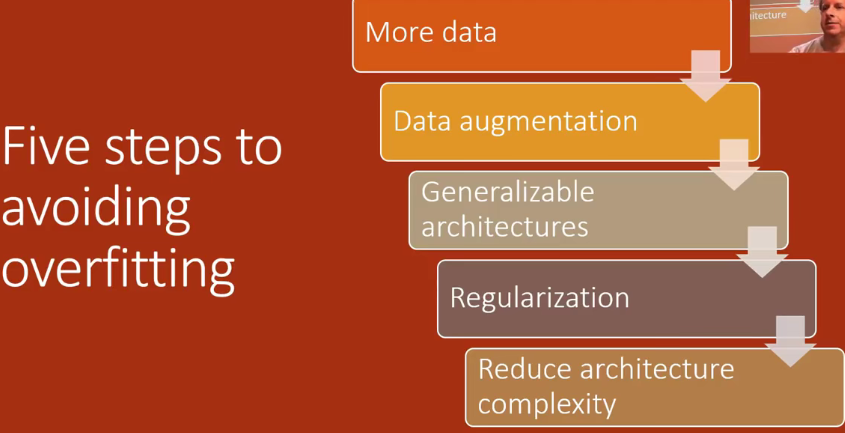

# lesson8

- 2019年视频地址：https://course19.fast.ai/videos/?lesson=8
- YouTube lesson8 英文字幕（自动生成），中文字幕（自动翻译，不太好）：https://www.youtube.com/playlist?list=PLWP4UZT-7V3Gv9y_dLHzM0A-Ju3EqDP9r
- 哔哩哔哩 视频地址：https://www.bilibili.com/video/BV1yx411d7aL?from=search&seid=4827352682218845364&spm_id_from=333.337.0.0
- 笔记参考：https://forums.fast.ai/t/forum-markdown-notes-lesson-8/41896
- 笔记参考：https://github.com/WittmannF/fastai-dlpt2-notes/blob/master/lesson-08.md
- fastai forum论坛 第八课 Links and Updates：https://forums.fast.ai/t/2019-part-2-lessons-links-and-updates/41429
- 笔记本地址：https://nbviewer.jupyter.org/github/fastai/course-v3/tree/master/nbs/dl2/
  - 用Jupyter viewer 效果真的好，github中反而打不开

# 前言

这次的第 2 部分与 2018 年的版本有很大不同。课程名称是“**从基础开始的深度学习**”。我们将学习实现 Fastai 和 PyTorch 中的很多东西。基本上，我们将学习**可以用来构建我们自己的深度学习库**的东西。在此过程中，我们将学习**如何实现论文**，这是制作最先进模型时需要掌握的一项重要技能。

基础，但它基本上意味着从头开始，所以我们将研究基本的矩阵演算，从头开始创建一个训练循环，从头开始创建一个优化器以及许多不同的层和架构等等orth，而不仅仅是创建某种对任何事情都没有用的愚蠢的库，而**是从头开始实际构建一些可以训练尖端世界级模型的东西**，所以这是我们在我之前从未做过的目标，我们认为以前没有人做过这件事，所以我不确切知道我们会走多远，但这是你知道的，这是我们正在进行的旅程，我们将看到我们将如何前进。

因此在此过程中我们将不得不阅读和正确实现论文，因为 Fastai library充满了实施的论文，所以如果你不阅读和实现论文，你将无法做到这一点，我们也将实现大部分 pytorch。正如您将看到的，我们还将更深入地解决一些尚未完全融入 fastai库的应用程序，因此将需要大量自定义工作，因此诸如对象检测、序列seq2seq之类的事情、要使用注意力转换器进行排序、transformer、 excel 循环增益音频之类的东西我会所以要更深入地研究一些性能方面的考虑，比如使用我们编写的新的即时编译器进行**分布式多 GPU 训练**，从现在开始称为 JIT 和 C++ 之类的东西，所以这是前五节课。

最后两节课是用Swift实现其中的一些应用，是Impractical的深度学习。这部分内容与part1相反。

- 第 1 部分是自上而下的，了解如何在实践中使用深度学习，以及如何使用它，以及如何获得结果
- 第 2 部分将自下而上：让您看到各种事物之间的联系。然后你可以针对你自己的问题定制你的算法，做你需要它做的事情。

我们今年改变了，有几个原因：

- ① 发表了如此多论文，这整个领域文献规模增长如此之快，以至于我无法为你挑选出接下来的七周内你真的需要知道的 12 篇论文，因为太多了，而且这也有点毫无意义，因为一旦你进入你意识到**所有的论文几乎都在说同一件事的微小变化**，所以相反，我想要做的是向你展示基础，让你阅读你关心的十二篇论文并意识到，这就是那件事这个小调整，**我现在拥有实现它所需的所有工具，并对其进行测试和试验**，所以这是我们为什么要朝这个方向前进的一个非常关键的问题，而且越来越清楚让你知道我们过去常常将一部分人称为编码人员的尖端技术学习。 
- 深度学习的前沿实际是工程上的，而不只是论文。深度学习中有效率的人与其他人的差别，**就是能用代码做出有用的东西，但这样的人很少**。所以part2是让大家深入实践，能用代码达成work。
- 所以part2是impratical的work，这些平常都是库在做，平常你是不会去做的。
- part1的课程是自上而下，已经能理解上下文了，所以Part2是自下而上的，当您自己从底层构建所有内容时，就可以看到所有不同事物之间的联系，可以看到它们都是您所知道的同一事物的变体，然后您可以进行自定义选择算法 A 或算法 B创建你自己的算法来解决你自己的问题，只做你需要它做的事情，然后你可以确保你知道它表现良好，你可以调试它维护它，因为你理解所有的部分都很正常。


**我们要做什么？**

- 与去年大不相同的第二部分
- 我们将从**基础**（从头开始）实现 fastai 库
  - 基本矩阵演算
  - 训练循环
  - 优化器定制
  - 定制退火
  - 实际上是可以训练世界级模型的地方
- 阅读和实施论文
- 解决在 fastai 库中没有完全支持的应用程序
- 最后，在 Swift 上实现
- 现在的论文太多了
  - 并说同一件事的微小变化
- 展示基础，以便您可以选择 12 篇论文
- 尖端技术实际上是关于工程师的，而不是关于论文的
  - 谁能用代码烘焙那些东西
- 第二部分将更多关于自下而上（带代码）
- 创建您自己的算法来解决您所做的事情。
- **今天我们将用Python从头开始实现矩阵乘法**

## why swift?

- Chris Lattner是独一无二的一个，他建立了世界上最为广泛使用的编译器框架LOVM

- 也为Mac创建了默认的C和C++编译器，clang

- 他创建了也许是世界上增长最快的计算机语言 Swift，现在专注于深度学习
  - 当你真正看到tensorflow之类的内部结构时，看起来TensorFlow是由一群没落的人设计的，而不是编译器人设计的。
  - 所以我一直希望有一种好的数字编程语言，它是由真正掌握编程语言的人构建的，但从来没有发生过
  - Python 这些语言都不是为了擅长数据分析而构建的，它们不是由那些真正深入了解编译器 它们当然不是为我们所处的现代高度并行处理器情况而构建的，但 Swift 是 Swift 是正确的，所以我们遇到了这种独特的情况，您第一次知道一种真正广泛使用的语言。一种从头开始设计得非常好的语言实际上是针对数字编程和深度学习的，所以我不可能错过那条船，我不希望你错过它。
  - 另一种Giulia语言有很大潜力，但是使用人数比Swift少10倍。但是Swift没有同Giulia相同水平的社区，但仍令人兴奋。且Giulia在简练简洁方面走的更远。
  
- 以前的语言都不是为多处理器操作而设计的，由编译器专家设计

- 另一个选择是用于数值编程的**Julia**，它更进一步；所以现在有两个选择。

- (Jeremy) 在圣诞假期期间玩弄 swift 图书馆。
  - 很高兴的发现，我可以从头构建代码，并且代码与最快的手动调参的线性代数库相媲美。
  - Swift简洁高效
  - Chris Lattner本人也将参加最后两节课，来叫大家使用Swift
  - Sift for TensorFlow, S4TF有一些优点和缺点，pytorch也有，二者相反

## Swift和Pytorch的优缺点

- pytorch有好的生态系统和出色的文档、教程，能够很快的get work done，迅速实践并解决问题
- 但S4TF不是，它很少有生态，文档也很少。人们说Swift是一种iPhone编程，但实际上设计精良、功能强大的语言。
- LLVM就是一个编译器，Swift直接与LLVM编译器交流。Swift就是上面的薄薄的一层，当你用 swift 编写东西时，它真的很容易LLVM 喜欢将其编译为超快速优化的代码。
- python翻译为其他语言时，**我尝试编写的内容与实际运行的内容之间的阻抗不匹配使得很难进行我们将要做的那种深入探索**


## what do we mean by from the foundations

重写fastai和很多pytorch的功能：矩阵乘法、torch.nn， torch.optim，还有顶级的数据集加载data loader

我们可以使用python和一些python标准库

#### 规则

- 我们可以使用纯python
- 标准python库
- 非数据科学模块
- pytorch - 仅适用于数组和 rng
- fastai.datasets（用于源材料）
- matplotlib
- 一旦我们重新创建了一个函数，我们就可以在下游使用真实版本

## why?

- 需要真正了解模型中在进行什么，训练中真正发生了什么。你会在接下来的几节课中我们将要做的实验中发现这一点
- 我们实际上会提出一些新的见解，如果你可以自己从头开始创造一些东西并理解它，
- 然后一旦你从头开始创造了一些东西并且你真的理解它，那么你就可以调整。你会突然意识到目标检测、架构和优化器不是像库里的那样完美，而是一堆半任意的特定选择，并且您的特定问题很可能需要一组不同的旋钮和选择。
- 对于那些想要给fastAI开源贡献的人，将了解fastai如何构建的，哪部分运行良好，您知道如何知道如何贡献测试或文档或新功能或创建自己的库，
- 而对于那些有兴趣深入研究的人，您将实施论文，这意味着您将能够将您正在编写的代码与您正在阅读的论文相关联。


## 本门课程有很多机会

- 作业是前沿的
- 实际做人们在观察之前没有做过的实验，很少有深度学习从业者知道你现在所知道，我们正在研究其他人以前没有看过的东西
- 所以请尝试做很多特别是在你的领域领域进行实验
- 并考虑写博客，虽然不够完美，也要写下来。
  - 不要等到完美，才开始沟通。为六个月前的你写下一些东西，那是你的听众。
  - 如果您没有博客，请尝试 medium.com


## part1 回顾

所以我假设你记得第一部分的内容，这里是第一部分的内容 在实践中 你不太可能记住所有这些东西 因为没有人是完美的 所以我实际上希望你做的是我正在做的事情。你在想我不知道他在说什么 你会回去观看关于那件事的视频 **不要只是继续向前推进** 因为我假设你已经知道第一部分的内容。特别是如果你对第一部分的后半部分不太自信，在那里我们更深入地了解什么是真正的激活，什么是真正的参数，它与 SGD 的工作完全一样，特别是在今天的课程中，我假设你真的懂得那些东西，所以如果你没有懂，回去重新看那些视频，从头开始回到像SGD那样的时间，并花点时间。

我设计这门课程是为了让大部分人忙起来，直接忙到下一门课程，所以请随意花时间深入挖掘。

- 对于您没有掌握的主题，请返回上一课。


## ① 过拟合》② 减少过拟合》没有第三步

- 最重要的事情是：尝试确保我们可以训练出好的模型
  - 有三个步骤可以训练得到一个非常好的模型

1. 首先，我们尝试创造比我们需要的容量更大的东西（尝试创建一个复杂模型）

   - 无正则化
   - 过拟合
   - 过拟合意味着你的训练损失低于验证损失 ✘
2. 过拟合并不意味着训练损失低于验证损失

   - 拟合良好的模型，train loss总是低于valid loss
   - ==**过拟合的标志是当您实际看到验证损失valid loss变得更糟时**==，
3. 可视化输入和输出：
   - 看看到底发生了什么

- 第一步通常很容易，但第二步通常很难。

## 避免过拟合的五个步骤

五件事情可以避免过拟合！

1. 更多数据
2. 数据增强
3. 通用架构
4. 正则化
5. 降低架构复杂性

- 大多数初学者从 5 开始，但这应该是最后一个
  - 除非模型太慢

- 它并不是那么难但基本上这五件事你可以按优先级顺序做，如果你可以获得更多数据你应该先做，如果你可以做更多数据增强你应该做，如果你可以使用你也应该使用更通用的架构，然后如果所有这些事情都完成了，那么您可以开始添加正则化，例如dropout或权重衰减，但请记住，此时您正在减少有效效果你的模型的能力，所以正则化不如前三件事好，然后最后降低架构复杂性，大多数人大多数初学者**特别开始降低架构的复杂性，但这应该是你尝试的最后一件事**，除非你的架构太复杂了，对于你的问题来说太慢了，所以这是我们在第     1 部分中学到的我们希望能够做的事情的总结，



## 是时候开始阅读论文了

所以我们将阅读part1中我们没有阅读的论文。阅读论文可能会非常令人生畏。excel 上最简单的计算可能是论文中的一大堆符号。

- 即使是熟悉的东西在论文中看起来也很复杂！
  - 克服对希腊字母的恐惧
- 论文对于超越基础的深度学习很重要，但很难阅读
- 谷歌搜索一篇描述该论文的博客文章
  - 他们不是因为他们出色的沟通清晰度而被选中
  - 通常，博客文章会比论文做得更好
- **提示 1**：学习希腊字母的发音，使方程更平易近人。
- **提示 2**：学习数学符号 - 查看维基百科。Detexify - 使用机器学习来确定您正在查看的符号。这样做的好处是它提供了latex name。

- https://en.wikipedia.org/wiki/List_of_mathematical_symbols
- 或使用[detexify](http://detexify.kirelabs.org/classify.html)

# 课程大纲

## 基本现代  basic modern CNN  model模型的步骤

> 对于接下来的几节课。我们将制作一个合格的 CNN 模型。

- 矩阵乘法 Matmul
- Relu/初始化
- 前向全连接层
- 反向全连接层
- train loop
- Conv
- 优化 Optim
- bacth normalization
- Resnet
  - 我们已经在第 1 部分的最后一课学过了

**今天上课的目标**

- 从矩阵乘法到反向传递


因为我们做到了在上一门课程中，我们已经有了用于创建 ResNet 的层 我们实际上得到了很好的结果 所以我们只需要做好所有这些事情就可以让我们从这里到这里 这只是接下来的几节课我们将走得更远，

- 今天我们将尝试直到正确计算 FC反向传播
- 我们将构建一个接受输入数组的模型，然后我们'重新尝试创建一个简单的全连接网络，这样它就会有一个隐藏层，所以我们将从一些输入开始做矩阵乘法，Matmul--->ReLU--->Matmul--->ReLU-->loss
- 输入->矩阵乘法->ReLU->矩阵乘法->loss，正向传播，计算loss
- 然后计算权重的梯度，然后梯度下降进行参数更新
- 重复多次上述过程

我在这里向您展示的是我将如何在 Jupiter 笔记本中构建我们的库，很多非常聪明的人向我保证，不可能在 Jupiter notebooks 中进行有效的library开发，这是一种耻辱，因为我已经建立了一个library。但是我们的 notebooks 所以无论如何人们会经常告诉你事情是不可能的，但是t我会告诉你我的观点，即我已经编程了 30 多年，在我一直使用的时间里，但是我的开发是一个愚蠢的笔记本，**我猜我的生产力大约提高了两到三倍。**是的，在过去的两三年里，我构建了比之前做的更多有用的东西,所以我会告诉你我们需要如何做一些事情。

我们不能仅仅用我们的整个library创建一个巨大的笔记本 我们必须能够以某种方式提取那些小宝石 我们认为哦这是的那些代码好的，让我们保留它，我们必须将它提取到一个我们可以重用的包中，以便告诉我们的系统这是一个我希望您保留和重用的单元格。

我在单元格的顶部使用这个特殊的评论缓存导出和然后我有一个名为 notebook2script 的程序，它遍历 notebook 并找到那些单元格和将它们放入 Python 模块中，把ipynb转换为py文件。

从[00_exports.ipynb ](https://github.com/fastai/fastai_docs/blob/master/dev_course/dl2/00_exports.ipynb)开始，

## [第00课.ipynb](https://github.com/fastai/fastai_docs/blob/master/dev_course/dl2/00_exports.ipynb)

### 如何从 jupyter 中提取一些代码到一个包中

- 如何在 jupyter 笔记本上构建应用程序，在 Jupyter 笔记本上更高效
  - 使用特殊注释`#export`告诉系统您要保留和重用的单元格。
  - 然后使用`notebook2script.py` 通过程序的文件并找到带有特殊注释的单元格`#export`并将它们放入python模块中。
  - `Path.stem.split("-") `用于输出文件名，因此，输出名称是 undesrcore 之前的第一部分。如果没有下划线，则为全名。
  - 导出的模块转到名为 `exp`
- 然后我们可以使用导入导出的模块 `from exp.nb_00 import *`
- 创建测试框架

  - `test`并`test_eq`使用`assert`
- 用于`run_notebook.py`**在 jupyter notebook 之外运行测试**

  - `python run_notebook.py 01_matmul.ipynb` 在 jupyter notebook 之外运行测试
  - 我们在终端运行时可以看到assert错误
  - 将函数转换为一个命令行界面了
- 现在我们在 jupyter notebook 上有了一个可自动化的单元测试框架
- 触发执行函数

  - fire 的库是一个非常简洁的库，它可以让你使用任何像这样的函数并自动将其转换为命令行界面
  - **它接受任何函数并自动转换 为命令行界面**
  - 函数的输入在命令行中转换为参数
- 笔记本是 json 文件。

  - 我们可以导入单元格并使用 jupyter notebook 文件将它们转换为 json 文件
  - SON 加载期间是最简单的方法，特别是我在 jupiter notebooks 中构建了我的 jupiter notebook 基础设施。
  - 这是一个非常好的环境，可以让你的东西自动化并在上面运行脚本之类的东西，所以这就是全部这是我们开发基础设施的全部内容
- **使用笔记本进行单元测试的好处**：有上下文信息，如果测试失败，你可以检查每个输入和输出 这是修复那些失败测试的一个非常好的方法。

## Notebook 01 矩阵乘法（文件[01_matmul.ipynb](https://github.com/fastai/fastai_docs/blob/master/dev_course/dl2/01_matmul.ipynb)）

- 有一些标准库的部分，但numpy不允许

  - 将
  - 将自动重新加载外部引用或文件
  - 并将在特定的时间间隔内这样做
  - 将在笔记本中绘制
  - matplotlib`mpl`将使用灰度，因为我们将使用 MNIST
  
  ### 获取数据
  
  - 导入 mnist, 将 mnist 提取到 train 和 y 对 numpy 数组有效
  - 将 numpy 数组转换为张量（不允许使用 np）
  - 张量以前是从 pytorch 导入的
  - 从训练数据中获取列数和行数
  - 一些可视化和统计数据
  - 从上面做一些明显的测试

```python
  %load_ext autoreload
  %autoreload 2
  
  %matplotlib inline
  mpl.rcParams['image.cmap'] = 'gray'
  #export
  
  # standard libraries
  from pathlib import Path
  from IPython.core.debugger import set_trace
  import pickle, gzip, math, torch, matplotlib as mpl
  import matplotlib.pyplot as plt
  
  # datasets
  from fastai import datasets
  
  # basic pytorch
  from torch import tensor
  
  MNIST_URL='http://deeplearning.net/data/mnist/mnist.pkl'
```
### 下载 mnist 数据集并加载

```python
path = datasets.download_data(MNIST_URL, ext='.gz'); path

# unzips the download
with gzip.open(path, 'rb') as f:
    ((x_train, y_train), (x_valid, y_valid), _) = pickle.load(f, encoding='latin-1')
```
numpy不允许使用，所以使用python的map，映射为tensor格式，pytroch的tensor是个不错的选择。
```python
# maps the pytorch tensor function against each
# of the loaded arrays to make pytorch versions of them
x_train,y_train,x_valid,y_valid = map(tensor, (x_train,y_train,x_valid,y_valid))

# store the number of 
# n = rows
# c = columns
n,c = x_train.shape

# take a look at the values and the shapes
x_train, x_train.shape, y_train, y_train.shape, y_train.min(), y_train.max()
```


```python
(tensor([[0., 0., 0.,  ..., 0., 0., 0.],
         [0., 0., 0.,  ..., 0., 0., 0.],
         [0., 0., 0.,  ..., 0., 0., 0.],
         ...,
         [0., 0., 0.,  ..., 0., 0., 0.],
         [0., 0., 0.,  ..., 0., 0., 0.],
         [0., 0., 0.,  ..., 0., 0., 0.]]),
 torch.Size([50000, 784]),
 tensor([5, 0, 4,  ..., 8, 4, 8]),
 torch.Size([50000]),
 tensor(0),
 tensor(9))
```

### 让我们测试我们的输入数据

1. **行检查**：检查行数`x_train`是否与形状相同，`y_train`并且该数字应为 50,000
2. **列检查**：检查列数是否为**28\*28，**因为这是展开图像的总像素数
3. **类检查**：测试是否在`y_train`0 - 9 中找到了 10 个不同的类

```python
assert n==y_train.shape[0]==50000
test_eq(c,28*28)
test_eq(y_train.min(),0)
test_eq(y_train.max(),9)
```
偷看其中一张图片
```python
img = x_train[0]
img.view(28,28).type()
```

```python
'torch.FloatTensor'
```


```python
# note that there is a single vector that is reshaped into the square format
plt.imshow(img.view((28,28)));
```

## 初始模型

我们将首先尝试线性模型：

Y=W^T X+b 将是我们将尝试的第一个模型。我们将需要以下内容：

- `w`: 重量
- `b`：基线或偏差

```python
weights = torch.randn(784,10)
bias = torch.zeros(10)
```

###  矩阵乘法

我们将经常这样做，所以熟悉这一点很好。有一个很棒的网站`matrixmultiplication.xyz`，它会说明矩阵乘法的工作原理。

**矩阵乘法函数**: 以下函数将两个数组逐个相乘

```python
def matmul(a,b):
    
    # gets the shapes of the input arrays
    ar,ac = a.shape # n_rows * n_cols
    br,bc = b.shape
    
    # checks to make sure that the
    # inner dimensions are the same
    assert ac==br
    
    # initializes the new array
    c = torch.zeros(ar, bc)
    
    # loops by row in A
    for i in range(ar):
        
        # loops by col in B
        for j in range(bc):
            
            # for each value
            for k in range(ac): # or br
                c[i,j] += a[i,k] * b[k,j]
    return c
```

#### 让我们做一个快速示例

将使用验证数据中的前 5 张图像并将它们乘以矩阵的权重

```python
m1 = x_valid[:5]
m2 = weights
m1.shape, m2.shape
```

```
(torch.Size([5, 784]), torch.Size([784, 10]))
```

#### 将计时操作

```python
%time t1=matmul(m1, m2)
```

```python
CPU times: user 605 ms, sys: 2.21 ms, total: 607 ms 
Wall time: 606 ms
```

```python
t1.shape
torch.Size([5, 10])
```

### 我们怎样才能更快地做到这一点？

我们可以通过逐元素操作来做到这一点。我们将使用 pytorch 的张量来说明这一点。使用 pytorch 对象时，操作符 (+,-,*,/,>,<,==) 通常是逐元素的。按元素操作的示例：

```python
a = tensor([10., 6, -4])
b = tensor([2., 8, 7])
m = tensor([[1., 2, 3], [4,5,6], [7,8,9]]); 
a, b, m
```

```
(tensor([10.,  6., -4.]), tensor([2., 8., 7.]), tensor([[1., 2., 3.],
         [4., 5., 6.],
         [7., 8., 9.]]))
```

```python 
# Addition
print(a + b)
# comparisons
print(a < b)
# can summarize
print((a < b).float().mean())
# frobenius norm 范数计算
print((m*m).sum().sqrt())
```

```
tensor([12., 14.,  3.])
tensor([0, 1, 1], dtype=torch.uint8)
tensor(0.6667)
tensor(16.8819)
```

#### 如果我们调整 matmul

```python
for k in range(ac): # or br
    c[i,j] += a[i,k] * b[k,j]
```

将被替换

```python
c[i,j] = (a[i,:] * b[:,j]).sum()
```

```python
def matmul(a,b):   
    # gets the shapes of the input arrays
    ar,ac = a.shape # n_rows * n_cols
    br,bc = b.shape 
    # checks to make sure that the
    # inner dimensions are the same
    assert ac==br
    # initializes the new array
    c = torch.zeros(ar, bc) 
    # loops by row in A
    for i in range(ar):  
        # loops by col in B
        for j in range(bc): 
            c[i,j] = (a[i,:] * b[:,j]).sum()
    return c
```
性能改变后，乘法要快得多

```python
%time t1=matmul(m1, m2)
```

```python
CPU times: user 1.57 ms, sys: 864 µs, total: 2.44 ms
Wall time: 1.57 ms
```

为了测试它，我们将编写另一个函数来比较矩阵。原因是由于数学运算的舍入误差，矩阵可能不完全相同。因此，我们希望有一个功能，将“是等于B**一定误差内的**”

```python
#export
def near(a,b): 
    return torch.allclose(a, b, rtol=1e-3, atol=1e-5)

def test_near(a,b): 
    test(a,b,near)
```

```python
test_near(t1, matmul(m1, m2))
```
### 广播

广播描述了在算术运算期间如何处理具有不同形状的数组。术语广播首先由 Numpy 使用。


我们如何才能做到 a > 0？0 正在**广播**以具有与 a 相同的维度。

例如，您可以使用广播通过从整个数据集（矩阵）中减去均值（一个标量）并除以标准差（另一个标量）来标准化我们的数据集。

#### 示例：针对矩阵广播向量

您可以使用特殊值进行索引`[None]`或用于`unsqueeze()`将一维数组转换为二维数组（尽管其中一个维度的值为 1）。这在稍后在建模中使用矩阵乘法时很重要

我们并没有真正复制，看起来我们复制了，但实际上step=0。

### squeeze和unsqueeze的不同

- unsqueeze是将一维扩展为2维，注意tensor的不同

```python
c = tensor([10., 20, 30])
c
-------
tensor([10., 20, 30])

c.unsqueeze(0)#
---
tensor([[10., 20., 30.]])

c.unsqueeze(1)
---
tensor([[10.],
        [20.],
        [30.]])

c.shape, c.unsqueeze(0).shape,c.unsqueeze(1).shape
----
(torch.Size([3]), torch.Size([1, 3]), torch.Size([3, 1]))
```


### 回到我们的函数

让我们利用广播并减少`matmul`函数中的循环：

**`a[i,:]`** 查看 1 级张量

**`.unsqueeze(-1)`**使它成为 2d，这`-1`意味着最后一个维度

**`\* b`** 广播结束 `b`

**`.sum(dim=0)`** 沿第一个轴求和

```python
def matmul(a,b):
    # gets the shapes of the input arrays
    ar,ac = a.shape # n_rows * n_cols
    br,bc = b.shape
    # checks to make sure that the
    # inner dimensions are the same
    assert ac==br  
    # initializes the new array
    c = torch.zeros(ar, bc) 
    # loops by row in A
    for i in range(ar):
        c[i] = (a[i].unsqueeze(-1) * b).sum(dim=0)
    return c
```

```python
%time t1=matmul(m1, m2)
```

```python
CPU times: user 440 µs, sys: 283 µs, total: 723 µs
Wall time: 421 µs
```

```python
test_near(t1, matmul(m1, m2))
```
### 广播规则

由于多维广播可能很复杂，因此请务必遵循一些规则

在对两个数组/张量进行操作时，Numpy/PyTorch 会按**元素**比较它们的形状。它从**尾随的维度**开始，然后向前推进。当两个维度**兼容**时

- 他们是平等的，或者
- 其中之一是 1，在这种情况下，该维度被广播以使其大小相同

数组不需要具有相同的维数。例如，如果您有一个 256 *256* 3 个 RGB 值数组，并且您想将图像中的每种颜色缩放不同的值，则可以将图像乘以具有 3 个值的一维数组。根据广播规则排列这些数组的尾随轴的大小，表明它们是兼容的：

## 爱因斯坦求和

爱因斯坦求和 ( `einsum`) 是以一般方式组合乘积和总和的紧凑表示。从 numpy 文档：

下标字符串是一个逗号分隔的下标标签列表，其中每个标签指的是对应操作数的一个维度。每当一个标签被重复时，它就会被求和，所以`np.einsum('i,i', a, b)`等价于`np.inner(a,b)`。如果一个标签只出现一次，它不会被求和，所以`np.einsum('i', a)`会产生一个没有变化的视图。”

```python
c[i,j] += a[i,k] * b[k,j]
c[i,j] = (a[i,:] * b[:,j]).sum()
```

考虑一些重新排列，将目标向右移动，并去掉名称

```python
a[i,k] * b[k,j] -> c[i,j]
[i,k] * [k,j] -> [i,j]
ik,kj -> [ij]
```

```python
# c[i,j] += a[i,k] * b[k,j]
# c[i,j] = (a[i,:] * b[:,j]).sum()
def matmul(a,b): return torch.einsum('ik,kj->ij', a, b)
```
```python
%timeit -n 10 _=matmul(m1, m2)
```

```python
47.7 µs ± 4.04 µs per loop (mean ± std. dev. of 7 runs, 10 loops each)
```
#### 性能注意事项

不幸的是，在 einsum 中隐藏了另一种非常高性能的语言。目前，人们对高性能语言有很多兴趣和发展。这是为称为“halide”的语言所做的一些工作的链接

[http://halide-lang.org/ 9](http://halide-lang.org/)

#### pytorch opUnfo

我们加快了速度，但而且                                                                                                                                                                                                                                                                                                                                                                                                     pytorch 操作得到了更多优化。即使使用矢量化操作，也有处理内存的缓慢和快速方法。不幸的是，大多数程序员无法访问这个，缺少使用`BLAS`库中提供的函数（基本线性代数子程序）

要查找的主题：张量理解

```python
%timeit -n 10 t2 = m1.matmul(m2)
```

```python
14 µs ± 4.44 µs per loop (mean ± std. dev. of 7 runs, 10 loops each)
```

```python
t2 = m1@m2
```

```python
!python notebook2script.py lesson82.ipynb
```

```python
Converted lesson82.ipynb to nb_lesson82.py
```
|                  | CPU矩阵乘法时间消耗 |      |
| ---------------- | ------------------- | ---- |
| 三个循环         | 330ms               |      |
| pytorch矩阵点乘  | 709us               |      |
| pytorch 广播乘法 | 289us               |      |
| 爱因斯坦求和     | 16.6us              |      |

## 数据归一化

```python
#export
from exp.nb_01 import *

def get_data():
    path = datasets.download_data(MNIST_URL, ext='.gz')
    with gzip.open(path, 'rb') as f:
        ((x_train, y_train), (x_valid, y_valid), _) = pickle.load(f, encoding='latin-1')
    return map(tensor, (x_train,y_train,x_valid,y_valid))

def normalize(x, m, s): return (x-m)/s

x_train,y_train,x_valid,y_valid = get_data()
train_mean,train_std = x_train.mean(),x_train.std()
train_mean,train_std
----(tensor(0.1304), tensor(0.3073))

x_train = normalize(x_train, train_mean, train_std)
# NB: Use training, not validation mean for validation set
x_valid = normalize(x_valid, train_mean, train_std)

train_mean,train_std = x_train.mean(),x_train.std()
train_mean,train_std
----(tensor(3.0614e-05), tensor(1.))

(tensor(3.0614e-05), tensor(1.))
#export
def test_near_zero(a,tol=1e-3): assert a.abs()<tol, f"Near zero: {a}"
    
test_near_zero(x_train.mean())
test_near_zero(1-x_train.std())

```


# 第8课制作Relu/初始化

```python
%load_ext autoreload
%autoreload 2

%matplotlib inline
```
```python
The autoreload extension is already loaded. To reload it, use:
  %reload_ext autoreload
```
```python
  %reload_ext autoreload
#export
from exp.nb_lesson81 import *
from exp.nb_lesson82 import *

def test(a,b,cmp,cname=None):
    if cname is None: cname=cmp.__name__
    assert cmp(a,b),f"{cname}:\n{a}\n{b}"

def near(a,b): 
    return torch.allclose(a, b, rtol=1e-3, atol=1e-5)

def test_near(a,b): 
    test(a,b,near)
    

def get_data():
    """
    Loads the MNIST data from before
    """
    path = datasets.download_data(MNIST_URL, ext='.gz')
    with gzip.open(path, 'rb') as f:
        ((x_train, y_train), (x_valid, y_valid), _) = pickle.load(f, encoding='latin-1')
    return map(tensor, (x_train,y_train,x_valid,y_valid))

def normalize(x, m, s): 
    """
    Normalizes an input array
    Subtract the mean and divide by standard dev
    result should be mean 0, std 1
    """
    return (x-m)/s

def test_near_zero(a,tol=1e-3): 
    assert a.abs()<tol, f"Near zero: {a}"
```
#### 加载 MNIST 数据并标准化

### 向前和向后传球

- x train, y train, xy 获取数据
- 得到标准偏差
- 使用标准偏差归一化
- 注意使用训练集的均值和标准差去normalize验证集                                                      
- 这样做意味着接近于零，标准接近于 1
- 测试函数是否真的标准化
- n,m 得到 xtrain 形状
- c 输出大小

```python
# load the data
x_train, y_train, x_valid, y_valid = get_data()

# calculate the mean and standard deviation
train_mean,train_std = x_train.mean(),x_train.std()
print("original mean and std:", train_mean,train_std)

# normalize the values
x_train = normalize(x_train, train_mean, train_std)
x_valid = normalize(x_valid, train_mean, train_std)

# check the updated values
train_mean,train_std = x_train.mean(),x_train.std()
print("normalized mean and std:", train_mean, train_std)
```
```python
original mean and std: tensor(0.1304) tensor(0.3073)
normalized mean and std: tensor(0.0001) tensor(1.)
```
```python
# check to ensure that mean is near zero
test_near_zero(x_train.mean())

# check to ensure that std is near zero
test_near_zero(1-x_train.std())
```
### 看一下训练数据

注意训练集的大小

```python
n,m = x_train.shape
c = y_train.max()+1
n,m,c
```
```python
(50000, 784, tensor(10))
```
# 我们的第一个模型

我们的第一个模型将有 50 个隐藏单元。它还将有两个隐藏层：

1. 第一层 ( `w1`): 将是`input_shape`x 的大小`hidden units`
2. 第二层 ( `w2`): 将是大小`hidden units`

```python
# our linear layer definition
def lin(x, w, b):
    return x@w + b

# number of hidden units
nh = 50

# initialize our weights and bias
# standard xavier init / he init
w1 = torch.randn(m,nh)/math.sqrt(m)
b1 = torch.zeros(nh)

w2 = torch.randn(nh,1)/math.sqrt(nh)
b2 = torch.zeros(1)
```
定义模型

- 模型有一个隐藏层
- 基础版
- 基础架构
- 隐藏层数 nhis 50
- 两层是两个权重和偏置矩阵
- w1 是随机值除以 m 的平方根
- b 是零
- w2 是随机值 (nh,1) 除以 nh 的数学平方
- t 是三个向量的线性
- 除以平方根 m 然后张量具有较低的值
- 简化kaiming初始化，写了一篇关于它的论文
- 测试均值和重量标准 1
- 训练时真正重要的事情
- **[1] Fixup 初始化：** [https ](https://arxiv.org/abs/1901.09321)**:** [//arxiv.org/abs/1901.09321](https://arxiv.org/abs/1901.09321)
  - 带有 10000 层的纸，只需仔细初始化
- 如何进行初始化，真的很重要
- 花很多时间在这上面深入
- 第一层由relu定义
- relu 是 grag 数据并将 min 钳制到 z （将负数替换为零）
- 尝试在 pytorch 上找到内部函数
- 不幸的是没有均值零和标准差为 1
- 示范
  - 数据分布
  - 然后把所有东西都拿小了然后拿出来
  - 显然意思和标准是不同的 

## 获得标准化权重

如果我们希望我们的权重同样在 0 和 1 之间。我们将除以这些不同的因素，以便输出也应该有一个均值 0 和标准差 1。这通常用 kaiming normal 来完成，但我们通过除法来近似它由 sqrt

```python
t = lin(x_valid, w1, b1)
print(t.mean(), t.std())
```
```python
tensor(-0.0155) tensor(1.0006)
```
- 权重w1初始化为随机初始化，均值为0，标准差为1.
- 但是x_valid经x_train 归一化normalization之后，再与W1相乘积之后，均值为0，标注差还是1.
- 就应该是这样的，一维我们使用了xavier init

### 初始化问题——kaiming init

- 希望权重初始化时 仍然是较小的数值，如∈[0,1]。**权重初始化为小一些的值**
- 大型网络，如1万层，没有归一化，但是进行了仔细的初始化。网络能继续训练
  - 1cycle训练中呈现超级收敛，也是在于前几次训练中学习率先升后降，所以与初始化有关。

初始化权重很重要。示例：使用非常具体的权重初始化训练大型网络[https://arxiv.org/abs/1901.09321 5](https://arxiv.org/abs/1901.09321). 事实证明，即使在单周期训练中，那些第一次迭代也非常重要。我们会回到这个

>**这可能看起来是一个非常小的问题，但是作为我们将在接下来的几节课中看到它就像训练神经网络时重要的事情，**实际上在过去的几个月里人们真的注意到这有多么重要，有修复初始化之类的事情。这些人实际上训练了一个没有归一化层的 10,000 层深度神经网络，基本上只是通过仔细的初始化，所以现在人们真的花了很多时间思考，==我们如何初始化真的很重要==，你知道我们已经有了很多诸如单循环训练和超级收敛之类的成功，这与前几次迭代中发生的事情有关，**事实证明这完全与初始化有关**，因此我们将花费大量时间深入研究这一点，

### 我们的 ReLu（整流线性单元）

```python
def relu(x):
    """
    Will return itself, unless its below 0
    then will return 0
    """
    return x.clamp_min(0.)
```
#### 检查均值 0 std 1

这不会是真的，因为所有负值都将更改为 0，因此均值不会为零，并且 std 也会发生变化

ReLU改变了隐藏层激活元的均值和方差，因为非线性截断了。

**我可以通过多种方式编写此代码，但是如果您可以使用类似于 pytorch 中的单个函数的东西来实现它，它几乎总是更快，因为通常用 C 编写的东西**

```python
t = relu(lin(x_valid, w1, b1))
print(t.mean(), t.std())
```
```python
tensor(0.3896) tensor(0.5860) # xavier init 初始化后，x_valid后的均值和方差，偏离1太远
```
- 由于是xavier init，W1*X后均值为0，标准差为1.
  - 但是经过relu之后，去掉了负数，所以均值和标准差都变了，标准差变为0.5，因为有一半的数据被扔掉了，差不多就是这样。
- 由于ReLU把<0的数值给去掉了，所以ReLU后的激活元们，不再是均值为0，标准差为1了。
- 所以这是**过去几年中最出色的见解之一，也是最非凡的论文之一，它是由我们提到的那个人领导的 2015 年图像网络获奖者的论文**，He Kaiming
- 这充满了伟大的想法，==阅读竞赛获胜者的论文是一个非常非常好的想法==，因为他们往往是你知道普通论文会花一页又一页试图证明，他们做的一个微小的调整为什么应该被接受到欧洲，但==是比赛获胜者有 20 个好主意，只能顺便提一下==

#### 如何处理Relu --> (0,1)

- Imagenet 获奖者论文

- 竞赛优胜者论文有很多好点子。这里介绍了 ReLu、resnet、kaiming 归一化


- 在2.2节，ReLU网络很容易训练；超过8层的网络很难收敛

  > "Rectifier networks are easier to train" 
  >
  > "Very deep models > 8 conv layers have difficulties to converge"

您可能会看到`Glorot`初始化 (2010)。论文很好，影响很大。**在接下来的几节课中，我们实际上将重新实现本文中的大部分内容，**，**他们描述了一个关于如何初始化神经网络的建议**


但是网络变深了以后，梯度会消失的，分母的值太大了。所以ImageNet的人做了一些改变，将6改为了2


```python
# kaiming init / he init for relu
w1 = torch.randn(m,nh)*math.sqrt(2/m)
```
```python
w1.mean(),w1.std()
```

```python
(tensor(0.0003), tensor(0.0506))  
```

```python
t = relu(lin(x_valid, w1, b1))
t.mean(),t.std()
```
### 现在结果更接近于均值 0，标准 1

```python
(tensor(0.5896), tensor(0.8658))  # 经过何凯明的初始化之后，标准差上升了
```
这篇论文值得深入研究。他们解决的另一个有趣的话题是 conv 层非常类似于矩阵乘法


b可能不怎么重要，

然后他们会带您逐步了解整个网络中的方差如何变化。

- ==前向传递是矩阵乘法，后向传递是带有转置的矩阵乘法==。他们最终推荐 sqrt(2 over activations)。现在我们了解了如何归一化权重以及如何计算 kaiming 法线，让我们使用它的 pytorch 版本
- std就变为1了，但是mean仍然为0.5，因为ReLU删除了小于0的激活元。
- 我没有看到任何人在文献中谈论这一点，这是我上周刚刚尝试的东西，这是一种显而易见的东西，不用`max(0,x)`，而是使用`max(-0.5, x)`
- 在我的简短实验中，这似乎有帮助，所以有你可以尝试的另一件事，看看它是否真的有帮助，或者如果我只是想象一些事情，它肯定会让你恢复到正确的平均值，

> fan_in 在前向传播中保留权重方差的幅值
>
> fan_out在反向传播中保留幅值

```python
#export
from torch.nn import init

w1 = torch.zeros(m,nh)
init.kaiming_normal_(w1, mode='fan_out')
t = relu(lin(x_valid, w1, b1))
```
- 这是pytorch的init中的kaiming_normal函数，里面的代码就是sqrt(2/m)
- 基本上它的意思是你除以根 M 或根 NH 因为如果你除以根 M 正如你将在论文的那部分看到的那样我建议你阅读，这将在前向传递期间将方差保持在 1 但如果你使用 NH 它会给你正确的单位方差在向后传递中保持1.
- 那么我们为什么要这样做`fan_out`呢？你是除以`row(m)`还是除以`row(nh)`。因为我们的权重形状是 784 x 50。pytorch 实际上是相反的（50 x 784）。这是如何运作的？

```python
import torch.nn
torch.nn.Linear(m,nh).weight.shape
-----
  torch.Size([50, 784])
```
`doc(torch.nn.Linear(.forward)` ，在pytorch中**`F`**总是指**`torch.nn.functional`**，

```python
...
# Source:   
    @weak_script_method
    def forward(self, input):
        return F.linear(input, self.weight, self.bias)
...
```
`torch.nn.functional.linear??`，我们在文档字符串中看到我们使用以下短语进行转置，**`weight.t()`**这就是维度翻转的原因

```python
@torch._jit_internal.weak_script
def linear(input, weight, bias=None):
    # type: (Tensor, Tensor, Optional[Tensor]) -> Tensor
    r"""
    Applies a linear transformation to the incoming data: :math:`y = xA^T + b`.

    Shape:

        - Input: :math:`(N, *, in\_features)` where `*` means any number of
          additional dimensions
        - Weight: :math:`(out\_features, in\_features)`
        - Bias: :math:`(out\_features)`
        - Output: :math:`(N, *, out\_features)`
    """
    if input.dim() == 2 and bias is not None:
        # fused op is marginally faster
        ret = torch.addmm(torch.jit._unwrap_optional(bias), input, weight.t())
    else:
        output = input.matmul(weight.t())	# 所以是转置了的，pytorch中的权重矩阵是反的 
        if bias is not None:
            output += torch.jit._unwrap_optional(bias)
        ret = output
    return ret
```
### pytorch如何初始化线性层和卷积层的呢？

```python
torch.nn.Conv2d??
```

```python
torch.nn.modules.conv._ConvNd.reset_parameters??
```

所以卷积层的初始化操作：请注意，它除以**math.sqrt(5)**，结果不是很好。

用的是kaiming_uniform这是普通的kaiming_norm基本相同，但是$\sqrt{5}$，这个$\sqrt{5}$貌似没有文献记录的有，这个$\sqrt{5}$ ==seems to work pretty badly==，所以看源代码是非常有用的。

```python
# Source:
    def reset_parameters(self):
        n = self.in_channels
        # 请注意，它除以math.sqrt(5)，结果不是很好。
        init.kaiming_uniform_(self.weight, a=math.sqrt(5)) # 初始化用的是kaiming_uniform
        if self.bias is not None:
            fan_in, _ = init._calculate_fan_in_and_fan_out(self.weight)
            bound = 1 / math.sqrt(fan_in)
            init.uniform_(self.bias, -bound, bound)
```
### 回到激活函数

现在我们看到均值为零，标准差接近 1

- 我们尝试ReLU-0.5，就是shift一下ReLU之后的值。
- **相当于重新定义了我们新的激活函数**

所以我们要尝试这个东西并从我们的 ReLu 中减去 0.5 所以这样很酷对我们已经设计了我们自己的新激活函数，是**不是很糟糕我不知道，**但就像这样当人们写论文时，你知道**这是一种调整水平 tweak**，总水平就像对一行代码的微小更改可能会很有趣，看看它有多大帮助。

- mean()均值变为了0，似乎对方差也有帮助，方差减少了。
- 这两点说的通，为什么我认为我会看到更好的结果

```python
def relu(x): 
    return x.clamp_min(0.) - 0.5 # 重新定义了我们新的激活函数


for i in range(10):
    # kaiming init / he init for relu
    w1 = torch.randn(m,nh)*math.sqrt(2./m )
    t1 = relu(lin(x_valid, w1, b1))
    print(t1.mean(), t1.std(), '| ')
```
```python
tensor(0.0482) tensor(0.7982) | 
tensor(0.0316) tensor(0.8060) | 
tensor(0.1588) tensor(0.9367) | 
tensor(0.0863) tensor(0.8403) | 
tensor(-0.0310) tensor(0.7310) | 
tensor(0.0467) tensor(0.7965) | 
tensor(0.1252) tensor(0.8700) | 
tensor(-0.0610) tensor(0.7189) | 
tensor(0.0264) tensor(0.7755) | 
tensor(0.1081) tensor(0.8605) | 
```
- 我们有了 init，有了ReLU，有了矩阵乘法，就可以做一个前向传播了

## 我们的第一个模型

在Pytorch中，model也可以是一个function函数，

```python
def relu(x): 
    return x.clamp_min(0.) - 0.5

def lin(x, w, b):
    return x@w + b

def model(xb):
    l1 = lin(xb, w1, b1)
    l2 = relu(l1)
    l3 = lin(l2, w2, b2)
    return l3
```
所以这是我们的模型，它只是一个执行一个线性层的函数，一个ReLU层，和一个linear层，让我们尝试运行它，好吧，在验证集上运行模型需要 8 毫秒，因此它足够快，可以训练
```python
# timing it on the validation set
%timeit -n 10 _=model(x_valid)
-------
6.71 ms ± 456 µs per loop (mean ± std. dev. of 7 runs, 10 loops each)
```
```python
assert model(x_valid).shape==torch.Size([x_valid.shape[0],1])
```
### 损失函数：MSE

一件事情是损失函数，正如我所说，我们现在将通过使用主平方误差来简化事情，尽管这显然是一个愚蠢的想法。我们的模型正在返回大小为 10,000 的东西，但是

我们需要**`squeeze()`**去掉尾随**`(,1)`**, 以便使用 mse。（当然，mse 不是多类分类的合适损失函数；我们很快就会使用更好的损失函数。为了简单起见，我们现在将使用 mse。）

```python
model(x_valid).shape
----------
torch.Size([10000, 1])
```
这里偷懒了，对output进行了squeeze()，很多时候fastai论坛上同学们report code breaks，通常都是因为他们batch size =1，然后调用了squeeze()，就变成了标量，然后就崩溃了。所以在使用squeeze时最好指明维度。
```python
#export
def mse(output, targ): 
    # we want to drop the last dimension
    return (output.squeeze(-1) - targ).pow(2).mean()
```
```python
# converting to float (from tensors)，把这些数值转为float
y_train, y_valid = y_train.float(), y_valid.float()

# make our predictions  计算预测
preds = model(x_train)		# 前向传播
print(preds.shape)			# 计算loss
# check our mse
print(mse(preds, y_train))
-----------
torch.Size([50000, 1])
tensor(22.1963)
```
### 梯度与反向传播

关于矩阵微积分你应该知道多少？这取决于你，但有一篇很好的参考文章：[The Matrix Calculus You need for deep learning](https://explained.ai/matrix-calculus/index.html)

- 你应该学习的一件事是**链式法则**。

#### MSE

如果我们对求导，我们会得到，将其应用到代码中$ （x^2）‘= 2x$ 

```python
#MSE
(output.squeeze(-1) - targ).pow(2).mean()

#MSE grad
inp.g = 2. * (inp.squeeze() - targ).unsqueeze(-1) / inp.shape[0]
# 存储上一层的梯度，因为链式法则中，梯度是要连乘的。
```
### ReLU的梯度

1. 如果输入 >0，则为 True（或 1）
2. 如果输入 <=0，则为 False（或 0）
3. 乘以超时.g（这是梯度

#### 这是反向传播

我们保存中间计算，所以我们不必计算两次。请注意，在计算正向和反向传播时通常不需要损失

```python
def mse_grad(inp, targ): 
    # grad of loss with respect to output of previous layer loss对最后一层的导数
    # the derivative of squared output x^2 => 2x
    inp.g = 2. * (inp.squeeze() - targ).unsqueeze(-1) / inp.shape[0]
    
def relu_grad(inp, out):
    # grad of relu with respect to input activations
    inp.g = (inp>0).float() * out.g

# 线性层的梯度求法：
def lin_grad(inp, out, w, b):
    # grad of matmul with respect to input
    inp.g = out.g @ w.t()
    w.g = (inp.unsqueeze(-1) * out.g.unsqueeze(1)).sum(0)
    b.g = out.g.sum(0)
    # 前向传播
def forward_and_backward(inp, targ):
    # forward pass:
    l1 = inp @ w1 + b1
    l2 = relu(l1)
    out = l2 @ w2 + b2
    # we don't actually need the loss in backward!
    loss = mse(out, targ)
    
        # backward pass:
    mse_grad(out, targ)
    lin_grad(l2, out, w2, b2)
    relu_grad(l1, l2)
    lin_grad(inp, l1, w1, b1)
```
反向传播就是链式法则，只不过节省了中间计算，不必要每次都计算他们。

loss基本上在梯度中没有出现，在反向传播中没有用到。

- 误差反向传播
- 权重通过误差的反向传播来更新


### 测试和比较与`pytorch`版本

```python
orward_and_backward(x_train, y_train)

# Save for testing against later
w1g = w1.g.clone()
w2g = w2.g.clone()
b1g = b1.g.clone()
b2g = b2.g.clone()
ig  = x_train.g.clone()

# =========================================
# PYTORCH version for checking
# =========================================

# check against pytorch's version
xt2 = x_train.clone().requires_grad_(True)
w12 = w1.clone().requires_grad_(True)
w22 = w2.clone().requires_grad_(True)
b12 = b1.clone().requires_grad_(True)
b22 = b2.clone().requires_grad_(True)

def forward(inp, targ):
    # forward pass:
    l1 = inp @ w12 + b12
    l2 = relu(l1)
    out = l2 @ w22 + b22
    # we don't actually need the loss in backward!
    return mse(out, targ)
```
将我们写的与Pytorch的结果进行对比，发现差不多。
```python
loss = forward(xt2, y_train)
loss.backward()
test_near(w22.grad, w2g)
test_near(b22.grad, b2g)
test_near(w12.grad, w1g)
test_near(b12.grad, b1g)
test_near(xt2.grad, ig )
```
## 重构 Refactoring

让我们做一些有意思的重构：

这与`pytorch`API非常相似。对于这些函数中的每一个，我们将前向和后向函数组合在一个类中。Relu 会有自己的前进后退功能

`__call__` 将类视为函数

将所有的层作为一个class，并实现前向传播和反向传播。有了__call__意味着可以将这个类class视为函数。

```python
class Relu():
    def __call__(self, inp):
        self.inp = inp
        self.out = inp.clamp_min(0.)-0.5
        return self.out
    
    def backward(self):
        self.inp.g = (self.inp>0).float() * self.out.g
```
提醒一下，在线性层中，`Lin`我们需要输出相对于权重的梯度和相对于偏差的输出
```python
class Lin():
    def __init__(self, w, b): 
        self.w,self.b = w,b
        
    def __call__(self, inp):
        self.inp = inp
        self.out = inp@self.w + self.b
        return self.out
    
    def backward(self):
        self.inp.g = self.out.g @ self.w.t()
        # Creating a giant outer product, just to sum it, is inefficient!
        self.w.g = (self.inp.unsqueeze(-1) * self.out.g.unsqueeze(1)).sum(0)
        self.b.g = self.out.g.sum(0)
        
class Mse():
    def __call__(self, inp, targ):
        self.inp = inp
        self.targ = targ
        self.out = (inp.squeeze() - targ).pow(2).mean()
        return self.out
    
    def backward(self):
        self.inp.g = 2. * (self.inp.squeeze() - self.targ).unsqueeze(-1) / self.targ.shape[0]
```

让我们也让我们的模型成为一个类。此类中没有使用 pytorch 函数或实用程序

```python
class Model():
    def __init__(self, w1, b1, w2, b2):
        self.layers = [Lin(w1,b1), Relu(), Lin(w2,b2)]
        self.loss = Mse()
        
    def __call__(self, x, targ):
        for l in self.layers: x = l(x)
        return self.loss(x, targ)
    
    def backward(self):
        self.loss.backward()
        
        # iterates through layers
        for l in reversed(self.layers): 
            l.backward()
```
#### 理解反向传播公式


#### 让我们训练

```python
# initialize the gradients
w1.g, b1.g, w2.g, b2.g = [None]*4

# create the model
model = Model(w1, b1, w2, b2)
```
时间消耗还是比较长的
```python
%time loss = model(x_train, y_train)
--------
CPU times: user 274 ms, sys: 44.9 ms, total: 319 ms
Wall time: 59.6 ms
```
### 围绕具有通用功能的通用类进行设计

让我们尝试减少重复代码的数量。这将在通用`module`类中设计。然后对于每个函数，我们将为每个函数扩展基本模块。

- 也将使用`einsum`代替之前的数组操作来加速线性层
- 参数太复杂，太混乱了。
- 创建一个Module的新类

```python
# ============================================
# Base class
# ============================================

class Module():
    def __call__(self, *args):
        self.args = args
        self.out = self.forward(*args)
        return self.out
    
    def forward(self): 
        """ will be implemented when extended"""
        raise Exception('not implemented')
        
    def backward(self): 
        self.bwd(self.out, *self.args)
        
# ============================================
# Relu extended from module class
# ============================================     

class Relu(Module):
    def forward(self, inp): 
        return inp.clamp_min(0.)-0.5
    
    def bwd(self, out, inp): 
        inp.g = (inp>0).float() * out.g
        
# ============================================
# linear layer extended from module class
# ============================================
class Lin(Module):
    def __init__(self, w, b): 
        self.w,self.b = w,b
        
    def forward(self, inp): 
        return inp@self.w + self.b
    
    def bwd(self, out, inp):
        inp.g = out.g @ self.w.t()
        
        # implementing einsum 使用了爱因斯坦求和
        self.w.g = torch.einsum("bi,bj->ij", inp, out.g)
        self.b.g = out.g.sum(0)
        
# ============================================
# MSE extended from module
# ============================================
class Mse(Module):
    def forward (self, inp, targ):
        return (inp.squeeze() - targ).pow(2).mean()
    
    def bwd(self, out, inp, targ): 
        inp.g = 2*(inp.squeeze()-targ).unsqueeze(-1) / targ.shape[0]
        
# ============================================
# Remake the model
# ============================================
class Model():
    def __init__(self):
        self.layers = [Lin(w1,b1), Relu(), Lin(w2,b2)]
        self.loss = Mse()
        
    def __call__(self, x, targ):
        for l in self.layers: x = l(x)
        return self.loss(x, targ)
    
    def backward(self):
        self.loss.backward()
        for l in reversed(self.layers): l.backward()
```
#### 让我们重新计时

```python
w1.g,b1.g,w2.g,b2.g = [None]*4
model = Model()
```
s
```python
%time loss = model(x_train, y_train)
-----------
CPU times: user 294 ms, sys: 11.2 ms, total: 306 ms
Wall time: 44.3 ms
```

```python
%time model.backward()
-------
CPU times: user 454 ms, sys: 92.4 ms, total: 547 ms
Wall time: 174 ms
```
### 没有 Einsum

```python
class Lin(Module):
    def __init__(self, w, b): self.w,self.b = w,b
        
    def forward(self, inp): return inp@self.w + self.b
    
    def bwd(self, out, inp):
        inp.g = out.g @ self.w.t()
        self.w.g = inp.t() @ out.g
        self.b.g = out.g.sum(0)
```
s
```python
w1.g,b1.g,w2.g,b2.g = [None]*4
model = Model()
```
s
```python
%time loss = model(x_train, y_train)

-----------
CPU times: user 280 ms, sys: 33.7 ms, total: 314 ms
Wall time: 45.8 ms
    
------
%time model.backward()
-----
CPU times: user 442 ms, sys: 70.9 ms, total: 513 ms
Wall time: 158 ms
```
### 带有`nn.Linear`和的Pytorch 版本`nn.Module`

```python
from torch import nn

class Model(nn.Module):
    def __init__(self, n_in, nh, n_out):
        super()._0_init__()
        self.layers = [nn.Linear(n_in,nh), nn.ReLU(), nn.Linear(nh,n_out)]
        self.loss = mse
        
    def __call__(self, x, targ):
        for l in self.layers: x = l(x)
        return self.loss(x.squeeze(), targ)
```
s
```python
model = Model(m, nh, 1)
%time loss = model(x_train, y_train)

--------
CPU times: user 280 ms, sys: 36.7 ms, total: 316 ms
Wall time: 40.5 ms
```
s
```python
%time loss.backward()
--------
CPU times: user 183 ms, sys: 6.87 ms, total: 190 ms
Wall time: 33.8 ms
```

