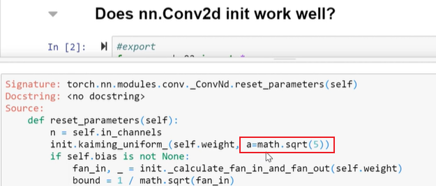

# lesson9 How to train your model

- 2019年视频地址：[https://course19.fast.ai/videos/?lesson=9](https://course19.fast.ai/videos/?lesson=9)
- YouTube lesson9 英文字幕（自动生成），中文字幕（自动翻译，不太好）：https://www.youtube.com/playlist?list=PLWP4UZT-7V3Gv9y_dLHzM0A-Ju3EqDP9r
- 哔哩哔哩 视频地址：[【中文字幕】Fast.ai part 2 (2019) - 深度学习原理 Deep Learning from the Foundations](https://www.bilibili.com/video/BV1yx411d7aL?p=2)
- fastai forum论坛 第9课 Links and Updates：[https://forums.fast.ai/t/2019-part-2-lessons-links-and-updates/41429](https://forums.fast.ai/t/2019-part-2-lessons-links-and-updates/41429)
  - [lesson9 notes](https://forums.fast.ai/t/lesson-9-notes/43094)
  - 笔记参考Great notes [@jimypbr](https://forums.fast.ai/u/jimypbr)：[Fast.ai Lesson 9 Notes: Training in Depth](https://jimypbr.github.io/2020/02/fast-ai-lesson-9-notes-training-in-depth)
  - 笔记参考 from [@Lankinen](https://forums.fast.ai/u/lankinen)：[Fast.ai Lesson 9 notes — Part 2 v3](https://medium.com/@lankinen/fast-ai-lesson-9-notes-part-2-v3-ca046a1a62ef)
  - 笔记参考：[Lesson 9 Notes:](https://github.com/timdavidlee/fastai_dl2019p2)
- 笔记本地址：https://nbviewer.jupyter.org/github/fastai/course-v3/tree/master/nbs/dl2/
  - 用Jupyter viewer 效果真的好，github中反而打不开

# 如何做研究？

- part2 lesson9 **how to train your model**
  - 想让大家知道jeremy是如何进行研究的,以及如何进行软件开发，希望这对您有所帮助。
  - 比如：为什么 PyTorch 使用 5 的平方根作为 Kaiming 初始化？
    - 进入到pytorch的conv2d的初始化参数代码中发现，这个sqrt(5)根本没有任何来源
  - 这很神秘，所以我决定对你知道的研究进行一些研究，这个平方根 5会产生什么影响？ 然后同时尝试与pytorch取得联系，询问他们这个数学点平方根 5 的来源，所以让我向您展示我是如何进行这项研究的。

### 卷积层是如何初始化的？为什么卷积层的初始化能够work?

- 自己版本的测试与Pytorch版本作对比，我们的想法是看看这些方法有何不同。
- 他还测试了不同数字对 Kaiming 初始化结果的影响。
- 我立刻注意到的一件事是 Jeremy 不只是从某个地方读取东西，而是自己测试它们。例如，读取均匀分布的标准偏差很容易，但 Jeremy 只想通过生成随机数并计算标准偏差来找到它。

- 初始化：

