# lesson9 How to train your model

- 2019年视频地址：[https://course19.fast.ai/videos/?lesson=9](https://course19.fast.ai/videos/?lesson=9)
- YouTube lesson9 英文字幕（自动生成），中文字幕（自动翻译，不太好）：https://www.youtube.com/playlist?list=PLWP4UZT-7V3Gv9y_dLHzM0A-Ju3EqDP9r
- 哔哩哔哩 视频地址：[【中文字幕】Fast.ai part 2 (2019) - 深度学习原理 Deep Learning from the Foundations](https://www.bilibili.com/video/BV1yx411d7aL?p=2)
- fastai forum论坛 第9课 Links and Updates：[https://forums.fast.ai/t/2019-part-2-lessons-links-and-updates/41429](https://forums.fast.ai/t/2019-part-2-lessons-links-and-updates/41429)
  - [lesson9 notes](https://forums.fast.ai/t/lesson-9-notes/43094)
  - 笔记参考Great notes [@jimypbr](https://forums.fast.ai/u/jimypbr)：[Fast.ai Lesson 9 Notes: Training in Depth](https://jimypbr.github.io/2020/02/fast-ai-lesson-9-notes-training-in-depth)
  - 笔记参考 from [@Lankinen](https://forums.fast.ai/u/lankinen)：[Fast.ai Lesson 9 notes — Part 2 v3](https://medium.com/@lankinen/fast-ai-lesson-9-notes-part-2-v3-ca046a1a62ef)
  - 笔记参考：[Lesson 9 Notes:](https://github.com/timdavidlee/fastai_dl2019p2)
- 笔记本地址：https://nbviewer.jupyter.org/github/fastai/course-v3/tree/master/nbs/dl2/
  - 用Jupyter viewer 效果真的好，github中反而打不开

# 如何做研究？

欢迎回到第 9 课第 2 部分 **如何训练您的模型，**讨论如何训练我们的模型，尽管我想重温上周出现的一些事情，而我真正想重温它们的原因是因为我**想让您深入了解我是如何进行研究的**。我的意思是，这门课程的很多内容确实会向您展示我如何进行研究，以及如何进行软件开发，希望这对您有所帮助。

- Jeremy 通过展示他如何进行研究来开始这堂课。他试图找到解决方案的问题。为什么 PyTorch 使用 5 的平方根作为 Kaiming 初始化？没有添加任何关于选择的评论。
- **看看它是如何初始化参数的入河，我们发现这里里面包含了点重置参数，我们找到了它进行初始化的方式，我们发现这个数学点平方根** ******5 没有任何注释**，这很神秘，所以我决定对你知道的研究进行一些研究，这个平方根 5会产生什么影响？ 然后同时尝试与pytorch取得联系，询问他们这个数学点平方根 5 的来源，所以让我向您展示我是如何进行这项研究的。

### 卷积层是如何初始化的？为什么卷积层的初始化能够work?

首先，他从获取输入开始。然后，他自己版本的测试与Pytorch版本作对比。我们的想法是看看这些方法有何不同。他还测试了不同数字对 Kaiming 初始化结果的影响。我立刻注意到的一件事是 Jeremy 不只是从某个地方读取东西，而是自己测试它们。例如，读取均匀分布的标准偏差很容易，但 Jeremy 只想通过生成随机数并计算标准偏差来找到它。他的笔记本上写满了这些单行测试。

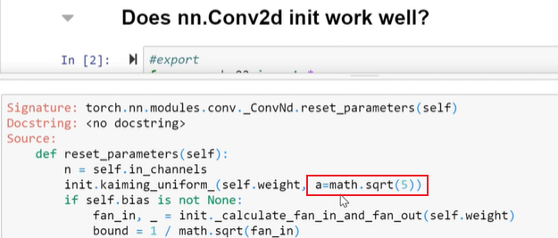

```python
#export
from exp.nb_02 import *

def get_data():
    path = datasets.download_data(MNIST_URL, ext='.gz')
    with gzip.open(path, 'rb') as f:
        ((x_train, y_train), (x_valid, y_valid), _) = pickle.load(f, encoding='latin-1')
    return map(tensor, (x_train,y_train,x_valid,y_valid))

def normalize(x, m, s): return (x-m)/s

torch.nn.Conv2d??
# nn.Conv2d是从ConNd继承而来的，所以调用了基类的构造函数，在基类中调用reset_parameters
torch.nn.modules.conv._ConvNd.reset_parameters??

x_train,y_train,x_valid,y_valid = get_data()
train_mean,train_std = x_train.mean(),x_train.std()
x_train = normalize(x_train, train_mean, train_std)
x_valid = normalize(x_valid, train_mean, train_std)

x_train = x_train.view(-1,1,28,28)
x_valid = x_valid.view(-1,1,28,28)
x_train.shape,x_valid.shape
----(torch.Size([50000, 1, 28, 28]), torch.Size([10000, 1, 28, 28]))

n,*_ = x_train.shape
c = y_train.max()+1
nh = 32
n,c
----(50000, tensor(10))

# torch.nn.Conv2d(in_channels, out_channels, kernel_size, stride=1, padding=0, dilation, groups, bias, padding_mode='zeros')
l1 = nn.Conv2d(1, nh, 5)		# l1是 32*1*5*5的权重矩阵，自动初始化
x = x_valid[:100]
x.shape
---torch.Size([100, 1, 28, 28])
```

- 如果您经常使用某些东西，请制作函数。Jeremy 创建了一个名为**stats(x) 的**函数，它返回输入的均值和标准差。

- https://blog.csdn.net/qq_34243930/article/details/107231539

  - [`nn.Conv2d`：对由多个输入平面组成的输入信号进行二维卷积](https://pytorch.org/docs/master/generated/torch.nn.Conv2d.html#torch.nn.Conv2d)
  - `torch.nn.Conv2d(in_channels, out_channels, kernel_size, stride, padding, dilation, groups, bias, padding_mode)`

  

  

  

```python
def stats(x): return x.mean(),x.std()
l1.weight.shape
----torch.Size([32, 1, 5, 5])

stats(l1.weight),stats(l1.bias)					# 卷积层初始化之后的权重
----
((tensor(-0.0043, grad_fn=<MeanBackward1>),
  tensor(0.1156, grad_fn=<StdBackward0>)),
 (tensor(0.0212, grad_fn=<MeanBackward1>),
  tensor(0.1176, grad_fn=<StdBackward0>)))

stats(x)
---------
(tensor(-0.0363), tensor(0.9602))

t = l1(x)										# 输入经过卷积层之后的结果
stats(t)
----------
(tensor(0.0107, grad_fn=<MeanBackward1>),
 tensor(0.5978, grad_fn=<StdBackward0>))

init.kaiming_normal_(l1.weight, a=1.)			# 使用kaiming初始化之后，标号准差为1
stats(l1(x))
------
(tensor(0.0267, grad_fn=<MeanBackward1>),		# 得到了均值为0，标准差为1
 tensor(1.1067, grad_fn=<StdBackward0>))
```
- 但是Conv2d的标准初始化权重的结果来看，均值不是0，标准差不是1.似乎是一个问题。
- kaiming初始化一般使用在ReLU层之后，或者更多的是Leaky ReLU之后。
  - 2d卷积层经过 kaiming_normal初始化后，经过一个leaky_relu层后，均值和方差 变化情况。均值0.5，方差仍然为1.

```python
import torch.nn.functional as F
def f1(x,a=0): return F.leaky_relu(l1(x),a)
init.kaiming_normal_(l1.weight, a=0)
stats(f1(x))
-------
(tensor(0.5547, grad_fn=<MeanBackward1>),
 tensor(1.0199, grad_fn=<StdBackward0>))
```
- 经过kaiming初始化之后，标准差为1.
- 如下的是，没有经过kaiming初始化，而是Conv2d默认的初始化，可以看出经过ReLU之后(f1(x))，它的标准差更差了。 0.36

```python
l1 = nn.Conv2d(1, nh, 5)
stats(f1(x))
-------
(tensor(0.2219, grad_fn=<MeanBackward1>),
 tensor(0.3653, grad_fn=<StdBackward0>))

```
##### 两个正态分布乘积的理论推导 

https://blog.csdn.net/chaosir1991/article/details/106910668

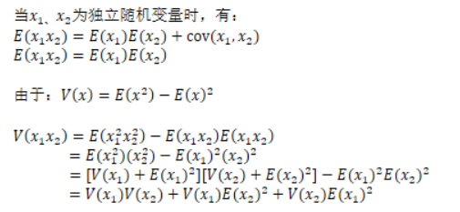

==两个独立的随机变量的乘积的方差为：$D(XY)=D(X)D(Y)+D(X)E(Y)^2+D(Y)E(X)^2$。假设X和Y是独立的标准正太分布，有：$D(XY)=1$。==

- 我们开始尝试写自己的kaiming_normal function。

- 32是滤波器的通道数，滤波器大小为5×5。感受野就是5*5

- 值得一提的是，pytorch的conv2d初始化用的不是Kaiming_normal而是用的kaiming_uniform，前者是正态分布，后者是均匀分布。

  - 均匀分布为[-1,1]上的均匀分布，标准差肯定<1
  - `torch.zeros(10000).uniform_(-1,1).std()
    -----tensor(0.5788)`

  

  - 这种差异的原因是，均匀分布需要一个增益来处理均匀随机数，而不是仅仅是正态随机数。

```python
l1.weight.shape
----
torch.Size([32, 1, 5, 5])

# receptive field size
rec_fs = l1.weight[0,0].numel()
rec_fs
-------25
nf,ni,*_ = l1.weight.shape
nf,ni
------(32, 1)

fan_in  = ni*rec_fs
fan_out = nf*rec_fs
fan_in,fan_out
------(25, 800)

def gain(a): return math.sqrt(2.0 / (1 + a**2))
gain(1),gain(0),gain(0.01),gain(0.1),gain(math.sqrt(5.))
----
(1.0,
 1.4142135623730951,
 1.4141428569978354,
 1.4071950894605838,
 0.5773502691896257)
```
下面是我的kaiming初始化代码，如果是sqrt(5)，就会得到跟pytorch一样的结果，说明我们实现对了

- 均匀分布方差如下所示：【-bound, +bound】的方差为 $\frac{4*\text{bound}^2}{12}=\text{bound}^2/3$


```python
def kaiming2(x,a, use_fan_out=False):
    nf,ni,*_ = x.shape
    rec_fs = x[0,0].shape.numel()
    fan = nf*rec_fs if use_fan_out else ni*rec_fs
    std = gain(a) / math.sqrt(fan)
    bound = math.sqrt(3.) * std	  # 令标准差为sqrt(3) * 1
    x.data.uniform_(-bound,bound) # 令标准差为1
    
kaiming2(l1.weight, a=0);
stats(f1(x))
------
(tensor(0.5603, grad_fn=<MeanBackward1>),
 tensor(1.0921, grad_fn=<StdBackward0>))

kaiming2(l1.weight, a=math.sqrt(5.))
stats(f1(x))
------
(tensor(0.2186, grad_fn=<MeanBackward1>),
 tensor(0.3437, grad_fn=<StdBackward0>))
```
- 做了4个卷积层，使用x_valid，经过4个卷积层后，标准差为0.0065，
- 这听起来很可能这是一个非常大的问题，==因为最后一层的变化很小==，
- ==而且第一层和最后一层之间存在巨大差异，这是真正的大问题==，第一层和最后一层的标准偏差为 0.4
- 输入层是 1，第一个隐藏层是 0.4，最后一层是 0.06，所以这些都以完全不同的速率进行，

```python
class Flatten(nn.Module):
    def forward(self,x): return x.view(-1)
m = nn.Sequential(
    nn.Conv2d(1,8, 5,stride=2,padding=2), nn.ReLU(),
    nn.Conv2d(8,16,3,stride=2,padding=1), nn.ReLU(),
    nn.Conv2d(16,32,3,stride=2,padding=1), nn.ReLU(),
    nn.Conv2d(32,1,3,stride=2,padding=1),
    nn.AdaptiveAvgPool2d(1),
    Flatten(),
)
y = y_valid[:100].float()
t = m(x)
stats(t)
-------
(tensor(0.0875, grad_fn=<MeanBackward1>),
 tensor(0.0065, grad_fn=<StdBackward0>))
```
##### ~~3D卷积是如何计算的？~~  只有2D卷积

https://blog.csdn.net/njuptalex/article/details/110124538


- 计算最后一层的输出与标签y的loss，mse如下。
- 然后反向传播回去，看第一层的权重更新结果，标准差不再是1了，这似乎是一个很大的问题。

```python
l = mse(t,y)
l.backward()
stats(m[0].weight.grad)
--
(tensor(0.0054), tensor(0.0333))
```
- 我们尝试用kaiming初始化代替，看看它的源码
-  std有一个增益，bound那里为$\sqrt{3}$。

```python
init.kaiming_uniform_??
```


- 然后经过每一层，如果是卷积层，使用kaiming_uniform来初始化卷积层的权重，然后把卷积层的偏置置为0.
- 我们自己进行初始化，然后再前向传播

```python
for l in m:
    if isinstance(l,nn.Conv2d):
        init.kaiming_uniform_(l.weight)
        l.bias.data.zero_()
```
- 可以看到标准差为0.4了，虽然不是1，也比前面的0.0065要好多了。
- **所以这是非常令人鼓舞的**，我们可以通过四层卷积层，我们不希望在一个40层的神经网络之后，这个方差损失太多。但对于 4 层网络来说应该足够好了，然后让我们也确认向后和向后第一层的梯度是 0.5，

```python
t = m(x)
stats(t)
------
(tensor(-0.0352, grad_fn=<MeanBackward1>),
 tensor(0.4043, grad_fn=<StdBackward0>))

l = mse(t,y)
l.backward()
stats(m[0].weight.grad)
---
(tensor(0.0093), tensor(0.4231))
```
- 然后我们反向传播回去看一下第一层的权重，发现标准差为0.4.
- 你知道这很令人担忧，为什么我认为这是令人担忧的，我们将看到更多关于它为何令人担忧的信息，我们看看2b.notebook

- **结果：** Jeremy 使用 4 层 convnet 测试 PyTorch 代码，发现在最后一层输出`m(x)`的标准偏差为 0.0060，这是一个问题。因为它与之前的层有很大不同。
- 当他进行反向传播并打印第一层的梯度的标准偏差时`std(m[0].weight.grad)`，也发生了同样的事情。**说明第一层的梯度更新的很少**
- 当他用自己的 PyTorch 版本替换 PyTorch 版本时，最后一层输出`m(x)`的标准偏差为 0.2445。它不是 1，而是比 PyTorch 版本更接近。

## why you need a good init?

- 这本笔记本很短，但很重要。它表明，如果我们将初始化为正态分布的数字 (mean=0;std=1) 相乘甚至 28 次，**它们就会变成 nan，这意味着它们太大了。**
- **如果我们将权重乘以 0.01 会怎样？那么问题是数字变成了零**。
- 答案是除以矩阵列大小的平方根。这样数字就保持在某个范围内。尽管没有多少人熟悉这一点，但它是深度学习中最重要的事情之一。

为了理解为什么初始化在神经网络中很重要，我们将重点关注基本操作：矩阵乘法。所以让我们只取一个 vector`x`和一个`a`随机初始化的矩阵，然后将它们相乘 100 次（好像我们有 100 层）。

```python
x = torch.randn(512)
a = torch.randn(512,512)
for i in range(100): x = a @ x

x.mean(),x.std()
---
(tensor(nan), tensor(nan))
```
您将遇到的问题是激活爆炸：很快，您的激活将变为 nan。我们甚至可以要求循环在第一次发生时中断：
```python
x = torch.randn(512)
a = torch.randn(512,512)
for i in range(100): 
    x = a @ x
    if x.std() != x.std(): break
        
i
------28
```


只需要 27 次乘法！另一方面，如果你用一个太低的比例初始化你的激活，那么你会遇到另一个问题：
```python
x = torch.randn(512)
a = torch.randn(512,512) * 0.01
for i in range(100): x = a @ x
x.mean(),x.std()
---------
(tensor(0.), tensor(0.))
```

- 在这里，每个激活都消失为 0。因此，为了避免这个问题，人们提出了几种策略来初始化他们的权重，例如：

  - 使用标准偏差来确保 x 和 Ax 具有完全相同的尺度
  - 使用正交矩阵来初始化权重（正交矩阵具有保留 L2 范数的特殊属性，因此在这种情况下 x 和 Ax 将具有相同的平方和）
  - 在矩阵 A 上使用[谱归一化](https://arxiv.org/pdf/1802.05957.pdf)（A 的谱范数是最小可能的数 M，`torch.norm(A@x) <= M*torch.norm(x)`因此将 A 除以这个 M 确保你不会溢出。你仍然可以用这个消失）


- 它正在做 100 个矩阵乘法，就在前一个的输出上，你必须是超级的小心地找到一些权重集，因为如果这是你的起始权重集，如果它是 0.01 或者如果它是一个标准偏差，你永远无法学到任何东西，因为没有梯度，**==梯度要么是零要么是 Nan==**，所以你实际上必须有一个合理的起点，**这就是为什么几十年来人们无法训练深度神经网络的原因，因为人们还没有弄清楚如何初始化它们**，所以我们必须在其中使用一些更好的，

- 我们会对于那些感兴趣的人，稍后再谈，仍然有粉丝认为继续描述为什么你必须除以激活元个数的平方根，所以请随意继续阅读，如果你有兴趣，这很酷，但是我们现在不需要知道，**它只是一些推导和进一步的讨论**，所以同时我也向pytorch团队询问了这一点，你知道将这些结果发送给他们，我说发生了什么，所以 sumif 终于出现了，**他说这是一个历史性的意外**，从来没有发表过。已经在torch的代码里面存在了15年。

- 然后在 2014 年的 Google+ 上，他开始与 diliman （现在在deepmind工作）交谈。然后Sander去看了，然后说去看看Paper，最后总结过，这是一个bug，但是是一个好的bug，至少有人去确认了。

- 他已经在某种程度上意识到了这个问题，并且在几个小时内，pytorch团队创建了一个issue，说他们将更新他们的 init，所以这非常酷，所以这显然是在说这是一个很棒的团队超级响应，这就是为什么 pytorch工作如此出色的原因：是他们看到问题并修复它们！

- 但这也意味着当您在库中看到某些东西时，不要认为它是正确的或者解释得通的（ right或者make sense），谈到深度学习，我们谁都不知道我们在做什么，你可以看到挖掘一些东西并不需要太多，然后你能知道提出一个问题并说这是他的分析。

- 我做了有一个很棒的扩展称为 gist it G 不仅仅是这样，Jupiter notebooks 让你把你的小研究笔记本按下一个按钮，它把它变成一个可共享的 gist，然后你可以像我一样放一个链接说这是分析，所以是的这有点有趣 从上周开始我做了一点研究来回答这个问题

- Jeremy 注意到的初始化问题的最终结果是什么？PyTorch 将在不久的将来修复它。Jeremy 确实注意到了一个非常重要的错误，它可能对许多人造成了更糟糕的结果。

  > 有时库可能有错误，人们会犯错误，这就是为什么**总是怀疑一切很重要**。尽可能多地进行测试，而不是期望一切正常。采取额外的步骤，因为当您发现错误时绝对值得。如果没有，至少你学到了一些东西。


### scaling的神奇数字

- Xavier 初始化，他告诉我们应该用 `1/math.sqrt(n_in)` 其中`n_in` 是矩阵的输入个数
- https://blog.csdn.net/shuzfan/article/details/51338178 深度学习——Xavier初始化方法

```python
import math
x = torch.randn(512)
a = torch.randn(512,512) / math.sqrt(512)
for i in range(100): x = a @ x
x.mean(),x.std()
----------
(tensor(-0.0171), tensor(0.9270))
```

- 这个数字确实很有效，但是这个数字`1/math.sqrt(n_in)`与前面的0.01很接近

```python
1/ math.sqrt(512)
0.044194173824159216
```

- y = a @ x的矩阵乘法计算如下：
- $y_{i} = a_{i,0} x_{0} + a_{i,1} x_{1} + \cdots + a_{i,n-1} x_{n-1} = \sum_{k=0}^{n-1} a_{i,k} x_{k}$
- 输入x是N(0,1)的

```python
x = torch.randn(512)
x.mean(), x.std()
(tensor(0.0144), tensor(1.0207))
```

- 注意：这就是为什么在深度学习中规范化输入非常重要的原因，初始化规则的设计输入均值为 0，标准差为 1。
- 标准差计算公式为：$\sigma = \sqrt{\frac{1}{n}\left[(x_{0}-m)^{2} + (x_{1}-m)^{2} + \cdots + (x_{n-1}-m)^{2}\right]}$
- 如果我们返回`y = a @ x`并假设我们选择的权重`a`也具有 0 的均值，我们可以很容易地计算 `y`的标准偏差。由于它是随机的，而且我们可能会遇到错误的数字，因此我们重复该操作 100 次。

```python
mean,sqr = 0.,0.
for i in range(100):
    x = torch.randn(512)
    a = torch.randn(512, 512)
    y = a @ x
    mean += y.mean().item()
    sqr  += y.pow(2).mean().item()
mean/100,sqr/100
--------------
(0.01184942677617073, 516.7942666625977)
```

- 现在看起来非常接近我们矩阵 512 的维度。这不是巧合！当您计算 y 时，您将 a 的一个元素与 x 的一个元素的乘积相加。那么这种点积的均值和标准差是多少呢？我们可以从数学上证明，只要 `a`中和`x`中的元素是独立的，均值是 0，std 是 1。 这也可以通过实验看出：

```python
mean,sqr = 0.,0.
for i in range(10000):
    x = torch.randn(1)
    a = torch.randn(1)
    y = a*x
    mean += y.item()
    sqr  += y.pow(2).item()
mean/10000,sqr/10000
(0.013266791818584533, 0.9896199178691623)
```

- 然后我们将 512 个均值为 0 且均值为 1 的事物求和，因此我们得到均值为 0 且均值为 512 的事物，因此这`math.sqrt(512)`就是我们的magic number 神奇数字。如果我们缩放矩阵的权重`a`并将它们除以 this `math.sqrt(512)`，它将给我们一个`y`比例为 1 的值，并且重复乘积很多次我们想要的不会溢出或消失。

##### Adding ReLUctant in the mix 加入RELU

- 我们可以用 ReLU 重现之前的实验，看看这一次，均值偏移和标准差变为 0.5。这次神奇的数字将是`math.sqrt(2/512)`正确缩放矩阵的权重。

```python
mean,sqr = 0.,0.
for i in range(10000):
    x = torch.randn(1)
    a = torch.randn(1)
    y = a*x
    y = 0 if y < 0 else y.item()
    mean += y
    sqr  += y ** 2
mean/10000,sqr/10000
(0.313308998029304, 0.4902977162997965)
```

- 在整个矩阵乘法上再次运行实验，检查实验结果

```python
mean,sqr = 0.,0.
for i in range(100):
    x = torch.randn(512)
    a = torch.randn(512, 512)
    y = a @ x
    y = y.clamp(min=0)
    mean += y.mean().item()
    sqr  += y.pow(2).mean().item()
mean/100,sqr/100
(9.005213165283203, 257.3701454162598)
```

```python
mean,sqr = 0.,0.
for i in range(100):
    x = torch.randn(512)
    a = torch.randn(512, 512) * math.sqrt(2/512)
    y = a @ x
    y = y.clamp(min=0)
    mean += y.mean().item()
    sqr  += y.pow(2).mean().item()
mean/100,sqr/100
(0.5643280637264252, 1.0055165421962737)
```

- 用神奇数字2来缩放这个系数，我们可以得到1
- 这个2后面的数学有些复杂，可以再kaiming和Xavier的paper里面获取一些intuition 
- The math behind is a tiny bit more complex, and you can find everything in the [Kaiming](https://arxiv.org/abs/1502.01852) and the [Xavier](http://proceedings.mlr.press/v9/glorot10a.html) paper but this gives the intuition behing those results.

### 还有很多其他的初始化方法 


- 理解训练深度神经网络的难点——fluoro的论文
- 何凯明的paper，ReLU
- 好的初始化的重要性 论文。它描述了如何迭代地遍历网络并一次设置一层权重，就像字面意思一样做一些优化以找出哪一组参数在每个点都会为您提供单位方差
- 还有另一篇核心论文讨论了所谓的**正交初始化**
- 我们上周简要讨论了修复初始化，然后还有一种叫做自归一化神经网络的东西，修复fixup和自归一化神经网络self-normalizing nn 都是有趣的论文，因为它们描述了如何尝试设置各种激活函数的组合，并在其中保证单位方差与您喜欢的一样深，这两篇论文都达到了大约一千层的深度和在这两种情况下都成功地训练了它们
- 修复程序是最近的，但在这两种情况下人们都称赞它们是我们可以摆脱batch normalization的原因 **我认为这不太可能是真的** 很少有人使用你现在认为的这个,因为在这两种情况下，它们都非常繁琐，你知道所以例如在自归一化神经网络的情况下，如果你放入 dropout，你需要放入一个correction，如果你知道你是否在更正中做了任何不同的单元，因为一旦你看到了一些变化，比如你的激活函数中的，或者你所知道的关于你的所有假设方差将在下一层消失，对于这篇论文，这是一个特殊的问题，因为它依赖于两个特定的数字，这些数字是在 论文中著名的 96 页长的数学附录中计算的，**所以如果你想做一点不同的你****,****以任何方式了解架构**，直到他们只展示了一个完全连接的网络，所以即使你想做卷积你必须做的事情，你也知道重做 96 页的math，这样 96 页的match现在如此出名，有它的自己的 Twitter 处理您附录中的单元格，其中包含 pin 推文" 为什么没有人想要阅读我?"
- 这就像我将提到的整个 snotty 6 页的附录一样在我看来，**这是找到这两个数字的一********种愚蠢的方法，《**All you need is a good init**》论文**在我看来，这是一种更好的方法来做这些事情，就像你有一对需要设置的参数，那么为什么不使用一个快速的小循环来设置它们，所以如果你需要这些，如果你想找到一种向你推销适用于你的架构的参数，你可以凭经验找到它们很快，很容易

### 关于Pytorch的转置问题

- 我们很快就会回到更多关于上周的另一个问题，为什么pytorch构建的权重矩阵是反的，转置的。
- 问题是为什么，所以我又做了一些深入研究，我去问了一下pytorch的团队，在旧的pytorch代码中向我指出了七年前的这个提交，其中转置确实发生了，基本上是因为旧的pytorch库不把矩阵倒置的话就无法处理批处理矩阵乘法。这就是为什么 pytorch到今天还很高兴的原因，pytorch做到矩阵乘法。
- 它不慢也不是问题，但又是一个有趣的例子，我发现这种情况一直在发生，就像在深度学习中一样，某事永远以特定的方式完成，然后每个人都永远这样做，没有人回过头来说为什么。
- 现在这个特殊案例我不认为这真的无关紧要，但通常它是正确的，**例如我们如何初始化神经网络以及它们应该有多少层之类**的东西，他们有点没有人真正想到过，**就像没有人真正改变挑战多年来的正常做法**，所以我希望通过这种方式，您知道真正的基础方法，您可以了解我们所做的假设是什么，**并了解如何质疑它们**并了解即使对我来说，你也知道 pytorch 是目前最好的库，甚至 pytorch 也有这些奇怪的古老问题。


### 回到构建现代的CNN模型的步骤

- 所以回到我们如何实现基本的现代 CNN 模型，我们已经完成了矩阵乘法，这就是我们的Relu和初始化，ReLU是我们的非线性，所以一个完全连接的网络前向只是将这两件事分层在一起，就像我们是如何做到的，然后我们做了反向传递，我们很好地反映了这一点，结果它看起来很漂亮类似于 pytoch的做事方式，
- 所以现在我们准备好训练我们的模型，这就是我们要做的，所以这里我们进行了三个小批量训练，我们将训练我们的模型，这样我们就可以开始了再次抓住我们的 minst data。我们只是导入我们刚刚从前一个类中导出的东西，这是我们在前一个类中创建的模型，因此可以从该模型中获得一些预测，我们将它们称为 pred OK，现在来训练我们的模型我们需要做的第一件事是我们需要一个损失函数，因为如果没有损失函数，我们现在无法训练它，以前我们使用均方误差，


```
03_minibatch_training.ipynb
```

## 损失函数

首先，我们只是使用我们上次所做的代码创建一个模型。这次我们使用交叉熵，而不是我们上次使用的均方误差作为损失。为了计算交叉熵，我们需要使用我们在第 1 部分学到的 softmax。

- 回想一下，我们使用 MSE 作为损失函数，这对于多分类问题没有意义，但作为教学工具很方便。让我们继续这个并使用适当的损失函数。

```python
mpl.rcParams['image.cmap'] = 'gray'
x_train,y_train,x_valid,y_valid = get_data()

n,m = x_train.shape
c = y_train.max()+1
nh = 50

class Model(nn.Module):
    def __init__(self, n_in, nh, n_out):
        super().__init__()
        self.layers = [nn.Linear(n_in,nh), nn.ReLU(), nn.Linear(nh,n_out)]
        
    def __call__(self, x):
        for l in self.layers: x = l(x)
        return x
model = Model(m, nh, 10)
pred = model(x_train)
```

### 交叉熵损失

https://www.jianshu.com/p/71bd778dfb5a 信息论基础（熵，互信息，交叉熵）


- 我们需要一个合适的 MNIST 损失函数。这是一个多类分类问题，所以我们使用*交叉熵损失*。使用称为**Softmax 函数**的函数计算交叉熵损失：
- 交叉熵首先需要做两件事，首先是 softmax，如果它是多类，首先通过 soft Max 分类交叉熵，然后你做负对数似然
- 我们使用 log softmax 而不是 normal，因为这是 PyTorch 需要的东西。**我们稍后会看到为什么**


- **交叉熵**是一个常用来量化两个概率分布之间差异的函数，这就是为什么我们可以将它用作我们的损失函数。如果我们有“真实”分布，$x_i$，以及估计的分布， $p(z_i)$，交叉熵损失定义为：

  

  当估计分布与真实分布匹配时，它具有最小值。您可以在具有变化的交叉熵图中看到这一点p ( z)

  

```python
def log_softmax(x): return (x.exp()/(x.exp().sum(-1,keepdim=True))).log()
sm_pred = log_softmax(pred)
```

- 需要注意的是，每次One-hot编码，大部分都是0的时候。$x\log(p(x))$大多数都是乘以0，其实你什么都没做。所以每次不是使用One-hot的矩阵乘法，而是像前面的课程中所讲到的那样，使用数组查找。
- 可以写为$-\log(p_i)$，其中i为target的索引
- 这可以使用 numpy 风格的[整数数组索引](https://docs.scipy.org/doc/numpy-1.13.0/reference/arrays.indexing.html#integer-array-indexing)来完成。请注意，PyTorch 支持该链接中讨论的高级索引方法中的所有技巧。

### 如何在Pytorch上实现softmax呢？

- pytorch索引 功能。

```python
y_train[:3]
---------
tensor([5, 0, 4])

sm_pred[[0,1,2], [5,0,4]]
----------
tensor([-2.2674, -2.1714, -2.3043], grad_fn=<IndexBackward>)

y_train.shape[0]
----------
50000
```

```python
def nll(input, target): 
    # input is log(softmax(z))
    # x is 1-hot encoded target, so this simplifies to array lookup.
    return -input[range(target.shape[0]), target].mean()
```
```python
loss = nll(sm_pred, y_train)
loss
---------
tensor(2.3019, grad_fn=<NegBackward>)
```
### softmax实现一：

```python
def log_softmax(x): return (x.exp()/(x.exp().sum(-1,keepdim=True))).log()
```

- 数学计算出来了，我们可以将公式转换为上面的代码。然而，这个实现有几个*大*问题，这意味着这个代码*在实践中不起作用*。
- 指数、对数和浮点数，之地狱!!!
- 在计算机上处理指数需要小心——这些数字可能会变得*非常大*或*非常小*，**而且都是很快变大或者很快变小**。浮点数是实数的有限近似；大多数时候我们可以假装它们的行为像实数，但是当我们开始进入极端值时，这种想法就会崩溃，我们就会面临浮点数的局限性。
- 如果浮点数太大，它将*溢出*，即它将转到`INF`：

```python
np.exp(1) -> 2.718281828459045
np.exp(10) -> 22026.465794806718
np.exp(100) -> 2.6881171418161356e+43
np.exp(500) -> 1.4035922178528375e+217
np.exp(1000) -> inf # oops...
```

- 另一方面，如果浮点数太小，它就会*下溢*，也就是说它会变为零：

```python
np.exp(-1) -> 0.36787944117144233
np.exp(-10) -> 4.5399929762484854e-05
np.exp(-100) -> 3.720075976020836e-44
np.exp(-500) -> 7.124576406741286e-218
np.exp(-1000) -> 0.0 # oops...
```

- 指数的输入甚至不必那么大就可以下溢/溢出。因此我们不能真正相信天真的 softmax 不会因此而崩溃。
- 另一个不太明显的问题是，当对具有极值的浮点数进行运算时，算术可能会停止工作：

```python
np.exp(-10) + np.exp(-100) == np.exp(-10) # wut
np.exp(10) + np.exp(100) == np.exp(100) # wut?
```

- 操作都是在浮点数之间执行，并且会四舍五入。此处数字之间的值差异如此之大，以至于较小的数字被四舍五入并消失 -造成*精度损失*。**这对于softmax公式的分母中的指数之和来说是个大问题**。
- 处理极端数字的解决方案是将所有内容转换为**log空间**，在那里事情更稳定。大量的数值代码是在log空间中实现的，并且有许多将操作转换为log空间的公式/技巧。简单的有：


### softmax实现二：

```python
def log_softmax(x): return x - x.exp().sum(-1,keepdim=True).log()
test_near(nll(log_softmax(pred), y_train), loss)
```
- 如何转换softmax中的指数总和？总和的对数没有很好的公式，所以我们必须留下对数空间，计算总和，然后取它的对数。离开log空间会给我们带来上述所有的麻烦。然而，有一个技巧可以稳定地计算和的对数，称为[LogSumExp 技巧](https://en.wikipedia.org/wiki/LogSumExp)。这个想法是使用以下公式：
- 将一些数字计算为 e 的幂可以大大增加它们。这就是我们要使用 LogSumExp 技巧的原因。[LogSumExp trick](https://en.wikipedia.org/wiki/LogSumExp).


- a是xj中的最大值，减去m能够将数值xj降低到一个足够安全的size，能够留到Log空间去计算求和。
- LogSumExp 技巧中的想法是您可以用某个数字减去 x，然后再将其添加回来。当我们找到最大输入值除以那将确保数字不会变得太大。
- *即使浮点数没有小到下溢，如果浮点数变得足够小，它就会变得“denormalized”。denormalized数字扩展浮点数以获得一些非常接近零的额外值。它们的处理方式与普通浮点数不同CPU 及其性能很**糟糕**，会降低您的代码速度。有关此[问题](https://stackoverflow.com/questions/9314534/why-does-changing-0-1f-to-0-slow-down-performance-by-10x)的更多信息，请参阅此[经典 stackoverflow 问题](https://stackoverflow.com/questions/9314534/why-does-changing-0-1f-to-0-slow-down-performance-by-10x)）。*
- 这是Numerical stabilities的部分，数值稳定性。

### softmax实现三：更好的实现

- PyTorch已经有这样的：`x.logsumexp()`。
- 我们现在可以实现`log_softmax`和`cross_entropy_loss`：

```python
def logsumexp(x):
    m = x.max(-1)[0]
    return m + (x-m[:,None]).exp().sum(-1).log()
# 这样我们可以避免激活元数值太大时，溢出
# This way, we will avoid an overflow when taking the exponential of a big activation. In PyTorch, this is already implemented for us.

test_near(logsumexp(pred), pred.logsumexp(-1))
# So we can use it for our log_softmax function.

def log_softmax(x): return x - x.logsumexp(-1,keepdim=True)
test_near(nll(log_softmax(pred), y_train), loss)
# Then use PyTorch's implementation.
test_near(F.nll_loss(F.log_softmax(pred, -1), y_train), loss)
```

### Basic Training Loop 小批量训练 基本的训练循环

- 现在我们已经完成了损失函数，接下来我们需要一个性能指标。对于分类问题，我们可以使用精度：

```python
def accuracy(out, targ):
	return (torch.argmax(out, dim=1) == targ).float().mean()
```

- 好的，现在我们有一个损失函数，你可以用它来训练，我们也可以定义一个度量metric，因为很高兴看到准确性，看看我们如何”重新开始它，只是更具可解释性，并记住从第一部分开始，准确度只是简单地抓住了 Arg max 确定我们的 softmax 中哪个数字是最高的，以及它的索引是我们的预测，然后检查这是否是等于实际然后我们想要取平均值，但在pytorch中，您不能取 ints整型的平均值，您必须取浮点数的平均值，这很有意义，因此首先将其转换为tensor，这样我们的准确性就可以了，
- 现在我们建立了一个训练循环。（回忆[Fast.ai 第 1 部分中](https://github.com/fastai/course-v3/blob/master/nbs/dl1/lesson2-sgd.ipynb)的训练循环）。

基本训练循环重复以下内容：

1. 在一批输入上获取模型的输出
2. 将输出与目标进行比较并计算损失
3. 计算模型的每个参数的损失梯度
4. 使用这些梯度更新参数，使它们更好一点

训练循环如下所示：

- 计算预测
- 计算损失
- 反向传播
- 用梯度减去学习率
- 零梯度

```python
loss_func = F.cross_entropy
#export
def accuracy(out, yb): return (torch.argmax(out, dim=1)==yb).float().mean()
bs=64                  # batch size

xb = x_train[0:bs]     # a mini-batch from x
preds = model(xb)      # predictions
preds[0], preds.shape
----------- 
(tensor([ 0.0154,  0.2477, -0.0076, -0.1921, -0.0089,  0.0422,  0.0218, -0.0388,
         -0.0303, -0.0328], grad_fn=<SelectBackward>), torch.Size([64, 10]))
# 预测结果为 64×10
```
- 所以让我们检查一下，让我们抓住一批大小64，然后model是一个简单的线性模型，做出越策
- 然后计算loss，计算acc准确度。它大约是 10%，因为我们还没有训练我们的模型，所以我们得到了一个模型，基本上随机一个答案，

```python
# 计算loss
yb = y_train[0:bs]
loss_func(preds, yb)
------------
tensor(2.3076, grad_fn=<NllLossBackward>)

accuracy(preds, yb)
-----------
tensor(0.1719)

```

-  所以让我们训练它 所以我们需要一个学习率 。我们需要选择多个epoch 我们需要一个训练循环 所以我们的训练循环
- 让我们运行它，然后让我们检查损失函数和准确度，损失从 2.3 下降到 0.05，准确度从点 1 2 上升到 1 请注意，这个准确度仅适用于单个小批量，它是训练集中的小批量，所以它并不意味着太多，但显然我们的模型正在学习一些东西，所以这很好。

```python
lr = 0.5   # learning rate
epochs = 1 # how many epochs to train for

for epoch in range(epochs):
    for i in range((n-1)//bs + 1):
#         set_trace()
        start_i = i*bs
        end_i = start_i+bs
        xb = x_train[start_i:end_i]
        yb = y_train[start_i:end_i]
        loss = loss_func(model(xb), yb)

        loss.backward()
        with torch.no_grad():
            for l in model.layers:
                if hasattr(l, 'weight'):
                    l.weight -= l.weight.grad * lr
                    l.bias   -= l.bias.grad   * lr
                    l.weight.grad.zero_()
                    l.bias  .grad.zero_()
                    
loss_func(model(xb), yb), accuracy(model(xb), yb)
---------------
(tensor(0.3465, grad_fn=<NllLossBackward>), tensor(0.9375))
```

**有几点需要注意！**

- 我们需要`torch.no_grad()`在更新权重时使用，因为我们不希望这些影响梯度。在这行代码之后，我们一层一层地运行所有层并更新权重。`hasattr(l,'weight')`将检查该层上是否有权重参数。

- 但是上面的代码太混乱了，我们要摆脱这些混乱。
- 用model中参数属性，来极大的简化代码，而不是每一个层都去遍历，而是只遍历参数部分，这样就会更加灵活。
- 然后我们进行一些重构以使代码更好地泛化到其他任务中。

所以我们要做的第一件事是我们将尝试摆脱这个混乱，我们将用这个替换它，然后这里的区别在于而不是手动进行每个参数的权重和偏差，我们将遍历称为**模型参数**的东西，因此我们甚至不会查看层，我们将直接遍历模型参数，并且对于每个参数都会说参数减去等于梯度乘以学习率。所以不知何故，我们需要成为一个能够获得我们模型的所有参数，如果我们可以的话，我们可以极大地简化循环的这一部分，并使其更加灵活，

- 这样我们就可以创建类似这样的东西，它可以正确地调用这个**虚拟模块**，在虚拟模块中，我要做的是每次我将 l1 或 l2 之类的属性设置为你知道在这种情况下为线性时。我想更新一个名为下划线模块的列表，其中包含所有列表换句话说，在我创建了这个虚拟模块之后，我希望能够打印出来，这是我的表示，我希望能够打印出这些模块的列表并查看那里的模块，因为那时我可以定义一个称为参数的方法，该方法将遍历我的下划线模块列表中的所有内容，然后遍历它们的所有参数，这就是我可以看到的我可以在这里做模型点参数

```python
class Model(nn.Module):
    def __init__(self, n_in, nh, n_out):
        super().__init__()
        self.l1 = nn.Linear(n_in,nh)
        self.l2 = nn.Linear(nh,n_out)
        
    def __call__(self, x): return self.l2(F.relu(self.l1(x)))
    
model = Model(m, nh, 10)
for name,l in model.named_children(): print(f"{name}: {l}")
-----------------
l1: Linear(in_features=784, out_features=50, bias=True)
l2: Linear(in_features=50, out_features=10, bias=True)
    
model
---------------
Model(
  (l1): Linear(in_features=784, out_features=50, bias=True)
  (l2): Linear(in_features=50, out_features=10, bias=True)
)

model.l1
--------------
Linear(in_features=784, out_features=50, bias=True)

```

- 所以我是如何创建这个的，你看它没有继承 fr嗯，这一切都是用**纯 Python** 编写的，我是怎么做到的，所以只要我说这是我的init 中的一个属性，它就以某种方式神奇地出现在这个下划线模块列表中，这样我就可以创建这些参数，**以便然后我可以进行这个重构**，诀窍是 Python 有一个特殊的 `__setattr__` 方法，每次你分配给 python 内部 self 内部的任何东西时，就会调用 `__setattr__` 方法，所以这个方法只是检查我的关键所以换句话说，属性名称不以下划线开头，因为如果这样做，它可能是下划线模块，然后它就像一个递归循环，而且pythons得到了各种以下划线开头的内部内容，只要这不是一些内部私有的东西把那个值放在我的模块字典中并称之为 K 就可以了，然后在你完成超类在设置属性和在 th 中所做的任何事情之后

### 使用参数

- 一旦调用DummyModule的self函数，就会调用 `__setattr__` 方法，然后将属性k的内容都放在我的modules中，也就是之后我们要放的parameters。
- 这与pytorch的nn.module的功能是一样，所以我们不必要自己构建了。
- 这也是pytorch中为什么要首先调用super().__init_()函数，确实是有一些初始化操作要做。

```python
class Model(nn.Module):
    def __init__(self, n_in, nh, n_out):
        super().__init__()
        self.l1 = nn.Linear(n_in,nh)
        self.l2 = nn.Linear(nh,n_out)
        
    def __call__(self, x): return self.l2(F.relu(self.l1(x)))
```


```python
def fit():
    for epoch in range(epochs):
        for i in range((n-1)//bs + 1):
            start_i = i*bs
            end_i = start_i+bs
            xb = x_train[start_i:end_i]
            yb = y_train[start_i:end_i]
            loss = loss_func(model(xb), yb)

            loss.backward()
            with torch.no_grad():
                for p in model.parameters(): p -= p.grad * lr
                model.zero_grad()
fit()
loss_func(model(xb), yb), accuracy(model(xb), yb)
-----------------
(tensor(0.1094, grad_fn=<NllLossBackward>), tensor(0.9375))

# Behind the scenes, PyTorch overrides the __setattr__ function in nn.Module so that the submodules you define are properly registered as parameters of the model.

class DummyModule():
    def __init__(self, n_in, nh, n_out):
        self._modules = {}
        self.l1 = nn.Linear(n_in,nh)
        self.l2 = nn.Linear(nh,n_out)
        
    def __setattr__(self,k,v):
        if not k.startswith("_"): self._modules[k] = v
        super().__setattr__(k,v)
        
    def __repr__(self): return f'{self._modules}'
    
    def parameters(self):
        for l in self._modules.values():
            for p in l.parameters(): yield p
                
mdl = DummyModule(m,nh,10)
mdl
-------------
{'l1': Linear(in_features=784, out_features=50, bias=True), 'l2': Linear(in_features=50, out_features=10, bias=True)}

[o.shape for o in mdl.parameters()]
-----------------
[torch.Size([50, 784]),
 torch.Size([50]),
 torch.Size([10, 50]),
 torch.Size([10])]
```

### 重构2

- 现在方便多了，但还是不够方便。必须为每一层都编写属性并不好 - 如果我们有 50 层怎么办？前向传递也不方便写，如果我们可以循环遍历层会更好。
- 如果我们可以使具有层列表的旧实现在获得`__setattr__`优点的同时工作，那就太好了
- 这整个事情已经在 PyTorch 中完成，它被称为 `nn.Sequential()`

```python
layers = [nn.Linear(m,nh), nn.ReLU(), nn.Linear(nh,10)]
class Model(nn.Module):
    def __init__(self, layers):
        super().__init__()
        self.layers = layers
        for i,l in enumerate(self.layers): self.add_module(f'layer_{i}', l)
            # 这一行还是有点笨重，所以使用pytorch的ModuleList来实现同样的功能
        
    def __call__(self, x):
        for l in self.layers: x = l(x)
        return x
    
model = Model(layers)
model
-------------
Model(
  (layer_0): Linear(in_features=784, out_features=50, bias=True)
  (layer_1): ReLU()
  (layer_2): Linear(in_features=50, out_features=10, bias=True)
)
```

### nn.ModuleList

- ``nn.ModuleList` 为我们提供了列表模型，但也在列表中注册了层，因此我们保留了之前的优秀功能：
- 我们已经实现了等价于`nn.Sequential`，我们现在可以使用它。

```python
class SequentialModel(nn.Module):
    def __init__(self, layers):
        super().__init__()
        self.layers = nn.ModuleList(layers) # 
        
    def __call__(self, x):
        for l in self.layers: x = l(x)
        return x
model = SequentialModel(layers)
model
------------------
Model(
  (layers): ModuleList(
    (0): Linear(in_features=784, out_features=50, bias=True)
    (1): ReLU()
    (2): Linear(in_features=50, out_features=10, bias=True)
  )
)
fit()
loss_func(model(xb), yb), accuracy(model(xb), yb)
--------------
(tensor(0.2131, grad_fn=<NllLossBackward>), tensor(0.9375))
```

### nn.Sequential

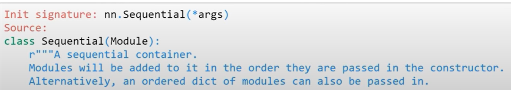

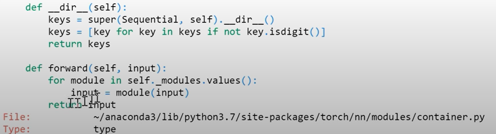

```python
model = nn.Sequential(nn.Linear(m,nh), nn.ReLU(), nn.Linear(nh,10))
fit()
loss_func(model(xb), yb), accuracy(model(xb), yb)
---------------
(tensor(0.2167, grad_fn=<NllLossBackward>), tensor(0.9375))

nn.Sequential??
model
----------------
Sequential(
  (0): Linear(in_features=784, out_features=50, bias=True)
  (1): ReLU()
  (2): Linear(in_features=50, out_features=10, bias=True)
)
```

### Optim

对fit()进一步简化：

- 这就是重构的模型。优化步骤呢？让我们替换我们之前手动编码的优化步骤：
- Jeremy 想通过创建`Optimizer`类来隐藏这部分代码。

```python
# 将如下这些步骤进一步简化：
with torch.no_grad():
    for p in model.parameters(): p -= p.grad * lr
    model.zero_grad()
```

- 而是使用：

```python
opt.step()
opt.zero_grad()
```

- 这抽象了优化算法和实现，让我们在之后交换东西。

  **提示**：让我们创建一个类`Optimizer`来做到这一点。它应该采用参数和学习率并实现`step`和`zero_grad`方法。

```python
class Optimizer():
    def __init__(self, params, lr=0.5): 
        self.params,self.lr=list(params),lr
        
    def step(self):
        with torch.no_grad():
            for p in self.params: p -= p.grad * self.lr

    def zero_grad(self):
        for p in self.params: p.grad.data.zero_()
model = nn.Sequential(nn.Linear(m,nh), nn.ReLU(), nn.Linear(nh,10))
```

训练循环现在是：

```python
opt = Optimizer(model.parameters()) # 将参数传递给Optimizer

for epoch in range(epochs):
    for i in range((n-1)//bs + 1):
        start_i = i*bs
        end_i = start_i+bs
        xb = x_train[start_i:end_i]
        yb = y_train[start_i:end_i]
        pred = model(xb)	# 预测
        loss = loss_func(pred, yb) # loss

        loss.backward()		# 反向传播
        opt.step()			# 参数更新
        opt.zero_grad()		# 梯度归零
```

pytorch中也已经有了相应的代码，为optim.SGD，SGD里面做了很多事情，如Weight decay， Momentum等。

```python
#export
from torch import optim

optim.SGD.step?? # 去看一下optim的SGD里面的step的函数做了哪些事情
```

```python
def get_model():
    model = nn.Sequential(nn.Linear(m,nh), nn.ReLU(), nn.Linear(nh,10))
    return model, optim.SGD(model.parameters(), lr=lr)

model,opt = get_model()
loss_func(model(xb), yb)
------------
tensor(2.3222, grad_fn=<NllLossBackward>)

for epoch in range(epochs):
    for i in range((n-1)//bs + 1):
        start_i = i*bs
        end_i = start_i+bs
        xb = x_train[start_i:end_i]
        yb = y_train[start_i:end_i]
        pred = model(xb)
        loss = loss_func(pred, yb)

        loss.backward()
        opt.step()
        opt.zero_grad()
        
loss,acc = loss_func(model(xb), yb), accuracy(model(xb), yb)
loss,acc
--------------
(tensor(0.0436, grad_fn=<NllLossBackward>), tensor(1.))
```

这是我们的训练循环并且似乎正在工作它是不时进行测试，我喜欢进行这些测试**，嘿，我的准确率应该明显高于** **50%**，请注意，此类随机测试在许多方面都非常不完善，理论上可能会全部失败因为你真的很不走运 我知道虽然这真的是不可能发生的 它总是超过 90%。

你的代码也有可能以某种方式失败，导致准确性比它应该的要低一点但是不是那么低，但我仍然认为在您进行机器学习时进行此类测试是个好主意，因为它们会在出现问题时给您提示，您会注意到我不会在任何时候设置随机种子这是非常有意的，我真的很喜欢它，如果我在不同时间运行模型时发生变化，我想看到它，我不希望它隐藏在固定种子后面，所以有一个很大的推动可复现的科学，reproducable science。 这有很多原因，但它不是你应该如何开发模型 在开发模型时，您希望对哪些位是稳定的，哪些位是不稳定的以及有多少变化有一种良好的直觉认识你期待吗，所以如果你有一个测试，你知道每 100 次失败一次，那么知道你知道是件好事，就像在我编码的第一天有很多这样的测试，然后有时你知道会有一个测试失败 这与刚刚发生的推送没有什么特别的关系，但这对我们真的很有帮助，因为这样我们就可以看看它，就像哦，这个简短的事情有时几乎总是正确的不是真的，然后我们会回去，我们将深入研究为什么会这样，并找出如何使其更稳定以及如何使其可靠地通过该测试，因此这是一种有争议的测试这是我在实践中发现的东西非常非常有用 它不完整，也不是完全自动化的，在很多方面都不完美，但它同样有用，

```python
assert acc>0.7
```

## Dataset and DataLoader

分别迭代 x 和 y 值的小批量很笨拙：

```python
xb = x_train[start_i:end_i]
yb = y_train[start_i:end_i]
```
让我们同时做这两个步骤，引入Dataset类
```python
xb,yb = train_ds[i*bs : i*bs+bs]
```

```python
#export
class Dataset():
    # 纯python 没有从任何地方继承类
    def __init__(self, x, y): self.x,self.y = x,y
    def __len__(self): return len(self.x)
    def __getitem__(self, i): return self.x[i],self.y[i]
    
train_ds,valid_ds = Dataset(x_train, y_train),Dataset(x_valid, y_valid)
assert len(train_ds)==len(x_train)
assert len(valid_ds)==len(x_valid)

xb,yb = train_ds[0:5]
assert xb.shape==(5,28*28)
assert yb.shape==(5,)
xb,yb
-----------------------
(tensor([[0., 0., 0.,  ..., 0., 0., 0.],
         [0., 0., 0.,  ..., 0., 0., 0.],
         [0., 0., 0.,  ..., 0., 0., 0.],
         [0., 0., 0.,  ..., 0., 0., 0.],
         [0., 0., 0.,  ..., 0., 0., 0.]]), tensor([5, 0, 4, 1, 9]))
```
正如我所说，我们将用一行代码替换这两行代码，因此在这一点上，我们的训练循环变得非常整洁，虽然没有想象的那么整洁，但已经变得非常整洁了
```python
model,opt = get_model()
for epoch in range(epochs):
    for i in range((n-1)//bs + 1):
        # 这里用一行代码替换了之前的两行代码
        xb,yb = train_ds[i*bs : i*bs+bs]
        pred = model(xb)
        loss = loss_func(pred, yb)

        loss.backward()
        opt.step()
        opt.zero_grad()
loss,acc = loss_func(model(xb), yb), accuracy(model(xb), yb)
assert acc>0.7
loss,acc
---------
(tensor(0.4507, grad_fn=<NllLossBackward>), tensor(0.8750))
```

所以接下来我们要做的就是数据集接下来我们要做的是创建一个数据加载器

## DataLoader

之前我们的batch(xb,yb)中迭代如下：训练循环之前的样子

```python
for i in range((n-1)//bs + 1):
    xb,yb = train_ds[i*bs : i*bs+bs]
```

然后我们用一行代码来替换：`for xb,yb in train_dl:`

可能很多人都没有见过 yield 之前它是一个非常有用的概念 如果你真的很感兴趣 它是一个相当的共同例程 它基本上是一个非常有趣的想法，你可以拥有一个不只返回一件事的函数一旦它可以返回很多东西，你可以多次要求它，所以这些迭代器在 python 中的工作方式是，当你调用它时，它基本上返回一些东西，然后**==你可以多次调用 next 和每次你调用 next 时，它都会从产生的结果中返回下一个东西，==**所以我没有时间在这里详细解释协程，但它确实值得查找和学习，我们将使用它们很多它们是非常有价值的东西，而且不仅仅是对于数据科学，它们对于诸如网络编程 Web 应用程序之类的东西非常方便，因此非常值得熟悉 Python 中的 yield 并且现在大多数编程语言都有这样的东西,因此您可以将其带到任何地方。

因为我们在没有潜入的情况下做到了非常深入地了解正在发生的事情，从我们的数据集中返回一件事，数据集返回两件事，因为这是我们放入其中的内容，所以我们希望得到两件事，我们可以检查这两件事的大小是否合适。

```python
class DataLoader():
    def __init__(self, ds, bs): self.ds,self.bs = ds,bs
    def __iter__(self):
        for i in range(0, len(self.ds), self.bs): yield self.ds[i:i+self.bs]
            
train_dl = DataLoader(train_ds, bs)
valid_dl = DataLoader(valid_ds, bs)

xb,yb = next(iter(valid_dl))
assert xb.shape==(bs,28*28)
assert yb.shape==(bs,)
plt.imshow(xb[0].view(28,28))
yb[0]
------------
tensor(3)
```

看起来不错所以这与我们将要得到的一样整洁这是非常漂亮的它是您可以想到的所有步骤。通过每个epoch，通过每个batch，获取独立的自变量，计算预测，计算损失，计算梯度，使用学习率更新梯度，重置梯度，这样您就知道您想要到达的位置是你可以以一种非常直观的方式阅读你的代码以挖掘专家，直到你到达那个点，我发现真的很难真正维护代码并理解代码，这是进行研究的技巧以及这不仅仅是因为硬核软件工程 不能对他们的代码做这些事情的研究不能正确地进行研究，因为如果你想到一些你想尝试的东西，你不知道怎么做，或者它需要数周时间，或者如果有你不知道的错误，所以你希望你的代码非常漂亮，我认为这是漂亮的代码，这些数据集和数据加载器与 PI torch 使用的抽象相同，所以让我们深入研究一下。

- **最终简洁的代码如下所示：**

```python
model,opt = get_model()
def fit():
    for epoch in range(epochs):
        for xb,yb in train_dl:
            pred = model(xb)
            loss = loss_func(pred, yb)
            loss.backward()
            opt.step()
            opt.zero_grad()
fit()
loss,acc = loss_func(model(xb), yb), accuracy(model(xb), yb)
assert acc>0.7
loss,acc
(tensor(0.0762, grad_fn=<NllLossBackward>), tensor(0.9844))
```

### Random sampling

- 我们希望我们的训练集采用随机顺序，并且每次迭代的顺序都应该不同。但是验证集不应该是随机的。

  正如我们所做的那样，`DataLoader`我们可以将其实现为一个类，该类采用 a`Dataset`和批量大小，然后覆盖`_iter__`以便它`yields`以随机顺序获取数据集的索引。

我们确实有一个问题，那就是我们总是按顺序循环遍历我们的训练集，这非常有问题，因为我们失去了每次洗牌的随机性，特别是如果我们的训练集已经像按因变量排序那样，那么每个批次都将是完全相同的因变量，所以我们真的想对其进行洗牌，所以让我们尝试随机抽样所以对于随机采样，我将创建一个采样器类，我们将向它传递一个数据集来采样和一个批次大小以及一些说明它是否正确的东西，按照惯例，，我们只存储这些，我实际上并没有存储dataset，我只是存储数据集的长度，以便我们知道有多少item可以采样，然后这里是我们的 __iter__，是我们接下来可以多次调用的东西。

- shufliling，洗牌，随机数0~n-1，不洗牌，随机数0~n

```python
class Sampler():
    def __init__(self, ds, bs, shuffle=False):
        self.n,self.bs,self.shuffle = len(ds),bs,shuffle
        
    def __iter__(self):
        self.idxs = torch.randperm(self.n) if self.shuffle else torch.arange(self.n)
        for i in range(0, self.n, self.bs): yield self.idxs[i:i+self.bs]
```

```python
small_ds = Dataset(*train_ds[:10])
```

shuffle true和false的情况

```python
s = Sampler(small_ds,3,False)
[o for o in s]
-----------------
[tensor([0, 1, 2]), tensor([3, 4, 5]), tensor([6, 7, 8]), tensor([9])]

s = Sampler(small_ds,3,True)
[o for o in s]
------------
[tensor([8, 0, 3]), tensor([5, 1, 2]), tensor([7, 6, 4]), tensor([9])]
```

所以现在我们有了这些，我们将sampler作为参数传递给dataloader，然后再sampler中遍历，所以它会循环通过这些正确和很酷的东西，是因为我们使用了 yield 。

- 这些只有当我们要求时才计算，并不是预先计算的。所以我们可以在真正的大数据集上使用这些，没问题，所以这是一个常见的事情是你实际上循环通过一些本身用于协同程序的东西，然后产生一些可以做其他事情的东西，所以这就像一种非常好的进行流式计算 steaming computations的方式，它是懒惰地完成的，你不会用完内存，这是做事情的非常巧妙的方式，
- 然后我们将抓住该样本中的所有索引，我们将获取该索引处的数据集，所以现在我们有一个list of tensors，然后我们需要某种方法将它们全部调用为一个single Tensor，所以我们已经创建了一个名为 collate的函数，它只抓取 XS 和 Y 并将它们堆叠起来，因此 Torch Stack 只抓取一堆张量并将它们粘在一个新轴上，您可能想要做不同的事情，例如添加一些填充或您知道诸如这样你就可以传入不同的集合，如果你想要，它会将它存储起来并立即使用。
- 除了sampler可以作为dataloader的参数，一些数据集的增广操作如transform也可以给到collate作为参数给dataloader

```python
def collate(b):
    xs,ys = zip(*b)
    return torch.stack(xs),torch.stack(ys)

class DataLoader():
    def __init__(self, ds, sampler, collate_fn=collate):# 给dataloader传递一个sampler
        self.ds,self.sampler,self.collate_fn = ds,sampler,collate_fn
        
    def __iter__(self): # 在sampler中遍历
        for s in self.sampler: yield self.collate_fn([self.ds[i] for i in s])
```

- 创建两个Sampler，一个有Shuffle=true，一个没有false。
- 如果我们用完全相同的索引调用它两次 我们得到不同的东西

```python
train_samp = Sampler(train_ds, bs, shuffle=True)
valid_samp = Sampler(valid_ds, bs, shuffle=False)

train_dl = DataLoader(train_ds, sampler=train_samp, collate_fn=collate)
valid_dl = DataLoader(valid_ds, sampler=valid_samp, collate_fn=collate)

xb,yb = next(iter(valid_dl))
plt.imshow(xb[0].view(28,28))
yb[0]
-------------
tensor(3)
```

对于train_dl两次调用next，都会得到不同的结果，因为有了shuffle

```python
xb,yb = next(iter(train_dl))
plt.imshow(xb[0].view(28,28))
yb[0]
```

```
tensor(1)
```

```python
xb,yb = next(iter(train_dl))
plt.imshow(xb[0].view(28,28))
yb[0]
```

```
tensor(9)
```
再次训练我们的模型
```python
model,opt = get_model()
fit()

loss,acc = loss_func(model(xb), yb), accuracy(model(xb), yb)
assert acc>0.7
loss,acc
```

```
(tensor(0.2939, grad_fn=<NllLossBackward>), tensor(0.9375))
```

### PyTorch DataLoader

下面import pytorch的DataLoader

```python
#export
from torch.utils.data import DataLoader, SequentialSampler, RandomSampler
```

您可以看到它使用完全相同的参数，我们甚至可以传入确切的参数我们刚刚编写的 collate 函数。它必须使用Sequential Sampler来传入，与我们的shuffle=true的API接口不太相同。这就是 pytorch数据加载器在大多数时候所做的事情，你不需要编写自己的采样器和自己的整理函数的灵活性，所以你可以通过在 shuffle 中，它将使用默认的采样器和整理功能，它们的工作方式与我们刚刚展示的一些我们没有在pytorch数据加载器中实现的东西是一样的。

```python
train_dl = DataLoader(train_ds, bs, sampler=RandomSampler(train_ds), collate_fn=collate) # 带shuffle的使用 randomsampler
valid_dl = DataLoader(valid_ds, bs, sampler=SequentialSampler(valid_ds), collate_fn=collate) # 不shuffle的 valid使用序列sampler
```

```python
model,opt = get_model()
fit()
loss_func(model(xb), yb), accuracy(model(xb), yb)
```

```
(tensor(0.2196, grad_fn=<NllLossBackward>), tensor(0.9375))
```

```python
train_dl = DataLoader(train_ds, bs, shuffle=True, drop_last=True)
valid_dl = DataLoader(valid_ds, bs, shuffle=False)
```

```python
model,opt = get_model()
fit()

loss,acc = loss_func(model(xb), yb), accuracy(model(xb), yb)
assert acc>0.7
loss,acc
```

```
(tensor(0.1029, grad_fn=<NllLossBackward>), tensor(0.9688))
```

我们没有实现的Pytorch的一部分功能为：num_workers。每个进程都会从你的数据集中单独抓取一些东西，或者之后将它们收集在一起。

## Validation

- 应该始终有一个validation dataset，以便确定是否过拟合。
- 这个训练循环还包括验证。我们在每个 epoch 结束时计算并打印验证损失。
- 请注意，我们总是在训练之前调用`model.train()`，在推理之前调用 model.eval()，因为它们被 nn.BatchNorm2d 和 nn.Dropout 等层使用，以确保这些不同阶段的适当行为。
  - 比如：batchnorm2d和nn.Dropout只有在训练时做。
- `model.train()`而`model.eval()`看起来复杂，但它仅设置`training`模型对象内部参数为真或假。为什么我们需要这个？无论是训练还是测试，某些层都有不同类型的行为。例如，当我们进行验证时，dropout 不会删除任何值，因为那太愚蠢了。

```python
def fit(epochs, model, loss_func, opt, train_dl, valid_dl):
    for epoch in range(epochs):
        # Handle batchnorm / dropout
        model.train()
#         print(model.training)
        for xb,yb in train_dl:
            loss = loss_func(model(xb), yb)
            loss.backward()
            opt.step()
            opt.zero_grad()

        model.eval()
#         print(model.training) 
#	validation，不执行梯度下降和优化器，只执行推理，获取预测和损失，并跟踪loss和accuracy的变化
        with torch.no_grad():
            tot_loss,tot_acc = 0.,0.
            for xb,yb in valid_dl:
                pred = model(xb)
                tot_loss += loss_func(pred, yb)
                tot_acc  += accuracy (pred,yb)
        nv = len(valid_dl)
        print(epoch, tot_loss/nv, tot_acc/nv)
    return tot_loss/nv, tot_acc/nv
```

- question？

  - 如果batch size变化了，validation 的结果还是正确的吗？

  get_dls 返回训练集和验证集，由于验证集只用做推理，不用做反向传播，不需要存储梯度，这意味着我们有两倍的空间，所以验证集的batch size可以*2.

```python
#export
def get_dls(train_ds, valid_ds, bs, **kwargs):
    return (DataLoader(train_ds, batch_size=bs, shuffle=True, **kwargs),
            DataLoader(valid_ds, batch_size=bs*2, **kwargs)) # valid_batchsize * 2，因为不做反向传播，所以内存空间可以大一些
```

现在获取数据和拟合模型，可以用三行代码就解决了！

```python
train_dl,valid_dl = get_dls(train_ds, valid_ds, bs)
model,opt = get_model()
loss,acc = fit(5, model, loss_func, opt, train_dl, valid_dl)
```

```
0 tensor(0.1573) tensor(0.9533)
1 tensor(0.5863) tensor(0.8684)
2 tensor(0.1299) tensor(0.9609)
3 tensor(0.1178) tensor(0.9664)
4 tensor(0.1283) tensor(0.9625)
```

```python
assert acc>0.9
```

- questions?

  - 为什么要zero_gradients?

  如果我们没有将梯度归零，那么下次我们通过并说丢失我们的反向时会发生什么，它现在会将新的梯度添加到那些现有的梯度中 为什么会发生这种情况，因为我们经常有很多梯度的来源，你知道有很多不同的模块都连接在一起，所以它们从许多不同的地方得到它们的梯度，它们都必须加起来，所以当我们向后调用时，我们不希望向后将梯度归零，因为那样我们将失去这种将很多东西插入在一起并让它们工作的能力，这就是为什么我们需要这里的梯度零，所以你知道这是答案的一部分。

  我们本来可以写成下面这样

  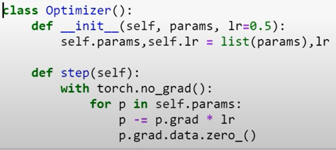

  - 我们为什么要step和zero_grad分开写呢？
    - 因为我们可以选择不做zero_grad。
    - 比如在超分辨的任务上，输出为2K，一次在GPU上只能放2个image，batch=2获得的梯度的稳定性太差了，需要使用更大的batch，此时就需要将梯度累计，才能实现更大的batch的效果。这样就可以选择不做zero_grad。所以在optim中要将step和zero_grad给分开来做。

```python
if i%2:
    opt.step()
    opt.zero_grad()
```

#### 无限可自定义的训练loop

到目前为止，我们的train loop在`fit`上面的函数中。我们需要一个代码设计，用户可以无限地自定义这个循环来添加他们想要的任何东西，比如花哨的进度条、不同的优化器、tensorboard集成、正则化等。库设计需要足够开放和灵活，以处理任何不可预见的扩展。有一个很好的方法来构建可以处理这个问题的东西 -**回调**。

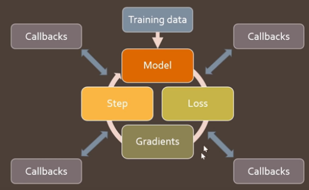

- 基本的train loop就是在这四个简单步骤中循环，model, loss, grad, step……

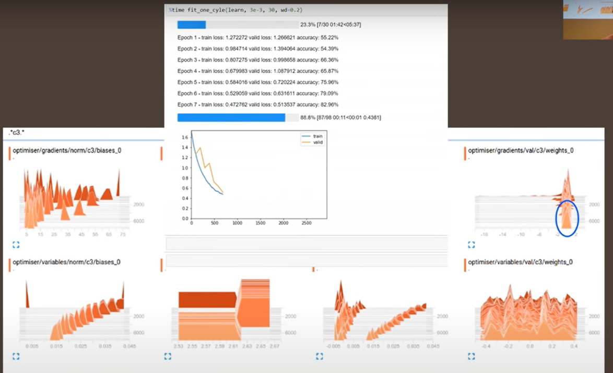

- 比如想要增加一些进度条、可视化的东西等

- 现在我们有一个很好的训练循环，但我们仍然可以做一些事情：

  - 更精美地绘制损失和指标 loss和metrics
  - 超参数调度 parameters tune
  - 添加正则化技术 regulation
  - 还有更多……

  我们可能想要使用很多修改，并且总是为每个任务创建一个训练循环并不明智。这个问题的解决方案是**callbacks**。

  下面是各种正则化技术：

  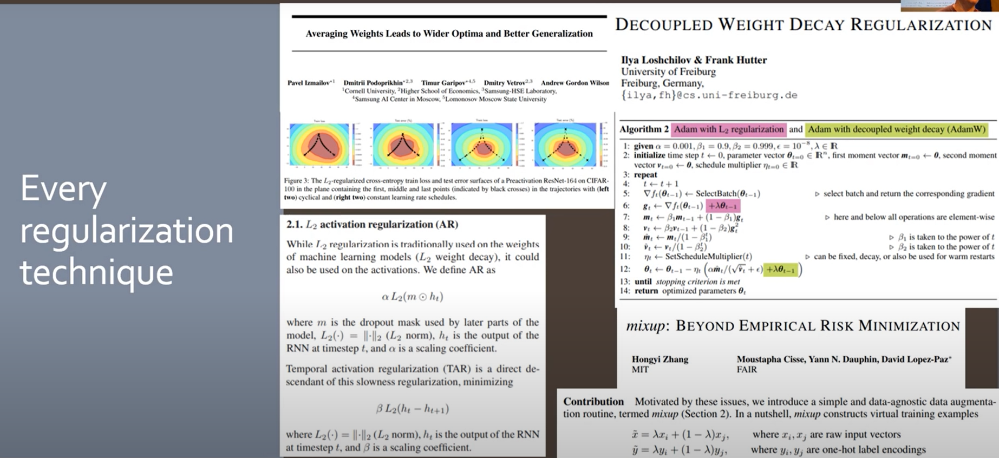

  混合精度训练：利用tensor的优势，训练更快。

  你可能在训练中需要更多的调整来做train loop。

  - 那么你如何添加更复杂的东西呢？

  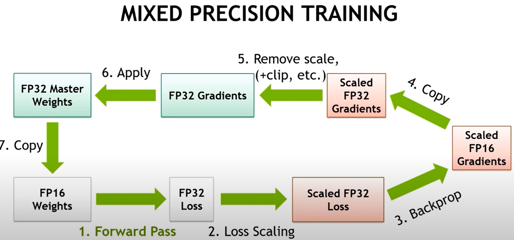

- 甚至是更复杂的训练：如GANs

- 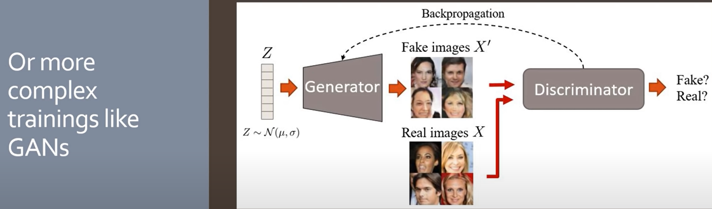

所以要么为每一种新的训练，重写一个train loop。所以一种方法是为你想要训练的每一种可能的方式编写一个训练循环，这尤其成问题，当你开始喜欢将多个不同的调整组合在一起时，就像你喜欢剪切和粘贴一样，所以这肯定不适用于fastai，是我为fastai0.7所尝试的。


- 现在可以使用回调 call back

- **个库都有回调的东西，但没有其他人有像我们的回调那样的回调，你会明白我的意思。**我们的回调让你不仅可以查看而且完全自定义这些步骤中的每一个

  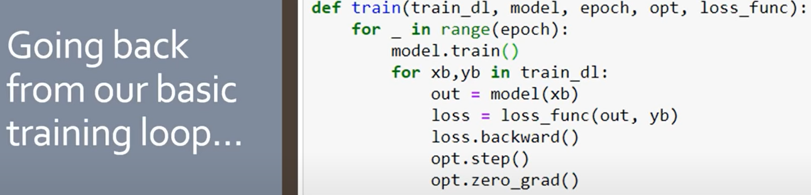

  - 这是第一个版本的fastAi，有完全相同的代码行加上一堆对回调的调用。

  

  - 这就是可定制的训练循环的样子

  回调基本上与函数相同。问题是我们希望可以向这些地方添加代码，但我们不想修改原始代码。通过回调，我们可以修改例如 on_epoch_begin 函数，而不是将该代码直接写入 fit 函数。

  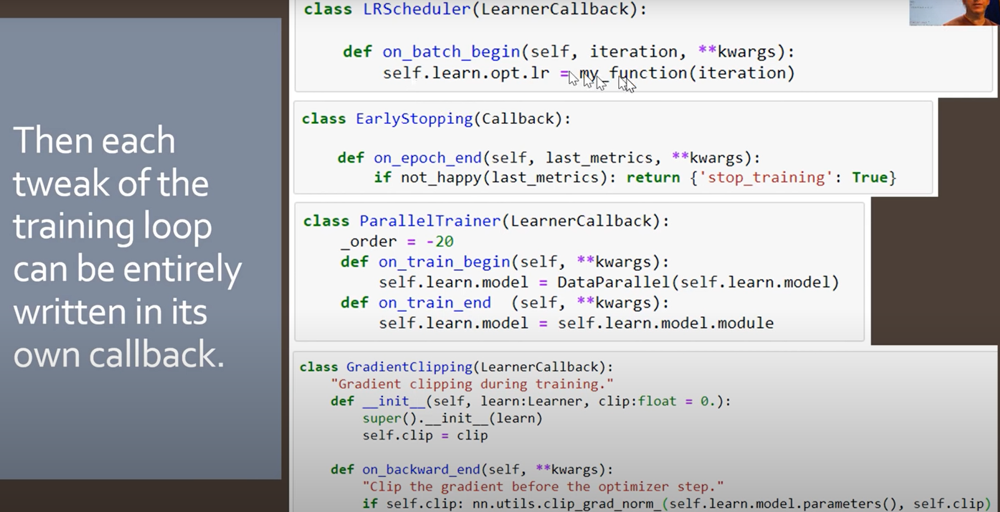

  - 这里有一些回调，正如你所看到的，每个回调都有一些目的，然后我们只是修改函数来像我们想要的那样工作。

  

- 所以有了这些之后，我们可以更快地创建和创建各种东西，比如学习率调度器、提前停止、并行或梯度裁剪。您也可以将它们混合在一起。

#### 举例说明：我们如何做GANs？


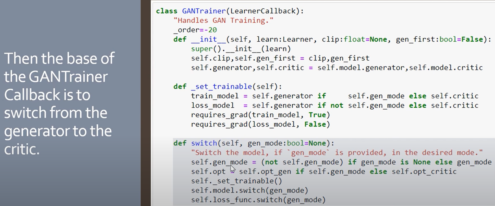

- 创建另一个回调，可以在generate和critic两个模式中切换。

`04_callbacks.ipynb`

*本课的下一部分将构建处理回调的框架。很难写成笔记，因为它的代码量很大。我将对设计决策做一些一般性的描述。然后我将继续讨论在这个框架中使用的回调的实现。我建议只观看[课程](https://youtu.be/AcA8HAYh7IE?t=4976)并通过[笔记本进行操作](https://github.com/fastai/course-v3/blob/master/nbs/dl2/04_callbacks.ipynb)。*

```python
x_train,y_train,x_valid,y_valid = get_data()
train_ds,valid_ds = Dataset(x_train, y_train),Dataset(x_valid, y_valid)
nh,bs = 50,64
c = y_train.max().item()+1
loss_func = F.cross_entropy
```

这是之前的fit函数的样子：

Jeremy 指出拥有这么多参数很复杂，将所有这些存储到一个对象中会更容易。这就是我们希望我们的 fit 函数的样子：`fit(1, learn)`

- 这将允许我们在代码的其他地方调整训练循环内发生的事情，因为`Learner`对象将是可变的，因此在我们的训练循环中将看到在其他地方更改其任何属性。
- 把model, loss_func, opt, train_dl, valid_dl这些全部放在 learn里面打包起来。

所以我们想要创建一个包含所有这些信息的学习对象。让我们先从创建**DataBunch**来存储**DataLoader**开始

```python
#export
class DataBunch():
    def __init__(self, train_dl, valid_dl, c=None):
        self.train_dl,self.valid_dl,self.c = train_dl,valid_dl,c
        
    @property
    def train_ds(self): return self.train_dl.dataset
        
    @property
    def valid_ds(self): return self.valid_dl.dataset
data = DataBunch(*get_dls(train_ds, valid_ds, bs), c)
```
然后让我们为模型创建创建一个函数，我们有一个很好的类，我们称之为Learner.
```python
#export
def get_model(data, lr=0.5, nh=50):
    m = data.train_ds.x.shape[1]
    model = nn.Sequential(nn.Linear(m,nh), nn.ReLU(), nn.Linear(nh,data.c))
    return model, optim.SGD(model.parameters(), lr=lr)

class Learner():
    def __init__(self, model, opt, loss_func, data):
        self.model,self.opt,self.loss_func,self.data = model,opt,loss_func,data
```

```python
learn = Learner(*get_model(data), loss_func, data)
```

```python
def fit(epochs, learn):
    for epoch in range(epochs):
        learn.model.train()
        for xb,yb in learn.data.train_dl:
            loss = learn.loss_func(learn.model(xb), yb)
            loss.backward()
            learn.opt.step()
            learn.opt.zero_grad()

        learn.model.eval()
        with torch.no_grad():
            tot_loss,tot_acc = 0.,0.
            for xb,yb in learn.data.valid_dl:
                pred = learn.model(xb)
                tot_loss += learn.loss_func(pred, yb)
                tot_acc  += accuracy (pred,yb)
        nv = len(learn.data.valid_dl)
        print(epoch, tot_loss/nv, tot_acc/nv)
    return tot_loss/nv, tot_acc/nv
loss,acc = fit(1, learn)
0 tensor(0.2194) tensor(0.9372)
```

### CallbackHandler

### 训练循环地标

训练循环在训练循环的重要部分之前或之后有几个关键点或地标，我们可能希望将一些功能/代码注入这些点。按运行顺序，这些是：

1. 训练开始： `begin_fit`
2. 训练结束： `after_fit`
3. 每个epoch的开始： `begin_epoch`
4. 一个batch的开始： `begin_batch`
5. 计算损失后： `after_loss`
6. 执行反向传播后： `after_backward`
7. 在优化器执行了一个步骤之后： `after_step`
8. 在所有批次之后和验证之前： `begin_validate`
9. 每个时期的结束： `after_epoch`
10. 训练结束： `after_fit`
11. 同样在每个批次或时代之后，我们可能想要停止一切： `do_stop`

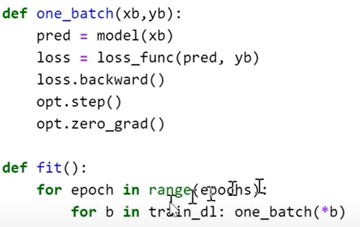

添加回调。这是之前的train loop，我们来重构代码，并添加回调。

```python
def one_batch(xb, yb, cb):
    if not cb.begin_batch(xb,yb): return # 添加了这样一些回调函数
    loss = cb.learn.loss_func(cb.learn.model(xb), yb)
    if not cb.after_loss(loss): return
    loss.backward()
    if cb.after_backward(): cb.learn.opt.step()
    if cb.after_step(): cb.learn.opt.zero_grad()

def all_batches(dl, cb):
    for xb,yb in dl:
        one_batch(xb, yb, cb)
        if cb.do_stop(): return

def fit(epochs, learn, cb):
    if not cb.begin_fit(learn): return
    for epoch in range(epochs):
        if not cb.begin_epoch(epoch): continue
        # train dataset和valid要遍历整个batch，所以创建了一个Batch
        all_batches(learn.data.train_dl, cb)
        
        if cb.begin_validate():
            with torch.no_grad(): all_batches(learn.data.valid_dl, cb)
        if cb.do_stop() or not cb.after_epoch(): break
    cb.after_fit()
```

我们将创建一个回调类，其中包含我们上面定义的所有内容。

面对这种情况时，一个明智的设计选择是定义一个抽象基类，该基类具有与上述所有地标（+ 方法名称）对应的方法。这些方法中的每一种都应返回 True 或 False 以指示成功/失败或其他一些停止条件。在训练循环中的每个地标处，将检查这些布尔值以查看训练循环是否应该继续。

```python
class Callback():
    def begin_fit(self, learn):
        self.learn = learn
        return True
    def after_fit(self): return True
    def begin_epoch(self, epoch):
        self.epoch=epoch
        return True
    def begin_validate(self): return True
    def after_epoch(self): return True
    def begin_batch(self, xb, yb):
        self.xb,self.yb = xb,yb
        return True
    def after_loss(self, loss):
        self.loss = loss
        return True
    def after_backward(self): return True
    def after_step(self): return True
```

然后我们需要做回调处理程序。

我们希望能够将多个回调传递给训练循环，因此我们需要一个附加类来处理调用的回调集合`CallbackHandler`。它将有一个`Callback`对象集合和相同的方法，`Callback`除了它循环遍历其所有回调对象并返回一个布尔值，指示所有回调是成功还是失败。

**CallbackHandler**的工作是处理多个回调，但也在某些步骤中做一些基本的事情。例如`begin_epoch`将模型更改为训练模式。它运行给它的所有回调，并且它还跟踪是否继续。

```python
class CallbackHandler():
    def __init__(self,cbs=None):
        self.cbs = cbs if cbs else []

    def begin_fit(self, learn):
        self.learn,self.in_train = learn,True
        learn.stop = False
        res = True
        for cb in self.cbs: res = res and cb.begin_fit(learn)
        return res

    def after_fit(self):
        res = not self.in_train
        for cb in self.cbs: res = res and cb.after_fit()
        return res
    
    def begin_epoch(self, epoch):
        self.learn.model.train()
        self.in_train=True
        res = True
        for cb in self.cbs: res = res and cb.begin_epoch(epoch)
        return res

    def begin_validate(self):
        self.learn.model.eval()
        self.in_train=False
        res = True
        for cb in self.cbs: res = res and cb.begin_validate()
        return res

    def after_epoch(self):
        res = True
        for cb in self.cbs: res = res and cb.after_epoch()
        return res
    
    def begin_batch(self, xb, yb):
        res = True
        for cb in self.cbs: res = res and cb.begin_batch(xb, yb)
        return res

    def after_loss(self, loss):
        res = self.in_train
        for cb in self.cbs: res = res and cb.after_loss(loss)
        return res

    def after_backward(self):
        res = True
        for cb in self.cbs: res = res and cb.after_backward()
        return res

    def after_step(self):
        res = True
        for cb in self.cbs: res = res and cb.after_step()
        return res
    
    def do_stop(self):
        try:     return self.learn.stop
        finally: self.learn.stop = False
```

现在我们可以创建一个测试来展示这是如何工作的。

```python
class TestCallback(Callback):
    def begin_fit(self,learn):
        super().begin_fit(learn)	# 先调用基类的构造函数
        self.n_iters = 0			# 派生类，多了一个成员
        return True
        
    def after_step(self):
        self.n_iters += 1
        print(self.n_iters)
        if self.n_iters>=10: self.learn.stop = True
        return True
fit(1, learn, cb=CallbackHandler([TestCallback()]))
1
2
3
4
5
6
7
8
9
10
```

这大致就是 fastai 现在所做的（除了处理程序也可以更改和返回`xb`, `yb`, 和`loss`）。但是让我们看看我们是否可以让事情变得更简单和更灵活，这样单个类就可以访问所有内容并可以随时更改任何内容。我们传递`cb`给这么多函数的事实强烈暗示它们应该都在同一个类中！

### Runner

- fastai的方式，我觉得很愚蠢，还是要修复，所以Runner可能会出现在接下来的fastai版本中。
- 我发现cb是个对象，作为参数到处在传递。这三个函数 one_batch, all_batches, fit到处都在调用，CP 是回调处理程序到处都在传递

```python
#export
import re

_camel_re1 = re.compile('(.)([A-Z][a-z]+)')
_camel_re2 = re.compile('([a-z0-9])([A-Z])')
def camel2snake(name):
    s1 = re.sub(_camel_re1, r'\1_\2', name)
    return re.sub(_camel_re2, r'\1_\2', s1).lower()

class Callback():
    _order=0
    def set_runner(self, run): self.run=run
    def __getattr__(self, k): return getattr(self.run, k)
    @property
    def name(self):
        name = re.sub(r'Callback$', '', self.__class__.__name__)
        return camel2snake(name or 'callback')
```

第一个回调负责在训练或验证模式下来回切换模型，以及维护迭代计数，或迭代周期中经过的迭代百分比。

```python
#export
class TrainEvalCallback(Callback):
    def begin_fit(self):
        self.run.n_epochs=0.
        self.run.n_iter=0
    
    def after_batch(self):
        if not self.in_train: return
        self.run.n_epochs += 1./self.iters
        self.run.n_iter   += 1
        
    def begin_epoch(self):
        self.run.n_epochs=self.epoch
        self.model.train()
        self.run.in_train=True

    def begin_validate(self):
        self.model.eval()
        self.run.in_train=False
```

- 我们现在来看我们的测试回调，超级简单只是实现你需要的东西，我们从一个新的回调继承。
- 上面的Callback中有一个_oder成员变量，选择运行回调的顺序。
- 最后在那个笔记本中有另一种（更好的）方法来做同样的事情。Jeremy 说 Fastai 将来可能会使用它，但我不打算通过它，因为它主要只是重构上面的东西。一个重要的修改是有一个名为`_order`. 这定义了执行回调的顺序。
- 很多时候你希望能够将行为注入到某些东西中，但是不同的东西会相互影响，例如我们将要看到的转换当我们进行数据增强时，经常需要一些东西以特定的顺序运行，所以当我添加这种可注入的行为（如回调）时，我喜欢添加一些东西，它应该以什么顺序运行，而你没有把这个放在这里，你可能已经注意到，
- 关于callback的另一件好事：getattr，它只在 Python 找不到您要求的属性时才调用。所以它永远不会到达`__getattr__`这里。
  - 如果到了这里，意味着python找不到。
  - 所以你真正想要的回调实际上是在 runner 里面
- callback有一个name属性，camel格式转化为snake格式。
  - 在Runner中传入的任何回调函数，都用来创建新的回调。实际上分配给相应的属性。

```python
class TestCallback(Callback):
    _order = 1
    def after_step(self):
        if self.train_eval.n_iters>=10: return True
        
cbname = 'TrainEvalCallback'
camel2snake(cbname)
------------
'train_eval_callback'

TrainEvalCallback().name
-------------
'train_eval'

#export
from typing import *

def listify(o):
    if o is None: return []
    if isinstance(o, list): return o
    if isinstance(o, str): return [o]
    if isinstance(o, Iterable): return list(o)
    return [o]
```

- Runner是一个新的类，这个 self 字符串可能看起来有点奇怪，但再看看我们之前的代码 可怕的代码气味是很多重复的代码，到处都是cb。
- 代码重复意味着多余开销，所以把它拿出来，分解为`__call__`，它让你把一个对象当作一个函数。
- 我不喜欢的另一件事是我所有的回调都必须继承自callback，因为如果他们没有，那么他们就会丢失这些方法之一，所以当它试图调用该方法时，他们会抛出异常，我不喜欢强迫人们必须继承某些东西他们应该能够做任何他们喜欢的事情。所以我们在这里做了什么 所以我们在这里做的是我们使用了 get 属性，它是 Python 的东西，它说查看这个对象内部并尝试找到这个名字的东西，例如开始验证并默认为无如果你找不到它，那么它会尝试o 找到那个回调，如果回调不存在，那将没有，如果你找到它，那么你可以调用它，所以这是调用任何回调的好方法。

```python
#export
class Runner():
    def __init__(self, cbs=None, cb_funcs=None):
        # 罗列出callbacks中所有的回调函数
        cbs = listify(cbs)
        for cbf in listify(cb_funcs):
            cb = cbf()
            # 设定self的cb.name为cb self.cb.name = cb
            setattr(self, cb.name, cb)
            cbs.append(cb)
        # self.cbs = cbs, 从callback中找到所有的。
        # self不仅存了每一个callback函数的名字，还用cbs去存了所有的callbacknames
        self.stop,self.cbs = False,[TrainEvalCallback()]+cbs

    @property
    def opt(self):       return self.learn.opt
    @property
    def model(self):     return self.learn.model
    @property
    def loss_func(self): return self.learn.loss_func
    @property
    def data(self):      return self.learn.data

    def one_batch(self, xb, yb):
        self.xb,self.yb = xb,yb
        if self('begin_batch'): return
        self.pred = self.model(self.xb)
        if self('after_pred'): return
        self.loss = self.loss_func(self.pred, self.yb)
        if self('after_loss') or not self.in_train: return
        self.loss.backward()
        if self('after_backward'): return
        self.opt.step()
        if self('after_step'): return
        self.opt.zero_grad()

    def all_batches(self, dl):
        self.iters = len(dl)
        for xb,yb in dl:
            if self.stop: break
            self.one_batch(xb, yb)
            self('after_batch')
        self.stop=False

    def fit(self, epochs, learn):
        self.epochs,self.learn = epochs,learn

        try:
            for cb in self.cbs: cb.set_runner(self)
            if self('begin_fit'): return
            for epoch in range(epochs):
                self.epoch = epoch
                if not self('begin_epoch'): self.all_batches(self.data.train_dl)

                with torch.no_grad(): 
                    if not self('begin_validate'): self.all_batches(self.data.valid_dl)
                if self('after_epoch'): break
            
        finally:
            self('after_fit')
            self.learn = None

    def __call__(self, cb_name):
        # 在self.cbs中去排序，排序名称用_order排序
        for cb in sorted(self.cbs, key=lambda x: x._order):
            f = getattr(cb, cb_name, None)
            # 根据order的顺序逐个调用f和f()， if you find f, You can call it。 找到了就执行
            if f and f(): return True
        return False
```

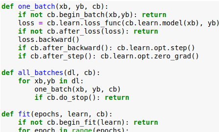

回调`cb`作为训练循环中每个函数的参数传递。这表明这些函数应该是类的一部分，并且`cb`应该是该类中的实例属性。

我们创建一个新类`Runner`（我这里就不一一列举），其中包含`one_batch`，`all_batches`以及`fit`从训练循环方法，采用列表`Callback`在构造函数的对象，同时还整合了先前的逻辑`CallbackHandler`类。

它有一些巧妙的重构，以便通过覆盖处理回调循环`__call__`，在其集合中查找具有所需方法名称（例如“ `begin_epoch`”）的所有回调并调用它们。启动和停止的布尔逻辑也由这个方法处理，这意味着`Callback`子类不再需要返回布尔值——它们可以直接完成自己的工作，而无需知道使用它们的上下文。以下是`Callback`此实现中的 a 示例：

```python
class ChattyCallback(Callback):
    def begin_epoch(self):
        print('begin_epoch...')
    def after_epoch(self):
        print('after epoch...')
    def begin_fit(self):
        print('begin_fit...')
    def begin_validate(self):
        print('begin_validate...')
>>> run = Runner(cbs=[ChattyCallback()])
>>> run.fit(2, learn)
begin_fit...
begin_epoch...
begin_validate...
after epoch...
begin_epoch...
begin_validate...
after epoch...
```

该`Runner`设计将训练循环与回调分离，这样即使训练循环的训练和验证部分所需的不同逻辑也可以实现为`Callback`硬编码到`Runner`类中的

```python
class TrainEvalCallback(Callback):
    def begin_fit(self):
        self.run.n_epochs=0.
        self.run.n_iter=0
    
    def after_batch(self):
        if not self.in_train: return
        self.run.n_epochs += 1./self.iters
        self.run.n_iter   += 1
        
    def begin_epoch(self):
        self.run.n_epochs=self.epoch
        self.model.train()
        self.run.in_train=True

    def begin_validate(self):
        self.model.eval()
        self.run.in_train=False
```

*（恕我直言：`Runner`代码很难理解，但在课程的其余部分并不重要。这是一个实验类，即使在 FastAI2 库中也没有结束。查看库的状态 (2/ 2020），这个类的想法确实出现在新的`Learner`类中。最好只知道你需要编写回调）。*

`Callbacks`下一节中所有实现的注意事项：

- 他们假设 存在`self.in_train`，表示我们是在训练还是验证中。该变量由 设置`TrainEvalCallback`。
- 他们也有机会在变量`Runner`类，如：`self.opt`，`self.model`，`self.loss_func`，`self.data`，`self.n_epochs`，和`self.epochs`。

##### question:

pytorch中的hooks和callbacks有什么区别？

- 我们很快就会做 hooks ，如果想要在算模型第二层的前向传递后添加回调，我无法正确执行此操作，因为我执行前向传递的点看起来像这个自点模型或者如果我想抓住我已经如果我的倒数第二层我不能这样做，只是调用了self.model(self.xb)，没法到中间过程中去调用回调函数，
- 同样，反向传播中也不能这样做。`self.loss.backward()`，没法在pytorch的中间函数中去加回调函数
- pytorch hooks callbacks可以添加到特定的Pytorch模块，我们将很快就会看到它们，它可能是下一个

```python
#export
class AvgStats():
    def __init__(self, metrics, in_train): self.metrics,self.in_train = listify(metrics),in_train
    
    def reset(self):
        self.tot_loss,self.count = 0.,0
        self.tot_mets = [0.] * len(self.metrics)
        
    @property
    def all_stats(self): return [self.tot_loss.item()] + self.tot_mets
    @property
    def avg_stats(self): return [o/self.count for o in self.all_stats]
    
    def __repr__(self):
        if not self.count: return ""
        return f"{'train' if self.in_train else 'valid'}: {self.avg_stats}"

    def accumulate(self, run):
        # 计算loss
        bn = run.xb.shape[0]
        self.tot_loss += run.loss * bn
        self.count += bn
        for i,m in enumerate(self.metrics):
            self.tot_mets[i] += m(run.pred, run.yb) * bn

# 创建了新的callback，
class AvgStatsCallback(Callback):
    def __init__(self, metrics):
        self.train_stats,self.valid_stats = AvgStats(metrics,True),AvgStats(metrics,False)
        
    def begin_epoch(self):
        self.train_stats.reset()
        self.valid_stats.reset()
        
    def after_loss(self):
        stats = self.train_stats if self.in_train else self.valid_stats
        with torch.no_grad(): stats.accumulate(self.run)
    
    # epoch结束之后，打印出统计信息
    def after_epoch(self):
        print(self.train_stats)
        print(self.valid_stats)
```

```python
learn = Learner(*get_model(data), loss_func, data)
```

```python
stats = AvgStatsCallback([accuracy])
run = Runner(cbs=stats)
```

```python
run.fit(2, learn)
-----------------------------
train: [0.31116248046875, tensor(0.9052)]
valid: [0.141587158203125, tensor(0.9587)]
train: [0.144049990234375, tensor(0.9572)]
valid: [0.2177901611328125, tensor(0.9354)]
```

```python
loss,acc = stats.valid_stats.avg_stats
assert acc>0.9
loss,acc
-------------------
(0.2177901611328125, tensor(0.9354))
```

- questionc：`__call__`在第一个回调返回 true 时提前退出，为什么？
  - 这是我注意到的一件事在我编写回调处理程序的第一种方式中真的很烦人，因为我有它，所以必须返回某些东西必须返回 true 表示继续，所以基本上 false 意味着停止，这真的很尴尬，因为如果你不添加 return在

```python
#export
from functools import partial
```

```python
# 含有callback的function
acc_cbf = partial(AvgStatsCallback,accuracy)
```

```python
run = Runner(cb_funcs=acc_cbf)
```

```python
run.fit(1, learn)
train: [0.109901865234375, tensor(0.9663)]
valid: [0.12098992919921875, tensor(0.9649)]
```

```python
run.avg_stats.valid_stats.avg_stats
-------------
[0.12098992919921875, tensor(0.9649)]
```

tips: Jeremy 经历的大部分事情都不是那么重要。我建议至少阅读一次回调笔记本并尝试了解它是如何工作的。Jeremy 说这是给那些对软件工程感兴趣的人准备的。就我个人而言，这对我来说很难理解，因为有很多活动部件。你有回调处理程序，回调，然后你需要做其他事情。我可能会写一篇关于这个的教程，因为我有兴趣更好地理解它。我想分享的一个好技巧是打印这些代码。有时，当某些代码在屏幕之外时，很难在计算机上看到东西。将整个代码贴在墙上并记下标记或其他东西，以便您可以突出显示最重要的部分并添加一些注释。这就是我理解复杂代码的方式。

- 更多示例：[https](https://docs.fast.ai/callbacks.html) : [//docs.fast.ai/callbacks.html](https://docs.fast.ai/callbacks.html)

在本课程的第二部分中的很多事情你可以选择做不同事情的深度。我认为我们的回调方法非常有趣，如果你也这样做，你可能想要深入这里并真正研究，你知道什么您可以构建的回调类型以及您可以用它们做什么我们尚未完成的事情，**但是如果您对软件工程的细节不那么感兴趣，那么您就会知道很多关于我如何做到这一点的细节可能是你不太关心的事情**，这很好，最重要的是每个人都应该知道这是我们的训练循环，所以你知道其他的事情，比如我们是如何创建我们的平均统计回调的，以及确切地说 dunder call 绘制了相当小的细节，但你应该认识到 fit 函数存储了多少epoch，正在做我们正在使用的学习者每次正确地调用每个不同的回调，


### 05_anneal.ipynb

- 同样，我认为从笔记本中复制代码不是一个好主意，因为没有任何新内容。它只是展示了学习率退火是如何在 Fastai 库中完成的。
- 与其花太多时间在理解上`Runner`，不如让我们继续做一些有用的事情——实现一些回调。
- 让我们实现回调以进行*单周期*  one epoch训练。如果你能很好地训练第一批，那么整个训练会更好，你可以获得超收敛。良好的退火对于做好前几批至关重要。
- 首先让我们做一个回调`Recorder`，记录每批之后的学习率和损失。此调用将需要两个在训练循环中初始化的学习率和损失列表，并且需要在每批之后附加到这些列表中。

```python
x_train,y_train,x_valid,y_valid = get_data()
train_ds,valid_ds = Dataset(x_train, y_train),Dataset(x_valid, y_valid)
nh,bs = 50,512
c = y_train.max().item()+1
loss_func = F.cross_entropy
data = DataBunch(*get_dls(train_ds, valid_ds, bs), c)
#export
def create_learner(model_func, loss_func, data):
    return Learner(*model_func(data), loss_func, data)
learn = create_learner(get_model, loss_func, data)
run = Runner([AvgStatsCallback([accuracy])])

run.fit(3, learn)
----------------
train: [0.6664653125, tensor(0.8075)]
valid: [0.302250390625, tensor(0.9146)]
train: [0.291615546875, tensor(0.9162)]
valid: [0.2376760986328125, tensor(0.9324)]
train: [0.23417873046875, tensor(0.9323)]
valid: [0.2117640869140625, tensor(0.9397)]
```

```python
# 这里的lr不一样
learn = create_learner(partial(get_model, lr=0.3), loss_func, data)
run = Runner([AvgStatsCallback([accuracy])])

run.fit(3, learn)
-------------
train: [0.762880078125, tensor(0.7988)]
valid: [0.36490234375, tensor(0.8969)]
train: [0.3508654296875, tensor(0.9002)]
valid: [0.30942646484375, tensor(0.9107)]
train: [0.30202353515625, tensor(0.9126)]
valid: [0.26613701171875, tensor(0.9218)]
#export
def get_model_func(lr=0.5): return partial(get_model, lr=lr)
```

- what is your particular debugging process?
  - 当我运行一个单元格时出现异常然后我进入下一个单元格并键入 % debug 并且如果事情没有按我预期的方式工作，它会在调试器中弹出但它不是一个例外然后我将添加设置下划线在某个点附近的某个地方我关心的就是这点是的，我发现这在大多数情况下效果很好，然后只是看看它做了什么，一切的形状是什么，一切都像你们几个一样包含在内知道批次中的几个对象我通常会发现某些东西有 Nan 或零或其他任何东西 确实很少使用我发现调试的 bug 很难，如果是，那么这只是一个你知道的情况，离开并提出问题调整你的假设，但在调试器的帮助下，你知道你面前的所有状态，这是关于 PI 火炬的伟大之处之一是它支持这种开发.

##### Annealing

- 所以我们要创建一个回调来进行超参数调度，所以对于这个笔记本，我们只是将学习率作为一个超参数，但在过去的 12 个月里，真正成功的研究领域之一是人们指出：

  - 我们can and should schedule everthing

    - dropout amount, 什么样的数据增强， weight decay, learning rate, momentum,一切都有意义

  因为在过去的 12 个月中我们一直在学习的另一件事是如何作为你训练一个模型，它经历了不同的阶段，神经网络的loss landscape 在中间开始时看起来非常不同。
  
- **因此您不太可能希望始终使用相同的超参数，因此能够安排任何事情非常方便，因此我们将创建一个参数安排一个回调，您只需传入一个函数即可一个参数调度**

- 

我们定义了两个新的callback：Recorder用于保存损失跟踪和我们预定的学习率，以及一个 ParamScheduler，它可以调度任何超参数，只要它在优化器的 state_dict 中注册即可。

- 记住我告诉过你我们添加的火车 eval 回调将把它设置为一个浮点数，所以这将是这个数字
- 接下来我们需要一个回调类，它可以`opt`根据某个调度函数根据已经过去的 epoch数来更新优化器的参数。

```python
#export
# 记录lr和loss
class Recorder(Callback):
    def begin_fit(self): self.lrs,self.losses = [],[]

    def after_batch(self):
        if not self.in_train: return
        self.lrs.append(self.opt.param_groups[-1]['lr'])
        self.losses.append(self.loss.detach().cpu())        

    def plot_lr  (self): plt.plot(self.lrs)
    def plot_loss(self): plt.plot(self.losses)

class ParamScheduler(Callback):
    _order=1
    def __init__(self, pname, sched_func): 
        self.pname,self.sched_func = pname,sched_func

    def set_param(self):
        for pg in self.opt.param_groups:
            # epoch数，除以整的epoch个数，这个n_epochs在train的callback函数中+1
            pg[self.pname] = self.sched_func(self.n_epochs/self.epochs)
            
    def begin_batch(self): 
        if self.in_train: self.set_param()
```

- 正如part1中所讲的一样，你不想要每一层都使用相同的超参数值。所以pytorch有一些parameter group，在fastai中使用一种抽象，叫做layer_groups，基本上是一样。
- pytorch优化器包含很多param_groups。

- 然后每次我们开始你的批处理，如果我们正在训练，我们将很难知道我们的日程安排是否有效，如果我们实际上无法看到学习率发生了什么变化，那么让我们创建另一个回调线记录器，Recorder
  - 这个看起来很熟悉，与fastai很相似的。

让我们从一个简单的线性时间表开始，从开始到结束。它返回一个函数，该函数接受一个`pos`参数（从 0 到 1），使得该函数以线性方式从`start`(at `pos=0`) 到`end`(at `pos=1`)。

- pos表示从start-end的中间位置，所以是一个线性表示。
- 设置了start和end之后，只需要一个pos即可。

```python
def sched_lin(start, end):
    def _inner(start, end, pos): return start + pos*(end-start)
    return partial(_inner, start, end)
```

接下来我们要定义一些退火函数来提高和降低学习率，如下图所示：

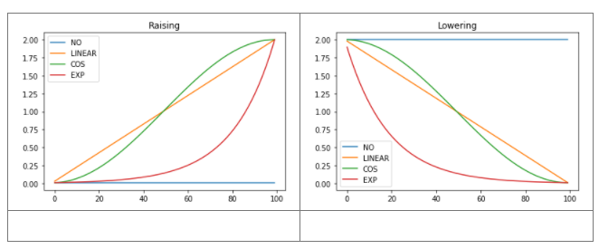

- 但是上面的表示方式不太方便，因为我们将创建许多不同的调度程序，我不想每次都必须编写所有这些。所以下面是用decorator来重构，您以自然的方式创建线性调度程序。
- decorator返回一个函数，，Python 所做的是，如果它在这里看到一个带有 @ 符号的函数名称，它在它接受这个函数之前将它传递给这个函数，并用它返回的任何东西替换这个函数的定义。
- 你可以利用 python 的动态特性就像如果你没有充分利用动态语言的动态特性，那么使用动态语言是没有意义的，所以像装饰器这样的东西是做这些事情的超级方便的方法，还有其他语言，比如 Julia，可以用宏做类似的事情，就像这样不是获得这种非常好的表达能力的唯一方法，但这是一种很好的方法

```python
#export
def annealer(f):
    def _inner(start, end): return partial(f, start, end)
    return _inner

@annealer
def sched_lin(start, end, pos): return start + pos*(end-start)
# shift-tab works too, in Jupyter!
# sched_lin()
f = sched_lin(1,2)
f(0.3)
1.3
```

下面定义了不同的退火函数

这些退火函数应该有一个开始和结束值以及一个介于 0 和 1 之间的位置，表示在时间表中的相对位置。当其中 2 个是常量时，我们可以将退火函数实现为抽象基类或仅使用部分函数，而不是编写一个接受所有 3 个参数的函数。这里使用了部分函数：

- `annearler`是一个*装饰器*函数。装饰器接受一个函数并返回另一个函数，并具有`@decorator`Python 中的奇特语法。

```python
#export
def annealer(f):
    def _inner(start, end): 
        return partial(f, start, end)
    return _inner

@annealer
def sched_lin(start, end, pos): 
    return start + pos*(end-start)

@annealer
def sched_cos(start, end, pos): return start + (1 + math.cos(math.pi*(1-pos))) * (end-start) / 2
@annealer
def sched_no(start, end, pos):  return start
@annealer
def sched_exp(start, end, pos): return start * (end/start) ** pos

def cos_1cycle_anneal(start, high, end):
    return [sched_cos(start, high), sched_cos(high, end)]

#This monkey-patch is there to be able to plot tensors
torch.Tensor.ndim = property(lambda x: len(x.shape))
```

- matplotlib无法绘制tensor，`torch.Tensor.ndim = property(lambda x: len(x.shape))`
- 给torch的tensor指定一个新属性，就可以绘制了。
- python的好处是，虽然不支持，但是你可以插入和替换任何东西。
- 现在可以输出我们的四个不同的调度程序

```python
annealings = "NO LINEAR COS EXP".split()

a = torch.arange(0, 100)
p = torch.linspace(0.01,1,100)

fns = [sched_no, sched_lin, sched_cos, sched_exp]
for fn, t in zip(fns, annealings):
    f = fn(2, 1e-2)
    plt.plot(a, [f(o) for o in p], label=t)
plt.legend();
```

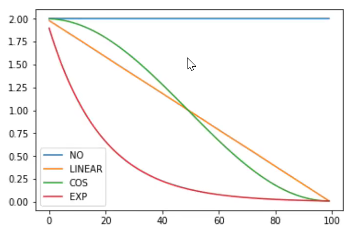

- 我们希望将升高和降低时间表与不同时间表开始时的位置列表结合在一个函数中。这是`combine_scheds`函数：

```python
def combine_scheds(pcts, scheds):
    assert sum(pcts) == 1.
    pcts = tensor([0] + listify(pcts))
    assert torch.all(pcts >= 0)
    pcts = torch.cumsum(pcts, 0)
    def _inner(pos):
        idx = (pos >= pcts).nonzero().max()
        actual_pos = (pos-pcts[idx]) / (pcts[idx+1]-pcts[idx])
        return scheds[idx](actual_pos)
    return _inner
# 30% 从0.3-0.7，按照cos曲线上升；后面的70%，从0.6按照余弦曲线下降到0.2
sched = combine_scheds([0.3, 0.7], [sched_cos(0.3, 0.6), sched_cos(0.6, 0.2)]) 
```

```python
plt.plot(a, [sched(o) for o in p])
[<matplotlib.lines.Line2D at 0x7f8c1cc93588>]
```

- lr的时间表如下：

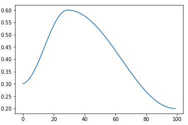

这就是我们将传递每个阶段的时间长度以及每个阶段的日程安排，所以这是我们的工作方式，

- 这就是fastai的1cycle时间表，这在其他地方应该没有发表过，但是是fastai默认的方法。
- 您在开始时会得到一个很好的温和nice gentle warm-up start, 
- **但是正如您在下周的课程中看到的那样，当我们使用钩子hooks深入研究事物时，它不会花费很长时间才能进入体面的部分失去了风景**，所以你可以很快地提高学习率，
- **下周将开始看论文，人们在过去 4 个月左右的时间里已经意识到这一点，尽管莱斯利史密斯真的向我们展示了这两个几年前，但直到最近 4 个月左右，人们才真正理解了这一点以及更广泛的学术文献，您需要长时间以高学习率进行训练，**
- 因此通过这种有指导的余弦计划，我们可以保持高水平许久 但是随后您还需要在很长一段时间内以非常低的学习率进行微调，因此它具有我们想要的所有类型的优秀功能，因此cos 1cycle 计划非常棒，我们现在可以从头开始构建它们，所以让我们尝试像这样训练，
- 所以让我们创建一个回调函数列表，它有一个Recorder，平均统计回调，其中具有准确性，还有一个参数调度器，它使用这个调度来降低学习率，然后拟合，看起来很不错，我们正在起床很快就达到了 94%，我们现在可以绘制 LR，这是我们希望的形状，我们甚至可以说plot_loss还可以，所以我们现在真的拥有了我们需要的所有部分来尝试许多不同的方式，在训练神经网络方面，我们仍然没有研究卷积，我们将在下周做更多的事情，但你现在有能力想出很多你可能想要尝试的事情，并尝试它们

```python
cbfs = [Recorder,
        partial(AvgStatsCallback,accuracy),
        partial(ParamScheduler, 'lr', sched)]
```

```python
learn = create_learner(get_model_func(0.3), loss_func, data)
run = Runner(cb_funcs=cbfs)
```

```python
run.fit(3, learn)
```

```
train: [0.788337578125, tensor(0.7860)]
valid: [0.3378462158203125, tensor(0.8999)]
train: [0.29788216796875, tensor(0.9127)]
valid: [0.2410066162109375, tensor(0.9319)]
train: [0.23813974609375, tensor(0.9312)]
valid: [0.2132032958984375, tensor(0.9400)]
```

```
run.recorder.plot_lr()
```

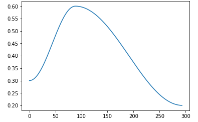

```python
run.recorder.plot_loss()
```

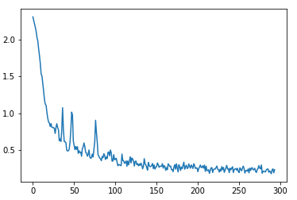

- Convnet卷积网络，使用GPU了，我们将最终使用 GPU 因为一旦我们开始建立这种规模的信心，它就会开始花费太长时间，但只需提前阅读一点，把东西放在 GPU 上需要什么。
- 我们也将要添加一些转换，这是在没有回调的情况下进行批量转换所需的全部内容
- 正如我们所讨论的，尽管我们无法在层之间添加回调，因此我们将首先手动添加层之间的回调，然后使用 Pytorch hooks和这样，我们将能够绘制并准确查看我们的模型在训练时发生了什么，我们将找到更好地训练它们的方法，以便在下一个笔记本结束时我们将提高 98% 以上的准确率超级酷，然后我们将深入研究批规范数据块 API 优化和转换，到那时我认为我们将基本上拥有进入一些更高级架构和训练方法所需的所有机制看看我们是如何做一些很酷的事情的，我们下周见
