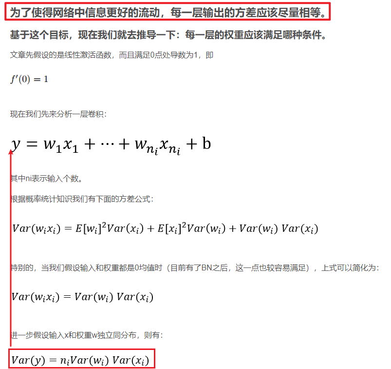
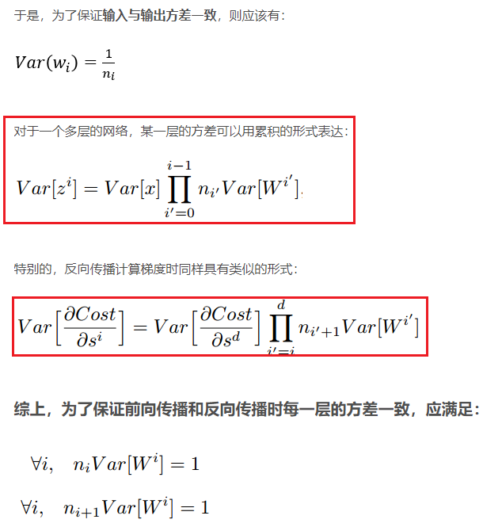
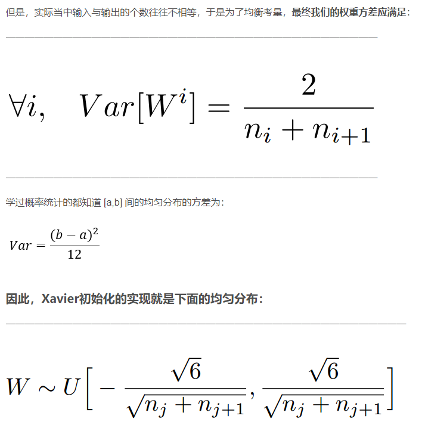
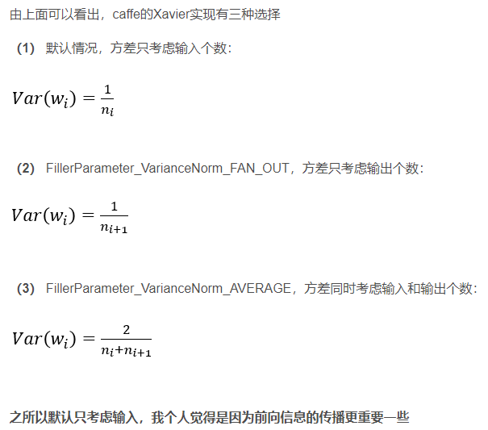
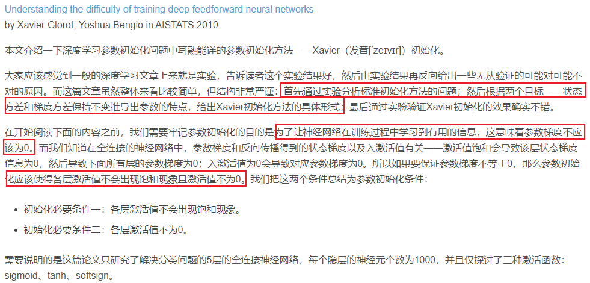

- 参考笔记：[深度学习——Xavier初始化方法](https://blog.csdn.net/shuzfan/article/details/51338178)

“Xavier”初始化方法是一种很有效的神经网络初始化方法，方法来源于2010年的一篇论文**==《Understanding the difficulty of training deep feedforward neural networks》==**，可惜直到近两年，这个方法才逐渐得到更多人的应用和认可。

## 参考笔记：[深度学习之参数初始化（一）——Xavier初始化](https://blog.csdn.net/VictoriaW/article/details/73000632)

